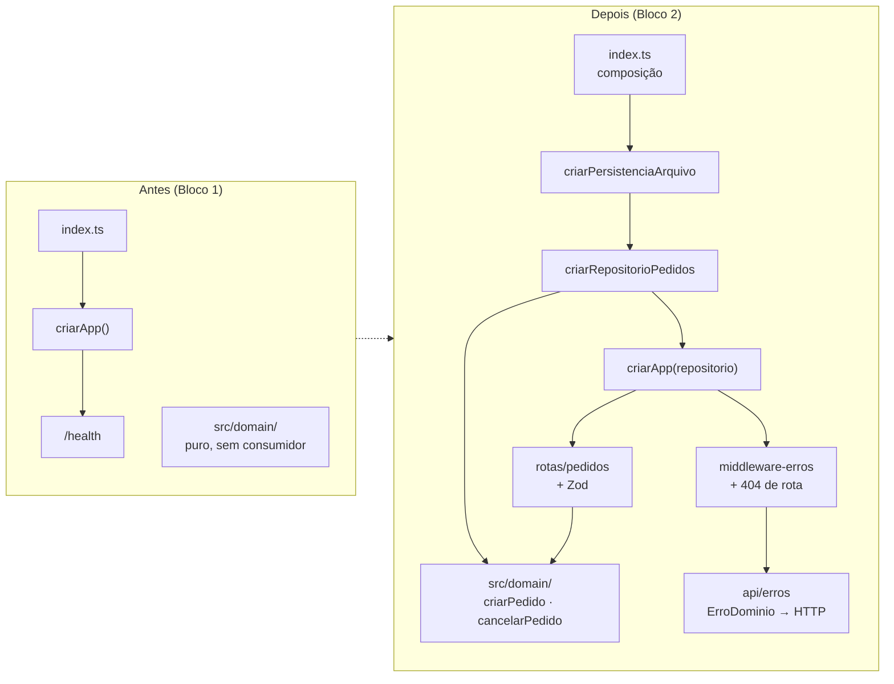

# Walkthrough — Bloco 2: Gestão de Pedidos

**Data:** 2026-07-25
**Status:** ✅ implementado e verificado — branch `feat/bloco-2`, commit `9a279b8`, PR #5 (CI verde)
**Plano:** `plans/2026-07-25_Bloco_2_Pedidos.md`
**Histórias:** E1-1, E1-2, E1-3 (épico E1) + E7-1, E7-2 (transversais)

---

## 1. Implementation Summary

O Bloco 1 deixou o domínio pronto, mas inalcançável: a API só respondia `/health` e nada
sobrevivia a um reinício. Este bloco fecha o épico **E1 — Gestão de Pedidos** ponta a ponta e,
junto com ele, entrega a camada de erros padronizada que os critérios de "mensagem clara" do E1
pressupunham.

Três camadas novas entraram, com as dependências apontando sempre para dentro — o domínio
continua sem conhecer ninguém:



O eixo do desenho é a **porta de persistência**: o repositório recebe `carregar`/`salvar`
prontos e nunca vê o `fs`. Em produção entra a implementação de arquivo; nos testes, a de
memória. É a mesma técnica que `criarPedido` já usava com `gerarId`, agora aplicada ao I/O — e
é o que permite que 69 testes rodem em 845 ms sem tocar o disco.

### Endpoints entregues

| Método | Rota                    | História | Sucesso | Erros    |
| ------ | ----------------------- | -------- | ------- | -------- |
| POST   | `/pedidos`              | E1-1     | 201     | 400, 422 |
| GET    | `/pedidos`              | E1-2     | 200     | 400      |
| GET    | `/pedidos/:id`          | E1-2     | 200     | 404      |
| POST   | `/pedidos/:id/cancelar` | E1-3     | 200     | 404, 422 |

`GET /pedidos` aceita `?status=` e `?prioridade=` combináveis e devolve `[]` quando nada casa —
nunca erro. O cancelamento é sub-recurso de ação, não `DELETE`: o pedido permanece no sistema
com status `cancelado` e segue consultável por `GET /pedidos?status=cancelado`.

### Decisões tomadas durante a implementação

| Decisão | Escolha | Motivo |
| --- | --- | --- |
| Verbo do cancelamento | `POST /:id/cancelar` | `DELETE` promete remoção; o registro continua existindo. Padrão Stripe/Shopify/GitHub |
| Estrutura da persistência | Porta injetável + 2 impls | Testes determinísticos e sem I/O; troca de implementação em um único ponto (`index.ts`) |
| Momento da gravação | Write-through, a cada mutação | É o que sustenta o "sobrevive a reinício" do E1-1; gravar só ao encerrar perde dados em crash |
| Escrita no disco | Arquivo temporário + `rename` | Evita JSON truncado se o processo morrer no meio da gravação |
| Posição de `cancelado` | Fim de `STATUS_PEDIDO` | Não altera a ordem dos valores já usados pelo Bloco 1 |
| 400 vs. 422 | Semântico, centralizado | 400 = entrada malformada; 422 = entrada válida que viola regra; 404 = inexistente |
| Teste de HTTP | `supertest` (devDep) | Padrão do ecossistema Express; testa o app sem abrir porta de rede |

---

## 2. Changes Made

**21 arquivos · +1663 / −8 linhas** (inclui o plano, 544 linhas, e o `package-lock.json`, 303).

```text
case_dti/
├── .env.example                              [MODIFY]  +3    PEDIDOS_ARQUIVO
├── .gitignore                                [MODIFY]  +3    data/
├── README.md                                 [MODIFY]  +68   endpoints + exemplos curl (E7-2)
├── package.json                              [MODIFY]  +2    supertest, @types/supertest (dev)
├── plans/2026-07-25_Bloco_2_Pedidos.md       [ADD]     +544  plano aprovado
└── src/
    ├── config.ts                             [MODIFY]  +3    pedidosArquivo
    ├── index.ts                              [MODIFY]  +6/-2 composição das camadas
    ├── domain/
    │   ├── erros.ts                          [MODIFY]  +4/-2 PEDIDO_NAO_ENCONTRADO, CANCELAMENTO_NAO_PERMITIDO
    │   ├── pedido.ts                         [MODIFY]  +19   status cancelado + cancelarPedido
    │   └── pedido.test.ts                    [MODIFY]  +38   6 casos de cancelamento
    ├── infra/
    │   ├── persistencia-pedidos.ts           [ADD]     +54   porta + impl. arquivo + impl. memória
    │   └── persistencia-pedidos.test.ts      [ADD]     +52
    ├── repositorio/
    │   ├── pedidos.ts                        [ADD]     +70   listar/buscar/adicionar/cancelar
    │   └── pedidos.test.ts                   [ADD]     +130
    └── api/
        ├── erros.ts                          [ADD]     +36   statusHttpDe + corpoErro
        ├── middleware-erros.ts               [ADD]     +44   handler central + 404 de rota
        ├── server.ts                         [MODIFY]  +13/-4 criarApp(repositorio)
        ├── schemas/pedido.ts                 [ADD]     +26   Zod na borda
        └── rotas/
            ├── pedidos.ts                    [ADD]     +55   as 4 rotas
            └── pedidos.test.ts               [ADD]     +198
```

### Domínio (`src/domain/`)

`STATUS_PEDIDO` ganhou `'cancelado'` no fim do array. `cancelarPedido(pedido)` é função pura:
devolve nova cópia se o status for `pendente`, e lança `CANCELAMENTO_NAO_PERMITIDO` citando o
status atual em qualquer outro caso — inclusive quando o pedido já está cancelado (cancelar de
novo é erro, não no-op). A regra vive só aqui; nem repositório nem rota reimplementam a checagem.

### Persistência (`src/infra/persistencia-pedidos.ts`)

A porta é síncrona de propósito — mantém o repositório sem `async` e os testes sem `await`.
`carregar()` devolve `[]` quando o arquivo ainda não existe, então o primeiro boot funciona sem
setup. `salvar()` cria o diretório se preciso, grava num `.tmp` e faz `rename`.

### Repositório (`src/repositorio/pedidos.ts`)

Carrega o estado uma vez no boot, mantém a lista em memória e persiste a cada mutação.
`buscarPorId` lança `PEDIDO_NAO_ENCONTRADO`; `cancelar` busca, delega ao domínio e substitui o
item preservando a ordem de cadastro. Zero regra de negócio própria.

### API (`src/api/`)

`statusHttpDe` concentra o mapeamento código → HTTP num `Record` exaustivo sobre
`CodigoErroDominio`, então um código novo sem status quebra o typecheck em vez de virar 500
silencioso:

| Código | HTTP |
| --- | --- |
| `COORDENADA_INVALIDA`, `PRIORIDADE_INVALIDA`, `PESO_INVALIDO`, `QUANTIDADE_DRONES_INVALIDA` | 400 |
| `COORDENADA_FORA_DA_MALHA`, `PESO_ACIMA_CAPACIDADE`, `CANCELAMENTO_NAO_PERMITIDO` | 422 |
| `PEDIDO_NAO_ENCONTRADO` | 404 |
| `ZodError` → `REQUISICAO_INVALIDA` (com `detalhes`: campo + motivo) | 400 |
| qualquer outro → `ERRO_INTERNO` (mensagem genérica, sem stack) | 500 |

Os handlers de rota não montam resposta de erro: repassam tudo a `next(erro)`. O 404 de rota
inexistente e o handler de erro são registrados **por último** em `criarApp` — ordem que o teste
de rota inexistente trava.

Os schemas Zod validam a **forma** (`x`, `y`, `pesoKg` numéricos; `prioridade` como `string`
frouxa, D23) e deixam a **regra** para o domínio. `schemaFiltrosPedido` restringe os filtros aos
enums canônicos, então `?status=xpto` já falha em 400 antes de chegar ao repositório.

---

## 3. Real Test Results

`npm test` — **7 arquivos, 69 testes, todos passando** em 845 ms.

| Arquivo | Testes | Foco |
| --- | ---: | --- |
| `src/config.test.ts` | 4 | chaves e invariante de alcançabilidade |
| `src/domain/coordenada.test.ts` | 14 | Manhattan e validação de malha |
| `src/domain/pedido.test.ts` | 14 | criação, status e **cancelamento (novo)** |
| `src/domain/drone.test.ts` | 6 | frota homogênea |
| `src/infra/persistencia-pedidos.test.ts` | 5 | round-trip e arquivo ausente |
| `src/repositorio/pedidos.test.ts` | 10 | filtros, durabilidade, erros |
| `src/api/rotas/pedidos.test.ts` | 16 | 4 endpoints, caminho feliz e cada ramo de erro |

O bloco somou **37 testes** aos 32 que já existiam.

`npm run coverage` — **91,59% de linhas no total**:

| Arquivo | Linhas |
| --- | ---: |
| `src/domain/*` (4 arquivos) | 100% |
| `src/repositorio/pedidos.ts` | 100% |
| `src/api/rotas/pedidos.ts` | 100% |
| `src/api/schemas/pedido.ts` | 100% |
| `src/api/erros.ts` | 100% |
| `src/config.ts` | 100% |
| `src/api/middleware-erros.ts` | 88,88% |
| `src/api/server.ts` | 87,5% |
| `src/infra/persistencia-pedidos.ts` | 46,66% |

Domínio e repositório em 100% cumprem com folga a meta de ~80% do D21.

**Verificação completa:** `typecheck`, `lint`, `format:check`, `test`, `coverage` e `build`
verdes localmente; o CI do PR #5 passou em 17 s.

**Validação manual da durabilidade (E1-1):** pedido cadastrado via `POST /pedidos`, processo
derrubado, servidor reiniciado — `GET /pedidos` devolveu o mesmo pedido. `data/` não aparece no
`git status`.

---

## 4. Attention Points / Limitations / Technical Debt

- **`src/infra/persistencia-pedidos.ts` em 46,66%** — as linhas 25-36 (leitura e gravação reais)
  não são exercitadas por teste automatizado; o plano restringiu a suíte ao caminho de arquivo
  ausente para não escrever em disco. Foi validado à mão. Se quisermos fechar isso, o caminho é
  um teste com diretório temporário (`os.tmpdir()`) isolado do repositório.

- **Arquivo JSON não é validado ao carregar** — `carregar()` faz `JSON.parse` e devolve o
  resultado como `Pedido[]` por asserção de tipo. Um `data/pedidos.json` corrompido ou editado à
  mão derruba o boot com erro cru, ou pior, entra no sistema com forma inválida. Dívida real;
  candidata natural a um `z.array(schemaPedido)` na borda da persistência.

- **Estado carregado uma única vez no boot** — o repositório não relê o arquivo. Editar o JSON
  com o servidor de pé não tem efeito, e a próxima gravação sobrescreve a edição. Aceitável para
  um simulador de processo único; deixaria de ser se houvesse mais de uma instância.

- **`criarApp` mudou de assinatura** (`criarApp(repositorio)`). Só `src/index.ts` e os testes
  chamam, ambos atualizados — mas é o único ponto do bloco que não é puramente aditivo.

- **`GET /pedidos` não tem paginação** — irrelevante na escala atual, mas vira ponto de atenção
  no E8-2 (simulação de carga com centenas/milhares de pedidos).

- **Os status `alocado`, `em_voo` e `entregue` ainda não são produzidos por nada.** O tipo os
  prevê e os filtros os aceitam, mas quem os atribui é a alocação (Bloco 4) e a simulação
  (Bloco 5). Até lá, todo pedido é `pendente` ou `cancelado`.

---

## 5. Commit Suggestion

O commit da implementação **já foi aplicado**:

```
9a279b8  feat(pedidos): bloco 2 — cadastro, consulta e cancelamento
```

Para a documentação gerada agora (este walkthrough + a sincronização de contexto), na mesma
branch `feat/bloco-2`, antes do merge do PR #5:

```
docs(context): documenta o bloco 2 e sincroniza o contexto

- Walkthrough do bloco 2 em context/walkthroughs/
- metaspec, index e timeline atualizados via /context-update
- Plano movido para plans/old/
```
