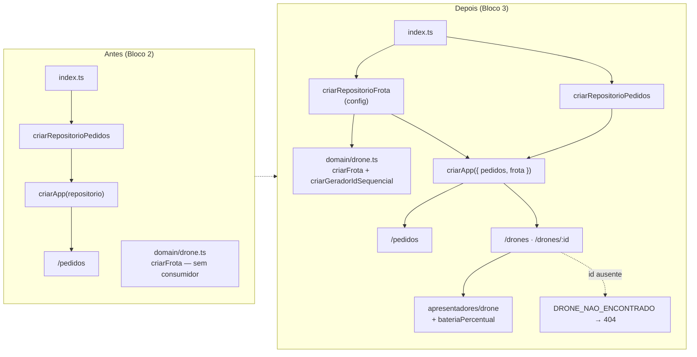

# Walkthrough — Bloco 3: Frota de Drones

**Data:** 2026-07-26
**Status:** ✅ implementado e verificado — branch `feat/bloco-3`, commit `b686cf4`
**Plano:** `plans/2026-07-26_Bloco_3_Frota.md`
**Histórias:** E2-1, E2-2 (épico E2)

---

## 1. Implementation Summary

O domínio da frota existia desde o Bloco 1 — `criarDrone` e `criarFrota` estavam escritos e
testados — mas **ninguém os chamava**. `src/index.ts` subia a API com o repositório de pedidos e
nada mais; a frota era código morto. Este bloco fecha o épico **E2** ligando a config à frota e
expondo seu status via REST.

Foi a primeira implementação do projeto feita inteiramente em **TDD**: em cada uma das cinco
fases, o teste foi escrito antes e confirmado vermelho pelo motivo certo (função inexistente,
módulo ausente, `Record` incompleto, tipo não atribuível) antes de qualquer linha de produção.



O eixo do desenho é a **frota derivada da config**: não há porta de persistência, não há arquivo,
não há estado a reconciliar. `criarRepositorioFrota` reconstrói a mesma frota a cada boot a partir
de quatro números do `.env`. O que torna isso viável para os próximos blocos é o gerador de ids
sequencial — sem ele, `randomUUID` faria a frota nascer com identidade nova a cada subida do
processo, e o `droneId` que o Bloco 4 vai gravar dentro de pedidos/viagens **persistidos** ficaria
órfão no primeiro reinício. Registrado em **D24**.

### Endpoints entregues

| Método | Rota          | História | Sucesso | Erros |
| ------ | ------------- | -------- | ------- | ----- |
| GET    | `/drones`     | E2-2     | 200     | —     |
| GET    | `/drones/:id` | E2-2     | 200     | 404   |

`GET /drones` nunca falha: sem frota configurada o boot já teria quebrado em
`QUANTIDADE_DRONES_INVALIDA`, então a lista sempre tem ao menos um item.

### Decisões tomadas durante a implementação

| Decisão | Escolha | Motivo |
| --- | --- | --- |
| Nome das rotas | `GET /drones` + `GET /drones/:id` | REST canônico, coerente com `/pedidos`. Substitui o `GET /drones/status` planejado — `status` não é recurso e colidiria com `:id` |
| Id do drone | `drone-1`…`drone-N` | Estável entre reinícios sem persistir nada; sustenta o `droneId` que o Bloco 4 vai gravar em disco (D24) |
| Origem da frota | Derivada da config no boot | D8: frota fixa, muda-se via `.env` + reinício. Persistir criaria divergência entre arquivo salvo e `.env` alterado |
| `bateriaPercentual` | Derivado na borda da API | O backlog pede "bateria" legível; o domínio continua falando só em `bateriaQuadras` (D15), sem duplicar o conceito que o E4-3 vai implementar |
| Assinatura de `criarApp` | Objeto `Dependencias` | `criarApp({ pedidos, frota })` em vez de posicional — o Bloco 4 acrescenta `viagens` sem virar o terceiro parâmetro solto |

---

## 2. Changes Made

**17 arquivos · +775 / −12 linhas** (inclui o plano, 349 linhas).

```text
case_dti/
├── .env.example                              [MODIFY]  +4/-2  nota sobre ids e reinício
├── README.md                                 [MODIFY]  +51/-1 seção E2 + exemplos curl (E7-2)
├── docs/
│   ├── BACKLOG.md                            [MODIFY]  +4/-2  E2-1 e E2-2 -> ✅
│   └── DECISIONS.md                          [MODIFY]  +22    ADR D24
├── plans/2026-07-26_Bloco_3_Frota.md         [ADD]     +349   plano aprovado
└── src/
    ├── index.ts                              [MODIFY]  +11/-2 compõe o repositório de frota
    ├── domain/
    │   ├── drone.ts                          [MODIFY]  +11    criarGeradorIdSequencial
    │   ├── drone.test.ts                     [MODIFY]  +37/-2 4 casos do gerador
    │   └── erros.ts                          [MODIFY]  +3/-1  DRONE_NAO_ENCONTRADO
    ├── repositorio/
    │   ├── frota.ts                          [ADD]     +52    listar / buscarPorId
    │   └── frota.test.ts                     [ADD]     +70
    └── api/
        ├── erros.ts                          [MODIFY]  +1     DRONE_NAO_ENCONTRADO -> 404
        ├── server.ts                         [MODIFY]  +19/-4 criarApp({ pedidos, frota })
        ├── apresentadores/
        │   └── drone.ts                      [ADD]     +32    RespostaDrone
        └── rotas/
            ├── drones.ts                     [ADD]     +31    as 2 rotas
            ├── drones.test.ts                [ADD]     +80
            └── pedidos.test.ts               [MODIFY]  +10/-5 adapta à nova assinatura
```

### Domínio (`src/domain/`)

`criarGeradorIdSequencial(prefixo = 'drone')` fecha sobre um contador próprio e devolve
`drone-1`, `drone-2`, … Dois geradores são independentes — o teste cobre isso, porque é essa
independência que garante que uma frota reconstruída no boot seguinte comece de novo em
`drone-1`. `criarDrone`/`criarFrota` não mudaram: o gerador entra pelo `gerarId` que já era
injetável desde o Bloco 1.

`CodigoErroDominio` ganhou `DRONE_NAO_ENCONTRADO`. Como o mapa HTTP é um `Record` exaustivo, o
typecheck quebrou no mesmo instante em `src/api/erros.ts` — o mecanismo desenhado no Bloco 2
funcionando como pretendido: código de erro novo não vira 500 silencioso.

### Repositório (`src/repositorio/frota.ts`)

Simétrico ao de pedidos, com uma diferença central: **não recebe porta de persistência**. Recebe
`OpcoesFrota` (base, capacidade, alcance, quantidade), monta a frota uma vez na criação e expõe
`listar`/`buscarPorId`. `listar()` devolve cópia (`[...frota]`) — o teste muta o array retornado e
verifica que a chamada seguinte veio intacta. Validação de quantidade não é reimplementada aqui:
`criarFrota` já lança `QUANTIDADE_DRONES_INVALIDA` e o repositório apenas deixa propagar.

### API (`src/api/`)

`paraRespostaDrone` é a única coisa entre o domínio e o JSON. Copia os campos do `Drone` e
acrescenta `bateriaPercentual = round(bateriaQuadras / alcanceQuadras × 100)` — hoje sempre 100,
porque nada consome bateria até o E4-3. O campo nasce e morre na borda; o tipo `Drone` não mudou.

`criarApp` passou a receber `Dependencias` (`{ pedidos, frota }`). É a segunda vez que a
assinatura muda, e o motivo de trocá-la por um objeto agora é justamente não ter uma terceira:
o Bloco 4 acrescenta `viagens` sem tocar nos chamadores existentes.

---

## 3. Real Test Results

`npm test` — **9 arquivos, 97 testes, todos passando** em 881 ms.

| Arquivo | Testes | Foco |
| --- | ---: | --- |
| `src/config.test.ts` | 4 | chaves e invariante de alcançabilidade |
| `src/domain/coordenada.test.ts` | 14 | Manhattan e validação de malha |
| `src/domain/pedido.test.ts` | 14 | criação, status e cancelamento |
| `src/domain/drone.test.ts` | 10 | frota homogênea + **gerador sequencial (novo)** |
| `src/infra/persistencia-pedidos.test.ts` | 19 | round-trip, schema e I/O real |
| `src/repositorio/pedidos.test.ts` | 10 | filtros, durabilidade, erros |
| `src/repositorio/frota.test.ts` | 6 | **frota, imutabilidade e 404 (novo)** |
| `src/api/rotas/pedidos.test.ts` | 16 | 4 endpoints de pedido |
| `src/api/rotas/drones.test.ts` | 4 | **2 endpoints de drone (novo)** |

O bloco somou **14 testes** aos 83 que já existiam.

`npm run coverage` — **98,21% de statements** (165/168), 93,9% de branches, 98,15% de linhas:

| Arquivo | Statements |
| --- | ---: |
| `src/domain/*` | 100% |
| `src/repositorio/*` (pedidos e frota) | 100% |
| `src/infra/*` | 100% |
| `src/api/apresentadores/drone.ts` | 100% |
| `src/api/rotas/pedidos.ts` | 100% |
| `src/api/rotas/drones.ts` | 91,66% |
| `src/api/middleware-erros.ts` | 88,88% |
| `src/api/server.ts` | 88,88% |

**Verificação completa:** `typecheck`, `lint`, `format:check`, `test`, `coverage` e `build`
verdes localmente.

**Validação manual (E2-1):** `npm run dev` + `curl localhost:3000/drones` devolveu os 3 drones
`idle`, na base `(0,0)`, `cargaKg: 0`, `bateriaPercentual: 100`, com ids `drone-1`…`drone-3`.

---

## 4. Attention Points / Limitations / Technical Debt

- **`src/api/rotas/drones.ts` em 91,66%** — a linha não coberta é o `catch` do `GET /`, que hoje
  é inalcançável: `listar()` não lança. O bloco manteve o `try/catch` por simetria com as outras
  rotas e porque o E4 vai tornar a listagem capaz de falhar. Custo: uma linha morta no relatório.

- **Reduzir `DRONE_QUANTIDADE` entre reinícios encolhe a frota sem aviso.** Hoje é inofensivo —
  nada persistido referencia drone. A partir do Bloco 4, `droneId` gravado em pedidos/viagens
  pode apontar para um drone que deixou de existir. A reconciliação é dívida explícita do Bloco 4,
  registrada na limitação conhecida de D24.

- **`bateriaPercentual` é sempre 100** enquanto o E4-3 não consumir bateria. O campo existe para
  o consumidor (dashboard, E6) não ter que calcular, mas até lá não carrega informação.

- **`criarApp` mudou de assinatura pela segunda vez.** Só `src/index.ts` e as duas suítes de rota
  chamam, todas atualizadas. A troca para objeto foi feita agora justamente para não haver uma
  terceira mudança no Bloco 4.

- **A frota não tem estado entre requisições.** Os drones são recriados na composição e nunca
  mudam — `estado`, `posicao` e `cargaKg` são constantes até o E3/E4 escreverem neles. O
  repositório ainda não expõe nenhuma operação de mutação; ela nasce junto com a alocação.

- **`GET /drones` não tem paginação nem filtro por estado.** Irrelevante numa frota de 3 drones;
  se a simulação de carga (E8-2) subir a frota para dezenas, filtrar por `estado` vira útil.

---

## 5. Commit Suggestion

O commit da implementação **já foi aplicado**:

```
b686cf4  feat(frota): bloco 3 — status da frota via API
```

Para a documentação gerada agora (este walkthrough + a sincronização de contexto), na mesma
branch `feat/bloco-3`, antes de abrir o PR:

```
docs(context): documenta o bloco 3 e sincroniza o contexto

- Walkthrough do bloco 3 em context/walkthroughs/
- metaspec, index e timeline atualizados via /context-update
- Plano movido para plans/old/
```
