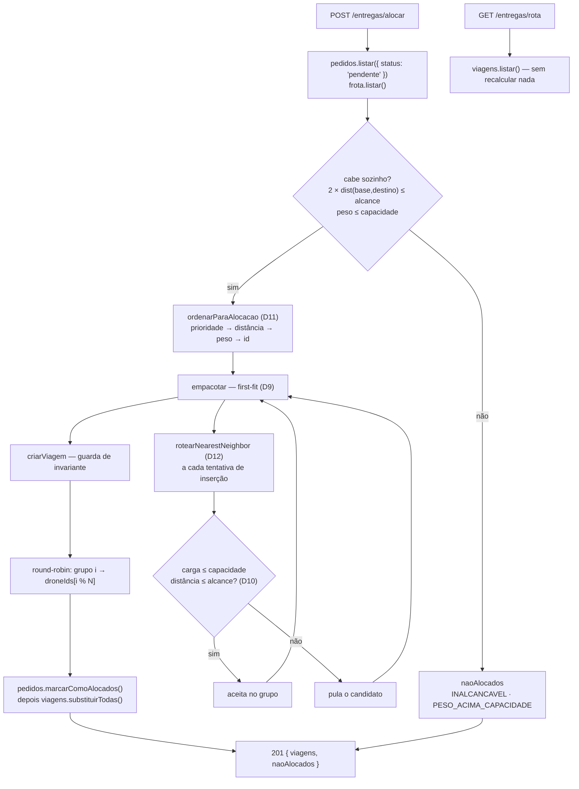

# Walkthrough — Bloco 4: Alocação & Otimização

**Data:** 2026-07-26
**Status:** ✅ implementado e verificado — branch `feat/bloco-4`, sem commit
**Plano:** `plans/2026-07-26_Bloco_4_Alocacao.md`
**Histórias:** E3-1, E3-2, E3-3 (épico E3)

---

## 1. Implementation Summary

Este é o bloco que o case avalia mais. Até aqui o sistema sabia guardar pedidos (E1) e listar
drones (E2), mas **nada decidia o que vai em qual viagem** — `StatusPedido` tinha `alocado` no
tipo e nenhum caminho de código o produzia. O Bloco 4 fecha o épico **E3**: monta o conceito de
viagem, empacota os pedidos por heurística **greedy** respeitando capacidade e alcance, roteia
cada viagem por vizinho mais próximo e expõe o resultado em duas rotas.

O eixo do desenho é a **separação entre decidir e executar**. `alocarPedidos` é uma função pura —
sem I/O, sem relógio, sem `Math.random`, com `gerarId` injetável — que recebe pedidos, ids de
drone e três limites, e devolve `{ viagens, naoAlocados }`. Toda a persistência, o HTTP e o
estado ficam fora dela. É isso que torna o algoritmo testável a fundo, inclusive sob carga: o
teste de ~500 pedidos com semente fixa roda em milissegundos e confere que duas execuções da
mesma entrada produzem resultado idêntico.

Implementado inteiramente em **TDD**, como o Bloco 3: em cada uma das cinco fases o teste foi
escrito primeiro e confirmado vermelho pelo motivo certo (módulo inexistente, função inexistente,
`Record` incompleto, rota não montada) antes de qualquer linha de produção.



### Endpoints entregues

| Método | Rota                | História | Sucesso | Erros |
| ------ | ------------------- | -------- | ------- | ----- |
| POST   | `/entregas/alocar`  | E3-1, E3-2 | 201   | 422 (`FROTA_VAZIA`) |
| GET    | `/entregas/rota`    | E3-3     | 200     | —     |

`POST /entregas/alocar` sem nenhum pedido pendente devolve `201` com listas vazias — é idempotente
por construção, porque só considera pedidos `pendente`. `GET /entregas/rota` nunca falha: sem
alocação devolve `[]`, conforme o critério de aceite do E3-3.

### Decisões tomadas durante a implementação

| Decisão | Escolha | Motivo | ADR |
| --- | --- | --- | --- |
| Disparo da alocação | `POST /entregas/alocar` explícito | Separa cadastro de planejamento; um `GET` que muda status de pedido violaria a semântica HTTP | D25 |
| Persistência das viagens | JSON, mesmo padrão de D6 | `pedido.status` já é persistido; viagem só em memória deixaria pedidos `alocado` órfãos no arquivo após reinício | D26 |
| Viagem órfã no boot | Descartar e devolver os pedidos a `pendente` | Reduzir `DRONE_QUANTIDADE` é operação prevista (D8), não corrupção — falhar o boot impediria o operador de encolher a frota | D27 |
| Viagens × frota | Fila round-robin | O objetivo do E3-1 é minimizar viagens para entregar **tudo**, não caber numa rodada; execução sequencial é do E4 | D28 |
| Pedido inviável | Relatório `naoAlocados` na resposta | Alocação parcial é o comportamento correto; abortar tudo por um destino ruim travaria a operação | D29 |
| Desempate final por peso | Maior primeiro (FFD) | D11 fixa "empate por peso" sem cravar a direção; pacote grande primeiro deixa menos buraco na viagem | D29 |
| Ordem de gravação | Pedidos antes das viagens | Falha entre as duas escritas deixa o estado **recuperável** (pedido `alocado` sem viagem), que a reconciliação do boot já desfaz | D26 |

---

## 2. Changes Made

**28 arquivos · ~2.048 linhas adicionadas / 19 removidas** (13 novos, 15 modificados; inclui o
plano de 349 linhas).

```text
case_dti/
├── .env.example                                [MODIFY]  +5      VIAGENS_ARQUIVO + nota de reconciliação
├── README.md                                   [MODIFY]  +69/-2  seção E3 + curl das 2 rotas (E7-2)
├── docs/
│   ├── BACKLOG.md                              [MODIFY]  +6/-3   E3-1, E3-2, E3-3 -> ✅
│   └── DECISIONS.md                            [MODIFY]  +78     ADRs D25–D29
├── plans/2026-07-26_Bloco_4_Alocacao.md        [ADD]     +349    plano aprovado
└── src/
    ├── config.ts                               [MODIFY]  +3      viagensArquivo
    ├── index.ts                                [MODIFY]  +29/-4  compõe viagens + reconciliação no boot
    ├── domain/
    │   ├── viagem.ts                           [ADD]     +163    tipo, nearest-neighbor, guarda, reconciliação
    │   ├── viagem.test.ts                      [ADD]     +245
    │   ├── alocacao.ts                         [ADD]     +207    ordenação (D11) + greedy (D9) + round-robin
    │   ├── alocacao.test.ts                    [ADD]     +351
    │   ├── pedido.ts                           [MODIFY]  +34     alocarPedido / reverterParaPendente
    │   ├── pedido.test.ts                      [MODIFY]  +84/-1
    │   └── erros.ts                            [MODIFY]  +7/-1   +5 códigos
    ├── infra/
    │   ├── persistencia-viagens.ts             [ADD]     +94     porta + arquivo atômico + memória
    │   ├── persistencia-viagens.test.ts        [ADD]     +130
    │   └── schema-viagem.ts                    [ADD]     +38     Zod da viagem persistida
    ├── repositorio/
    │   ├── viagens.ts                          [ADD]     +52     write-through + reconciliação na criação
    │   ├── viagens.test.ts                     [ADD]     +77
    │   ├── pedidos.ts                          [MODIFY]  +29     mutação em lote
    │   └── pedidos.test.ts                     [MODIFY]  +54
    └── api/
        ├── erros.ts                            [MODIFY]  +5      5 códigos novos -> 422
        ├── server.ts                           [MODIFY]  +17/-3  Dependencias += viagens; monta /entregas
        ├── apresentadores/
        │   └── viagem.ts                       [ADD]     +31     RespostaViagem
        └── rotas/
            ├── entregas.ts                     [ADD]     +68     as 2 rotas
            ├── entregas.test.ts                [ADD]     +175
            ├── pedidos.test.ts                 [MODIFY]  +8/-2   adapta à nova assinatura
            └── drones.test.ts                  [MODIFY]  +8/-2   adapta à nova assinatura
```

### Domínio — `viagem.ts`

O tipo `Viagem` carrega exatamente o que o E3-3 pede: `droneId`, `pedidoIds`, `paradas` (com a
base nas duas pontas), `distanciaQuadras` e `cargaKg`.

`rotearNearestNeighbor` (D12) tem um detalhe que o plano exigiu e o teste cobre: **o desempate é
por menor `x`, depois menor `y`** — nunca a ordem de chegada no array. Sem isso, dois destinos
equidistantes fariam a rota depender da ordem em que os pedidos foram cadastrados, e o requisito
de determinismo do E3-2 cairia justamente no caso mais comum (malha pequena, muitos empates).

`criarViagem` é uma **guarda de invariante**, não um caminho normal de erro: valida capacidade e
alcance na construção, com bordas inclusivas (`<=`). O greedy nunca deve fazê-la lançar — ela
existe para que um bug no empacotamento falhe alto em vez de gravar uma viagem impossível em
disco.

### Domínio — `alocacao.ts`

Três funções em camadas. `separarInviaveis` retira do caminho quem nunca caberia em viagem
nenhuma; `ordenarParaAlocacao` aplica D11; `empacotar` faz o first-fit.

A ordenação tem um quarto critério que o D11 não previa: **desempate final pelo `id`**. O
comparador nunca devolve `0`, porque um `0` residual deixaria a ordem remanescente à mercê da
implementação do `sort` do V8 — determinismo aparente que quebraria com o volume.

O empacotamento é *first-fit*, não *next-fit*: um pedido que não cabe na viagem corrente é
**pulado**, não trava a fila, e é reavaliado na viagem seguinte. É o que faz um pacote leve e
próximo entrar numa viagem onde um pesado não coube — e o que difere "minimizar viagens" de
"encher a primeira e seguir".

Cada tentativa de inserção **reroteia a viagem inteira**, porque a distância depende do conjunto,
não do último inserido: inserir um destino pode encurtar ou alongar o percurso conforme a posição
que ele assume na rota do vizinho mais próximo. Custa O(n²) por viagem, e o teste de carga da
fase 2 é quem vigia esse custo.

### Persistência e repositórios

`persistencia-viagens.ts` espelha `persistencia-pedidos.ts` (D6): porta `carregar`/`salvar`,
implementação de arquivo com escrita atômica (`.tmp` + `rename`) e validação por schema Zod na
carga, mais a implementação de memória usada pelos testes. Arquivo inválido derruba o boot e
**nunca é apagado, renomeado ou regravado** — mesma política do bloco 2.

`criarRepositorioViagens` reconcilia **na criação**: viagem cujo `droneId` sumiu da frota é
descartada, seus `pedidoIds` ficam disponíveis em `pedidoIdsOrfaos()`, e o arquivo só é regravado
se algo mudou (frota intacta não gera escrita à toa). O `src/index.ts` fecha o ciclo devolvendo
esses pedidos a `pendente` com log explícito.

A mutação em lote no repositório de pedidos (`marcarComoAlocados` / `reverterParaPendente`) valida
**todos** os ids antes de mutar qualquer um e chama `persistencia.salvar` uma única vez — id
inexistente lança `PEDIDO_NAO_ENCONTRADO` sem deixar meia-alocação gravada.

### API

`criarRotasEntregas` recebe os três repositórios num objeto e não decide status de erro nenhum
(D20). Os cinco códigos novos (`VIAGEM_ACIMA_CAPACIDADE`, `VIAGEM_ACIMA_ALCANCE`,
`VIAGEM_SEM_PEDIDOS`, `FROTA_VAZIA`, `ALOCACAO_NAO_PERMITIDA`) foram mapeados para **422** — todos
são entrada válida violando regra de negócio. Como no Bloco 3, acrescentar os códigos ao domínio
quebrou o typecheck em `src/api/erros.ts` antes de qualquer teste rodar: o `Record` exaustivo
continua fazendo seu trabalho.

`criarApp` ganhou `viagens` em `Dependencias` — aditivo, exatamente como o Bloco 3 previu ao
trocar os parâmetros posicionais por um objeto. Nenhuma terceira mudança de assinatura foi
necessária.

---

## 3. Real Test Results

`npm test` — **14 arquivos, 164 testes, todos passando** em ~1,1 s.

| Arquivo | Testes | Foco |
| --- | ---: | --- |
| `src/config.test.ts` | 4 | chaves e invariante de alcançabilidade |
| `src/domain/coordenada.test.ts` | 14 | Manhattan e validação de malha |
| `src/domain/pedido.test.ts` | 24 | criação, status, cancelamento + **transições de alocação (novo)** |
| `src/domain/drone.test.ts` | 10 | frota homogênea e gerador sequencial |
| `src/domain/viagem.test.ts` | 15 | **roteamento, guardas e reconciliação (novo)** |
| `src/domain/alocacao.test.ts` | 17 | **ordenação D11, greedy, inviáveis, round-robin, carga (novo)** |
| `src/infra/persistencia-pedidos.test.ts` | 19 | round-trip, schema e I/O real |
| `src/infra/persistencia-viagens.test.ts` | 11 | **round-trip, schema e I/O real de viagens (novo)** |
| `src/repositorio/pedidos.test.ts` | 13 | filtros, durabilidade, erros + **mutação em lote (novo)** |
| `src/repositorio/frota.test.ts` | 6 | frota, imutabilidade e 404 |
| `src/repositorio/viagens.test.ts` | 4 | **write-through e reconciliação no boot (novo)** |
| `src/api/rotas/pedidos.test.ts` | 16 | 4 endpoints de pedido |
| `src/api/rotas/drones.test.ts` | 4 | 2 endpoints de drone |
| `src/api/rotas/entregas.test.ts` | 7 | **2 endpoints de entrega (novo)** |

O bloco somou **67 testes** aos 97 que já existiam.

`npm run coverage` — **98,32% de statements** (352/358), 92,66% de branches, 98,95% de funções.
O relatório lista apenas o que está abaixo de 100%; os arquivos omitidos (entre eles
`repositorio/viagens.ts`, `infra/schema-viagem.ts`, `api/apresentadores/viagem.ts` e
`domain/pedido.ts`) estão integralmente cobertos.

| Arquivo | Statements | Linha não coberta |
| --- | ---: | --- |
| `src/domain/alocacao.ts` | 100% | 63 — desempate final por `id` (só dispara com prioridade, distância e peso idênticos) |
| `src/domain/viagem.ts` | 97,91% | 46 — ramo `y` do desempate de coordenada |
| `src/api/rotas/entregas.ts` | 95,23% | 63 — `catch` do `GET /rota`, hoje inalcançável |
| `src/infra/persistencia-viagens.ts` | 96,15% | 24 — formatação de issue na raiz do arquivo |
| `src/api/rotas/drones.ts` | 91,66% | 17 — `catch` do `GET /` (pré-existente) |
| `src/api/server.ts` | 90% | 32 — handler do `/health` |
| `src/domain` (agregado) | **99,35%** | — |

**Verificação completa:** `typecheck`, `lint`, `format:check`, `test`, `coverage` e `build` verdes
localmente.

**Validação manual:** `npm run dev` + `POST /entregas/alocar` devolveu as viagens com paradas
começando e terminando na base; `GET /entregas/rota` repetiu o mesmo conteúdo; `GET
/pedidos?status=alocado` refletiu a mudança. Reiniciar com `DRONE_QUANTIDADE` menor descartou a
viagem do drone removido, reverteu seus pedidos a `pendente` e emitiu o log de reconciliação.

---

## 4. Attention Points / Limitations / Technical Debt

- **`empacotar` depende de um invariante estabelecido em outra função.** O laço externo só termina
  porque `separarInviaveis` garante que todo pedido restante cabe sozinho numa viagem — se essa
  garantia fosse quebrada, o grupo sairia vazio e o laço giraria para sempre, já que `restantes`
  nunca encolheria. O acoplamento é real e não está protegido por asserção. Um `if (grupo.length
  === 0) throw` fecharia o buraco a custo de uma linha; fica como dívida consciente.

- **As viagens acumulam entre alocações e não há como limpá-las.** `POST /entregas/alocar`
  concatena as viagens novas às existentes, e não existe rota que descarte viagens. Como só
  pedidos `pendente` são alocados, não há duplicação — mas depois de várias rodadas o
  `GET /entregas/rota` cresce indefinidamente, e a única forma de zerar é apagar
  `data/viagens.json`. Um `DELETE /entregas` ou o encerramento de viagem no E4 resolve.

- **Nada executa as viagens.** O drone continua `idle`, na base, com `cargaKg: 0` e
  `bateriaPercentual: 100`, mesmo com viagens atribuídas a ele. O pedido para em `alocado` e nunca
  chega a `em_voo`/`entregue`. É o escopo do Bloco 5 (E4) — mas hoje o `GET /drones` mostra um
  estado que contradiz o `GET /entregas/rota`.

- **`droneId` é atribuído em round-robin, sem olhar carga nem posição.** Com frota heterogênea ou
  drones em estados diferentes (E4), a distribuição vira um problema de balanceamento real; hoje é
  uma divisão cega de índices.

- **O greedy não tem passo de melhoria local.** D9 descarta explicitamente, e os testes garantem
  *correção* (nenhuma viagem viola capacidade ou alcance), nunca *otimalidade*. Em distribuições
  adversas o resultado pode ter mais viagens que o ótimo — 2-opt ou realocação entre viagens fica
  como evolução possível.

- **A janela entre as duas gravações do `POST /alocar` é assumida, não eliminada.** Falha entre
  gravar pedidos e gravar viagens deixa pedidos `alocado` sem viagem; a reconciliação do boot só
  desfaz o caso do drone inexistente, não este. Registrado em D26 como limitação conhecida.

- **`GET /entregas/rota` não tem paginação nem filtro por drone.** Mesmo ponto de atenção do
  `GET /pedidos` e `GET /drones`, agravado pelo acúmulo de viagens acima — vira relevante na
  simulação de carga (E8-2).

---

## 5. Commit Suggestion

O trabalho está na branch `feat/bloco-4`, **sem commit**. Sugestão de dois commits:

```
feat(alocacao): bloco 4 — alocação greedy e rotas de entrega

Fecha o épico E3: domínio da viagem com roteamento nearest-neighbor (D12),
alocação greedy respeitando capacidade e alcance (D9, D10), ordenação
determinística por prioridade > distância > peso (D11), persistência das
viagens com reconciliação no boot e as rotas POST /entregas/alocar e
GET /entregas/rota.

- ADRs D25–D29 em docs/DECISIONS.md
- E3-1, E3-2 e E3-3 concluídas em docs/BACKLOG.md
- 164 testes verdes; cobertura do domínio em 99,35%
```

```
docs(context): documenta o bloco 4 e sincroniza o contexto

- Walkthrough do bloco 4 em context/walkthroughs/
- metaspec, index e timeline atualizados via /context-update
- Plano movido para plans/old/
```
