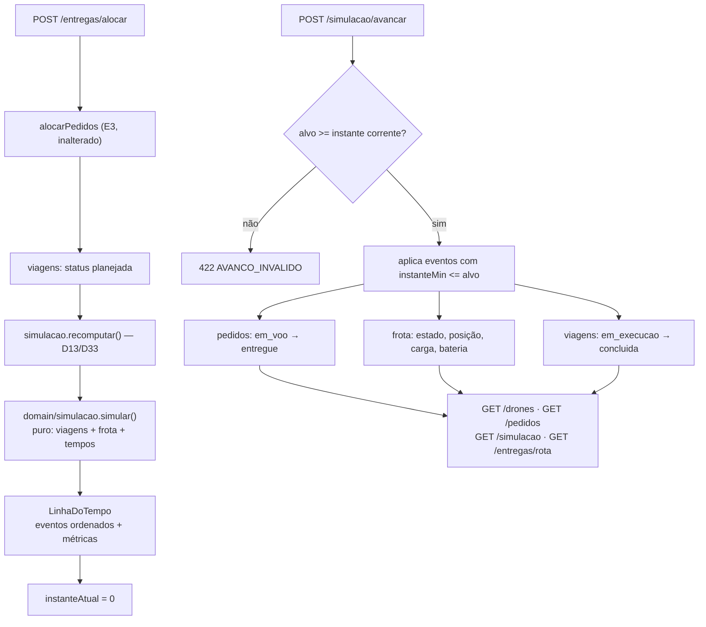
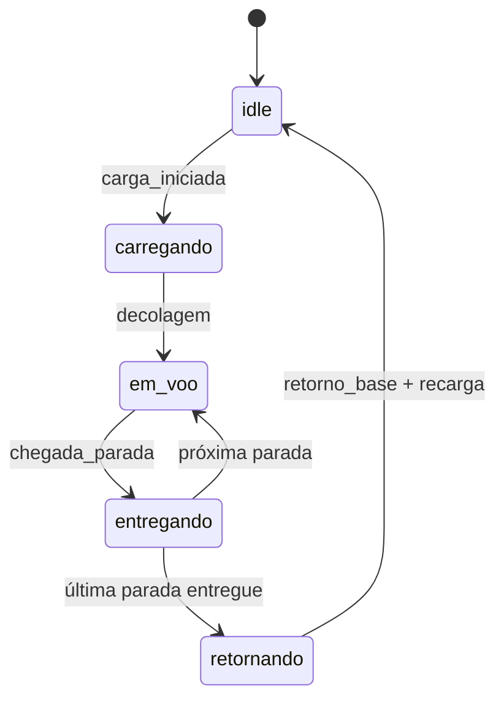

# Walkthrough — Bloco 5: Simulação & Estados

**Data:** 2026-07-26
**Status:** ✅ implementado e verificado — branch `feat/bloco-5`, sem commit
**Plano:** `plans/2026-07-26_Bloco_5_Simulacao_Estados.md`
**Histórias:** E4-1, E4-2, E4-3 (épico E4)

---

## 1. Implementation Summary

Até aqui o sistema **planejava e não executava**. O bloco 4 fechou a alocação: `POST /entregas/alocar`
produzia viagens corretas, com rota e carga. Mas o drone continuava `idle` na base, com
`cargaKg: 0` e bateria cheia, mesmo com viagem atribuída — e o pedido parava em `alocado`. Os valores
`em_voo` e `entregue` existiam em `StatusPedido` e **nenhum caminho de código os produzia**;
`ESTADOS_DRONE` existia e não havia função de transição. `GET /drones` contradizia `GET /entregas/rota`.

O Bloco 5 fecha o épico **E4**: máquina de estados explícita, motor de simulação em tempo simulado,
métricas de tempo e bateria como recurso consumível.

O eixo do desenho é a **separação entre calcular a linha do tempo e aplicá-la**. `simular` é uma
função pura — sem I/O, sem relógio real, sem `Math.random` — que recebe viagens, pedidos, frota, base
e os quatro tempos operacionais, e devolve `{ eventos, metricas }`. Quem toca repositório é o serviço
`src/servicos/simulacao.ts`, uma **camada nova** entre rota e repositório: ele guarda a linha do tempo
e o instante corrente, e ao avançar o relógio aplica os eventos já vencidos. Nenhuma regra vive nele —
transição, consumo de bateria e cálculo de tempo estão todos em `src/domain/`.

Implementado inteiramente em **TDD**, como os blocos 3 e 4: em cada uma das cinco fases o teste foi
escrito primeiro e confirmado vermelho pelo motivo certo (módulo inexistente, função inexistente,
`Record` incompleto, rota não montada) antes de qualquer linha de produção.



### Máquina de estados (E4-1)



A tabela `TRANSICOES` em `src/domain/drone.ts` é a fonte única. Qualquer par fora dela — **inclusive
permanecer no mesmo estado** — lança `TRANSICAO_INVALIDA`. Não existe transição silenciosa.

### Endpoints entregues

| Método | Rota | História | Sucesso | Erros |
| ------ | ---- | -------- | ------- | ----- |
| GET    | `/simulacao` | E4-2 | 200 | — |
| POST   | `/simulacao/avancar` | E4-1, E4-3 | 200 | 400 (Zod), 422 (`AVANCO_INVALIDO`) |
| GET    | `/simulacao/eventos` | E4-1 | 200 | 400 (Zod no recorte) |
| GET    | `/entregas/rota?status=` | D35 | 200 | 400 (status desconhecido) |
| DELETE | `/entregas/concluidas` | D35 | 200 | — |

`POST /simulacao/avancar` aceita **exatamente um** entre `ateInstante` (absoluto) e `minutos`
(relativo) — o `refine` do Zod garante isso na borda. `GET /simulacao` nunca falha: sem alocação
devolve métricas zeradas e `instanteAtual: 0`.

### Decisões tomadas durante a implementação

| Decisão | Escolha | Motivo | ADR |
| --- | --- | --- | --- |
| Observabilidade do tempo | Relógio virtual com instante corrente | Forma canônica de simulação de eventos discretos; é o que faz `GET /drones` exibir de fato a máquina de estados | D30 |
| Persistência da simulação | Não persistir — recomputar da lista de viagens | A simulação é pura e determinística; persistir criaria um terceiro arquivo a reconciliar (mesma lógica de D24) | D31 |
| Semântica do avanço | Aplicar eventos: o estado real muda e é persistido | Projeção pura deixaria `pedido.status` como ficção não persistida, colidindo com o E1-2 | D32 |
| Alocar durante simulação | Recomputa as viagens não concluídas e zera o relógio | Coerente com D25 (a alocação já recalcula do zero); instante inicial independe de histórico | D33 |
| Recarga | Duração proporcional à bateria consumida | Recarga instantânea não afetaria métrica nenhuma e esvaziaria o E4-3 | D34 |
| Ciclo de vida da viagem | `planejada → em_execucao → concluida` + rota de limpeza | Necessário para a simulação não reexecutar viagem já entregue; fecha a dívida de acúmulo do bloco 4 | D35 |

### Modelo de tempo (D14)

`tempoVoo = distância ÷ velocidade`, somados os tempos fixos. Defaults na config, sobrescrevíveis
por `.env`:

| Constante | Default | Unidade |
| --- | ---: | --- |
| `droneVelocidadeQuadrasMin` | 1 | quadras/min |
| `tempoCarregamentoMin` | 5 | min por viagem |
| `tempoEntregaMin` | 2 | min por pedido entregue |
| `recargaMinPorQuadra` | 0,5 | min por quadra consumida |

Drones **diferentes** voam em paralelo (cada um com relógio próprio começando em 0); o **mesmo**
drone executa suas viagens em série, recarga incluída. O makespan é o maior instante final.

---

## 2. Changes Made

**37 arquivos · ~2.800 linhas adicionadas / 36 removidas** (9 novos, 28 modificados; inclui o plano
de 508 linhas).

```text
case_dti/
├── .env.example                                [MODIFY]  +12     4 constantes de tempo
├── README.md                                   [MODIFY]  +112    seção E4 + curl ponta a ponta (E7-2)
├── docs/
│   ├── BACKLOG.md                              [MODIFY]  +16/-8  E4 -> ✅ + checkboxes atrasados de E1/E7
│   └── DECISIONS.md                            [MODIFY]  +84     ADRs D30–D35
├── plans/2026-07-26_Bloco_5_Simulacao_Estados.md [ADD]   +508    plano aprovado
└── src/
    ├── config.ts                               [MODIFY]  +12     velocidade, carregamento, entrega, recarga
    ├── index.ts                                [MODIFY]  +19     compõe o serviço e recomputa no boot
    ├── domain/
    │   ├── simulacao.ts                        [ADD]     +270    **motor puro: viagens -> eventos + métricas**
    │   ├── simulacao.test.ts                   [ADD]     +446
    │   ├── drone.ts                            [MODIFY]  +76     TRANSICOES + transitar/carregar/mover/descarregar/recarregar
    │   ├── drone.test.ts                       [MODIFY]  +158
    │   ├── pedido.ts                           [MODIFY]  +34     despacharPedido / entregarPedido
    │   ├── pedido.test.ts                      [MODIFY]  +80
    │   ├── viagem.ts                           [MODIFY]  +11     STATUS_VIAGEM + comStatusViagem
    │   ├── viagem.test.ts                      [MODIFY]  +43
    │   ├── alocacao.ts                         [MODIFY]  +11     guarda do invariante (dívida do bloco 4)
    │   └── erros.ts                            [MODIFY]  +7/-1   +5 códigos
    ├── servicos/                                                 **camada nova**
    │   ├── simulacao.ts                        [ADD]     +159    orquestra motor + repositórios
    │   └── simulacao.test.ts                   [ADD]     +161
    ├── infra/
    │   ├── schema-viagem.ts                    [MODIFY]  +3      status com .default('planejada')
    │   └── persistencia-viagens.test.ts        [MODIFY]  +11     compatibilidade com arquivo do bloco 4
    ├── repositorio/
    │   ├── frota.ts                            [MODIFY]  +15     atualizar() — frota deixa de ser só leitura
    │   ├── frota.test.ts                       [MODIFY]  +43
    │   ├── pedidos.ts                          [MODIFY]  +12     despachar / entregar em lote
    │   ├── pedidos.test.ts                     [MODIFY]  +27
    │   └── viagens.test.ts                     [MODIFY]  +1      status no literal de teste
    └── api/
        ├── erros.ts                            [MODIFY]  +5      5 códigos novos
        ├── server.ts                           [MODIFY]  +11     Dependencias += simulacao; monta /simulacao
        ├── apresentadores/
        │   ├── simulacao.ts                    [ADD]     +17     RespostaEvento / RespostaMetricas
        │   └── viagem.ts                       [MODIFY]  +2      expõe status
        ├── schemas/simulacao.ts                [ADD]     +42     avanço, recorte de eventos, filtro de viagem
        └── rotas/
            ├── simulacao.ts                    [ADD]     +67     as 3 rotas
            ├── simulacao.test.ts               [ADD]     +208
            ├── entregas.ts                     [MODIFY]  +36/-10 recomputa após alocar; ?status=; DELETE /concluidas
            ├── entregas.test.ts                [MODIFY]  +88
            ├── pedidos.test.ts                 [MODIFY]  +17     adapta à nova Dependencias
            └── drones.test.ts                  [MODIFY]  +17     adapta à nova Dependencias
```

### Domínio — `drone.ts`

A máquina de estados é uma tabela, não uma cadeia de `if`. `TRANSICOES` é um
`Record<EstadoDrone, readonly EstadoDrone[]>` — acrescentar um estado ao enum sem declarar suas
transições quebra o typecheck, no mesmo espírito do `Record` exaustivo de `src/api/erros.ts`.

A separação entre **transição** e **efeito físico** é deliberada: `moverPara` altera posição e
bateria e **não** mexe no estado; `transitar` altera só o estado. Isso permite a `simular` compor os
dois na ordem certa (chegar na parada e só então entrar em `entregando`) sem que nenhuma das duas
funções conheça o roteiro da viagem.

`carregarDrone` valida capacidade antes de transitar — `PESO_ACIMA_CAPACIDADE`, reaproveitando o
código de erro já existente em vez de inventar um novo para a mesma invariante.

### Domínio — `simulacao.ts`

O motor reaproveita as funções puras de `drone.ts` em vez de recalcular estado à mão. É o que garante
que a bateria consumida na simulação siga exatamente a mesma regra que um teste unitário de
`moverPara` verifica — não há uma segunda implementação da física em lugar nenhum.

Três detalhes que o plano exigiu e os testes cobrem:

- **Paradas físicas ≠ pedidos.** `paradasDeEntrega` funde entradas consecutivas de mesma coordenada:
  três pedidos no mesmo destino são **uma** parada com três entregas, cada uma custando
  `entregaMin`. Sem isso, o drone "chegaria" três vezes ao mesmo ponto, inflando o tempo de voo com
  pernas de distância zero.
- **Ordenação total dos eventos.** `compararEventos` desempata por `instanteMin → droneId →
  sequencia` e nunca devolve 0 — mesmo motivo do comparador de `ordenarParaAlocacao` (D11): um `0`
  residual deixaria a ordem à mercê da implementação do `sort` do V8.
- **Ponto único de arredondamento.** `recargaMinPorQuadra = 0.5` e a divisão por velocidade produzem
  frações; todo instante passa por `arredondar` (3 casas) para que a comparação `<=` no avanço do
  relógio não sofra deriva de ponto flutuante acumulada.

Viagem com `status: 'concluida'` é ignorada na entrada — é o que impede a reexecução após uma
segunda rodada de alocação (D35).

### Serviço — `servicos/simulacao.ts`

Camada nova no projeto. A justificativa: aplicar eventos toca **três** repositórios (pedidos, frota,
viagens) — não é regra de negócio (que fica no domínio) nem tradução HTTP (que fica na rota).
Espremer isso numa rota engordaria a casca fina; colocar num repositório faria um repositório
conhecer os outros dois.

O avanço é monotônico e mantém um cursor (`indiceProximoEvento`): avançar duas vezes não reaplica
evento já aplicado, e avançar para instante menor que o corrente lança `AVANCO_INVALIDO`. Recomputar
zera cursor e relógio.

### API

`criarRotasSimulacao` recebe só o serviço e não decide status de erro nenhum (D20). Os cinco códigos
novos foram mapeados em `src/api/erros.ts`: `TRANSICAO_INVALIDA`, `BATERIA_INSUFICIENTE`,
`ENTREGA_NAO_PERMITIDA` e `AVANCO_INVALIDO` para **422** (entrada válida violando regra de negócio);
`EMPACOTAMENTO_INCONSISTENTE` para **500**, por ser bug do algoritmo e não entrada do usuário. Como
nos blocos anteriores, acrescentar os códigos ao domínio quebrou o typecheck antes de qualquer teste
rodar.

`Dependencias` ganhou `simulacao` — aditivo, terceira vez que o objeto de dependências do Bloco 3
absorve uma extensão sem mudar assinatura.

### Compatibilidade do arquivo persistido

`Viagem` ganhou `status`, e `viagens.json` é persistido. A mudança é retrocompatível nos **dois**
sentidos, e isso está coberto por teste:

- arquivo do bloco 4 (sem `status`) carrega no bloco 5 pelo `.default('planejada')` do schema;
- arquivo do bloco 5 carrega no bloco 4 porque `z.object` não é estrito — a chave extra é descartada.

---

## 3. Real Test Results

`npm test` — **17 arquivos, 234 testes, todos passando** em ~1,3 s.

| Arquivo | Testes | Foco |
| --- | ---: | --- |
| `src/config.test.ts` | 4 | chaves e invariante de alcançabilidade |
| `src/domain/coordenada.test.ts` | 14 | Manhattan e validação de malha |
| `src/domain/pedido.test.ts` | 34 | criação, status, cancelamento, alocação + **despachar/entregar (novo)** |
| `src/domain/drone.test.ts` | 30 | frota e gerador + **máquina de estados, bateria, recarga (novo)** |
| `src/domain/viagem.test.ts` | 17 | roteamento, guardas, reconciliação + **status (novo)** |
| `src/domain/alocacao.test.ts` | 17 | ordenação D11, greedy, inviáveis, round-robin, carga |
| `src/domain/simulacao.test.ts` | 11 | **motor: eventos, instantes, série vs. paralelo, métricas, determinismo (novo)** |
| `src/infra/persistencia-pedidos.test.ts` | 19 | round-trip, schema e I/O real |
| `src/infra/persistencia-viagens.test.ts` | 12 | round-trip e schema + **compatibilidade do arquivo antigo (novo)** |
| `src/repositorio/pedidos.test.ts` | 15 | filtros, durabilidade, lote + **despachar/entregar (novo)** |
| `src/repositorio/frota.test.ts` | 10 | frota e 404 + **atualizar (novo)** |
| `src/repositorio/viagens.test.ts` | 4 | write-through e reconciliação no boot |
| `src/servicos/simulacao.test.ts` | 6 | **recomputar, avanço parcial/total, avanço retroativo (novo)** |
| `src/api/rotas/pedidos.test.ts` | 16 | 4 endpoints de pedido |
| `src/api/rotas/drones.test.ts` | 4 | 2 endpoints de drone |
| `src/api/rotas/entregas.test.ts` | 11 | 2 endpoints + **filtro, DELETE, não reexecutar concluídas (novo)** |
| `src/api/rotas/simulacao.test.ts` | 10 | **3 endpoints de simulação (novo)** |

O bloco somou **70 testes** aos 164 que já existiam.

`npm run coverage` — **97,87% de statements**, 92,30% de branches, 99,30% de funções.
Domínio em **99,24%**.

| Arquivo | Statements | Linha não coberta |
| --- | ---: | --- |
| `src/domain/simulacao.ts` | 98,83% | 160 — viagem cujo drone sumiu da frota (D27 já trata antes) |
| `src/domain/alocacao.ts` | 98,41% | 162 — guarda `EMPACOTAMENTO_INCONSISTENTE`, **descoberta por decisão** (ver §4) |
| `src/servicos/simulacao.ts` | 97,77% | 81 — atalho quando a viagem já está no status alvo |
| `src/api/rotas/simulacao.ts` | 87,50% | 23, 37, 62 — dois `catch` inalcançáveis e a guarda redundante do `refine` |
| `src/api/rotas/entregas.ts` | 94,28% | 75, 87 — `catch` inalcançáveis (pré-existente) |
| `src/domain` (agregado) | **99,24%** | — |

**Verificação completa:** `typecheck`, `lint`, `format:check`, `test`, `coverage` e `build` verdes
localmente — rodados de novo após a reversão descrita em §4.

**Determinismo verificado mecanicamente:** `Date.now`, `Math.random`, `setTimeout` e `setInterval`
não aparecem em `src/domain/simulacao.ts` nem em `src/servicos/simulacao.ts`.

**Validação manual:** `npm run dev` + cadastrar → alocar → `GET /simulacao` → avançar → consultar
reproduziu o fluxo do README; `GET /drones` mostrou `em_voo` e bateria parcial no meio da linha do
tempo, e voltou a `idle`/100% após o makespan. Reiniciar o processo reconstruiu a linha do tempo a
partir de `viagens.json` e `pedidos.json`.

---

## 4. Attention Points / Limitations / Technical Debt

- **`carga_iniciada` carrega o instante em que o carregamento *termina*.** O evento é registrado
  depois de somar `carregamentoMin` ao relógio, então o nome diz "iniciada" e o timestamp marca o
  fim. Não afeta nenhuma métrica (a decolagem acontece no mesmo instante), mas confunde quem lê
  `GET /simulacao/eventos`. Renomear para `carga_concluida` ou registrar antes de somar resolve —
  dívida consciente, decidida por não mexer em teste verde no fim do bloco.

- **Cada mudança de status de viagem reescreve o `viagens.json` inteiro.** `atualizarStatusViagem`
  chama `viagens.listar()` e `substituirTodas()` por evento aplicado, e o repositório é
  write-through. Um avanço que conclui 50 viagens grava o arquivo 100 vezes (uma na decolagem, uma
  na recarga). Correto, mas O(n²) em I/O — vira problema real na simulação de carga (E8-2). Um
  `substituirVarias` em lote, ou aplicar o avanço todo antes de gravar uma vez, resolve.

- **A guarda do `empacotar` ficou sem teste, por decisão explícita.** A implementação inicial
  exportou `empacotar` só para testar diretamente o `EMPACOTAMENTO_INCONSISTENTE`. A exportação foi
  **revertida** depois: o teste exercitava um estado que `alocarPedidos` nunca produz
  (`separarInviaveis` filtra antes), ao custo de alargar a superfície pública do módulo mais avaliado
  do case. A linha 162 está descoberta **de propósito** — mesmo tratamento que os `catch`
  inalcançáveis do bloco 4. Não "consertar" a cobertura reexportando a função.

- **Alocar no meio de uma simulação zera o relógio.** É D33 e é intencional, mas na prática significa
  que o operador que aloca um pedido novo perde o progresso visual da rodada corrente: as viagens não
  concluídas voltam a `planejada` na linha do tempo recomputada, e o `instanteAtual` volta a 0. Os
  pedidos já `entregue` permanecem entregues — não há perda de dado, só de posição no tempo.

- **O drone é atualizado a partir do snapshot do evento, não recalculado.** `aplicarEvento` espalha
  `estadoDrone`, `posicao`, `cargaKg` e `bateriaQuadras` do evento sobre o drone atual da frota. É
  simples e correto enquanto a linha do tempo for a única fonte de mudança de estado do drone. Se
  algum dia outra coisa mexer no drone (falha, redirecionamento em voo), os dois caminhos vão brigar.

- **Viagem cujo drone sumiu é ignorada silenciosamente pelo motor** (`simulacao.ts:160`). Na prática
  a reconciliação do boot (D27) já descartou essas viagens antes, então o ramo é inalcançável em
  produção — mas ele falha em silêncio em vez de alto, ao contrário do padrão adotado no resto do
  domínio.

- **O relógio não volta atrás nem reinicia sem realocar.** Não existe `POST /simulacao/reiniciar`.
  Para rever uma simulação do começo é preciso disparar `POST /entregas/alocar` de novo — que só tem
  efeito se houver pedido `pendente`.

- **Nenhuma paginação em `GET /simulacao/eventos`.** Há só o recorte por `desde`/`ate`. Com centenas
  de pedidos a linha do tempo tem milhares de eventos e a resposta cresce sem limite — mesmo ponto de
  atenção de `GET /pedidos`, `GET /drones` e `GET /entregas/rota`, agora com o maior volume dos
  quatro (E8-2).

---

## 5. Commit Suggestion

O trabalho está na branch `feat/bloco-5`, **sem commit**. Sugestão de dois commits:

```
feat(simulacao): bloco 5 — máquina de estados, tempo e bateria

Fecha o épico E4: máquina de estados do drone com tabela de transições
explícita (E4-1), motor de simulação puro em tempo simulado produzindo
linha do tempo de eventos e métricas de tempo (E4-2), e bateria como
recurso consumível com recarga proporcional na base (E4-3).

- Camada nova src/servicos/ orquestrando motor puro e repositórios
- Rotas GET /simulacao, POST /simulacao/avancar, GET /simulacao/eventos
- Ciclo de vida da viagem + DELETE /entregas/concluidas (D35), fechando
  a dívida de acúmulo do bloco 4
- Guarda do invariante de empacotar (dívida do bloco 4)
- ADRs D30–D35 em docs/DECISIONS.md
- E4-1, E4-2 e E4-3 concluídas em docs/BACKLOG.md; checkboxes atrasados
  de E1 e E7 sincronizados
- 234 testes verdes; cobertura do domínio em 99,24%
```

```
docs(context): documenta o bloco 5 e sincroniza o contexto

- Walkthrough do bloco 5 em context/walkthroughs/
- metaspec, index e timeline atualizados via /context-update
- Plano movido para plans/old/
```
