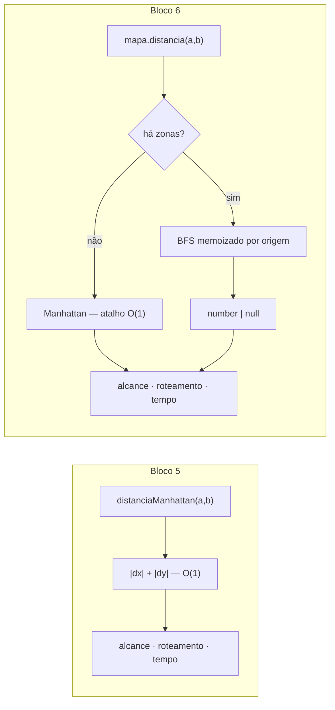
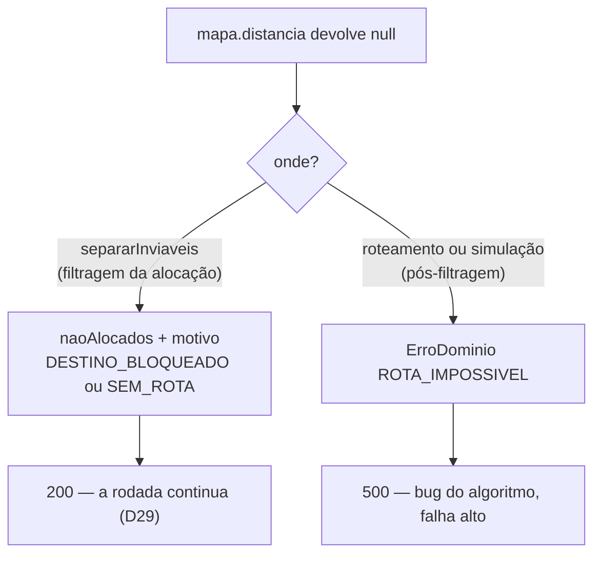

# Walkthrough — Bloco 6: Zonas de Exclusão Aérea

**Data:** 2026-07-27
**Status:** ✅ implementado e verificado — branch `feat/bloco-6`, sem commit
**Plano:** `plans/2026-07-26_Bloco_6_Zonas_Exclusao.md`
**Histórias:** E5-1, E5-2 (épico E5)

---

## 1. Implementation Summary

Até o bloco 5, a distância entre dois pontos era uma fórmula: `distanciaManhattan(a, b)` devolvia
`|dx| + |dy|` em O(1), e o drone voava em linha reta sobre qualquer coisa. O case pede zonas de
exclusão aérea — e é aí que o modelo simples quebra: com um obstáculo no caminho, `|dx| + |dy|`
deixa de ser a distância e vira apenas um limite inferior dela.

O Bloco 6 fecha o épico **E5**. A mudança de fundo é conceitual, não de superfície: **a distância
deixou de ser uma fórmula e virou uma consulta ao mapa.** `MapaCidade.distancia(a, b)` faz busca em
largura na grade, contornando as células bloqueadas, e devolve `number | null` — `null` quando não
existe caminho. Todo lugar que decidia alcance, rota ou tempo passou a consultá-lo.

O eixo do desenho é o **custo**. `empacotar` chama `rotearNearestNeighbor` a cada tentativa de
inserção, e o roteamento compara O(k²) pares por rota; no teste de carga de ~500 pedidos que já
existia, isso são milhões de consultas. Um BFS por consulta inviabilizaria a suíte. A solução é
memoizar **por origem**: a primeira chamada com origem `a` roda um BFS que cobre a componente conexa
inteira e guarda o mapa de distâncias; toda consulta seguinte a partir de `a` é O(1). O custo total
é O(P × células), com P = origens distintas — não O(pares).

Implementado em **TDD**, como os blocos 3, 4 e 5: em cada uma das cinco fases o teste foi escrito
primeiro e confirmado vermelho pelo motivo certo (módulo inexistente, chave `undefined`, assinatura
incompatível, `Record` incompleto) antes de qualquer linha de produção.



### O destino de um `null`

`null` significa "sem caminho", e o sistema o trata de **duas formas deliberadamente diferentes**,
dependendo de onde aparece:



A justificativa da assimetria é um argumento de conectividade: se `a` e `b` são ambos alcançáveis a
partir da base, estão na mesma componente conexa e, portanto, são alcançáveis entre si. Depois de
`separarInviaveis`, um `null` no roteamento **não é entrada inválida — é bug**. Silenciá-lo
esconderia o defeito; por isso `ROTA_IMPOSSIVEL` mapeia para 500, ao lado de
`EMPACOTAMENTO_INCONSISTENTE`.

### A constraint de compatibilidade virou código

O plano exigia que, com `ZONAS_EXCLUSAO` vazia, o resultado fosse idêntico ao do bloco 5. Isso não
ficou só como teste de regressão: `distancia` tem um atalho explícito — sem zonas, a malha é
totalmente conexa e a função devolve `distanciaManhattan` direto, sem construir fila nem `Map`. O
caminho de código do sistema sem obstáculos é literalmente o antigo.

### Decisões tomadas durante a implementação

| Decisão | Escolha | Motivo | ADR |
| --- | --- | --- | --- |
| Algoritmo de pathfinding | BFS memoizado por origem | Os mesmos pares se repetem exaustivamente dentro do empacotamento; cache vence heurística. A* seria melhor para um par isolado | D36 |
| Declaração das zonas | Retângulos `x1,y1:x2,y2` na config, derivadas e não persistidas | Compacto numa env var e é como geofencing declara áreas; não persistir evita um terceiro arquivo a reconciliar (mesma lógica de D24/D31) | D37 |
| Destino inviável | Reportado na alocação, não rejeitado no cadastro | Coerente com D29; cobre zonas que mudam **depois** do pedido já cadastrado, cenário que a rejeição na borda não resolve | D38 |

### Endpoints

Nenhuma rota nova. `POST /entregas/alocar` ganhou dois motivos em `naoAlocados`:

| Motivo | Quando | Resposta |
| --- | --- | --- |
| `DESTINO_BLOQUEADO` | Destino cai dentro de uma zona | 200, no corpo de `naoAlocados` |
| `SEM_ROTA` | Destino existe mas está cercado por zonas | 200, no corpo de `naoAlocados` |

---

## 2. Changes Made

**25 arquivos · ~1.290 linhas adicionadas / 64 removidas** (2 novos, 23 modificados), mais o plano
de 368 linhas.

```text
case_dti/
├── .env.example                        [MODIFY]  +7       ZONAS_EXCLUSAO
├── README.md                           [MODIFY]  +68      seção E5 + curl com desvio
├── docs/
│   ├── BACKLOG.md                      [MODIFY]  +12/-8   E5-1 e E5-2 -> ✅
│   └── DECISIONS.md                    [MODIFY]  +53      ADRs D36–D38
├── plans/2026-07-26_Bloco_6_Zonas_Exclusao.md [ADD] +368  plano aprovado
└── src/
    ├── config.ts                       [MODIFY]  +8       zonasExclusao
    ├── config.test.ts                  [MODIFY]  +23
    ├── index.ts                        [MODIFY]  +20/-1   compõe o mapa; falha se a base é bloqueada
    ├── domain/
    │   ├── mapa.ts                     [ADD]     +205     **parser + MapaCidade + BFS memoizado**
    │   ├── mapa.test.ts                [ADD]     +206
    │   ├── viagem.ts                   [MODIFY]  +40/-9   roteamento consulta o mapa
    │   ├── viagem.test.ts              [MODIFY]  +97
    │   ├── alocacao.ts                 [MODIFY]  +92/-14  filtragem e empacotamento com desvio
    │   ├── alocacao.test.ts            [MODIFY]  +126
    │   ├── simulacao.ts                [MODIFY]  +30/-8   pernas e distância total pelo mapa
    │   ├── simulacao.test.ts           [MODIFY]  +210
    │   └── erros.ts                    [MODIFY]  +5/-1    +3 códigos
    ├── servicos/
    │   ├── simulacao.ts                [MODIFY]  +7/-2    repassa o mapa ao motor
    │   └── simulacao.test.ts           [MODIFY]  +58
    └── api/
        ├── erros.ts                    [MODIFY]  +3       mapeia os 3 códigos novos
        ├── server.ts                   [MODIFY]  +3       Dependencias += mapa
        └── rotas/
            ├── entregas.ts             [MODIFY]  +5/-2    passa o mapa à alocação
            ├── entregas.test.ts        [MODIFY]  +61
            ├── drones.test.ts          [MODIFY]  +5       fixture do mapa (desvio, ver §4)
            ├── pedidos.test.ts         [MODIFY]  +5       fixture do mapa (desvio, ver §4)
            └── simulacao.test.ts       [MODIFY]  +5       fixture do mapa (desvio, ver §4)
```

### Domínio — `mapa.ts`

Módulo novo, e o único do bloco que introduz estado. `criarMapaCidade` é uma factory que devolve um
valor imutável com um **memo interno** de BFS por origem. Do ponto de vista do chamador segue
referencialmente transparente — mesma entrada, mesma saída, sem I/O, relógio ou aleatoriedade — e
isso está coberto por teste explícito de determinismo (duas chamadas seguidas e dois mapas criados
da mesma config).

Três detalhes que valem registro:

- **A validação é dividida em dois níveis.** `parsearZonasExclusao` valida só a *forma* (par de
  pontos inteiros, `de <= ate`) e não sabe o tamanho da malha; `criarMapaCidade` valida os *limites*
  contra `cidadeTamanho`. Isso mantém o parser puro e testável isolado, e é o que permite ao
  `config.ts` continuar declarativo — ele só chama o parser.
- **A fila do BFS é um array com cursor**, não `Array.shift()`. `shift` é O(n) no V8 e transformaria
  a busca em O(células²); com cursor, cada célula entra e sai uma vez.
- **Movimento em 4 direções**, coerente com a métrica Manhattan (D16). Diagonal quebraria a
  equivalência com a distância do bloco 5 quando não há zonas.

### Domínio — `alocacao.ts` e `viagem.ts`

A filtragem ganhou dois estágios antes do teste de alcance: célula bloqueada (`DESTINO_BLOQUEADO`) e
ausência de caminho (`SEM_ROTA`). O teste de alcance passou a usar a distância que desvia — um
destino a 4 quadras em linha reta pode custar 8 com a zona no meio, e é o 8 que conta contra o
alcance e a bateria.

`ordenarParaAlocacao` tem o único ponto do bloco onde `null` **não** falha alto: no comparador, uma
distância ausente ordena por último (`Number.POSITIVE_INFINITY`) em vez de lançar. Um `throw` dentro
de um comparador de `sort` deixaria a ordenação em estado indefinido; e o contrato garante que a
fila já passou pela filtragem. É um fallback defensivo consciente, documentado no código.

### Domínio — `simulacao.ts`

Além de trocar a fonte da distância, o motor mudou de onde tira a métrica agregada. Antes:

```
distanciaTotal += viagem.distanciaQuadras   // campo persistido
```

Agora a distância total é **acumulada das pernas efetivamente percorridas**. A motivação é concreta:
uma `viagens.json` gravada antes das zonas existirem guarda distâncias sem desvio; se o motor
recomputasse as pernas com desvio mas somasse o campo antigo, as métricas discordariam entre si. Ao
derivar tudo das pernas, essa classe inteira de inconsistência deixa de existir — e o arquivo antigo
continua carregando sem migração.

### Boot

`src/index.ts` monta o mapa da config e **falha alto se a base nascer dentro de uma zona** — nenhuma
viagem conseguiria decolar, então é config incoerente, no mesmo espírito do invariante
`4 × cidadeTamanho <= alcance` que já existia. `Dependencias` ganhou `mapa`: quarta extensão aditiva
seguida do objeto de dependências criado no bloco 3.

---

## 3. Real Test Results

`npm test` — **18 arquivos, 269 testes, todos passando** em ~2,1 s. O bloco somou **35 testes** aos
234 do bloco 5.

Cobertura por área (`npm run coverage`, valores reais da execução):

| Métrica | Valor |
| --- | ---: |
| Statements | **97,68%** (634/649) |
| Branches | 92,14% (258/280) |
| Functions | 99,37% (159/160) |
| Lines | 97,60% (611/626) |
| `src/domain` (agregado) | **98,57%** stmts / 98,52% lines |

| Arquivo | Statements | Linhas não cobertas |
| --- | ---: | --- |
| `src/domain/mapa.ts` | 97,05% | 49 — guarda de formato do parser; 158 — BFS com origem bloqueada |
| `src/domain/alocacao.ts` | 98,59% | 207 — guarda `EMPACOTAMENTO_INCONSISTENTE` (**pré-existente**, ver §4) |
| `src/domain/simulacao.ts` | 97,80% | 128 — `ROTA_IMPOSSIVEL`; 176 — viagem de drone inexistente (pré-existente) |
| `src/servicos/simulacao.ts` | 97,77% | 84 — atalho quando a viagem já está no status alvo (pré-existente) |
| `src/api/rotas/simulacao.ts` | 87,50% | 23, 37, 62 — `catch` inalcançáveis (pré-existente) |

O domínio caiu de 99,24% para 98,57%. A queda é composta pelas guardas defensivas novas —
`ROTA_IMPOSSIVEL` em dois módulos e dois ramos de `mapa.ts` — todas cobrindo estados que o contrato
torna inalcançáveis, mesmo tratamento já dado à guarda de `empacotar` no bloco 5.

**Verificação completa:** `typecheck`, `lint`, `format:check`, `test`, `coverage` e `build` verdes.
Os totais de teste e cobertura acima foram reexecutados e conferidos após o retorno do executor, não
apenas relatados por ele.

**Teste de carga:** ~500 pedidos **com zonas configuradas**, semente fixa, concluindo em ~420 ms —
a prova prática de que o custo é O(P × células) e não por par.

---

## 4. Attention Points / Limitations / Technical Debt

- **Correção de rastreio da cobertura.** O relatório do executor atribuiu `alocacao.ts:207` a um
  "fallback de distância `null`". Conferindo o arquivo, a linha 207 é a guarda
  `EMPACOTAMENTO_INCONSISTENTE` — a mesma linha 162 do bloco 5, deslocada pelas 45 linhas inseridas
  antes dela. Continua descoberta **de propósito** (não reexportar `empacotar` para testá-la). O
  fallback do comparador é um *branch* não coberto, não uma linha, e está dentro dos 90,9% de
  branches de `alocacao.ts`.

- **Desvio do plano: três arquivos de teste a mais.** `drones.test.ts`, `pedidos.test.ts` e
  `simulacao.test.ts` (em `src/api/rotas/`) não constavam da Seção 0 e precisaram do fixture
  `criarMapaCidade({ zonas: [] })`, porque `Dependencias.mapa` virou campo obrigatório. É o efeito
  que a seção de riscos previu — o typecheck enumerando todos os chamadores — só que atingiu
  arquivos além dos listados. Mudança mecânica, sem decisão de projeto envolvida.

- **Zona nova não invalida viagem já planejada.** A filtragem só roda sobre pedidos `pendente`
  (D25). Acrescentar uma zona ao `.env` e reiniciar mantém válidas as viagens já planejadas que a
  atravessam; elas só serão reavaliadas se forem realocadas. A simulação, essa sim, recomputa as
  pernas com o mapa novo — então uma viagem antiga pode passar a consumir mais bateria do que o
  planejamento previa, e falhar com `BATERIA_INSUFICIENTE` ao avançar o relógio.

- **O caminho percorrido não é observável.** A `Viagem` guarda as paradas e a distância total, nunca
  a sequência de células do desvio. O dashboard (E6) vai querer desenhar o trajeto contornando a
  zona e não tem esse dado — vai precisar recalcular a partir do mapa ou o motor vai precisar
  expor o caminho.

- **As zonas não são expostas por nenhuma rota.** Ficou explicitamente fora de escopo, mas é
  pré-requisito do mapa do dashboard: hoje só o processo conhece as zonas, e o cliente do E6 não tem
  como desenhá-las.

- **O memo do mapa cresce sem limite durante o processo.** Cada origem distinta consultada guarda um
  `Map` de até `(cidadeTamanho+1)²` entradas. Com a malha default (11×11) é irrelevante; numa malha
  grande com muitos destinos distintos, o mapa vira o maior consumidor de memória do processo. Não é
  problema no escopo do case, mas é o ponto que a simulação de carga (E8-2) deve observar.

- **Dívidas do bloco 5 que continuam abertas:** `carga_iniciada` marcando o fim do carregamento;
  regravação integral de `viagens.json` a cada mudança de status; drone atualizado por snapshot do
  evento; ausência de paginação nas listagens.

---

## 5. Commit Suggestion

O trabalho está na branch `feat/bloco-6`, **sem commit**. Sugestão de dois commits:

```
feat(zonas): bloco 6 — zonas de exclusão aérea com pathfinding

Fecha o épico E5: zonas de exclusão como células bloqueadas da malha
(E5-2), com a distância que contorna alimentando alcance, bateria,
roteamento e tempo. E5-1 (métrica Manhattan) marcada como concluída.

- MapaCidade novo em src/domain/mapa.ts: parser de zonas e BFS
  memoizado por origem, custo O(P x células) e não por par de pontos
- Sem zonas configuradas, a distância continua sendo exatamente
  Manhattan por atalho explícito — compatibilidade garantida em código
- Destino em zona ou cercado entra em naoAlocados com motivo próprio
  (DESTINO_BLOQUEADO / SEM_ROTA), sem abortar a rodada (D29)
- Rota impossível após a filtragem falha alto com ROTA_IMPOSSIVEL
- Distância total da simulação passa a ser derivada das pernas
  percorridas, eliminando divergência com viagens.json antigo
- Boot falha se a base nascer dentro de uma zona
- ADRs D36-D38 em docs/DECISIONS.md
- 269 testes verdes; carga de ~500 pedidos com zonas em ~420ms
```

```
docs(context): documenta o bloco 6 e sincroniza o contexto

- Walkthrough do bloco 6 em context/walkthroughs/
- metaspec, index e timeline atualizados via /context-update
- Plano movido para plans/old/
```
