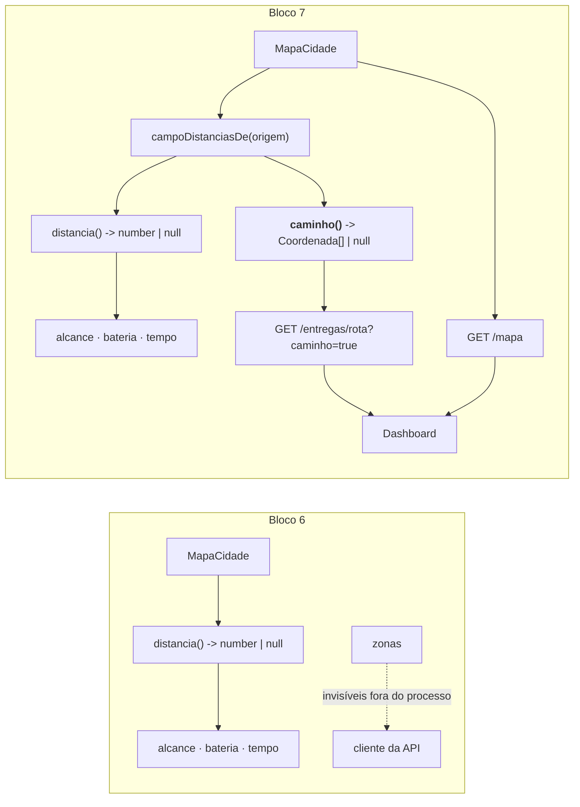

# Walkthrough — Bloco 7: Dashboard & Feedback

**Data:** 2026-07-27
**Status:** ✅ implementado e verificado — branch `feat/bloco-7`, sem commit
**Plano:** `plans/2026-07-27_Bloco_7_Dashboard_Feedback.md`
**Histórias:** E6-1, E6-2, E6-3, E6-4 (épico E6 — fechado)

---

## 1. Implementation Summary

O Bloco 6 deixou o sistema espacialmente correto e visualmente cego. As zonas de exclusão existiam
apenas dentro do processo, e o desvio em volta delas nunca saía do `MapaCidade`: uma `Viagem` guarda
paradas e distância total, jamais as células percorridas. Um dashboard construído sobre esse estado
desenharia um mapa **incompleto** (sem zonas) e rotas **incorretas** (linhas retas por cima delas).
Foi por isso que o Bloco 6 promoveu as duas limitações a histórias formais — E6-3 e E6-4 — em vez de
deixá-las como dívida solta.

O Bloco 7 fecha o épico **E6** inteiro, nessa ordem de destravamento. A mudança de fundo é de
**observabilidade**: o mapa e o trajeto deixam de ser detalhe interno do domínio e viram contrato
público, sem que nenhum dos dois passe a ser persistido. `mapa.caminho(a, b)` devolve a sequência de
células que o drone realmente percorre, derivada do mesmo campo de distâncias que `mapa.distancia`
já usava — nada de estrutura nova, nada em disco.

O eixo do desenho é o **desempate**. Entre duas células com uma zona no meio existem vários caminhos
de mesmo comprimento; escolher "o que o BFS calhou de produzir" tornaria o trajeto refém da ordem da
fila. O caminho é eleito por regra explícita: **menor `x`, depois menor `y`** — literalmente o mesmo
`compararPorXY` que governa o roteamento nearest-neighbor desde o Bloco 4 (D12). O sistema passa a
ter um único critério de desempate espacial, aplicado em dois lugares.

Implementado em **TDD**, como os blocos 3 a 6: nas 11 tarefas de teste, o teste foi escrito primeiro
e confirmado vermelho pelo motivo certo (módulo inexistente, `is not a function`, propriedade
`undefined`, 404 de rota não montada) antes de qualquer linha de produção.



### O helper que virou o pivô

A extração de `campoDistanciasDe(origem)` é a peça central e não estava óbvia no plano. `distancia`
e `caminho` precisam do **mesmo** campo de distâncias — memo do BFS quando há zonas, atalho Manhattan
quando não há. Duplicar essa escolha em dois lugares abriria a porta para os dois divergirem: um
contornando a zona, o outro não.

Com o helper, `distancia` encolheu para uma linha (`campoDistanciasDe(a)(b)`) e o backtracking ficou
cego para a existência de zonas. É isso que faz a **constraint de compatibilidade do Bloco 6 valer em
código**, não só em teste: sem zonas, o caminho é um trajeto Manhattan mínimo porque a mesma rotina
roda sobre um campo Manhattan — não porque exista um ramo separado que alguém precise lembrar de
manter em sincronia.

### Decisões tomadas durante a implementação

| Decisão | Escolha | Motivo | ADR |
| --- | --- | --- | --- |
| Caminho canônico | Backtracking sobre o campo de distâncias, desempate por menor `x` depois menor `y` | Zero memória sobre o BFS que já existe — o memo sem limite já é dívida (E8-2) — e reusa literalmente o desempate D12 do roteamento | D39 |
| Exposição do caminho | Opt-in em `GET /entregas/rota?caminho=true`, derivado na borda | A listagem de viagens segue sem paginação; embutir por padrão inflaria o payload de todo consumidor por causa de um só | D40 |
| Entrega da página | Módulo TS exportando o HTML como template string | `tsc` não copia `.html`: um `public/` exigiria script de cópia no build e um ponto novo de falha no CI. Como módulo, `npm start` serve idêntico ao `dev` | D41 |
| Distância no rastreio | Distância real do mapa, contornando zonas | Depois de D36 é a única métrica do sistema; Manhattan reto anunciaria "2 quadras" com 8 de desvio pela frente. **Atualiza o critério de aceite do E6-2**, escrito antes do Bloco 6 | D42 |

### Endpoints

| Método | Rota | O que faz | Status |
| --- | --- | --- | --- |
| `GET` | `/mapa` | Malha, base e zonas de exclusão (leitura pura, derivada da config) | 200 |
| `GET` | `/pedidos/:id/rastreio` | Rastreio em linguagem amigável; `em_voo` cita a distância real | 200 · 404 |
| `GET` | `/dashboard` | Página HTML/CSS/JS inline com métricas, mapa SVG e controles | 200 `text/html` |
| `GET` | `/entregas/rota?caminho=true` | Rota existente, agora com o caminho por perna sob demanda | 200 |

---

## 2. Changes Made

**29 arquivos · ~1.719 linhas adicionadas / 42 removidas** (12 novos, 16 modificados, 1 removido),
mais o plano de 368 linhas.

```text
case_dti/
├── README.md                                [MODIFY]  +78/-…    seção E6, endpoints, exemplos curl
├── docs/
│   ├── BACKLOG.md                           [MODIFY]  +28       E6-1..E6-4 -> ✅
│   └── DECISIONS.md                         [MODIFY]  +72       ADRs D39–D42
├── plans/2026-07-27_Bloco_7_Dashboard_Feedback.md [ADD] +368    plano aprovado
└── src/
    ├── domain/
    │   ├── mapa.ts                          [MODIFY]  +113/-…   **campoDistanciasDe + caminho (D39)**
    │   ├── mapa.test.ts                     [MODIFY]  +97
    │   ├── rastreio.ts                      [ADD]     +91       mensagem ao cliente, pura (E6-2)
    │   ├── rastreio.test.ts                 [ADD]     +132
    │   ├── simulacao.ts                     [MODIFY]  +48       entregas/drone, eficiência (D19)
    │   └── simulacao.test.ts                [MODIFY]  +112
    ├── servicos/
    │   ├── simulacao.ts                     [MODIFY]  +1        droneMaisEficiente no estado inicial
    │   └── simulacao.test.ts                [MODIFY]  +1
    ├── dashboard/
    │   ├── pagina.ts                        [ADD]     +314      **HTML/CSS/SVG/JS inline (D41)**
    │   ├── pagina.test.ts                   [ADD]     +25
    │   └── .gitkeep                         [DELETE]            o diretório deixou de estar vazio
    └── api/
        ├── server.ts                        [MODIFY]  +14       monta /mapa e /dashboard
        ├── schemas/
        │   ├── simulacao.ts                 [MODIFY]  +8        filtro `caminho` (z.enum, não coerce)
        │   └── simulacao.test.ts            [ADD]     +26
        ├── apresentadores/
        │   ├── mapa.ts                      [ADD]     +22       RespostaMapa (E6-3)
        │   ├── mapa.test.ts                 [ADD]     +36
        │   ├── viagem.ts                    [MODIFY]  +51       caminho opcional por perna (D40)
        │   └── viagem.test.ts               [ADD]     +108      (não existia — ver §4)
        └── rotas/
            ├── mapa.ts                      [ADD]     +24
            ├── mapa.test.ts                 [ADD]     +81
            ├── dashboard.ts                 [ADD]     +17
            ├── dashboard.test.ts            [ADD]     +56
            ├── entregas.ts                  [MODIFY]  +7        repassa ?caminho=true
            ├── entregas.test.ts             [MODIFY]  +73
            ├── pedidos.ts                   [MODIFY]  +58       GET /:id/rastreio; dependências em objeto
            ├── pedidos.test.ts              [MODIFY]  +67
            └── simulacao.test.ts            [MODIFY]  +1
```

### Domínio — `mapa.ts`

O módulo não ganhou estado novo. `campoDistanciasDe(origem)` devolve uma closure
`destino -> number | null` sobre o memo que já existia, e tanto `distancia` quanto `caminho` passam
por ela. O backtracking anda de `b` até `a` escolhendo, entre os vizinhos com distância `d - 1`, o
menor por `compararPorXY`, e inverte a lista no fim.

Duas guardas de segurança lançam `ROTA_IMPOSSIVEL`: exceder o número de passos esperado, e não achar
vizinho com distância decrescente. Ambas cobrem inconsistência do campo de distâncias — bug, não
entrada inválida — no mesmo espírito de `EMPACOTAMENTO_INCONSISTENTE`. Nenhuma é alcançável pelo
contrato, e é por isso que aparecem na lista de linhas descobertas de §3.

### Domínio — `rastreio.ts`

Módulo novo, função pura, sem repositório no caminho. As mensagens dos status "estáticos" vivem num
`Record<Exclude<StatusPedido, 'em_voo'>, string>` exaustivo: status novo sem mensagem declarada quebra
o typecheck, mesma técnica da tabela de transições de `drone.ts` e do mapa de status HTTP.

O ponto de projeto está na **degradação**. Toda a base de código trata ausência de rota como falha
alta depois da filtragem; aqui não. Sem drone localizável, ou com `distancia` devolvendo `null`, o
rastreio responde 200 com uma mensagem sem distância. É leitura para o cliente final: um 500 na tela
de "onde está meu pacote" seria pior que uma frase mais vaga. A rota reforça isso com
`buscarDroneOuIndefinido`, que engole o `DRONE_NAO_ENCONTRADO` da frota.

### Domínio — `simulacao.ts`

`MetricasPorDrone` ganhou `entregas` e `eficiencia`; `MetricasSimulacao` ganhou `droneMaisEficiente`.
A contagem entra no laço que já existia, e a eleição (maior eficiência, empate por menor `droneId`)
é uma função pura à parte. Guarda explícita contra distância 0, para que a divisão não produza
`Infinity` nem `NaN`.

`RespostaMetricas` é alias do tipo do domínio, então os campos novos apareceram em `GET /simulacao`
sem tocar no apresentador — o que forçou uma linha a mais em três arquivos que declaravam o estado
inicial das métricas por extenso (ver §4).

### Borda — apresentador de viagem e schema

`paraRespostaViagem(viagem, opcoes?)`: sem `opcoes`, o payload é **byte a byte** o de antes — a chave
`caminho` nem aparece. Com `{ mapa }`, monta uma perna por par consecutivo de `paradas`.

O schema usa `z.enum(['true','false'])` e não `z.coerce.boolean()`. O motivo virou comentário no
código e teste dedicado: `z.coerce.boolean()` trata qualquer string não vazia como `true`, então
`?caminho=false` ligaria o caminho — exatamente o oposto do pedido.

### Dashboard — `pagina.ts`

314 linhas de HTML, CSS, SVG e JS inline, sem uma única referência a host externo (assert explícito no
teste). Painel com entregas realizadas, tempo médio por entrega, makespan e drone mais eficiente;
mapa SVG desenhando malha, base, zonas, clientes e as rotas pelas células do `caminho` — não por
linhas retas. Controles de "Alocar pedidos" e "Avançar relógio" chamam os endpoints que já existiam;
o backend não ganhou nada para servi-los.

Texto vindo da API entra por `textContent`, nunca `innerHTML`.

---

## 3. Real Test Results

`npm test` — **25 arquivos, 313 testes, todos passando** em ~1,9 s. O bloco somou **44 testes** e 7
arquivos aos 269 testes do Bloco 6.

Cobertura (`npm run coverage`, valores reais da execução):

| Métrica | Valor |
| --- | ---: |
| Statements | **97,2%** (729/750) |
| Branches | 92,07% (302/328) |
| Functions | 99,44% (178/179) |
| Lines | 97,09% (701/722) |
| `src/domain` (agregado) | **98,04%** stmts / 97,97% lines |

| Arquivo | Statements | Linhas não cobertas |
| --- | ---: | --- |
| `src/domain/mapa.ts` | 95,19% | guardas do parser e do BFS (pré-existentes) + as 2 guardas novas do backtracking |
| `src/domain/rastreio.ts` | 100% | 41 — ramo singular de "1 quadra", **inalcançável** (ver §4) |
| `src/domain/simulacao.ts` | 97,95% | 135 — `ROTA_IMPOSSIVEL`; 183 — viagem de drone inexistente (pré-existentes) |
| `src/domain/alocacao.ts` | 98,59% | 207 — guarda `EMPACOTAMENTO_INCONSISTENTE` (pré-existente, descoberta de propósito) |
| `src/api/apresentadores/viagem.ts` | 92,85% | 68 — `ROTA_IMPOSSIVEL` ao montar a perna, inalcançável para viagem planejada |
| `src/api/rotas/mapa.ts` | 83,33% | 19 — `catch` inalcançável (mesmo padrão de `rotas/simulacao.ts`) |
| `src/api/rotas/pedidos.ts` | 97,29% | 97 — `catch` de `buscarDroneOuIndefinido` |

A cobertura total caiu de 97,68% para 97,2%, e a do domínio de 98,57% para 98,04%. A queda é composta
inteiramente por guardas defensivas novas que o contrato torna inalcançáveis — mesmo tratamento já
dado à guarda de `empacotar` no Bloco 5 e às de `ROTA_IMPOSSIVEL` no Bloco 6.

`src/dashboard/pagina.ts`, `src/api/rotas/dashboard.ts`, `src/api/apresentadores/mapa.ts` e
`src/api/schemas/` não aparecem na tabela do relatório, que só lista arquivos com alguma métrica
abaixo de 100%. **No caso de `pagina.ts` esse número é enganoso** — ver §4.

**Verificação completa:** `typecheck`, `lint`, `format:check`, `test`, `coverage` e `build` verdes.
Os totais de teste e cobertura acima foram reexecutados e conferidos após o retorno do executor, não
apenas relatados por ele. `npm run build && npm start` foi confirmado servindo `/dashboard` a partir
de `dist/` — a verificação que existia exatamente para provar D41.

---

## 4. Attention Points / Limitations / Technical Debt

- **Ramo morto em `rastreio.ts:41`.** A mensagem de `em_voo` formata o plural com
  `distanciaQuadras === 1 ? '' : 's'`, mas `QUADRAS_FAIXA_CHEGANDO = 1` faz `<= 1` retornar antes
  ("Seu pacote está chegando!"). A distância nesse ponto é sempre `>= 2`, então o singular é
  **inalcançável**. É o que a cobertura de branches do arquivo aponta (90%). Custo zero hoje; vira
  bug silencioso no dia em que a faixa de "chegando" mudar. Candidato a limpeza: remover o ternário
  ou baixar a faixa para 0.

- **A cobertura de `pagina.ts` mede a string, não o comportamento.** O arquivo aparece como 100%
  porque o teste chama `paginaDashboard()` e inspeciona o HTML resultante. As ~200 linhas de
  JavaScript **dentro** do template string nunca são executadas por teste nenhum — não há DOM, não há
  browser na suíte. O dashboard foi validado manualmente (build + `npm start` + requisição). Testar
  esse JS exigiria `jsdom` ou um runner de browser, fora do escopo do bloco.

- **`paraRespostaViagem` deixou de ser referência direta de `.map()`.** Com o segundo parâmetro
  opcional, `viagens.map(paraRespostaViagem)` passaria o **índice** do array como `opcoes` — o
  typecheck barra, mas só porque os tipos não batem. Os dois call sites viraram
  `.map((viagem) => paraRespostaViagem(viagem, ...))`. É o custo conhecido de parâmetro opcional em
  função usada como callback; quem adicionar um terceiro call site precisa lembrar disso.

- **Desvio do plano: um arquivo de teste a mais.** `src/api/apresentadores/viagem.test.ts` estava na
  Seção 0 como `[MODIFY]`, mas não existia em disco — o apresentador de viagem vinha sendo coberto só
  pelos testes de rota. Foi criado (`[ADD]`, 108 linhas). Sem decisão de projeto envolvida.

- **Três arquivos fora da lista mudaram em uma linha cada.** `src/servicos/simulacao.ts`,
  `src/servicos/simulacao.test.ts` e `src/api/rotas/simulacao.test.ts` declaravam o estado inicial das
  métricas por extenso e precisaram de `droneMaisEficiente: null`. É o efeito previsto na seção de
  riscos — o typecheck enumerando os chamadores — atingindo arquivos além dos listados, como já
  acontecera no Bloco 6.

- **O caminho não é conferido contra a distância gravada.** `mapa.caminho` sempre reflete as zonas
  **atuais**, enquanto `viagem.distanciaQuadras` reflete as do momento do planejamento. Numa viagem
  planejada antes de uma zona nova, o `caminho` desenhado no dashboard será mais longo que a distância
  no mesmo payload. É a face visual da limitação já registrada no Bloco 6 (zona nova não invalida
  viagem planejada), agora observável na tela.

- **`?caminho=true` sem paginação.** O opt-in (D40) protege o consumidor padrão, mas quem pedir o
  caminho com muitas viagens recebe um payload proporcional ao total de células percorridas. Continua
  sendo território de E8-2, junto com `GET /simulacao/eventos`.

- **O dashboard não se atualiza sozinho.** Recarrega após cada ação (alocar/avançar) e no load; não há
  polling nem stream. Decisão consciente: sem controle de relógio, um auto-refresh só gastaria
  requisição — com os controles na página, o refresh sob ação cobre o caso real.

- **Dívidas de blocos anteriores que continuam abertas:** `carga_iniciada` marcando o fim do
  carregamento; regravação integral de `viagens.json` a cada mudança de status; drone atualizado por
  snapshot do evento; memo do `MapaCidade` sem limite; ausência de paginação nas listagens.

---

## 5. Commit Suggestion

O trabalho está na branch `feat/bloco-7`, **sem commit**. Sugestão de dois commits:

```
feat(dashboard): bloco 7 — épico E6 completo com mapa, caminho e feedback

Fecha o épico E6 nas quatro histórias, na ordem em que se destravam:
zonas legíveis (E6-3) e caminho observável (E6-4) como habilitadores do
dashboard (E6-1) e do rastreio ao cliente (E6-2).

- mapa.caminho() novo: backtracking sobre o campo de distâncias já
  memoizado, desempate por menor x depois menor y — o mesmo D12 do
  roteamento. Sem estrutura nova e sem nada persistido
- campoDistanciasDe() extraído: distancia e caminho passam pelo mesmo
  campo, o que mantém a compatibilidade sem zonas em código, não em teste
- GET /mapa devolve malha, base e zonas (somente leitura, D37)
- GET /entregas/rota?caminho=true traz o caminho por perna; o payload
  padrão segue idêntico (opt-in por design)
- GET /pedidos/:id/rastreio responde em linguagem amigável; em_voo cita a
  distância real do mapa, não a Manhattan reta
- GET /dashboard serve página autossuficiente (HTML/CSS/SVG/JS inline),
  com métricas, mapa das rotas contornando zonas e controles de simulação
- Métricas ganham entregas por drone e droneMaisEficiente (D19)
- ADRs D39-D42 em docs/DECISIONS.md
- 313 testes verdes; cobertura total 97,2%, domínio 98,04%
```

```
docs(context): documenta o bloco 7 e sincroniza o contexto

- Walkthrough do bloco 7 em context/walkthroughs/
- metaspec, index e timeline atualizados via /context-update
- Plano movido para plans/old/
```
