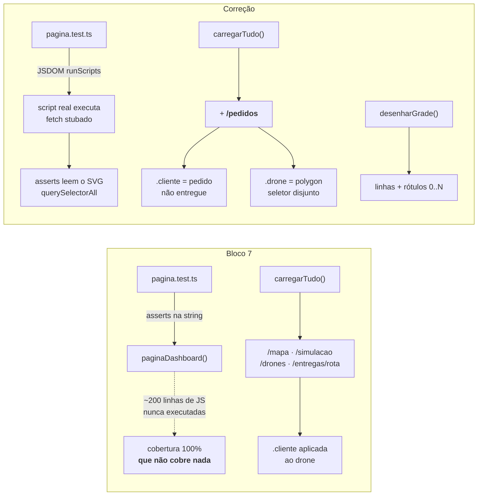

# Walkthrough — Correção do SVG do dashboard

**Data:** 2026-07-27
**Status:** ✅ implementado e verificado — branch `fix/dashboard-svg`, 3 commits, não publicada
**Plano:** `plans/old/2026-07-27_Correcao_SVG_Dashboard.md`
**Origem:** validação manual da aplicação rodando — não do backlog

---

## 1. Implementation Summary

O Bloco 7 fechou o épico E6 com 313 testes verdes, cobertura total de 97,2% e `pagina.ts`
marcado como **100%**. Ao subir a aplicação compilada e olhar a tela pela primeira vez, o
dashboard mostrava **três pontos amarelos para oito pedidos** e uma "malha" que era só a moldura
externa do SVG.

Os dois defeitos estavam no mesmo lugar e eram grosseiros:

- A classe `.cliente` estava aplicada à posição dos **drones**, e `carregarTudo()` nunca buscava
  `/pedidos`. Cliente nenhum era desenhado — os pontos amarelos eram a frota.
- O único elemento de fundo era um `rect` com `stroke`. Isso desenha a borda externa, não a grade.
  Numa cidade 10×10 não havia como ler uma coordenada do mapa.

Ambos contradiziam frontalmente o que o metaspec, o walkthrough do Bloco 7 e o próprio docblock de
`pagina.ts` afirmavam: *"desenha o mapa em SVG (malha, base, zonas, clientes e as rotas)"*.

O ponto que interessa não é o bug — é **por que ele sobreviveu**. A dívida registrada no Bloco 7
já dizia a resposta: *"as ~200 linhas de JavaScript dentro do template string nunca são executadas
por teste nenhum"*. O 100% de `pagina.ts` media a **string produzida**, não o comportamento do
script. A métrica não estava só omissa — estava ativamente enganando, porque exibia o número mais
alto do repositório exatamente sobre o arquivo menos testado dele.

A correção fecha os dois defeitos por TDD, e o pré-requisito para isso era tornar o JS testável.



### A escolha de projeto: jsdom sobre o script real

O caminho óbvio para testar aquele JS seria extraí-lo para um módulo `.ts` de verdade. Foi
descartado: o módulo teria que ser serializado de volta para dentro da string servida, o que
reintroduz o passo de empacotar/sincronizar dois artefatos — **exatamente o risco que D41 existiu
para evitar** quando decidiu que o HTML seria um módulo TS em vez de um asset em `public/`.

A alternativa adotada monta `paginaDashboard()` num `JSDOM` com `runScripts: 'dangerously'`,
injeta um `fetch` stub por URL em `beforeParse` e lê o SVG resultante. Testa **a string que é
servida**, não uma cópia que pode divergir dela. `vitest.config.ts` não foi tocado: o `JSDOM` é
construído explicitamente no arquivo de teste, em vez de trocar o `environment` global do Vitest
por causa de uma única página — o resto do projeto é Node puro de propósito.

| Decisão | Escolha | Motivo | ADR |
| --- | --- | --- | --- |
| Teste do JS embutido | `JSDOM` com `runScripts: 'dangerously'` sobre `paginaDashboard()` | Preserva D41 (nenhum asset, nenhum passo de build) e testa a string realmente servida | D45 |
| Clientes no mapa | Só `pendente`, `alocado` e `em_voo` | Tela de operação mostra o que falta; entregue e cancelado saem do mapa | D45 (escopo) |
| Símbolo do drone | `polygon` (triângulo) próprio, classe `.drone` | Distinto do cliente por **forma e cor** — a confusão anterior nasceu de compartilhar a classe | — |

---

## 2. Changes Made

**3 commits · 9 arquivos** (fora `package-lock.json`), sendo apenas **2 de código de produção**.

```text
case_dti/
├── package.json                        [MODIFY]  +2       jsdom + @types/jsdom (devDeps)
├── README.md                           [MODIFY]  +12      o que o mapa mostra + legenda
├── docs/DECISIONS.md                   [MODIFY]  +34      **ADR D45**
├── plans/old/
│   └── 2026-07-27_Correcao_SVG_Dashboard.md [ADD] +288    plano aprovado, já arquivado
├── context/                            [MODIFY]  +42      metaspec, index, timeline (via /context-update)
└── src/dashboard/
    ├── pagina.ts                       [MODIFY]  +123/-…  **grade, clientes, .drone, legenda**
    └── pagina.test.ts                  [MODIFY]  +153     **harness jsdom + 4 casos**
```

Nenhuma rota, apresentador, schema ou módulo de domínio foi tocado. A API já devolvia tudo o que o
mapa precisava — o defeito era inteiramente de desenho, e o diff prova isso.

### `pagina.ts` — o que passou a ser desenhado

Três funções novas, chamadas na ordem de pintura (do fundo para a frente): fundo → **grade** →
zonas → rotas → base → **clientes** → **drones**. A ordem não é cosmética: marcador desenhado antes
é coberto pelo desenhado depois.

- `desenharGrade(svg, tamanho, px, py)` — `2 × (N+1)` linhas de classe `.grade` mais rótulos
  `.rotulo-eixo` de `0` a `N` nos dois eixos, com traço fino para não competir com as rotas.
- `desenharClientes(svg, pedidos, px, py)` — filtra por
  `STATUS_VISIVEIS = ["pendente", "alocado", "em_voo"]` e desenha um `circle.cliente` por destino.
- `desenharDrones(svg, drones, px, py)` — `polygon.drone`, encerrando o uso indevido de `.cliente`.

`carregarTudo()` passou de 4 para 5 requisições no mesmo `Promise.all` — `GET /pedidos` entrou sem
serializar nada. A legenda é HTML estático, sem dado de API. O docblock do arquivo, que listava as
4 rotas antigas, foi corrigido junto.

### `pagina.test.ts` — o harness

`montarPagina(respostas)` devolve o `Document` já com o script executado. Os defaults por rota
cobrem o caso vazio, e cada teste sobrescreve só o que lhe interessa. Dois `setTimeout(0)` dão o
tick que o `Promise.all` mais as duas cadeias de `.then` precisam para resolver.

O comentário que explica por que `runScripts: 'dangerously'` é aceitável **aqui** (o único HTML
montado é o do próprio projeto) e perigoso em qualquer outro contexto ficou no arquivo, no mesmo
espírito do comentário que já explicava `z.enum` vs `z.coerce.boolean` no schema de simulação.

---

## 3. Real Test Results

`npm test` — **25 arquivos, 335 testes, todos passando**. Eram 313 no fecho do Bloco 7; a correção
somou 22 (4 casos novos, sendo 3 em jsdom, mais os do saneamento que entrou entre os dois marcos).

Cobertura (`npm run coverage`, valores reais da execução):

| Métrica | Valor |
| --- | ---: |
| Statements | **97,44%** (764/784) |
| Branches | 93,19% (315/338) |
| Functions | 99,45% (184/185) |
| Lines | 97,35% (736/756) |
| `src/domain` (agregado) | **98,29%** stmts / 98,23% lines |

`src/dashboard` não aparece na tabela detalhada do relatório, que só lista arquivos com alguma
métrica abaixo de 100%. **Esse número continua não significando o que parece** — ver §4.

### TDD: o vermelho de cada fase

O executor reportou o motivo real de cada falha antes do código de produção:

| Fase | Falha observada | Motivo |
| --- | --- | --- |
| 1 — harness | passou de primeira; `<script>` removido à mão para forçar `métricas continuam '—'` | o harness precisava provar que sabia falhar |
| 2 — grade | `expected +0 to be 22` | zero elementos `.grade` — a grade não existia |
| 3 — clientes | `expected 2 to be 3` | `.cliente` contava os 2 drones, não os 3 pedidos não entregues |
| 4 — legenda | `toContain('id="legenda"')` | legenda não existia |

A fase 1 é a interessante: um teste que passa de primeira não é evidência de nada. Quebrar a
produção de propósito para ver o vermelho foi o que provou que o harness observava o
comportamento, e não a própria existência do arquivo.

### Verificação visual contra a verdade da API

`npm run build && node dist/index.js` com `ZONAS_EXCLUSAO=2,2:4,5;7,0:8,3`, 8 pedidos, alocação e
relógio avançado até o minuto 20 — um estado deliberadamente misto (5 não entregues, 3 entregues):

| No mapa | Esperado | Confere |
| --- | --- | :---: |
| 5 círculos amarelos em (9,9) (3,8) (10,5) (6,2) (9,1) | os 5 pedidos não entregues | ✅ |
| nenhum amarelo em (5,7) (1,4) (2,1) | os 3 entregues, filtrados | ✅ |
| 3 triângulos em (1,4) (2,1) (5,7) | posição dos 3 drones | ✅ |
| grade com rótulos 0..10 nos dois eixos | — | ✅ |
| legenda Base / Zona / Cliente / Drone | — | ✅ |

A coincidência é o que fecha a prova: os drones estavam parados exatamente sobre os três destinos
já entregues, então vê-se o amarelo sumir e o triângulo aparecer no mesmo ponto. Os dois símbolos
são de fato disjuntos — que era o assert `interseccao.length === 0` do teste, agora confirmado
também na tela.

**Verificação completa:** `typecheck`, `lint`, `format:check`, `test`, `coverage` e `build` verdes.
Os totais acima foram reexecutados e conferidos após o retorno do executor, não apenas relatados
por ele. Servir `/dashboard` a partir de `dist/` segue sendo a prova viva de D41.

---

## 4. Attention Points / Limitations / Technical Debt

- **A cobertura de `pagina.ts` continua sem medir esse JS.** O v8 instrumenta a função que devolve
  a string; o script roda dentro do jsdom, em outro motor. O arquivo segue em 100% e esse 100%
  segue sem falar sobre o comportamento do script. O que mudou é que agora existem testes que
  falham quando o comportamento quebra — a garantia migrou da métrica para a suíte. **A dívida do
  metaspec foi reescrita, não removida**, precisamente para que ninguém leia o número como
  "coberto" e repita o erro que originou esta correção.

- **`runScripts: 'dangerously'` é um padrão perigoso fora daqui.** Vale porque o único HTML montado
  é o do próprio projeto. Copiado para HTML de terceiros, executa o que vier. O comentário está no
  arquivo de teste; quem adicionar um segundo uso do harness precisa lê-lo.

- **O dashboard agora depende de `GET /pedidos`, que não tem paginação.** É uma das rotas listadas
  na dívida de E8-2, junto de `GET /simulacao/eventos`. Como não há polling, o custo é por ação do
  usuário e não contínuo — mas numa base grande o refresh cresce com o total de pedidos.

- **A grade cresce linearmente com a malha.** São `2 × (N+1)` elementos mais `2 × (N+1)` rótulos.
  Numa cidade muito maior, a grade é o primeiro candidato a virar um `<pattern>` SVG. Fora do
  escopo agora.

- **O harness depende de dois `setTimeout(0)`.** É o número de ticks que a cadeia
  `Promise.all` → `.then` → `.then` precisa hoje. Somar mais um encadeamento em `carregarTudo()`
  pode exigir um terceiro tick, e a falha apareceria como assert de valor, não como timeout — ou
  seja, com diagnóstico ruim.

- **Dívidas anteriores que continuam abertas:** `carga_iniciada` marcando o fim do carregamento;
  drone atualizado por snapshot do evento; memo do `MapaCidade` sem limite; zona nova não invalida
  viagem já planejada; ausência de paginação nas listagens (E8-2).

### A lição de processo

Esta é a primeira leva do projeto nascida de **subir a aplicação e olhar**, não do backlog nem de
investigação de dívida. Vale registrar o que isso custou: dois defeitos visíveis a olho nu
sobreviveram a 313 testes verdes, a um plano aprovado, a um walkthrough revisado e a um PR
mergeado. Nenhum deles era sutil. O que faltou não foi rigor — foi executar o artefato final.

---

## 5. Commit Suggestion

O trabalho já está commitado na branch `fix/dashboard-svg`, em três commits:

```
48bcdf8  docs(context): sincroniza o contexto após o merge dos blocos 7 e 8
fe696cf  fix(dashboard): desenha clientes e a grade da malha no mapa SVG
01520ac  docs(context): documenta a correção do dashboard e arquiva o plano
```

Falta um quarto, com este walkthrough:

```
docs(walkthrough): documenta a correção do SVG do dashboard

- Walkthrough em context/walkthroughs/
- index atualizado via /context-update
```

Publicação: `git push -u origin fix/dashboard-svg` e PR contra a `main`. A branch sai direto da
`main`, sem empilhamento — a `main` recebe um merge só.
