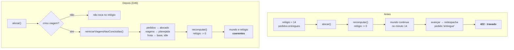

# Walkthrough — Replanejamento travado e cadastro pela tela

**Data:** 2026-07-27
**Status:** ✅ implementado e verificado — branch `fix/relogio-e-cadastro`, PR #14 aberto
**Origem:** bug encontrado pelo usuário clicando no dashboard, não por teste
**ADR:** D46

---

## 1. Implementation Summary

O usuário mexeu no dashboard e a simulação parou de responder. O diagnóstico revelou um defeito
que nenhuma das camadas de proteção do projeto tinha pego — nem os 339 testes, nem o typecheck
exaustivo, nem os ADRs.

`POST /entregas/alocar` chamava `simulacao.recomputar()` **incondicionalmente**. `recomputar`
reconstrói a linha do tempo do zero e zera o relógio (D33), mas **não desfazia os efeitos que a
rodada anterior já havia aplicado aos repositórios**. As viagens não concluídas voltavam para a
linha do tempo com o relógio em zero, e o avanço seguinte tentava redespachar pedido já `entregue`:

```
relógio em 14  →  Alocar  →  relógio volta a 0  →  Avançar = 422 ENTREGA_NAO_PERMITIDA
```

Sem saída: reiniciar o servidor não resolvia, porque a linha do tempo é recomputada no boot a
partir das mesmas viagens (D31). O estado em disco ficava permanentemente travado.

Dois caminhos chegavam lá pela interface, ambos naturais:

1. Clicar **"Alocar pedidos"** quando não havia nenhum pendente — foi o que o usuário fez.
2. Cadastrar um pedido no meio de uma rodada e alocar.

D33 já registrava o reset do relógio como limitação conhecida. Descrevia o **sintoma** — *"alocar
no meio de uma rodada zera o instante corrente"* — e não a **gravidade**: não é que o relógio
volta, é que a simulação morre.



### A decisão de projeto

A primeira correção que escrevi foi só a guarda: `alocar` não recomputa quando não criou viagem.
Fechava o caminho 1, com teste. Ao verificar contra o servidor real, **o caminho 2 continuou
travando** — e o formulário de cadastro que estava sendo implementado no mesmo trabalho tornaria
esse caminho o mais percorrido de todos. Meia correção teria embarcado um bug junto de uma feature
que o torna mais fácil de atingir.

A causa raiz é conceitual: **um relógio em zero e um mundo no minuto 14 são estados
incompatíveis.** A correção é torná-los consistentes, não tolerar a inconsistência.

| Decisão | Escolha | Motivo | ADR |
| --- | --- | --- | --- |
| Rodada vazia | `alocar` só recomputa se criou viagem | Requisição que não muda nada não pode ter efeito destrutivo | D46 |
| Estado ao replanejar | `recomputar` reinicia o mundo antes de simular | Zerar o relógio sem zerar o mundo é a própria incoerência | D46 |
| Estado da frota | Volta à base, `idle`, bateria cheia | Toda viagem começa e termina na base — é o único estado coerente com o instante zero | D46 |
| Viagem concluída | Preservada | Não entra na nova linha do tempo (D35), então seus pedidos seguem `entregue` | D35 |

**Alternativa descartada: tornar a aplicação de eventos idempotente.** Seria menor — bastaria o
`despachar` virar no-op quando o pedido já está `entregue`. Foi recusada porque viola a regra
explícita do projeto de que **transição inválida é erro, não no-op**. Afrouxá-la transformaria uma
falha barulhenta em corrupção silenciosa: qualquer bug futuro de ordenação de eventos passaria
despercebido.

**Alternativa descartada: agendar as viagens novas a partir do instante corrente.** É o modelo
correto a longo prazo — simulação incremental de verdade — mas exige o motor aceitar deslocamento
de início. Mudança grande, fora da janela desta correção.

---

## 2. Changes Made

**10 arquivos · 421 linhas adicionadas / 4 removidas.** Metade é teste.

```text
case_dti/
├── docs/DECISIONS.md                   [MODIFY]  +27      **ADR D46**
└── src/
    ├── domain/
    │   ├── pedido.ts                   [MODIFY]  +24      **reiniciarParaAlocado**
    │   └── pedido.test.ts              [MODIFY]  +37      5 casos da transição
    ├── repositorio/
    │   └── pedidos.ts                  [MODIFY]  +7       porta da transição nova
    ├── servicos/
    │   ├── simulacao.ts                [MODIFY]  +56      **reiniciarViagensNaoConcluidas**
    │   └── simulacao.test.ts           [MODIFY]  +46      replanejamento (D46)
    ├── api/rotas/
    │   ├── entregas.ts                 [MODIFY]  +13/-…   recomputa só se criou viagem
    │   └── entregas.test.ts            [MODIFY]  +34      rodada vazia é inócua
    └── dashboard/
        ├── pagina.ts                   [MODIFY]  +151     formulário + tabela + cancelar
        └── pagina.test.ts              [MODIFY]  +30      2 casos (string + jsdom)
```

### Domínio — `reiniciarParaAlocado`

Transição nova, com guarda explícita no mesmo estilo das vizinhas: aceita `alocado` (idempotente),
`em_voo` e `entregue` — os três estados em que um pedido de viagem não concluída pode estar — e
recusa `pendente` (não pertence a viagem alguma) e `cancelado` (cancelamento é final, nunca é
reaproveitado).

### Serviço — `reiniciarViagensNaoConcluidas`

Roda antes de `simular()`, dentro do `emLote` dos dois repositórios (D43), de modo que o reset
grava cada arquivo uma vez. O filtro de quais pedidos reiniciar foi estreitado durante a
implementação para `em_voo` e `entregue` apenas — a primeira versão incluía `alocado` e quebrou um
teste pré-existente de boot, onde uma viagem pode apontar para pedido `pendente` de propósito
(cenário de reconciliação, D27). Estreitar o filtro é mais correto que alargar a guarda do domínio.

### Dashboard — cadastro e lista

Formulário (x, y, peso, prioridade) via `POST /pedidos` e tabela de pedidos com botão **cancelar
apenas nos pendentes** — a UI reflete a regra de negócio em vez de deixar a API recusar depois do
clique. Todo texto vindo da API entra por `textContent`, e as linhas são montadas com
`createElement`, nunca `innerHTML`.

---

## 3. Real Test Results

`npm test` — **25 arquivos, 346 testes, todos passando** (eram 339 antes desta leva, 313 no fecho
do Bloco 7).

Cobertura (`npm run coverage`, valores reais da execução):

| Métrica | Valor |
| --- | ---: |
| Statements | **97,52%** (788/808) |
| Branches | 93,16% (327/351) |
| Functions | 99,48% (194/195) |

### O vermelho de cada etapa

| Etapa | Falha observada | Motivo |
| --- | --- | --- |
| Guarda da rodada vazia | `expected +0 to be 6` | o relógio foi zerado por uma alocação que não criou nada |
| Guarda da rodada vazia | `expected 422 to be 200` | reprodução exata da trava relatada pelo usuário |
| `reiniciarParaAlocado` | `TypeError: reiniciarParaAlocado is not a function` | módulo ainda não exportava a transição |
| `recomputar` | `expected 'entregue' to be 'alocado'` | o relógio voltava a zero e o pedido continuava entregue |
| Formulário | `expected '<!doctype html>…' to contain 'id="form-pedido"'` | formulário não existia |
| Lista | `expected +0 to be 3` | tabela não era renderizada |

### Verificação contra o servidor compilado

`npm run build && node dist/index.js`, com zonas ativas, os dois caminhos reproduzidos:

| Passo | Antes | Depois |
| --- | :---: | :---: |
| Alocar no meio da rodada | 201 | 201 |
| **Avançar em seguida** | **422** | **200** |
| Avançar de novo | — | 200 |
| **Relógio após alocar vazio** | **zerado** | **preservado (100)** |

Ao fim da sequência, os 6 pedidos terminaram `entregue` — a simulação completou em vez de morrer
no meio.

---

## 4. Attention Points / Limitations / Technical Debt

- **Replanejar continua sendo um recomeço.** Quem alocar no meio de uma rodada vê as entregas já
  feitas daquelas viagens serem refeitas do zero. Correto e previsível, mas não é simulação
  incremental. Fechar isso de verdade exige o motor aceitar instante de início por viagem — é a
  alternativa descartada em D46, e o candidato natural a virar história de backlog.

- **A frota inteira é resetada, não só os drones envolvidos.** Como toda viagem começa e termina na
  base, o efeito é o mesmo hoje. Deixaria de ser verdade no dia em que existir drone parado fora da
  base (pouso de emergência, recarga em campo).

- **D33 descrevia o sintoma, não a gravidade.** A dívida existia há dois blocos dizendo "zera o
  instante corrente", o que soa recuperável. Ninguém tinha executado a sequência. Vale como aviso
  sobre o texto das outras dívidas em aberto: várias podem estar subdimensionadas do mesmo jeito.

- **O JS do dashboard cresceu ~150 linhas** e a cobertura de `pagina.ts` segue medindo a string, não
  o script avaliado no jsdom (D45). Dois dos casos novos rodam em jsdom, mas o formulário em si — o
  `submit`, o `POST`, o refresh — não tem teste de comportamento; foi validado manualmente.

- **Dívidas anteriores que continuam abertas:** memo do `MapaCidade` sem limite; ausência de
  paginação nas listagens (E8-2, agora com `GET /pedidos` no caminho quente do dashboard);
  `carga_iniciada` marcando o fim do carregamento; drone atualizado por snapshot do evento.

### A lição

Dois blocos atrás, a validação visual pegou o que 313 testes verdes não pegaram. Desta vez, foi o
**usuário clicando** que pegou o que 339 testes verdes não pegaram — e o defeito era pior:
irreversível, com o estado travado em disco. As duas vezes o furo esteve no mesmo lugar: o que só a
execução real do sistema exercita.

---

## 5. Commit Suggestion

Já commitado e publicado:

```
7e40d6a  fix(simulacao): replanejar deixava a simulação travada sem volta
```

PR #14 aberto contra a `main`. Falta um commit com este walkthrough:

```
docs(walkthrough): documenta a correção do replanejamento e o cadastro
```
