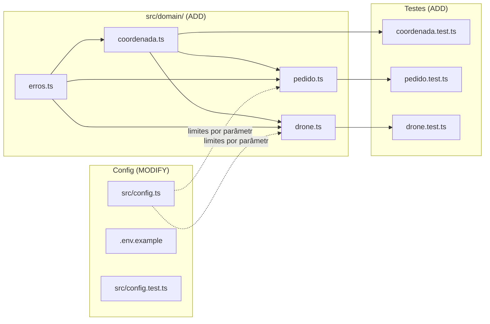
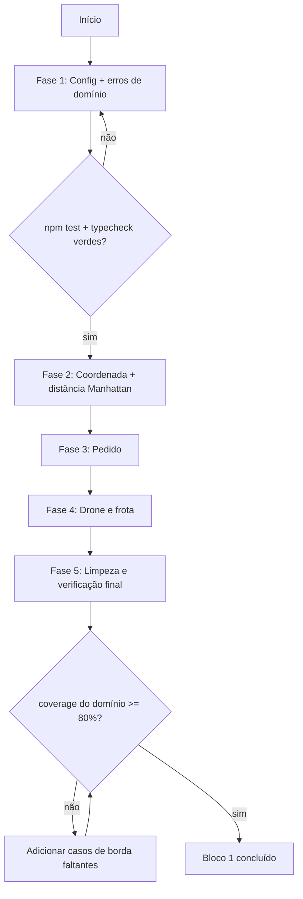
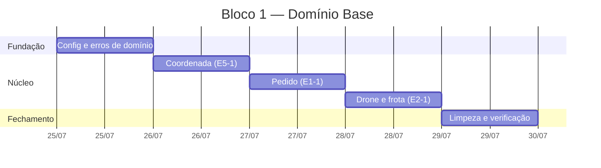

# Implementation Plan: Bloco 1 — Domínio Base

**Context:** O projeto tem toda a fundação (setup, docs, backlog, ADRs) pronta, mas
`src/domain/` está vazio. Este é o primeiro bloco do roadmap: modelar `Coordenada`
(+ distância Manhattan), `Pedido` e `Drone` como núcleo puro e testável, sobre o qual
os blocos seguintes (pedidos, frota, alocação, simulação) vão se apoiar.

**Tech Stack:** TypeScript (ESM, `NodeNext`) · Node.js >= 20.12 · Vitest 4 (cobertura v8)
· sem dependências novas (usa `node:crypto` nativo).

---

## 0. Context to Load

> Leia TODOS os itens abaixo ANTES de iniciar a execução. São os arquivos que carregam as
> convenções, regras de domínio e padrões necessários para implementar este plano sem
> alucinar. Leia a versão ATUAL em disco — não confie em memória ou suposição.

**Docs de contexto (convenções e regras):**
- [ ] `CLAUDE.md` — diretrizes de arquitetura, comandos, idioma (pt-BR) e a regra do ESM `NodeNext`
- [ ] `context/metaspec.md` — stack, arquitetura em camadas, regras críticas de negócio
- [ ] `docs/DECISIONS.md` → **D4, D5, D7, D8, D10, D15, D16, D20, D21** — as ADRs que este bloco materializa
- [ ] `docs/BACKLOG.md` → **E1-1** (critérios do Pedido), **E2-1/E2-2** (frota e status), **E5-1** (métrica), **E8-1** (testes)

**Código de referência (padrões a imitar):**
- [ ] `src/config.ts` — estilo de comentário JSDoc em pt-BR, `as const`, leitura de env com fallback
- [ ] `src/config.test.ts` — padrão de teste Vitest (`describe`/`it` em pt-BR)
- [ ] `src/api/server.ts` — confirma que a API é casca fina; o domínio não conhece HTTP
- [ ] `vitest.config.ts` — `include: src/**/*.test.ts`, cobertura v8

**Arquivos a modificar (leia o estado atual antes de alterar):**
- [ ] `src/config.ts` — alterado nas tarefas 1.1 e 1.2
- [ ] `src/config.test.ts` — alterado na tarefa 1.4
- [ ] `.env.example` — alterado na tarefa 1.3
- [ ] `src/domain/.gitkeep` — removido na tarefa 5.1

---

## 1. Goals & Scope

### 1.1. Goals

* **Goals:** Entregar o núcleo puro do domínio — `Coordenada` com distância Manhattan,
  `Pedido` e `Drone` — com validação de invariantes, erros tipados e cobertura de testes
  unitários, sem nenhum acoplamento a HTTP, persistência ou algoritmo de alocação.

### 1.2. Scope

* **Inputs:** dados brutos de um novo pedido (`x`, `y`, `pesoKg`, `prioridade`); limites
  operacionais vindos da config (capacidade do drone, tamanho da malha, alcance, base).
* **Outputs:** módulos `src/domain/{erros,coordenada,pedido,drone}.ts` exportando tipos
  imutáveis e funções puras de criação/consulta; suíte de testes verde; `config` estendida.

* **In-Scope:** Criar `Coordenada` + `distanciaManhattan` + validação de malha (E5-1, D16, D4).
* **In-Scope:** Criar o tipo `Pedido` com factory validante (E1-1, D5) e o tipo `Drone`
  com factory + criação de frota homogênea (E2-1, D8, D15).
* **In-Scope:** Estender `src/config.ts` com `cidadeTamanho` e `droneQuantidade`, corrigindo
  os defaults para que a malha inteira seja alcançável.
* **In-Scope:** Testes unitários de cada módulo, incluindo casos de borda (E8-1, D21).

* **Out-of-Scope:** Não criar nem alterar endpoints REST — `src/api/server.ts` fica intocado.
* **Out-of-Scope:** Não implementar repositório nem persistência JSON (é o Bloco 2 / D6).
* **Out-of-Scope:** Não implementar o algoritmo de alocação, a ordenação por prioridade
  nem o roteamento nearest-neighbor (Bloco 4 / D9, D11, D12).
* **Out-of-Scope:** Não implementar as transições da máquina de estados do drone nem o
  consumo de bateria (Bloco 5 / E4). Modelar apenas o tipo do estado e o valor inicial.
* **Out-of-Scope:** Não incluir o status `cancelado` no `Pedido` — ele entra no Bloco 2
  junto com a regra de cancelamento (E1-3).
* **Out-of-Scope:** Não adicionar schemas Zod — validação de payload é da borda da API (D3),
  entra no Bloco 2.
* **Out-of-Scope:** Não instalar nenhuma dependência nova.
* **Out-of-Scope:** Não editar `context/metaspec.md`, `context/index.md` ou `context/timeline.md`
  — esses arquivos só mudam via `/context-update`.

* **Constraint:** Todo tipo do domínio deve ser imutável (`readonly`) e toda função de
  domínio deve ser pura — sem I/O, sem `Date.now()`, sem estado global.
* **Constraint:** O domínio não pode importar `src/config.ts` nem nada de `src/api/`.
  Limites operacionais chegam por parâmetro; quem lê a config é a camada de fora.
* **Constraint:** A unidade de distância é a **quadra** — nenhum identificador ou comentário
  pode usar `km` (D16).
* **Constraint:** Imports relativos precisam da extensão `.js` (ESM `NodeNext`).
* **Constraint:** `npm test`, `npm run typecheck` e `npm run build` devem continuar verdes.
* **Constraint:** Código, comentários, nomes de teste e mensagens de erro em pt-BR.

---

## 2. Technical Design

### Convenção de valores literais

Derivada da decisão de prioridade (sem acento): **todo valor de enum é minúsculo, sem
acento e sem espaço** — usa-se `snake_case`. Isso mantém os valores seguros em JSON e em
query strings de filtro (E1-2) e uniformiza prioridade, status e estado.

| Conceito | Valores |
| --- | --- |
| `Prioridade` | `baixa` · `media` · `alta` |
| `StatusPedido` | `pendente` · `alocado` · `em_voo` · `entregue` |
| `EstadoDrone` | `idle` · `carregando` · `em_voo` · `entregando` · `retornando` |

### Coerência dos defaults de config

Com a base em `(0,0)`, o cliente mais distante da malha fica em `(N,N)`, a `2N` quadras;
a viagem fechada (D10) custa `4N`. Logo o alcance precisa satisfazer **`4 × cidadeTamanho ≤ droneAlcanceQuadras`**
para que nenhuma parte da cidade seja inalcançável por construção.

Os defaults atuais (`alcance 20`) só comportariam `N ≤ 5`. Novos defaults: `cidadeTamanho = 10`
e `droneAlcanceQuadras = 40` — o canto oposto fica exatamente no limite do alcance, o que
também dá um caso de borda natural para os testes de alocação do Bloco 4.

### Data Flow

1. **Entrada de limites:** a camada externa (API, no Bloco 2) lê `config` e monta um objeto
   de limites (`capacidadeKg`, `cidadeTamanho`).
2. **Criação de Coordenada:** `criarCoordenada(x, y, cidadeTamanho)` valida que os valores
   são inteiros finitos dentro de `0..N`; falha com `ErroDominio` tipado.
3. **Criação de Pedido:** `criarPedido(dados, opcoes)` valida peso (`> 0` e `<= capacidade`),
   prioridade e destino; gera `id`; devolve um `Pedido` congelado em `pendente`.
4. **Criação de Drone/Frota:** `criarFrota(quantidade, opcoes)` instancia N drones homogêneos,
   todos `idle`, na base, com carga `0` e bateria cheia (`= alcanceQuadras`, D15).
5. **Transições:** funções puras (`comStatus`) devolvem uma nova cópia com o campo alterado —
   nunca mutam o objeto original.

### Data Structures (Draft)

> Pseudocódigo — comunica intenção, não é a implementação final.

```ts
// erros.ts
export type CodigoErroDominio =
  | 'COORDENADA_INVALIDA' | 'COORDENADA_FORA_DA_MALHA'
  | 'PESO_INVALIDO' | 'PESO_ACIMA_CAPACIDADE'
  | 'PRIORIDADE_INVALIDA' | 'QUANTIDADE_DRONES_INVALIDA';

export class ErroDominio extends Error {
  constructor(readonly codigo: CodigoErroDominio, mensagem: string)
}

// coordenada.ts
export type Coordenada = { readonly x: number; readonly y: number };
export function criarCoordenada(x, y, cidadeTamanho): Coordenada     // valida
export function dentroDaMalha(c, cidadeTamanho): boolean
export function distanciaManhattan(a, b): number                     // |dx| + |dy| (D16)
export function saoIguais(a, b): boolean

// pedido.ts
export const PRIORIDADES = ['baixa', 'media', 'alta'] as const;
export const STATUS_PEDIDO = ['pendente', 'alocado', 'em_voo', 'entregue'] as const;

export type Pedido = {
  readonly id: string;
  readonly destino: Coordenada;
  readonly pesoKg: number;
  readonly prioridade: Prioridade;
  readonly status: StatusPedido;
};

type LimitesPedido = { capacidadeKg: number; cidadeTamanho: number };
type OpcoesPedido  = { limites: LimitesPedido; gerarId?: () => string };

export function criarPedido(dados: DadosNovoPedido, opcoes: OpcoesPedido): Pedido
export function comStatus(pedido: Pedido, status: StatusPedido): Pedido

// drone.ts
export const ESTADOS_DRONE =
  ['idle', 'carregando', 'em_voo', 'entregando', 'retornando'] as const;

export type Drone = {
  readonly id: string;
  readonly estado: EstadoDrone;
  readonly posicao: Coordenada;       // inicia na base
  readonly cargaKg: number;           // inicia 0
  readonly capacidadeKg: number;
  readonly alcanceQuadras: number;
  readonly bateriaQuadras: number;    // bateria == alcance restante (D15)
};

type OpcoesDrone = { base: Coordenada; capacidadeKg: number; alcanceQuadras: number;
                     gerarId?: () => string };

export function criarDrone(opcoes: OpcoesDrone): Drone
export function criarFrota(quantidade: number, opcoes: OpcoesDrone): Drone[]   // D8
```

### Impacto nos arquivos



```text
case_dti/
├── .env.example                    [MODIFY]  + CIDADE_TAMANHO, DRONE_QUANTIDADE
├── src/
│   ├── config.ts                   [MODIFY]  + cidadeTamanho, droneQuantidade
│   ├── config.test.ts              [MODIFY]  + invariante de alcançabilidade
│   └── domain/
│       ├── .gitkeep                [DELETE]
│       ├── erros.ts                [ADD]
│       ├── coordenada.ts           [ADD]
│       ├── coordenada.test.ts      [ADD]
│       ├── pedido.ts               [ADD]
│       ├── pedido.test.ts          [ADD]
│       ├── drone.ts                [ADD]
│       └── drone.test.ts           [ADD]
```

### Visão de execução



### Cronograma das fases



---

## 3. Phased Execution

### Phase 1: Config e erros de domínio (Infrastructure)

- [ ] **1.1: Adicionar `cidadeTamanho` à config** [MODIFY: ./src/config.ts]
    - Nova chave `cidadeTamanho: Number(process.env.CIDADE_TAMANHO ?? 10)`, com JSDoc
      explicando que a malha vai de `0` a `N` inclusive (D4).
    - *Verification:* `npm run typecheck` verde; `config.cidadeTamanho === 10` sem env.

- [ ] **1.2: Adicionar `droneQuantidade` e corrigir o alcance padrão** [MODIFY: ./src/config.ts]
    - Nova chave `droneQuantidade: Number(process.env.DRONE_QUANTIDADE ?? 3)` (E2-1, D8).
    - Alterar o default de `droneAlcanceQuadras` de `20` para `40`, satisfazendo
      `4 × cidadeTamanho ≤ droneAlcanceQuadras` (ver Technical Design).
    - *Verification:* `4 * config.cidadeTamanho <= config.droneAlcanceQuadras`.

- [ ] **1.3: Refletir as novas variáveis no exemplo de ambiente** [MODIFY: ./.env.example]
    - Acrescentar `CIDADE_TAMANHO=10` e `DRONE_QUANTIDADE=3`; atualizar
      `DRONE_ALCANCE_QUADRAS` para `40`. Manter os comentários em pt-BR já usados no arquivo.
    - *Verification:* toda chave lida em `config.ts` aparece no `.env.example` e vice-versa.

- [ ] **1.4: Cobrir as novas chaves de config** [MODIFY: ./src/config.test.ts]
    - Assertivas para `cidadeTamanho > 0` e `droneQuantidade >= 1`.
    - Novo teste explícito da invariante de alcançabilidade: a viagem fechada até o canto
      mais distante da malha cabe no alcance padrão.
    - *Verification:* `npm test` verde.

- [ ] **1.5: Criar o erro de domínio tipado** [ADD: ./src/domain/erros.ts]
    - `ErroDominio extends Error` com `codigo` readonly tipado por `CodigoErroDominio`.
    - Definir `name = 'ErroDominio'` e usar `Error.captureStackTrace` se disponível.
    - Sem qualquer referência a HTTP ou status code — o mapeamento é do middleware (D20).
    - *Verification:* `npm run typecheck` verde; `instanceof ErroDominio` funciona.

### Phase 2: Coordenada e métrica de distância (Core Domain)

- [ ] **2.1: Implementar `Coordenada`** [ADD: ./src/domain/coordenada.ts]
    - Tipo `Coordenada` readonly; `criarCoordenada(x, y, cidadeTamanho)` valida inteiro
      finito (`COORDENADA_INVALIDA`) e faixa `0..N` (`COORDENADA_FORA_DA_MALHA`).
    - `dentroDaMalha`, `saoIguais` e `distanciaManhattan(a, b) = |dx| + |dy|` (D16), esta
      última sem depender do tamanho da malha.
    - *Verification:* `npm run typecheck` verde.

- [ ] **2.2: Testar `Coordenada`** [ADD: ./src/domain/coordenada.test.ts]
    - Distância: zero para pontos iguais, simétrica (`d(a,b) === d(b,a)`), eixo puro,
      diagonal, e um caso conhecido (`(0,0)→(3,4)` = `7`, não `5` — confirma Manhattan).
    - Validação: aceita `0` e `N`; rejeita `-1`, `N+1`, `1.5`, `NaN`, `Infinity`.
    - Verifica o `codigo` do `ErroDominio` lançado, não apenas o tipo.
    - *Verification:* `npm test -- coordenada` verde.

### Phase 3: Pedido (Core Domain)

- [ ] **3.1: Implementar `Pedido`** [ADD: ./src/domain/pedido.ts]
    - `PRIORIDADES` / `STATUS_PEDIDO` como `as const` + tipos derivados.
    - `criarPedido(dados, { limites, gerarId })`: valida prioridade
      (`PRIORIDADE_INVALIDA`), peso `> 0` e finito (`PESO_INVALIDO`), peso `<= capacidadeKg`
      (`PESO_ACIMA_CAPACIDADE`, D5), e o destino via `criarCoordenada`. Status inicial
      `pendente`; `gerarId` default `crypto.randomUUID` de `node:crypto`.
    - `comStatus(pedido, status)` devolve nova cópia, sem mutar a original (D7).
    - Mensagens de erro em pt-BR citando os valores concretos (ex.: peso e capacidade).
    - *Verification:* `npm run typecheck` verde.

- [ ] **3.2: Testar `Pedido`** [ADD: ./src/domain/pedido.test.ts]
    - Caminho feliz: cria com status `pendente` e o `id` do gerador injetado.
    - Bordas: peso exatamente igual à capacidade é **aceito**; `capacidade + 0.1` rejeitado;
      peso `0` e negativo rejeitados; prioridade desconhecida rejeitada; destino fora da malha
      rejeitado (propaga o erro de `Coordenada`).
    - Imutabilidade: `comStatus` não altera o objeto de entrada.
    - *Verification:* `npm test -- pedido` verde.

### Phase 4: Drone e frota (Core Domain)

- [ ] **4.1: Implementar `Drone`** [ADD: ./src/domain/drone.ts]
    - `ESTADOS_DRONE` como `as const` + tipo `EstadoDrone` (E4-1 modela só o tipo).
    - `criarDrone(opcoes)`: estado `idle`, `posicao` = base, `cargaKg` 0,
      `bateriaQuadras` = `alcanceQuadras` (bateria cheia, D15).
    - `criarFrota(quantidade, opcoes)`: N drones homogêneos com ids únicos (D8); rejeita
      `quantidade < 1` com `QUANTIDADE_DRONES_INVALIDA`.
    - *Verification:* `npm run typecheck` verde.

- [ ] **4.2: Testar `Drone`** [ADD: ./src/domain/drone.test.ts]
    - Drone recém-criado atende E2-2: `idle`, na base, sem carga, bateria cheia.
    - `criarFrota(3, ...)` devolve 3 drones com ids distintos e limites idênticos (homogênea).
    - `criarFrota(0, ...)` e `criarFrota(-1, ...)` lançam `ErroDominio` com o código correto.
    - *Verification:* `npm test -- drone` verde.

### Phase 5: Limpeza e verificação final (Cleanup)

- [ ] **5.1: Remover o placeholder do diretório** [DELETE: ./src/domain/.gitkeep]
    - O diretório passa a ter arquivos reais; o `.gitkeep` perde a função.
    - *Verification:* `git status` mostra a remoção e os novos arquivos.

- [ ] **5.2: Verificação completa da suíte** [MODIFY: ./src/config.test.ts]
    - Rodar `npm test`, `npm run typecheck`, `npm run build` e `npm run coverage`.
    - Se a cobertura de `src/domain/` ficar abaixo de ~80% (D21), acrescentar os casos de
      borda faltantes nos testes já criados — sem alterar a implementação para inflar número.
    - *Verification:* as quatro tarefas verdes; cobertura do domínio >= 80%.

> **Nota para o executor:** `context/metaspec.md` e `context/index.md` ficam desatualizados
> ao fim deste bloco. **Não os edite** — a sincronização é feita depois via `/context-update`.

---

## 4. Test Strategy

- [ ] **Unit — Coordenada:** distância zero, simetria, eixo puro, diagonal, caso conhecido
  que distingue Manhattan de euclidiana; aceitação nas fronteiras `0` e `N`; rejeição de
  `-1`, `N+1`, fracionário, `NaN` e `Infinity`.
- [ ] **Unit — Pedido:** criação válida; peso no limite exato da capacidade (aceito) e
  logo acima (rejeitado); peso zero/negativo; prioridade inválida; destino fora da malha;
  status inicial `pendente`; `comStatus` sem efeito colateral.
- [ ] **Unit — Drone:** estado inicial conforme E2-2; frota homogênea com ids únicos;
  quantidade inválida rejeitada.
- [ ] **Unit — Config:** presença das novas chaves e a invariante
  `4 × cidadeTamanho ≤ droneAlcanceQuadras`.
- [ ] **Determinismo:** todo teste que envolva `id` injeta um gerador fixo — nenhum teste
  pode depender de `crypto.randomUUID` real, de relógio ou de ordem de execução (D13, D21).
- [ ] **Cobertura:** `npm run coverage` com meta ~80% em `src/domain/` (D21).

---

## 5. Rollback & Risks

- **Risk:** Vazamento de escopo — implementar alocação, ordenação por prioridade ou
  transições de estado "já que estamos aqui", inflando o Bloco 1.
    - *Mitigation:* a lista de Out-of-Scope da Seção 1.2 é o contrato. Nenhum arquivo fora
      da árvore da Seção 2 pode ser criado.

- **Risk:** Acoplamento indevido do domínio à config — importar `src/config.ts` dentro de
  `src/domain/`, quebrando a pureza exigida por CLAUDE.md e dificultando os testes.
    - *Mitigation:* limites entram por parâmetro (`LimitesPedido`, `OpcoesDrone`). Ao final,
      um grep por `from '../config` dentro de `src/domain/` deve retornar vazio.

- **Risk:** Esquecer a extensão `.js` nos imports relativos (ESM `NodeNext`), quebrando o
  build mesmo com o typecheck passando.
    - *Mitigation:* `npm run build` faz parte da verificação da Fase 5, não só `typecheck`.

- **Risk:** A mudança do default de alcance (20 → 40) altera o comportamento de quem já
  tenha um `.env` local com o valor antigo.
    - *Mitigation:* a variável renomeada (`DRONE_ALCANCE_QUADRAS`) já invalida o `.env`
      antigo de qualquer forma; o `.env.example` atualizado documenta o novo padrão.

- **Risk:** Reintroduzir "km" em nomes ou comentários por hábito, contrariando D16.
    - *Mitigation:* grep por `km`/`Km`/`KM` em `src/` e `docs/` ao fim da Fase 5.

- **Rollback:** Todo o trabalho está na branch `feat/bloco-1`, sem commits ainda no escopo
  do domínio. Reverter é `git checkout -- .` mais a remoção de `src/domain/*.ts`
  (restaurando `.gitkeep`). Nenhuma migração de dados ou dependência nova está envolvida.
