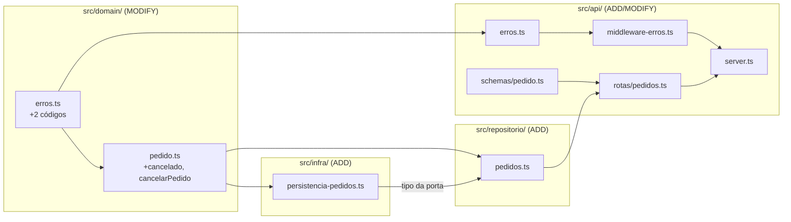
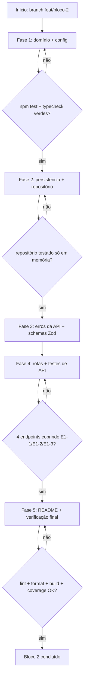
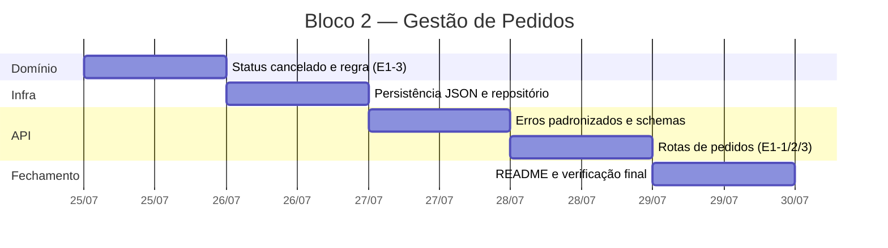

# Implementation Plan: Bloco 2 — Gestão de Pedidos

**Context:** O domínio base (`Coordenada`, `Pedido`, `Drone`) está pronto e testado, mas
nada dele é alcançável de fora: a API só expõe `/health` e os pedidos não sobrevivem a um
reinício. Este bloco entrega o épico E1 completo — cadastrar, consultar e cancelar pedidos —
com persistência em arquivo JSON (D6) e a camada de erros padronizada (E7-1/D20) que os
critérios de "mensagem clara" do E1 exigem.

**Tech Stack:** TypeScript (ESM, `NodeNext`) · Node.js >= 20.12 · Express 4 · Zod 3 ·
Vitest 4 (cobertura v8) · `supertest` (nova devDependency, só testes) · `node:fs` nativo.

---

## 0. Context to Load

> Leia TODOS os itens abaixo ANTES de iniciar a execução. São os arquivos que carregam as
> convenções, regras de domínio e padrões necessários para implementar este plano sem
> alucinar. Leia a versão ATUAL em disco — não confie em memória ou suposição.

**Docs de contexto (convenções e regras):**

- [ ] `CLAUDE.md` — diretrizes de arquitetura, comandos, idioma (pt-BR) e a regra do ESM `NodeNext`
- [ ] `context/metaspec.md` → **ARCHITECTURE** e **CRITICAL BUSINESS RULES** — camadas e invariantes
- [ ] `docs/DECISIONS.md` → **D3, D4, D5, D6, D7, D20, D22, D23** — as ADRs que este bloco materializa
- [ ] `docs/BACKLOG.md` → **E1-1, E1-2, E1-3** (critérios de aceite literais), **E7-1, E7-2**, **E8-1**

**Código de referência (padrões a imitar):**

- [ ] `src/domain/pedido.ts` — factory validante, tipos `readonly`, JSDoc em pt-BR, parse-don't-validate (D23)
- [ ] `src/domain/erros.ts` — `ErroDominio` com `codigo` tipado, sem qualquer referência a HTTP
- [ ] `src/domain/pedido.test.ts` — padrão de teste: `expect.assertions(2)` + `try/catch` verificando `codigo`
- [ ] `src/domain/coordenada.ts` — estilo das mensagens de erro (citam os valores concretos)
- [ ] `src/api/server.ts` — estado atual do app Express (casca fina, só `/health`)
- [ ] `src/config.ts` — leitura de env com fallback, `as const`
- [ ] `plans/old/2026-07-25_Bloco_1_Dominio_Base.md` → seção **Technical Design** — convenção de enums (D22)

**Arquivos a modificar (leia o estado atual antes de alterar):**

- [ ] `src/domain/erros.ts` — alterado na tarefa 1.1
- [ ] `src/domain/pedido.ts` — alterado na tarefa 1.2
- [ ] `src/domain/pedido.test.ts` — alterado na tarefa 1.3
- [ ] `src/config.ts` — alterado na tarefa 1.4
- [ ] `.env.example` — alterado na tarefa 1.5
- [ ] `.gitignore` — alterado na tarefa 1.6
- [ ] `package.json` — alterado na tarefa 3.4
- [ ] `src/api/server.ts` — alterado na tarefa 4.2
- [ ] `src/index.ts` — alterado na tarefa 4.3
- [ ] `README.md` — alterado na tarefa 5.1

---

## 1. Goals & Scope

### 1.1. Goals

- **Goals:** Entregar o épico E1 ponta a ponta — cadastro, consulta (com filtros e busca por
  id) e cancelamento de pedidos — expostos por endpoints REST que são casca fina sobre o
  domínio, com os pedidos persistidos em arquivo JSON e todo erro devolvido no formato
  padronizado do D20.

### 1.2. Scope

- **Inputs:** payload JSON de novo pedido (`x`, `y`, `pesoKg`, `prioridade`); query params de
  filtro (`status`, `prioridade`); `id` de pedido na URL; conteúdo do arquivo `data/pedidos.json`.
- **Outputs:** endpoints `POST /pedidos`, `GET /pedidos`, `GET /pedidos/:id` e
  `POST /pedidos/:id/cancelar`; arquivo JSON atualizado a cada mutação; respostas de erro
  padronizadas `{ erro: { codigo, mensagem, detalhes? } }`; suíte de testes verde.

- **In-Scope:** Acrescentar o status `cancelado` ao domínio do pedido e a regra de
  cancelamento (só a partir de `pendente`), como função pura (E1-3).
- **In-Scope:** Criar a porta de persistência (`carregar`/`salvar`) com duas implementações —
  arquivo JSON e memória — e o repositório de pedidos que a consome (D6).
- **In-Scope:** Criar os schemas Zod de payload e de query string na borda da API (D3).
- **In-Scope:** Criar o mapeamento `ErroDominio` → status HTTP e o middleware central de
  erro, incluindo 404 padronizado para rota inexistente (E7-1, D20).
- **In-Scope:** Criar as quatro rotas de pedido e ligá-las ao repositório por injeção.
- **In-Scope:** Testes unitários (domínio, persistência, repositório) e de API (supertest).
- **In-Scope:** Documentar os endpoints no README com exemplos de requisição/resposta (E7-2).

- **Out-of-Scope:** Não criar endpoints de frota (`GET /drones/status`) — é o Bloco 3 (E2-2).
- **Out-of-Scope:** Não implementar o algoritmo de alocação, a ordenação por prioridade nem
  o roteamento nearest-neighbor — é o Bloco 4 (E3, D9/D11/D12).
- **Out-of-Scope:** Não implementar transições da máquina de estados do drone, bateria ou
  tempo de entrega — é o Bloco 5 (E4).
- **Out-of-Scope:** Não transicionar pedido para `alocado`, `em_voo` ou `entregue` — nada
  neste bloco produz essas transições; apenas o tipo já as prevê.
- **Out-of-Scope:** Não criar dashboard nem qualquer arquivo em `src/dashboard/` (E6).
- **Out-of-Scope:** Não editar `context/metaspec.md`, `context/index.md` ou
  `context/timeline.md` — esses arquivos só mudam via `/context-update`.
- **Out-of-Scope:** Não commitar na `main` — todo o trabalho vai na branch `feat/bloco-2`.

- **Constraint:** O domínio (`src/domain/`) deve continuar puro: sem I/O, sem `fs`, sem
  Express, sem importar `src/config.ts`. Limites e dependências entram por parâmetro.
- **Constraint:** `ErroDominio` não pode ganhar campo de status HTTP — o mapeamento vive na
  camada de API (D20).
- **Constraint:** Nenhum teste pode escrever no sistema de arquivos real; a suíte usa a
  implementação de persistência em memória.
- **Constraint:** Todo valor de enum permanece minúsculo, sem acento, `snake_case` (D22).
- **Constraint:** A unidade de distância continua sendo a **quadra** — nenhum identificador
  ou comentário pode usar `km` (D16).
- **Constraint:** Imports relativos precisam da extensão `.js` (ESM `NodeNext`).
- **Constraint:** `npm test`, `npm run typecheck`, `npm run lint`, `npm run format:check` e
  `npm run build` devem terminar verdes.
- **Constraint:** Código, comentários, nomes de teste e mensagens de erro em pt-BR.

---

## 2. Technical Design

### Camadas e sentido das dependências

A regra que organiza o bloco: **as setas apontam sempre para dentro**. O domínio não conhece
ninguém; o repositório conhece o domínio e um _tipo_ de persistência; a implementação de
arquivo conhece o `fs`; a API conhece o repositório. Nenhuma seta volta.

```
index.ts ──cria──> persistência de arquivo ──injeta──> repositório ──injeta──> app Express
                                                            │                       │
                                                            v                       v
                                                        domínio puro           rotas + Zod
```

Isso é o que permite trocar disco por memória nos testes sem tocar em uma linha de domínio
ou de rota — a mesma técnica que `criarPedido` já usa com `gerarId`.

### Endpoints

| Método | Rota                     | História | Sucesso | Erros                    |
| ------ | ------------------------ | -------- | ------- | ------------------------ |
| POST   | `/pedidos`               | E1-1     | 201     | 400, 422                 |
| GET    | `/pedidos`               | E1-2     | 200     | 400 (filtro inválido)    |
| GET    | `/pedidos/:id`           | E1-2     | 200     | 404                      |
| POST   | `/pedidos/:id/cancelar`  | E1-3     | 200     | 404, 422                 |

`GET /pedidos` aceita `?status=` e `?prioridade=`, combináveis. Sem pedidos, devolve `[]`
(nunca erro). Cancelamento é sub-recurso de ação, não `DELETE`: o pedido continua existindo
com status `cancelado` e segue consultável por `GET /pedidos?status=cancelado`.

### Mapeamento de erro → HTTP (D20)

A divisão é semântica: **400 = a entrada está malformada**; **422 = a entrada é válida, mas
viola uma regra de negócio**; **404 = o recurso não existe**.

| Código                        | HTTP | Origem                                          |
| ----------------------------- | ---- | ----------------------------------------------- |
| (falha de schema Zod)         | 400  | payload/query malformado, campo faltando, tipo errado |
| `COORDENADA_INVALIDA`         | 400  | `x`/`y` não inteiro finito                      |
| `PRIORIDADE_INVALIDA`         | 400  | prioridade fora do conjunto                     |
| `PESO_INVALIDO`               | 400  | peso `<= 0` ou não finito                       |
| `COORDENADA_FORA_DA_MALHA`    | 422  | coordenada válida, porém fora de `0..N` (D4)    |
| `PESO_ACIMA_CAPACIDADE`       | 422  | peso válido, porém acima da capacidade (D5)     |
| `PEDIDO_NAO_ENCONTRADO`       | 404  | `id` inexistente                                |
| `CANCELAMENTO_NAO_PERMITIDO`  | 422  | pedido não está `pendente` (E1-3)               |
| (qualquer outro `Error`)      | 500  | falha inesperada — mensagem genérica, sem stack |

Rota inexistente cai num handler 404 padronizado com o mesmo envelope `{ erro: {...} }`.

### Dupla validação não é redundância (D3 + D23)

Zod valida a **forma** (existe? é número? é string?) e devolve 400 com o campo e o motivo.
O domínio valida a **regra** (cabe na malha? cabe no drone?) e lança `ErroDominio`. São
responsabilidades distintas: a factory continua sendo a única fonte de verdade das
invariantes, e continua chamável por uma CLI ou por um teste sem HTTP nenhum.

### Data Flow

1. **Cadastro:** `POST /pedidos` → Zod valida o corpo → rota monta `DadosNovoPedido` e lê os
   limites de `config` → `criarPedido()` valida e devolve o `Pedido` `pendente` →
   `repositorio.adicionar()` → persistência grava o JSON → resposta 201 com o pedido.
2. **Consulta:** `GET /pedidos` → Zod valida os filtros da query → `repositorio.listar()`
   aplica `status`/`prioridade` → 200 com o array (vazio se nada casar).
3. **Busca:** `GET /pedidos/:id` → `repositorio.buscarPorId()` → se ausente, lança
   `PEDIDO_NAO_ENCONTRADO` → middleware traduz para 404.
4. **Cancelamento:** `POST /pedidos/:id/cancelar` → repositório busca o pedido →
   `cancelarPedido()` (domínio) recusa se o status não for `pendente` → repositório
   substitui a versão antiga e persiste → 200 com o pedido cancelado.
5. **Boot:** `index.ts` cria a persistência de arquivo (que carrega o JSON existente, ou um
   array vazio se o arquivo não existir), injeta no repositório e este no app.

### Data Structures (Draft)

> Pseudocódigo — comunica intenção, não é a implementação final.

```ts
// domain/pedido.ts  (MODIFY)
export const STATUS_PEDIDO = ['pendente', 'alocado', 'em_voo', 'entregue', 'cancelado'] as const;

/** Só pedido `pendente` pode ser cancelado (E1-3); devolve nova cópia. */
export function cancelarPedido(pedido: Pedido): Pedido   // lança CANCELAMENTO_NAO_PERMITIDO

// domain/erros.ts  (MODIFY)
// + 'PEDIDO_NAO_ENCONTRADO' | 'CANCELAMENTO_NAO_PERMITIDO'

// infra/persistencia-pedidos.ts  (ADD)
export type PersistenciaPedidos = {
  carregar(): Pedido[];
  salvar(pedidos: readonly Pedido[]): void;
};
export function criarPersistenciaArquivo(caminho: string): PersistenciaPedidos  // node:fs
export function criarPersistenciaMemoria(inicial?: Pedido[]): PersistenciaPedidos

// repositorio/pedidos.ts  (ADD)
export type FiltrosPedido = { status?: StatusPedido; prioridade?: Prioridade };
export type RepositorioPedidos = {
  listar(filtros?: FiltrosPedido): Pedido[];
  buscarPorId(id: string): Pedido;      // lança PEDIDO_NAO_ENCONTRADO
  adicionar(pedido: Pedido): Pedido;    // persiste
  cancelar(id: string): Pedido;         // busca + cancelarPedido + persiste
};
export function criarRepositorioPedidos(persistencia: PersistenciaPedidos): RepositorioPedidos

// api/erros.ts  (ADD)
export type CorpoErro = { erro: { codigo: string; mensagem: string; detalhes?: unknown } };
export function statusHttpDe(codigo: CodigoErroDominio): number   // tabela acima

// api/schemas/pedido.ts  (ADD)
export const schemaNovoPedido = z.object({
  x: z.number(), y: z.number(), pesoKg: z.number(), prioridade: z.string(),
});                                   // frouxo de propósito (D23) — a regra é do domínio
export const schemaFiltrosPedido = z.object({
  status: z.enum(STATUS_PEDIDO).optional(),
  prioridade: z.enum(PRIORIDADES).optional(),
});

// api/server.ts  (MODIFY)
export function criarApp(repositorio: RepositorioPedidos): Express
```

### Impacto nos arquivos



```text
case_dti/
├── .env.example                              [MODIFY]  + PEDIDOS_ARQUIVO
├── .gitignore                                [MODIFY]  + data/
├── README.md                                 [MODIFY]  tabela de endpoints + exemplos (E7-2)
├── package.json                              [MODIFY]  + supertest, @types/supertest
└── src/
    ├── config.ts                             [MODIFY]  + pedidosArquivo
    ├── index.ts                              [MODIFY]  composição: persistência → repo → app
    ├── domain/
    │   ├── erros.ts                          [MODIFY]  + 2 códigos
    │   ├── pedido.ts                         [MODIFY]  + cancelado + cancelarPedido
    │   └── pedido.test.ts                    [MODIFY]  + casos de cancelamento
    ├── infra/
    │   ├── persistencia-pedidos.ts           [ADD]
    │   └── persistencia-pedidos.test.ts      [ADD]
    ├── repositorio/
    │   ├── pedidos.ts                        [ADD]
    │   └── pedidos.test.ts                   [ADD]
    └── api/
        ├── erros.ts                          [ADD]
        ├── middleware-erros.ts               [ADD]
        ├── server.ts                         [MODIFY]  recebe repositório, monta rotas
        ├── schemas/
        │   └── pedido.ts                     [ADD]
        └── rotas/
            ├── pedidos.ts                    [ADD]
            └── pedidos.test.ts               [ADD]
```

### Visão de execução



### Cronograma das fases



---

## 3. Phased Execution

> **Antes de qualquer edição:** verificar a branch com `git branch --show-current`. Se for
> `main`, criar `feat/bloco-2` primeiro. Nenhum commit vai direto para a `main`.

### Phase 1: Domínio e config (Core Domain)

- [ ] **1.1: Acrescentar os códigos de erro do bloco** [MODIFY: ./src/domain/erros.ts]
  - Somar `'PEDIDO_NAO_ENCONTRADO'` e `'CANCELAMENTO_NAO_PERMITIDO'` a `CodigoErroDominio`.
  - Não introduzir campo de status HTTP — o mapeamento é da camada de API (D20).
  - _Verification:_ `npm run typecheck` verde.

- [ ] **1.2: Modelar cancelamento no pedido** [MODIFY: ./src/domain/pedido.ts]
  - Acrescentar `'cancelado'` a `STATUS_PEDIDO` (fim do array, para não alterar a ordem já usada).
  - `cancelarPedido(pedido)`: devolve `comStatus(pedido, 'cancelado')` se o status for
    `pendente`; caso contrário lança `CANCELAMENTO_NAO_PERMITIDO` com mensagem citando o
    status atual. Função pura, sem mutar a entrada.
  - _Verification:_ `npm run typecheck` verde; `comStatus` segue intocada.

- [ ] **1.3: Cobrir a regra de cancelamento** [MODIFY: ./src/domain/pedido.test.ts]
  - Cancela pedido `pendente` → status `cancelado`, original não mutado.
  - Rejeita cancelamento de `alocado`, `em_voo` e `entregue`, verificando o `codigo`.
  - Cancelar um pedido já `cancelado` também é rejeitado (idempotência não é permitida aqui).
  - _Verification:_ `npm test -- pedido` verde.

- [ ] **1.4: Configurar o caminho do arquivo de pedidos** [MODIFY: ./src/config.ts]
  - Nova chave `pedidosArquivo: process.env.PEDIDOS_ARQUIVO ?? 'data/pedidos.json'`, com
    JSDoc explicando que é o armazenamento local dos pedidos (D6).
  - _Verification:_ `npm run typecheck` verde; `config.pedidosArquivo` tem valor padrão.

- [ ] **1.5: Refletir a nova variável no exemplo de ambiente** [MODIFY: ./.env.example]
  - Acrescentar `PEDIDOS_ARQUIVO=data/pedidos.json` com comentário em pt-BR, no estilo do arquivo.
  - _Verification:_ toda chave lida em `config.ts` aparece no `.env.example` e vice-versa.

- [ ] **1.6: Ignorar os dados de execução no git** [MODIFY: ./.gitignore]
  - Acrescentar a seção `data/` — o JSON de pedidos é estado de execução, não fonte.
  - _Verification:_ `git status` não lista `data/pedidos.json` após subir o servidor.

### Phase 2: Persistência e repositório (Infrastructure)

- [ ] **2.1: Criar a porta de persistência e suas duas implementações** [ADD: ./src/infra/persistencia-pedidos.ts]
  - Tipo `PersistenciaPedidos` com `carregar()` e `salvar(pedidos)` (síncronos — mantêm o
    repositório simples e os testes sem `async`).
  - `criarPersistenciaArquivo(caminho)`: `carregar` devolve `[]` se o arquivo não existir;
    `salvar` cria o diretório se necessário e grava com escrita atômica (arquivo temporário
    + `rename`), evitando JSON truncado se o processo morrer no meio.
  - `criarPersistenciaMemoria(inicial)`: guarda o array em memória; usada pelos testes.
  - _Verification:_ `npm run typecheck` verde; nenhum import de Express ou de `src/domain` além dos tipos.

- [ ] **2.2: Testar a persistência de arquivo** [ADD: ./src/infra/persistencia-pedidos.test.ts]
  - Foco na implementação de memória (round-trip `salvar` → `carregar`, isolamento entre instâncias).
  - Para a de arquivo, cobrir apenas o caminho de arquivo ausente devolvendo `[]`, usando um
    caminho dentro de `os.tmpdir()` que não existe — sem escrever nada.
  - _Verification:_ `npm test -- persistencia` verde; nenhum arquivo criado no repositório.

- [ ] **2.3: Criar o repositório de pedidos** [ADD: ./src/repositorio/pedidos.ts]
  - `criarRepositorioPedidos(persistencia)` carrega o estado inicial uma vez e mantém a
    lista em memória, persistindo a cada mutação (write-through).
  - `listar(filtros)` aplica `status` e `prioridade` combináveis; sem filtros devolve tudo.
  - `buscarPorId(id)` lança `PEDIDO_NAO_ENCONTRADO` citando o id.
  - `adicionar(pedido)` e `cancelar(id)` — este delega a regra a `cancelarPedido` do domínio
    e substitui o item na lista, preservando a ordem de cadastro.
  - _Verification:_ `npm run typecheck` verde; nenhuma regra de negócio duplicada aqui.

- [ ] **2.4: Testar o repositório** [ADD: ./src/repositorio/pedidos.test.ts]
  - Sempre com `criarPersistenciaMemoria` — nenhum acesso a disco.
  - Cadastro e listagem; filtros por status, por prioridade e combinados; lista vazia.
  - `buscarPorId` de id inexistente lança o código correto.
  - Cancelamento persiste: uma nova instância de repositório sobre a mesma persistência já
    enxerga o pedido cancelado (prova o "sobrevive a reinício" do E1-1).
  - Pedido cancelado não aparece em `listar({ status: 'pendente' })`.
  - _Verification:_ `npm test -- repositorio` verde.

### Phase 3: Erros e validação da API (API Layer)

- [ ] **3.1: Mapear erro de domínio para HTTP** [ADD: ./src/api/erros.ts]
  - `statusHttpDe(codigo)` implementando a tabela da Seção 2; default `500`.
  - Helper que monta o envelope `{ erro: { codigo, mensagem, detalhes? } }` (D20).
  - _Verification:_ `npm run typecheck` verde; o mapa cobre todos os `CodigoErroDominio` atuais.

- [ ] **3.2: Criar o middleware central de erro e o 404 de rota** [ADD: ./src/api/middleware-erros.ts]
  - Handler de erro (4 argumentos) traduzindo `ErroDominio` → status + envelope;
    `ZodError` → 400 com `detalhes` listando campo e motivo; qualquer outro → 500 com
    mensagem genérica (sem vazar stack).
  - Handler de rota não encontrada devolvendo 404 no mesmo envelope (`ROTA_NAO_ENCONTRADA`).
  - _Verification:_ `npm run typecheck` e `npm run lint` verdes.

- [ ] **3.3: Criar os schemas Zod da borda** [ADD: ./src/api/schemas/pedido.ts]
  - `schemaNovoPedido`: `x`, `y`, `pesoKg` como `number`; `prioridade` como `string` —
    frouxo de propósito, a validação de valor é do domínio (D23). Rejeita campos ausentes
    ou de tipo errado com mensagens em pt-BR.
  - `schemaFiltrosPedido`: `status` e `prioridade` opcionais, restritos aos enums (D22),
    de modo que `?status=xpto` já falhe em 400.
  - _Verification:_ `npm run typecheck` verde.

- [ ] **3.4: Instalar as dependências de teste HTTP** [MODIFY: ./package.json]
  - `npm install -D supertest @types/supertest`. Nada entra em `dependencies`.
  - _Verification:_ `npm test` continua verde; `npm audit` sem vulnerabilidade nova.

### Phase 4: Rotas de pedidos (API Layer)

- [ ] **4.1: Implementar as quatro rotas** [ADD: ./src/api/rotas/pedidos.ts]
  - `criarRotasPedidos(repositorio)` devolve um `express.Router` — a rota recebe o
    repositório por parâmetro, nunca o importa de um singleton.
  - `POST /` (201), `GET /` (200), `GET /:id` (200), `POST /:id/cancelar` (200).
  - Cada handler: valida com Zod → chama domínio/repositório → responde. Erros são
    repassados a `next(erro)`; nenhum `try/catch` monta resposta de erro por conta própria.
  - Os limites (`capacidadeKg`, `cidadeTamanho`) são lidos de `config` aqui e passados a
    `criarPedido` — o domínio segue sem conhecer a config.
  - _Verification:_ `npm run typecheck` verde; nenhuma regra de negócio dentro do handler.

- [ ] **4.2: Montar as rotas e o middleware no app** [MODIFY: ./src/api/server.ts]
  - `criarApp(repositorio)` passa a receber o repositório; monta `/pedidos`, mantém
    `/health` e registra o 404 de rota e o handler de erro **por último** (a ordem importa
    no Express).
  - Remover o `TODO` de `POST /pedidos`, mantendo os das rotas dos blocos seguintes.
  - _Verification:_ `npm run build` verde; `/health` continua respondendo.

- [ ] **4.3: Compor a aplicação no entry point** [MODIFY: ./src/index.ts]
  - Criar a persistência de arquivo com `config.pedidosArquivo`, injetar no repositório e
    este em `criarApp`. Este é o único lugar que decide qual implementação de persistência roda.
  - _Verification:_ `npm run dev`; cadastrar um pedido, reiniciar e ver o pedido em `GET /pedidos`.

- [ ] **4.4: Testar os endpoints ponta a ponta** [ADD: ./src/api/rotas/pedidos.test.ts]
  - App montado com `criarPersistenciaMemoria` — testes isolados e sem disco.
  - E1-1: cadastro válido devolve 201 com `id` e `status: 'pendente'`; peso acima da
    capacidade → 422; peso `0`/negativo → 400; prioridade desconhecida → 400; coordenada
    fora da malha → 422; corpo sem campo obrigatório → 400 com `detalhes`.
  - E1-2: lista vazia devolve `[]` e 200; filtro por status e por prioridade; combinação de
    ambos; filtro inválido → 400; `GET /pedidos/:id` existente → 200; inexistente → 404.
  - E1-3: cancelar `pendente` → 200 com `cancelado`; cancelar de novo → 422; id inexistente
    → 404; cancelado some de `?status=pendente`.
  - E7-1: rota inexistente → 404 no envelope padronizado; todo erro segue o formato
    `{ erro: { codigo, mensagem } }`.
  - _Verification:_ `npm test` verde com todos os endpoints cobertos.

### Phase 5: Documentação e verificação final (Cleanup)

- [ ] **5.1: Documentar os endpoints no README** [MODIFY: ./README.md]
  - Substituir a tabela "API (planejada)" por uma seção com os endpoints do E1 já
    implementados (método, rota, descrição, corpo, resposta) e os demais marcados como
    planejados. Incluir exemplos `curl` de cadastro, listagem com filtro e cancelamento,
    além de um exemplo de resposta de erro padronizada (E7-2).
  - _Verification:_ cada rota documentada existe em `src/api/rotas/pedidos.ts`, e vice-versa.

- [ ] **5.2: Verificação completa da suíte** [MODIFY: ./src/api/rotas/pedidos.test.ts]
  - Rodar `npm run typecheck`, `npm run lint`, `npm run format:check`, `npm test`,
    `npm run coverage` e `npm run build`.
  - Se a cobertura de `src/domain/` e `src/repositorio/` ficar abaixo de ~80% (D21),
    acrescentar os casos de borda faltantes — sem alterar a implementação para inflar número.
  - Conferir que `git status` não mostra `data/` e que nenhum teste criou arquivo no repositório.
  - _Verification:_ os seis comandos verdes; cobertura do domínio e do repositório >= 80%.

> **Nota para o executor:** `context/metaspec.md` e `context/index.md` ficam desatualizados
> ao fim deste bloco. **Não os edite** — a sincronização é feita depois via `/context-update`.

---

## 4. Test Strategy

- [ ] **Unit — Domínio:** cancelamento a partir de `pendente`; recusa a partir de `alocado`,
  `em_voo`, `entregue` e `cancelado`, verificando o `codigo` do `ErroDominio`; imutabilidade
  da entrada. Os testes já existentes de `criarPedido` devem continuar verdes sem alteração.
- [ ] **Unit — Persistência:** round-trip `salvar`/`carregar` na implementação de memória;
  isolamento entre instâncias; arquivo inexistente devolve `[]`.
- [ ] **Unit — Repositório:** cadastro, listagem, filtros isolados e combinados, lista vazia,
  busca por id inexistente, cancelamento; e o teste de durabilidade — repositório novo sobre
  a mesma persistência enxerga o estado anterior.
- [ ] **Integration — API (supertest):** os quatro endpoints com caminho feliz e cada ramo de
  erro (400/404/422), sempre conferindo o envelope `{ erro: { codigo, mensagem } }` e o
  status; rota inexistente padronizada.
- [ ] **Determinismo:** nenhum teste escreve em disco, depende de relógio real ou de ordem de
  execução; ids vêm de gerador injetado sempre que forem asseridos (D13, D21).
- [ ] **Cobertura:** `npm run coverage` com meta ~80% em `src/domain/` e `src/repositorio/` (D21).

---

## 5. Rollback & Risks

- **Risk:** Vazar regra de negócio para a camada de rota ou para o repositório — por exemplo
  checar `status === 'pendente'` no handler em vez de chamar `cancelarPedido`.
  - _Mitigation:_ a regra vive em `src/domain/pedido.ts` e é exercida por teste unitário sem
    HTTP. Ao final, um grep por `'pendente'` fora de `src/domain/` e dos testes deve
    aparecer apenas em filtros de listagem.

- **Risk:** O domínio ganhar acoplamento a `fs` ou a `config` ao introduzir a persistência.
  - _Mitigation:_ a porta é injetada e só `src/index.ts` escolhe a implementação. Grep por
    `node:fs` e `from '../config` dentro de `src/domain/` deve retornar vazio.

- **Risk:** Testes escreverem no `data/pedidos.json` real, poluindo o repositório e tornando
  a suíte dependente de ordem de execução.
  - _Mitigation:_ toda suíte usa `criarPersistenciaMemoria`; a Fase 5 confere o `git status`
    limpo após rodar os testes.

- **Risk:** Ordem errada dos middlewares no Express — registrar o handler de erro antes das
  rotas faz com que ele nunca seja chamado, e todo erro vira o HTML padrão do Express.
  - _Mitigation:_ tarefa 4.2 fixa a ordem, e o teste de rota inexistente da 4.4 falha
    imediatamente se a montagem estiver invertida.

- **Risk:** Ambiguidade 400 vs 422 aplicada de forma inconsistente entre as rotas.
  - _Mitigation:_ o mapeamento é centralizado em `statusHttpDe` (tarefa 3.1) e nenhuma rota
    escolhe status por conta própria; os testes da 4.4 travam o contrato.

- **Risk:** Escrita não atômica corromper o JSON se o processo cair durante `salvar`.
  - _Mitigation:_ gravação em arquivo temporário seguida de `rename` (tarefa 2.1); `carregar`
    tolera arquivo ausente.

- **Rollback:** Todo o trabalho fica na branch `feat/bloco-2`, sem merge na `main`. Reverter é
  `git checkout main` e apagar a branch; os arquivos novos ficam em diretórios novos
  (`src/infra/`, `src/repositorio/`, `src/api/rotas/`, `src/api/schemas/`), então a remoção é
  limpa. As alterações em arquivos existentes são aditivas — o único ponto de atenção é
  `criarApp`, que muda de assinatura. Nenhuma migração de dados está envolvida; o
  `data/pedidos.json` é descartável e não versionado.
