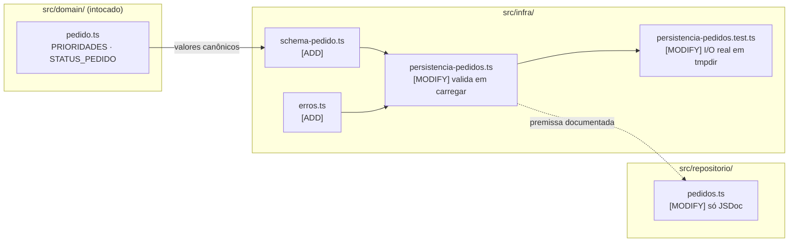
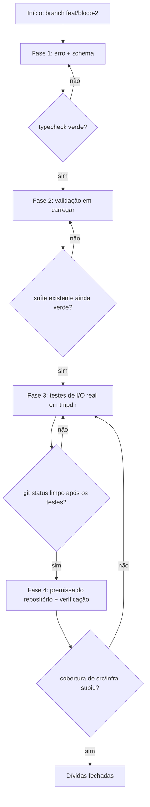
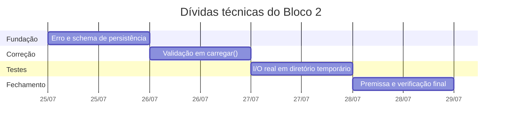

# Implementation Plan: Dívidas Técnicas do Bloco 2

**Context:** O walkthrough do Bloco 2 registrou três dívidas na camada de persistência. Duas
são defeitos reais — `carregar()` afirma ao TypeScript que o conteúdo do arquivo é `Pedido[]`
sem checar nada, e a escrita/leitura reais em disco não têm teste automatizado. A terceira
(estado lido uma única vez no boot) foi reavaliada e **rebaixada a limitação documentada**:
reler a cada operação anularia o design em memória para cobrir um cenário que não existe num
simulador de processo único.

**Tech Stack:** TypeScript (ESM, `NodeNext`) · Node.js >= 20.12 · Zod 3 (já em `dependencies`)
· Vitest 4 · `node:fs` e `node:os` nativos — sem dependências novas.

---

## 0. Context to Load

> Leia TODOS os itens abaixo ANTES de iniciar a execução. Leia a versão ATUAL em disco — não
> confie em memória ou suposição.

**Docs de contexto (convenções e regras):**

- [ ] `CLAUDE.md` — diretrizes de arquitetura, idioma (pt-BR), regra do ESM `NodeNext`
- [ ] `context/walkthroughs/2026-07-25_Walkthrough_Bloco_2_Pedidos.md` → seção **4** — as três dívidas na origem
- [ ] `docs/DECISIONS.md` → **D3, D6, D20, D22, D23** — Zod nas bordas, persistência JSON, erros, parse-don't-validate
- [ ] `context/metaspec.md` → **ARCHITECTURE** — direção das dependências entre camadas

**Código de referência (padrões a imitar):**

- [ ] `src/domain/erros.ts` — formato do erro tipado (classe + `codigo` readonly + `captureStackTrace`)
- [ ] `src/api/schemas/pedido.ts` — estilo dos schemas Zod com mensagens em pt-BR
- [ ] `src/domain/pedido.ts` — `PRIORIDADES` e `STATUS_PEDIDO` como fonte dos valores canônicos (D22)
- [ ] `src/repositorio/pedidos.test.ts` — padrão de teste do bloco

**Arquivos a modificar (leia o estado atual antes de alterar):**

- [ ] `src/infra/persistencia-pedidos.ts` — alterado nas tarefas 2.1 e 2.2
- [ ] `src/infra/persistencia-pedidos.test.ts` — alterado nas tarefas 3.1 e 3.2
- [ ] `src/repositorio/pedidos.ts` — alterado na tarefa 4.1

---

## 1. Goals & Scope

### 1.1. Goals

- **Goals:** Fechar as duas dívidas reais da persistência — validar a forma do JSON ao carregar,
  falhando cedo e com mensagem acionável quando o arquivo estiver corrompido, e cobrir com teste
  automatizado o comportamento real em disco (criação de diretório, escrita atômica, arquivo
  ausente e conteúdo inválido) — sem tocar em domínio, repositório ou API.

### 1.2. Scope

- **Inputs:** conteúdo de `data/pedidos.json` (possivelmente corrompido, editado à mão ou ausente).
- **Outputs:** `Pedido[]` validado, ou `ErroPersistencia` com arquivo e campo problemático;
  `src/infra/` com cobertura de I/O real; suíte verde sem escrever no repositório.

- **In-Scope:** Criar o schema Zod do pedido persistido, derivando os valores dos enums do domínio.
- **In-Scope:** Criar `ErroPersistencia` e fazer `carregar()` validar antes de devolver.
- **In-Scope:** Cobrir a implementação de arquivo com testes em diretório temporário exclusivo.
- **In-Scope:** Documentar em JSDoc a premissa de dono único do arquivo (dívida #2 rebaixada).

- **Out-of-Scope:** Não implementar releitura do arquivo, nem por `mtime` nem a cada operação —
  a dívida #2 foi rebaixada a limitação documentada, por decisão explícita.
- **Out-of-Scope:** Não alterar `src/domain/`, `src/repositorio/pedidos.ts` (além do JSDoc),
  `src/api/` nem `src/index.ts` — o conserto é interno à camada de persistência.
- **Out-of-Scope:** Não editar `context/metaspec.md`, `context/index.md` ou `context/timeline.md`
  — a sincronização é feita depois via `/context-update`.
- **Out-of-Scope:** Não editar o walkthrough do Bloco 2 — ele é o registro daquele commit; o
  estado novo será refletido no contexto e num walkthrough próprio.
- **Out-of-Scope:** Não instalar nenhuma dependência nova.

- **Constraint:** `src/domain/` deve continuar sem importar Zod, `fs` ou config.
- **Constraint:** `src/infra/` não pode importar de `src/api/` — a direção das dependências não
  se inverte; o schema da persistência é próprio e independente do schema de payload.
- **Constraint:** Nenhum teste pode escrever dentro do repositório. Escrita real só em diretório
  exclusivo sob `os.tmpdir()`, removido ao fim de cada teste.
- **Constraint:** Arquivo inválido não pode ser sobrescrito, renomeado nem apagado pelo sistema —
  precisa sobreviver intacto para conserto manual.
- **Constraint:** Os valores aceitos de `prioridade` e `status` vêm de `PRIORIDADES` e
  `STATUS_PEDIDO` do domínio — nunca duplicados como literais no schema (D22).
- **Constraint:** Imports relativos precisam da extensão `.js` (ESM `NodeNext`).
- **Constraint:** `npm test`, `typecheck`, `lint`, `format:check` e `build` verdes.
- **Constraint:** Código, comentários, nomes de teste e mensagens de erro em pt-BR.

---

## 2. Technical Design

### O problema, em uma frase

`carregar()` faz `JSON.parse` e usa uma asserção de tipo (`as Pedido[]`) para dizer ao
compilador que aquilo é um array de pedidos. É a mesma mentira de tipo que a D23 já corrigiu no
domínio — só que aqui a entrada não confiável é o arquivo, não o payload HTTP.

Dois modos de falha, e o segundo é o que justifica o schema:

| Falha | Hoje | Depois |
| --- | --- | --- |
| Sintaxe quebrada (vírgula sobrando) | `SyntaxError` cru, sem citar o arquivo | `ErroPersistencia` citando caminho e causa |
| Sintaxe válida, forma errada (`"pesoKg": "5"`) | Entra no sistema tipado como `Pedido`, mentindo | Recusado no boot, com o índice e o campo |

O segundo caso é silencioso: o filtro `?status=cancelada` nunca casa, e a soma de pesos da
alocação (Bloco 4) produziria `5 + "5" = "55"` — erro longe da causa.

### Por que falhar no boot

Carregar parcialmente parece mais resiliente, mas a lista truncada vira o estado em memória e a
**próxima gravação regrava o arquivo sem os pedidos descartados** — uma corrupção talvez
recuperável à mão se tornaria definitiva, causada por nós. Falhar cedo mantém o arquivo intacto
e põe o erro na frente de quem pode agir, antes da primeira requisição.

### Por que o schema é próprio da persistência

O schema da API descreve o **payload de entrada**: `prioridade` é `string` frouxa de propósito
(D23), porque quem valida o valor é o domínio. O da persistência descreve um **`Pedido` que já
passou pelo domínio**: tem `id`, tem `status`, e `prioridade` só admite os valores canônicos.
Formas diferentes; e `src/infra/` importar de `src/api/` inverteria a direção das dependências,
impedindo usar o repositório fora do HTTP.

### Data Flow

1. **Boot:** `index.ts` cria a persistência de arquivo e o repositório chama `carregar()` uma vez.
2. **Arquivo ausente:** devolve `[]` — primeiro boot funciona sem setup, comportamento inalterado.
3. **Leitura:** `readFileSync` → `JSON.parse`. Erro de sintaxe vira `ErroPersistencia` citando o caminho.
4. **Validação:** `z.array(schemaPedidoPersistido).parse(...)`. Falha vira `ErroPersistencia` com
   os `issues` formatados como `[índice].campo: motivo`.
5. **Sucesso:** devolve `Pedido[]` de verdade — sem asserção de tipo em lugar nenhum.
6. **Gravação:** inalterada — `.tmp` + `rename`, agora coberta por teste real.

### Data Structures (Draft)

> Pseudocódigo — comunica intenção, não é a implementação final.

```ts
// infra/erros.ts  (ADD)
export class ErroPersistencia extends Error {
  constructor(mensagem: string, readonly causa?: unknown)
}

// infra/schema-pedido.ts  (ADD)
import { PRIORIDADES, STATUS_PEDIDO } from '../domain/pedido.js';   // fonte única (D22)

export const schemaPedidoPersistido = z.object({
  id: z.string().min(1),
  destino: z.object({ x: z.number().int(), y: z.number().int() }),
  pesoKg: z.number().positive(),
  prioridade: z.enum(PRIORIDADES),
  status: z.enum(STATUS_PEDIDO),
});
export const schemaArquivoPedidos = z.array(schemaPedidoPersistido);

// infra/persistencia-pedidos.ts  (MODIFY)
carregar(): Pedido[] {
  if (!existsSync(caminho)) return [];
  let bruto: unknown;
  try { bruto = JSON.parse(readFileSync(caminho, 'utf-8')) }
  catch (causa) { throw new ErroPersistencia(`... JSON inválido em ${caminho} ...`, causa) }

  const resultado = schemaArquivoPedidos.safeParse(bruto);
  if (!resultado.success) throw new ErroPersistencia(formatarIssues(caminho, resultado.error));
  return resultado.data;      // Pedido[] de verdade — sem `as`
}
```

Mensagem alvo:

```
Erro ao carregar data/pedidos.json:
  [2].pesoKg: esperado número, recebido string
O arquivo está corrompido ou foi editado à mão.
```

### Impacto nos arquivos



```text
case_dti/
└── src/
    ├── infra/
    │   ├── erros.ts                          [ADD]     ErroPersistencia
    │   ├── schema-pedido.ts                  [ADD]     schema do pedido persistido
    │   ├── persistencia-pedidos.ts           [MODIFY]  validação em carregar()
    │   └── persistencia-pedidos.test.ts      [MODIFY]  suíte de I/O real (mkdtemp)
    └── repositorio/
        └── pedidos.ts                        [MODIFY]  JSDoc: dono único do arquivo
```

### Visão de execução



### Cronograma das fases



---

## 3. Phased Execution

> **Antes de qualquer edição:** conferir `git branch --show-current`. O trabalho continua em
> `feat/bloco-2`, a mesma branch do PR #5 — não abrir branch nova.
> Há mudanças de documentação não commitadas na árvore; preservá-las.

### Phase 1: Erro e schema da persistência (Infrastructure)

- [ ] **1.1: Criar o erro tipado da camada de persistência** [ADD: ./src/infra/erros.ts]
  - `ErroPersistencia extends Error` com `name` próprio e `causa?: unknown` preservando o erro
    original. Seguir o estilo de `src/domain/erros.ts`, inclusive `Error.captureStackTrace`.
  - Não reutilizar `ErroDominio`: isto não é violação de regra de negócio, e `CodigoErroDominio`
    não deve crescer com preocupações de infraestrutura.
  - _Verification:_ `npm run typecheck` verde; `instanceof ErroPersistencia` funciona.

- [ ] **1.2: Criar o schema do pedido persistido** [ADD: ./src/infra/schema-pedido.ts]
  - `schemaPedidoPersistido` cobrindo `id` (string não vazia), `destino.x`/`destino.y` (inteiros),
    `pesoKg` (positivo), `prioridade` e `status`.
  - Os valores de enum vêm de `PRIORIDADES` e `STATUS_PEDIDO` importados do domínio — nunca
    literais duplicados (D22). Exportar também `schemaArquivoPedidos` (o array).
  - Mensagens em pt-BR, no estilo de `src/api/schemas/pedido.ts`.
  - _Verification:_ `npm run typecheck` verde; o tipo inferido do schema é compatível com `Pedido`.

### Phase 2: Validação ao carregar (Infrastructure)

- [ ] **2.1: Validar o conteúdo do arquivo em `carregar()`** [MODIFY: ./src/infra/persistencia-pedidos.ts]
  - Manter o retorno `[]` para arquivo ausente (comportamento atual, não regride).
  - Envolver o `JSON.parse` em `try/catch`, convertendo erro de sintaxe em `ErroPersistencia`
    que cite o caminho do arquivo e preserve a causa.
  - Validar o resultado com `schemaArquivoPedidos.safeParse`; em falha, lançar `ErroPersistencia`
    com os `issues` formatados como `[índice].campo: motivo`, um por linha, e a frase indicando
    que o arquivo está corrompido ou foi editado à mão.
  - Remover a asserção `as Pedido[]` — o retorno passa a ser o dado validado.
  - **Não** apagar, renomear nem regravar o arquivo inválido em nenhuma hipótese.
  - _Verification:_ `npm test` — toda a suíte existente continua verde sem alteração.

- [ ] **2.2: Documentar o contrato de falha** [MODIFY: ./src/infra/persistencia-pedidos.ts]
  - JSDoc de `criarPersistenciaArquivo` explicando as três saídas de `carregar()`: `[]` se o
    arquivo não existe, `Pedido[]` validado, ou `ErroPersistencia` — e que a falha é intencional
    no boot, para não consolidar perda de dados na gravação seguinte.
  - _Verification:_ `npm run lint` verde; comentário descreve o porquê, não o como.

### Phase 3: Testes de I/O real (Testing)

- [ ] **3.1: Montar a suíte com diretório temporário exclusivo** [MODIFY: ./src/infra/persistencia-pedidos.test.ts]
  - `beforeEach` cria o diretório com `mkdtempSync(join(tmpdir(), 'drone-delivery-'))`;
    `afterEach` remove com `rmSync(dir, { recursive: true, force: true })`.
  - Nada é escrito dentro do repositório; cada teste tem seu próprio diretório, sem depender de
    ordem de execução.
  - Preservar os testes de `criarPersistenciaMemoria` já existentes.
  - _Verification:_ `npm test -- persistencia` verde; `git status` limpo depois.

- [ ] **3.2: Cobrir o comportamento real em disco** [MODIFY: ./src/infra/persistencia-pedidos.test.ts]
  - Round-trip real: `salvar` seguido de `carregar` na mesma instância e numa instância nova
    apontando para o mesmo caminho (é o que prova a durabilidade do E1-1).
  - Diretório inexistente é criado por `salvar` (subpasta aninhada).
  - Após `salvar`, o arquivo `.tmp` **não** permanece no diretório (prova o `rename`).
  - Arquivo ausente devolve `[]` sem criar nada (manter o teste atual).
  - JSON sintaticamente quebrado → `ErroPersistencia` citando o caminho.
  - JSON válido com forma errada (`pesoKg` como string; `status` fora do enum; entrada que não é
    array) → `ErroPersistencia` citando o campo.
  - Após a falha, o arquivo original continua **intacto** no disco (lê o conteúdo e compara).
  - _Verification:_ `npm run coverage` — `src/infra/` sobe de ~47% para próximo de 100%.

### Phase 4: Premissa do repositório e verificação final (Cleanup)

- [ ] **4.1: Documentar a premissa de dono único** [MODIFY: ./src/repositorio/pedidos.ts]
  - JSDoc de `criarRepositorioPedidos` registrando que o estado é carregado uma única vez no boot
    e que o processo é o dono do arquivo: edição externa com o servidor de pé é ignorada e
    sobrescrita na gravação seguinte. Decisão consciente — releitura por operação anularia o
    design em memória.
  - Nenhuma mudança de comportamento nesta tarefa.
  - _Verification:_ `npm test` verde; diff da tarefa contém apenas comentário.

- [ ] **4.2: Verificação completa da suíte** [MODIFY: ./src/infra/persistencia-pedidos.test.ts]
  - Rodar `npm run typecheck`, `npm run lint`, `npm run format:check`, `npm test`,
    `npm run coverage` e `npm run build`.
  - Conferir `git status` limpo de artefatos de teste e ausência de `data/`.
  - Confirmar por grep que `src/infra/` não importa de `src/api/` e que `src/domain/` não importa Zod.
  - _Verification:_ os seis comandos verdes; nenhum arquivo temporário sobrando.

> **Nota para o executor:** ao fim deste plano, o `Technical debt` do `context/metaspec.md` fica
> desatualizado (duas dívidas resolvidas, uma rebaixada). **Não edite os docs de `context/`** —
> a sincronização é feita depois via `/context-update`.

---

## 4. Test Strategy

- [ ] **Unit — Schema:** aceita um pedido válido; rejeita `pesoKg` string, `pesoKg` negativo,
  `status` fora do enum, `prioridade` fora do enum, `destino` fracionário e `id` vazio.
- [ ] **Integration — I/O real:** round-trip em diretório temporário; criação de diretório
  aninhado; ausência do `.tmp` após `rename`; arquivo ausente devolvendo `[]`.
- [ ] **Integration — Falha:** JSON quebrado e JSON com forma errada lançam `ErroPersistencia`
  com o caminho e o campo na mensagem; o arquivo permanece intacto após a falha.
- [ ] **Regressão:** a suíte inteira (69 testes) continua verde — nenhuma mudança de
  comportamento em domínio, repositório ou API.
- [ ] **Higiene:** `git status` limpo após `npm test`; nenhum arquivo criado dentro do repositório.
- [ ] **Cobertura:** `src/infra/` deixa de ser o ponto fraco (~47%); domínio e repositório seguem em 100%.

---

## 5. Rollback & Risks

- **Risk:** O schema divergir do tipo `Pedido` com o tempo — um campo novo no domínio entra no
  sistema e o schema o rejeita, ou pior, o ignora silenciosamente.
  - _Mitigation:_ os enums são importados do domínio, não duplicados. A Fase 1 verifica que o
    tipo inferido do schema é compatível com `Pedido`, então uma divergência quebra o typecheck.

- **Risk:** Falhar no boot transformar um arquivo corrompido em indisponibilidade total do
  serviço — o sistema não sobe até alguém consertar o JSON à mão.
  - _Mitigation:_ é a consequência aceita e escolhida: o arquivo fica intacto e a mensagem diz
    exatamente qual entrada e qual campo consertar. O caso é raro por construção — o arquivo é
    escrito pelo próprio sistema, de forma atômica.

- **Risk:** Testes de I/O real deixarem lixo no `tmpdir` ou, pior, escreverem no repositório se
  o caminho for montado errado.
  - _Mitigation:_ `mkdtemp` gera diretório exclusivo por teste e o `afterEach` remove com
    `force: true`; a Fase 4 confere `git status` limpo.

- **Risk:** Regressão silenciosa no caminho de arquivo ausente — introduzir a validação e fazer o
  primeiro boot passar a falhar em vez de devolver `[]`.
  - _Mitigation:_ o teste de arquivo ausente já existe e é preservado; a Fase 2 exige a suíte
    inteira verde antes de seguir.

- **Risk:** Escopo vazar para a releitura por `mtime` "já que estamos mexendo aqui", reabrindo a
  dívida #2 que foi deliberadamente rebaixada.
  - _Mitigation:_ está explícito em Out-of-Scope; a Fase 4 só adiciona comentário ao repositório,
    e seu diff deve conter apenas JSDoc.

- **Rollback:** O trabalho continua em `feat/bloco-2`, sobre o commit `9a279b8` já revisado no
  PR #5. Reverter é `git checkout -- src/infra src/repositorio` mais a remoção dos dois arquivos
  novos (`src/infra/erros.ts`, `src/infra/schema-pedido.ts`). Nada muda em domínio, API,
  dependências ou formato de dados — um `data/pedidos.json` válido gravado antes continua válido
  depois.
