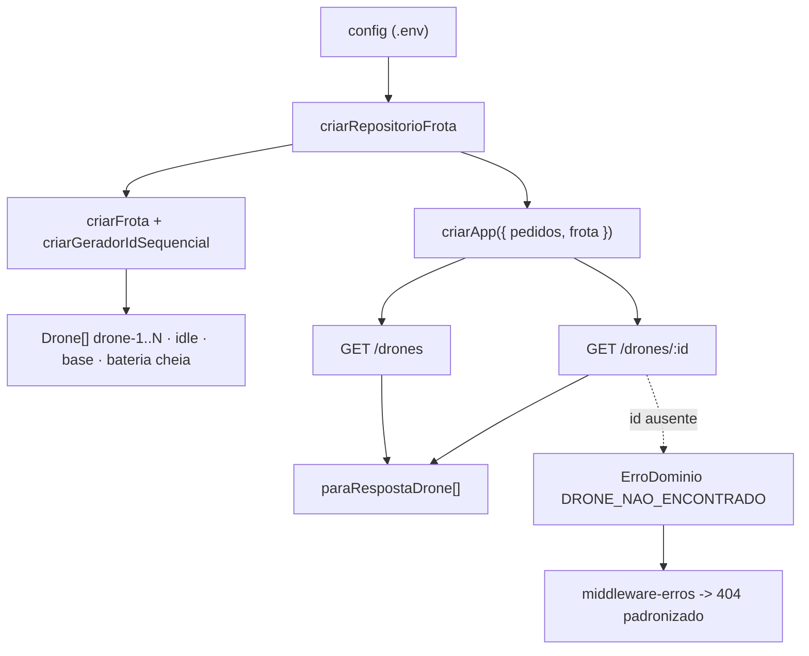

# Implementation Plan: Bloco 3 — Frota de Drones (E2)

**Context:** O domínio da frota (`criarDrone`, `criarFrota`) existe desde o Bloco 1, mas nada
o instancia — `src/index.ts` sobe a API sem frota e não há endpoint para consultá-la. Este
bloco fecha o épico **E2** ligando a config à frota e expondo seu status via REST.
**Tech Stack:** Node.js 24 (ESM, NodeNext) · TypeScript · Express 4 · Zod · Vitest 4 + supertest

---

## 0. Context to Load

> Leia TODOS os itens abaixo ANTES de executar. Leia a versão ATUAL em disco — não confie em
> memória nem em suposição.

**Context docs (convenções e regras):**

- [ ] `CLAUDE.md` — diretrizes de arquitetura, comandos, idioma, regra do `.js` em imports ESM
- [ ] `context/metaspec.md` — seções ARCHITECTURE e CRITICAL BUSINESS RULES
- [ ] `docs/BACKLOG.md` → épico **E2** (E2-1, E2-2) — critérios de aceite desta entrega
- [ ] `docs/DECISIONS.md` → **D8** (frota homogênea via config), **D15** (bateria = alcance),
      **D20** (erros padronizados), **D21** (meta de cobertura), **D22** (enums minúsculos)

**Reference code (padrões a imitar):**

- [ ] `src/repositorio/pedidos.ts` — padrão de repositório: factory, busca com `ErroDominio`, imutabilidade
- [ ] `src/repositorio/pedidos.test.ts` — padrão de teste de repositório
- [ ] `src/api/rotas/pedidos.ts` — padrão de rota: casca fina, `next(erro)`, nada de status HTTP
- [ ] `src/api/rotas/pedidos.test.ts` — padrão de teste de endpoint com supertest e helpers de tipagem
- [ ] `src/domain/drone.test.ts` — padrão de teste de domínio (E2-2 já tem casos escritos)

**Files to modify (leia o estado atual antes de alterar):**

- [ ] `src/domain/drone.ts` — tarefa 1.2
- [ ] `src/domain/drone.test.ts` — tarefa 1.1
- [ ] `src/domain/erros.ts` — tarefa 2.2
- [ ] `src/api/erros.ts` — tarefa 2.3
- [ ] `src/api/server.ts` — tarefa 3.4
- [ ] `src/api/rotas/pedidos.test.ts` — tarefa 3.5
- [ ] `src/index.ts` — tarefa 4.1
- [ ] `.env.example` — tarefa 4.2
- [ ] `README.md` — tarefa 5.1
- [ ] `docs/BACKLOG.md` — tarefa 5.2
- [ ] `docs/DECISIONS.md` — tarefa 5.3

---

## 1. Goals & Scope

### 1.1. Goals

* Instanciar a frota homogênea a partir da config no boot, com ids estáveis entre reinícios (**E2-1**).
* Expor `GET /drones` e `GET /drones/:id` com o status completo de cada drone (**E2-2**).
* Manter o padrão do Bloco 2: domínio puro, repositório injetado, rota como casca fina.
* Implementar em **TDD** — teste falhando antes do código, em todas as fases.

### 1.2. Scope

* **Inputs:** `config.droneQuantidade`, `config.droneCapacidadeKg`, `config.droneAlcanceQuadras`,
  `config.base` (todos já existentes, vindos do `.env`); `id` do drone na rota individual.
* **Outputs:** `GET /drones` → `200` com array de status; `GET /drones/:id` → `200` com o status
  do drone ou `404` padronizado; frota disponível em memória para os blocos 4 e 5.
* **In-Scope:** gerador de id sequencial no domínio; repositório de frota; apresentador da API;
  rotas de consulta; composição no `index.ts`; README, BACKLOG e um novo ADR.
* **Out-of-Scope:** Não criar endpoint de cadastro/edição/remoção de drone — D8 fixa a frota
  via `.env` + reinício.
* **Out-of-Scope:** Não implementar transições de estado, consumo de bateria, movimentação ou
  alocação — isso é E3/E4 (blocos 4 e 5).
* **Out-of-Scope:** Não criar persistência para a frota — ela é derivada da config a cada boot.
* **Constraint:** A frota deve permanecer **homogênea** — todos os drones com a mesma
  `capacidadeKg` e o mesmo `alcanceQuadras` (D8).
* **Constraint:** Todo drone recém-criado deve continuar `idle`, na base, com `cargaKg === 0` e
  `bateriaQuadras === alcanceQuadras` (D15). O teste que já cobre isso não pode ser afrouxado.
* **Constraint:** Nenhuma rota escolhe status HTTP — o mapa em `src/api/erros.ts` continua sendo
  o único lugar que traduz código de domínio para HTTP (D20).
* **Constraint:** O domínio (`src/domain/`) não pode importar nada de `api/`, `infra/`,
  `repositorio/` ou `config.ts`.
* **Constraint:** A suíte de pedidos existente deve continuar verde após a mudança de assinatura
  de `criarApp`.

---

## 2. Technical Design

### Decisões desta implementação

| Decisão | Escolha | Motivo |
| --- | --- | --- |
| Nome das rotas | `GET /drones` + `GET /drones/:id` | REST canônico e coerente com `/pedidos`. Substitui o `GET /drones/status` planejado — `status` não é recurso e colidiria com `:id` |
| Id do drone | `drone-1`…`drone-N`, determinístico | Ids estáveis entre reinícios sem persistir nada; o Bloco 4 vai gravar `droneId` dentro de pedidos/viagens **persistidos**, e `randomUUID` deixaria essas referências órfãs a cada boot |
| Origem da frota | Derivada da config no boot | D8: frota fixa, muda-se via `.env` + reinício. Persistir criaria divergência entre arquivo salvo e `.env` alterado |
| Acesso pelas rotas | Repositório injetado | Simetria com pedidos; concentra o 404 fora do handler e é o ponto onde o E4 vai mutar estado |
| Payload | Drone + `bateriaPercentual` derivado | O backlog pede "bateria"; a porcentagem é legível e já serve o dashboard (E6). O campo derivado nasce na borda da API, não no domínio |
| Assinatura de `criarApp` | Objeto `Dependencias` | `criarApp({ pedidos, frota })` em vez de posicional — o Bloco 4 acrescenta `viagens` sem virar o quarto parâmetro |

### Data Flow

1. **Boot:** `index.ts` lê `config` e chama `criarRepositorioFrota({ base, capacidadeKg, alcanceQuadras, quantidade })`.
2. **Construção:** o repositório chama `criarFrota(quantidade, { ..., gerarId: criarGeradorIdSequencial('drone') })`,
   produzindo N drones `idle` na base com ids `drone-1`…`drone-N`.
3. **Composição:** `criarApp({ pedidos, frota })` monta `/pedidos` e `/drones` sobre os repositórios.
4. **Consulta (lista):** `GET /drones` → `frota.listar()` → apresentador → `200` com o array.
5. **Consulta (individual):** `GET /drones/:id` → `frota.buscarPorId(id)`; ausente lança
   `ErroDominio('DRONE_NAO_ENCONTRADO')` → `next(erro)` → middleware → `404` padronizado.

### Data Structures (Draft)

```text
// src/domain/drone.ts  [MODIFY]
criarGeradorIdSequencial(prefixo = 'drone') -> () => string
  // fecha sobre um contador; chamadas sucessivas devolvem "drone-1", "drone-2", ...

// src/repositorio/frota.ts  [ADD]
tipo OpcoesFrota = { base, capacidadeKg, alcanceQuadras, quantidade }
tipo RepositorioFrota = {
  listar(): Drone[]              // cópia da lista — o chamador não muta o estado interno
  buscarPorId(id): Drone         // lança ErroDominio('DRONE_NAO_ENCONTRADO') se ausente
}
criarRepositorioFrota(opcoes) -> RepositorioFrota
  // constrói a frota uma vez, na criação; sem persistência

// src/api/apresentadores/drone.ts  [ADD]
tipo RespostaDrone = {
  id, estado, posicao: { x, y },
  cargaKg, capacidadeKg,
  bateriaQuadras, alcanceQuadras,
  bateriaPercentual              // derivado: bateriaQuadras / alcanceQuadras * 100
}
paraRespostaDrone(drone) -> RespostaDrone

// src/api/server.ts  [MODIFY]
tipo Dependencias = { pedidos: RepositorioPedidos, frota: RepositorioFrota }
criarApp(dependencias) -> Express
```

### Impacto nos arquivos

```text
case_dti/
├── .env.example                              [MODIFY]  comentário de DRONE_QUANTIDADE
├── README.md                                 [MODIFY]  endpoints de drone + exemplos
├── docs/
│   ├── BACKLOG.md                            [MODIFY]  E2-1 e E2-2 -> ✅
│   └── DECISIONS.md                          [MODIFY]  novo ADR D24
└── src/
    ├── index.ts                              [MODIFY]  compõe o repositório de frota
    ├── domain/
    │   ├── drone.ts                          [MODIFY]  criarGeradorIdSequencial
    │   ├── drone.test.ts                     [MODIFY]  casos do gerador
    │   └── erros.ts                          [MODIFY]  DRONE_NAO_ENCONTRADO
    ├── repositorio/
    │   ├── frota.ts                          [ADD]     listar / buscarPorId
    │   └── frota.test.ts                     [ADD]
    └── api/
        ├── erros.ts                          [MODIFY]  DRONE_NAO_ENCONTRADO -> 404
        ├── server.ts                         [MODIFY]  criarApp({ pedidos, frota })
        ├── apresentadores/
        │   └── drone.ts                      [ADD]     RespostaDrone + bateriaPercentual
        └── rotas/
            ├── drones.ts                     [ADD]     as 2 rotas
            ├── drones.test.ts                [ADD]
            └── pedidos.test.ts               [MODIFY]  adapta à nova assinatura
```



---

## 3. Phased Execution

> **TDD obrigatório.** Em cada fase, a tarefa de teste vem primeiro e deve **falhar pelo motivo
> certo** antes da tarefa de implementação. Não escreva implementação antes de ver o vermelho.

### Phase 1: Gerador de ids determinístico (Core Domain)

- [ ] **1.1: Testes do gerador sequencial** [MODIFY: ./src/domain/drone.test.ts]
    - Novo `describe('criarGeradorIdSequencial')`: chamadas sucessivas devolvem `drone-1`,
      `drone-2`, `drone-3`; prefixo customizado (`criarGeradorIdSequencial('d')` → `d-1`);
      dois geradores independentes têm contadores próprios.
    - Em `describe('criarFrota')`: uma frota criada com o gerador tem exatamente
      `['drone-1', 'drone-2', 'drone-3']`, e uma segunda frota criada com um gerador novo
      produz os mesmos ids (estabilidade entre "reinícios").
    - *Verification:* `npm test -- drone` falha com o gerador inexistente (erro de import/tipo).
- [ ] **1.2: Implementar `criarGeradorIdSequencial`** [MODIFY: ./src/domain/drone.ts]
    - Função exportada que fecha sobre um contador e devolve `` () => `${prefixo}-${++n}` ``.
      Prefixo padrão `'drone'`. Sem import novo; nada de `config` no domínio.
    - *Verification:* `npm test -- drone` verde; `npm run typecheck` limpo.

### Phase 2: Repositório de frota (Infrastructure)

- [ ] **2.1: Testes do repositório de frota** [ADD: ./src/repositorio/frota.test.ts]
    - `listar()` devolve `quantidade` drones, todos `idle`, na base, `cargaKg === 0`,
      `bateriaQuadras === alcanceQuadras`, com a mesma capacidade/alcance (frota homogênea).
    - Os ids são `drone-1`…`drone-N`, na ordem.
    - `listar()` devolve uma cópia — mutar o array retornado não afeta a chamada seguinte.
    - `buscarPorId('drone-2')` devolve o drone correspondente.
    - `buscarPorId('inexistente')` lança `ErroDominio` com código `DRONE_NAO_ENCONTRADO`.
    - `criarRepositorioFrota` com `quantidade: 0` propaga `QUANTIDADE_DRONES_INVALIDA`
      (vem de `criarFrota`, não é revalidado aqui).
    - *Verification:* `npm test -- frota` falha — módulo e código de erro inexistentes.
- [ ] **2.2: Novo código de erro de domínio** [MODIFY: ./src/domain/erros.ts]
    - Acrescentar `'DRONE_NAO_ENCONTRADO'` à união `CodigoErroDominio`.
    - *Verification:* `npm run typecheck` passa a acusar erro em `src/api/erros.ts` — o `Record`
      exaustivo ficou incompleto. É o comportamento esperado, fechado em 2.3.
- [ ] **2.3: Mapear o novo código para HTTP** [MODIFY: ./src/api/erros.ts]
    - `DRONE_NAO_ENCONTRADO: 404` no `MAPA_STATUS_HTTP`, junto de `PEDIDO_NAO_ENCONTRADO`.
    - *Verification:* `npm run typecheck` limpo novamente.
- [ ] **2.4: Implementar o repositório** [ADD: ./src/repositorio/frota.ts]
    - `criarRepositorioFrota(opcoes)` monta a frota uma vez com `criarFrota` + gerador sequencial
      e devolve `listar`/`buscarPorId`. Sem persistência, sem regra de negócio própria.
    - Comentário de cabeçalho explicando por que a frota é derivada da config (D8) e não persistida.
    - *Verification:* `npm test -- frota` verde.

### Phase 3: API — apresentador e rotas (API Layer)

- [ ] **3.1: Testes dos endpoints de drone** [ADD: ./src/api/rotas/drones.test.ts]
    - `GET /drones` → `200` com N itens; cada item traz `id`, `estado`, `posicao {x,y}`,
      `cargaKg`, `capacidadeKg`, `bateriaQuadras`, `alcanceQuadras`, `bateriaPercentual`.
    - Drone recém-criado aparece `idle`, na base, `cargaKg: 0`, `bateriaPercentual: 100`.
    - `GET /drones/:id` com id existente → `200` com o mesmo formato.
    - `GET /drones/inexistente` → `404` com envelope `{ erro: { codigo: 'DRONE_NAO_ENCONTRADO' } }`.
    - Seguir os helpers de tipagem de `pedidos.test.ts` (`comoErro`, etc.) para evitar `any`.
    - *Verification:* `npm test -- drones` falha — rotas e apresentador inexistentes.
- [ ] **3.2: Apresentador da resposta** [ADD: ./src/api/apresentadores/drone.ts]
    - `paraRespostaDrone(drone)` devolve os campos do domínio mais `bateriaPercentual`
      (`bateriaQuadras / alcanceQuadras * 100`, arredondado). O domínio **não** ganha esse campo.
    - *Verification:* `npm run typecheck` limpo.
- [ ] **3.3: Rotas de drone** [ADD: ./src/api/rotas/drones.ts]
    - `criarRotasDrones(repositorio)` com `GET /` e `GET /:id`; ambos em `try/catch` repassando
      via `next(erro)`. Nenhum status de erro escolhido no handler. Sem schema Zod: não há corpo
      nem query a validar nesta fase.
    - *Verification:* `npm test -- drones` verde.
- [ ] **3.4: Montar as rotas no app** [MODIFY: ./src/api/server.ts]
    - `criarApp(dependencias: Dependencias)` com `{ pedidos, frota }`; registrar
      `app.use('/drones', criarRotasDrones(dependencias.frota))` antes do 404 e do handler de erro.
    - Atualizar o `TODO` remanescente para citar apenas `GET /entregas/rota`.
    - *Verification:* `npm run typecheck` acusa as chamadas antigas de `criarApp` — fechado em 3.5/4.1.
- [ ] **3.5: Adaptar a suíte de pedidos à nova assinatura** [MODIFY: ./src/api/rotas/pedidos.test.ts]
    - Trocar `criarApp(repositorio)` por `criarApp({ pedidos: repositorio, frota })`, com uma
      frota mínima criada por `criarRepositorioFrota`. Nenhuma asserção de pedido muda.
    - *Verification:* `npm test` inteiro verde.

### Phase 4: Composição e config (Integration)

- [ ] **4.1: Compor a frota no entry point** [MODIFY: ./src/index.ts]
    - Criar o repositório de frota a partir de `config` (base, capacidade, alcance, quantidade) e
      passar ambos os repositórios a `criarApp`. Continua sendo o único arquivo que escolhe
      implementações concretas.
    - *Verification:* `npm run dev` sobe; `curl localhost:3000/drones` devolve 3 drones `idle`.
- [ ] **4.2: Documentar a variável de frota** [MODIFY: ./.env.example]
    - Ajustar o comentário de `DRONE_QUANTIDADE` deixando explícito que os ids são
      `drone-1`…`drone-N` e que mudar a quantidade exige reinício.
    - *Verification:* leitura; `.env.example` continua sem valores sensíveis.

### Phase 5: Documentação (Cleanup)

- [ ] **5.1: Endpoints no README** [MODIFY: ./README.md]
    - Mover as rotas de drone de "Planejados" para uma seção de implementados (E2 — Frota), com
      `GET /drones` e `GET /drones/:id`; remover a linha `GET /drones/status`, registrando em nota
      que ela foi substituída. Acrescentar exemplos `curl` de listagem e de 404 (E7-2).
    - *Verification:* tabela coerente com as rotas reais; `npm run format:check` verde.
- [ ] **5.2: Marcar as histórias concluídas** [MODIFY: ./docs/BACKLOG.md]
    - `E2-1` e `E2-2` de 🔲 para ✅.
    - *Verification:* nenhuma outra história alterada.
- [ ] **5.3: Registrar o ADR da frota** [MODIFY: ./docs/DECISIONS.md]
    - **D24 — Frota derivada da config, com ids determinísticos**: contexto (ids `randomUUID`
      mudam a cada boot e o Bloco 4 persiste `droneId`), escolha (`drone-N` sequencial, sem
      persistir a frota), porquê e alternativas descartadas (persistir a frota; manter UUID).
    - *Verification:* formato idêntico ao dos ADRs D1–D23.

```mermaid
gantt
    title Bloco 3 — Frota de Drones (E2)
    dateFormat X
    axisFormat %s
    section Fase 1 — Domínio
    1.1 testes do gerador       :a1, 0, 1
    1.2 criarGeradorIdSequencial:a2, after a1, 1
    section Fase 2 — Repositório
    2.1 testes da frota         :b1, after a2, 1
    2.2 codigo de erro          :b2, after b1, 1
    2.3 mapa HTTP               :b3, after b2, 1
    2.4 criarRepositorioFrota   :b4, after b3, 1
    section Fase 3 — API
    3.1 testes de endpoint      :c1, after b4, 1
    3.2 apresentador            :c2, after c1, 1
    3.3 rotas de drone          :c3, after c2, 1
    3.4 server.ts               :c4, after c3, 1
    3.5 adaptar pedidos.test    :c5, after c4, 1
    section Fase 4 — Composição
    4.1 index.ts                :d1, after c5, 1
    4.2 .env.example            :d2, after d1, 1
    section Fase 5 — Docs
    5.1 README                  :e1, after d2, 1
    5.2 BACKLOG                 :e2, after e1, 1
    5.3 DECISIONS (D24)         :e3, after e2, 1
```



---

## 4. Test Strategy

- [ ] **Unit (domínio):** `src/domain/drone.test.ts` — gerador sequencial (sequência, prefixo,
      independência entre geradores) e estabilidade dos ids da frota entre construções.
- [ ] **Unit (repositório):** `src/repositorio/frota.test.ts` — homogeneidade, invariante do drone
      recém-criado (idle/base/carga 0/bateria cheia), imutabilidade do retorno de `listar()`,
      `DRONE_NAO_ENCONTRADO` e propagação de `QUANTIDADE_DRONES_INVALIDA`.
- [ ] **Integration (HTTP):** `src/api/rotas/drones.test.ts` via supertest — caminho feliz das duas
      rotas, forma completa do payload (incluindo `bateriaPercentual: 100`) e o ramo de 404 com o
      envelope padronizado. Sem abrir porta de rede.
- [ ] **Regressão:** `src/api/rotas/pedidos.test.ts` roda verde após a troca de assinatura de
      `criarApp` — nenhuma asserção de pedido é alterada para acomodar a mudança.
- [ ] **Cobertura:** `npm run coverage` — `src/domain/drone.ts` e `src/repositorio/frota.ts` em
      100%; total do projeto não pode cair abaixo do patamar atual (~91%), meta D21 de ~80%.

---

## 5. Rollback & Risks

- **Risk:** A mudança de assinatura de `criarApp` é a única alteração não aditiva do bloco e
  quebra todos os chamadores (`index.ts` e a suíte de pedidos).
    - *Mitigation:* o `typecheck` acusa 100% dos chamadores — são apenas dois arquivos, ambos já
      listados em tarefas (3.5 e 4.1). A tarefa 3.4 declara explicitamente que o vermelho é esperado.
- **Risk:** `bateriaPercentual` vazar para o domínio, duplicando o conceito de bateria que o E4-3
  vai implementar de verdade.
    - *Mitigation:* o campo nasce e morre em `src/api/apresentadores/drone.ts`; o tipo `Drone`
      não muda. O teste de domínio continua asserindo `bateriaQuadras`, não a porcentagem.
- **Risk:** Ids determinísticos criam falsa sensação de identidade estável — mudar
  `DRONE_QUANTIDADE` para menos deixa `droneId` persistido pelo Bloco 4 apontando para o vazio.
    - *Mitigation:* registrar a limitação no ADR D24 e no comentário de `.env.example` (4.2). O
      Bloco 4 trata reconciliação; aqui não há dado persistido que referencie drone.
- **Risk:** Divergência entre a documentação e as rotas reais, já que o README e o enunciado do
  case citam `GET /drones/status`.
    - *Mitigation:* tarefa 5.1 troca a linha e deixa uma nota explícita de substituição, para o
      avaliador não achar que a rota do enunciado foi esquecida.
- **Rollback:** Todo o trabalho vive na branch `feat/bloco-3`. Descartar é
  `git checkout main && git branch -D feat/bloco-3` — nenhum arquivo de dado é criado ou migrado,
  e a frota não tem estado persistido para reverter.
