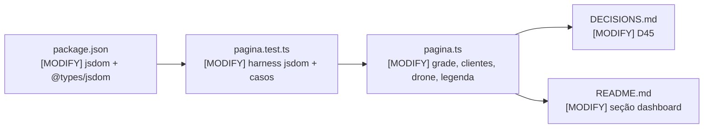
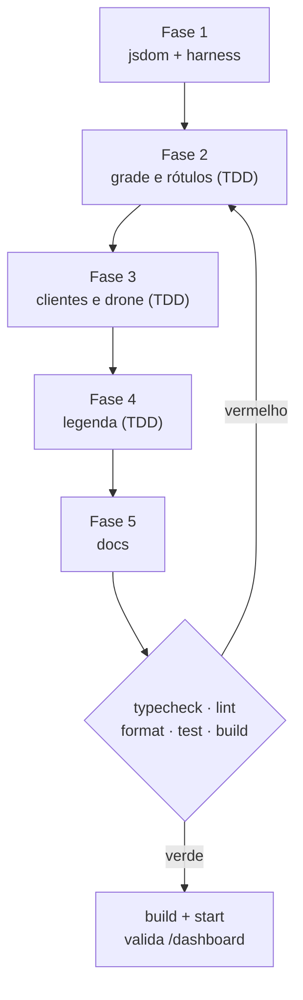

# Implementation Plan: Correção do SVG do dashboard + cobertura real do JS embutido

**Context:** A validação visual do dashboard (27/07/2026, servidor real com zonas ativas) revelou
que o mapa SVG não desenha os clientes — a classe `.cliente` está aplicada à posição dos **drones**,
e `carregarTudo()` nunca busca `/pedidos` — e que a "malha" é apenas a moldura externa, sem grade.
Ambos os defeitos contradizem o que metaspec, walkthrough e o docblock de `pagina.ts` afirmam, e
ambos passaram pela fresta da dívida já registrada: o JS embutido no template string nunca é
executado por teste.

**Tech Stack:** TypeScript (ESM, NodeNext) · Vitest 4 · jsdom (nova devDependency) · SVG inline ·
sem bundler, sem framework de front

---

## 0. Context to Load

> Leia TODOS os itens abaixo ANTES de começar a execução. São os arquivos que carregam as
> convenções, regras de domínio e padrões necessários para implementar este plano sem alucinar.
> Leia a versão ATUAL em disco — não confie em memória nem em suposição.

**Context docs (convenções e regras):**
- [ ] `CLAUDE.md` — diretrizes de arquitetura e comandos
- [ ] `context/metaspec.md` → seções `ARCHITECTURE` e `CRITICAL BUSINESS RULES` (unidade quadra, enums minúsculos)
- [ ] `context/index.md` → seções `Critical Files > Dashboard` e `Tests`
- [ ] `docs/DECISIONS.md` → **D41** (por que o HTML é módulo TS e não asset) e **D40** (`?caminho=true` é opt-in)

**Reference code (padrões a imitar):**
- [ ] `src/dashboard/pagina.test.ts` — teste atual (asserts de string); será ampliado, não substituído
- [ ] `src/api/rotas/dashboard.test.ts` — padrão de teste de rota com supertest
- [ ] `src/api/apresentadores/mapa.ts` — forma exata de `RespostaMapa` consumida pelo JS

**Files to modify (leia o estado atual antes de alterar):**
- [ ] `src/dashboard/pagina.ts` — alterado nas tarefas 2.2, 3.2, 4.1
- [ ] `src/dashboard/pagina.test.ts` — alterado nas tarefas 1.2, 2.1, 3.1, 4.1
- [ ] `package.json` — alterado na tarefa 1.1
- [ ] `docs/DECISIONS.md` — alterado na tarefa 5.1
- [ ] `README.md` — alterado na tarefa 5.2

---

## 1. Goals & Scope

### 1.1. Goals

* **Goals:**
  1. Desenhar no mapa os destinos dos pedidos **não entregues** (`pendente`, `alocado`, `em_voo`),
     que hoje não aparecem em lugar nenhum.
  2. Dar aos drones um símbolo próprio, encerrando o uso indevido da classe `.cliente`.
  3. Desenhar a grade da malha com rótulos de eixo `0..N`, para que uma coordenada seja legível
     direto do mapa.
  4. Fechar a dívida "o JS embutido nunca é executado por teste": as três mudanças acima entram
     por TDD, com o script real rodando em jsdom.
  5. Acrescentar legenda HTML estática nomeando base, zona, cliente e drone.

### 1.2. Scope

* **Inputs:** respostas de `GET /mapa`, `GET /simulacao`, `GET /drones`,
  `GET /entregas/rota?caminho=true` e — novo — `GET /pedidos`.
* **Outputs:** o mesmo HTML autossuficiente de sempre, agora com grade rotulada, marcadores de
  cliente, marcador de drone distinto e legenda; mais uma suíte que executa o JS de verdade.
* **In-Scope:** alterar `src/dashboard/pagina.ts` (HTML, CSS e o JS do template), ampliar
  `src/dashboard/pagina.test.ts`, adicionar `jsdom` e `@types/jsdom` como devDependencies.
* **Out-of-Scope:** Não alterar nenhuma rota, apresentador, schema ou módulo de domínio — os
  defeitos são exclusivamente de desenho, e a API já devolve tudo o que o mapa precisa.
* **Out-of-Scope:** Não editar `context/metaspec.md`, `context/index.md` nem `context/timeline.md`
  à mão; a sincronização do contexto é feita depois, por `/context-update`.
* **Out-of-Scope:** Não introduzir polling, auto-refresh, framework de front nem bundler.
* **Constraint:** A página deve continuar **autossuficiente** — zero referência a host externo,
  zero asset em disco (D41). O teste que já garante isso não pode ser afrouxado.
* **Constraint:** Todo texto vindo da API continua entrando por `textContent`, nunca `innerHTML`.
* **Constraint:** `paginaDashboard()` permanece **determinística** — duas chamadas devolvem a mesma
  string, byte a byte.
* **Constraint:** A unidade exibida é a **quadra**; nenhum rótulo pode dizer "km".
* **Constraint:** `npm run build && npm start` deve continuar servindo `/dashboard` idêntico ao
  `npm run dev` — a prova viva de D41.

---

## 2. Technical Design

### Data Flow

1. **Carga:** `carregarTudo()` passa de 4 para **5** requisições paralelas no mesmo `Promise.all`,
   somando `GET /pedidos`. Continua uma única rodada — nenhuma requisição em série.
2. **Filtragem:** os pedidos são filtrados no cliente por status ∈ {`pendente`, `alocado`, `em_voo`}.
   Um único `GET /pedidos` sem query é preferido a três requisições filtradas por status.
3. **Desenho (ordem de pintura, do fundo para a frente):** fundo → **grade + rótulos** → zonas →
   rotas → base → **clientes** → drones. A ordem importa: marcador desenhado antes é coberto pelo
   desenhado depois.
4. **Símbolos:** cliente vira `circle.cliente`; drone vira marcador próprio `.drone`, visualmente
   distinto (forma e cor), nunca mais reusando `.cliente`.
5. **Teste:** o HTML produzido é montado num `JSDOM` com `runScripts: 'dangerously'` e `fetch`
   stubado antes do parse; o script real executa, e os asserts leem o SVG resultante.

### Data Structures (Draft)

```text
// resposta já existente de GET /pedidos (array)
{ id, destino: { x, y }, pesoKg, prioridade, status }

STATUS_VISIVEIS = ["pendente", "alocado", "em_voo"]   // exclui entregue e cancelado

// pseudocódigo do desenho novo — dentro do template string
function desenharGrade(svg, tamanho, px, py):
    para i de 0 até tamanho:
        svg.append(line vertical em px(i))
        svg.append(line horizontal em py(i))
        svg.append(text rótulo i no eixo x, abaixo da malha)
        svg.append(text rótulo i no eixo y, à esquerda da malha)

function desenharClientes(svg, pedidos, px, py):
    para cada pedido com status em STATUS_VISIVEIS:
        svg.append(circle.cliente em px(destino.x), py(destino.y))

function desenharDrones(svg, drones, px, py):
    para cada drone com posicao:
        svg.append(marcador .drone em px(posicao.x), py(posicao.y))
```

```text
// pseudocódigo do harness de teste (jsdom)
função montarPagina(dadosPorRota):
    html = paginaDashboard()
    dom  = new JSDOM(html, {
             runScripts: "dangerously",
             beforeParse: (window) => { window.fetch = stubQueResolve(dadosPorRota) }
           })
    await proximoTick()          // deixa o Promise.all do script resolver
    devolve dom.window.document
```

### Impacto nos arquivos



```text
case_dti/
├── package.json                       [MODIFY]  + jsdom, @types/jsdom (devDeps)
├── README.md                          [MODIFY]  o que o mapa mostra + legenda
├── docs/DECISIONS.md                  [MODIFY]  D45 — jsdom sobre o script real
└── src/dashboard/
    ├── pagina.ts                      [MODIFY]  grade+rótulos, clientes, .drone, legenda, CSS
    └── pagina.test.ts                 [MODIFY]  harness jsdom + casos de comportamento
```

### Fluxo de execução

```mermaid
gantt
    title Cronograma das fases
    dateFormat X
    axisFormat %s
    section Infra
    jsdom + harness de teste        :f1, 0, 2
    section Correções (TDD)
    Grade e rótulos de eixo         :f2, after f1, 2
    Clientes e símbolo do drone     :f3, after f2, 3
    Legenda                         :f4, after f3, 1
    section Fecho
    DECISIONS + README              :f5, after f4, 1
```





---

## 3. Phased Execution

### Fase 1: Infra de teste (Testing)

- [ ] **1.1: Adicionar jsdom como devDependency** [MODIFY: ./package.json]
    - `npm install -D jsdom @types/jsdom`. Nada entra em `dependencies` — a página servida não
      ganha dependência alguma.
    - *Verification:* `npm run typecheck` verde e `jsdom` presente apenas em `devDependencies`.
- [ ] **1.2: Harness que executa o script real** [MODIFY: ./src/dashboard/pagina.test.ts]
    - Helper local no próprio arquivo de teste: monta `paginaDashboard()` num `JSDOM` com
      `runScripts: 'dangerously'`, injeta um `fetch` stub por URL em `beforeParse` e aguarda o
      tick que resolve o `Promise.all`. Um primeiro caso assere que as métricas foram preenchidas
      a partir do stub (prova de que o script executou de fato).
    - Não usar `environment: 'jsdom'` do Vitest: o `JSDOM` é construído explicitamente, então
      `vitest.config.ts` **não** é tocado.
    - *Verification:* o caso novo passa e falha se o `<script>` for removido da página — confirme
      essa falha manualmente antes de seguir.

### Fase 2: Grade da malha (UI)

- [ ] **2.1: Teste vermelho da grade e dos rótulos** [MODIFY: ./src/dashboard/pagina.test.ts]
    - Para `cidadeTamanho: 10`, esperar `2 * (10 + 1)` elementos `line` de grade e rótulos de texto
      cobrindo `0` e `10` nos dois eixos.
    - *Verification:* o teste falha por contagem zero de `line` — o motivo certo.
- [ ] **2.2: Desenhar grade e rótulos** [MODIFY: ./src/dashboard/pagina.ts]
    - `desenharGrade()` chamada logo após o retângulo de fundo e **antes** das zonas. Classes CSS
      novas (`.grade`, `.rotulo-eixo`) com traço fino e cor discreta, para não competir com as rotas.
    - *Verification:* o teste de 2.1 passa; `npm test` inteiro verde.

### Fase 3: Clientes e drones (UI)

- [ ] **3.1: Teste vermelho dos clientes e do símbolo do drone** [MODIFY: ./src/dashboard/pagina.test.ts]
    - Stub de `GET /pedidos` com um pedido de cada status. Esperar: um `.cliente` por pedido
      `pendente`/`alocado`/`em_voo`; **nenhum** para `entregue` ou `cancelado`; posição correta
      (lembrando que o eixo y é invertido por `py`); e que a contagem de `.drone` seja igual à de
      drones com posição, com `.cliente` e `.drone` sendo seletores disjuntos.
    - *Verification:* falha porque `.cliente` hoje conta drones e `/pedidos` não é buscado.
- [ ] **3.2: Buscar pedidos, desenhar clientes e separar o símbolo do drone** [MODIFY: ./src/dashboard/pagina.ts]
    - Somar `GET /pedidos` ao `Promise.all` de `carregarTudo()`; `desenharClientes()` filtrando por
      `STATUS_VISIVEIS`; trocar a classe do marcador de drone de `.cliente` para `.drone` e dar a ele
      forma/cor próprias no CSS. Atualizar o docblock do arquivo, que hoje lista as 4 rotas.
    - *Verification:* o teste de 3.1 passa; nenhum seletor `.cliente` restante aponta para drone.

### Fase 4: Legenda (UI)

- [ ] **4.1: Legenda HTML estática** [MODIFY: ./src/dashboard/pagina.ts] [MODIFY: ./src/dashboard/pagina.test.ts]
    - Bloco HTML abaixo do `#mapa-container` nomeando base, zona de exclusão, cliente e drone, com
      amostras de cor via CSS. Conteúdo fixo, sem dado de API. Teste de string basta aqui — não há
      comportamento a exercitar.
    - *Verification:* o assert de legenda passa e o teste de determinismo continua verde.

### Fase 5: Documentação (Cleanup)

- [ ] **5.1: Registrar a decisão de teste** [MODIFY: ./docs/DECISIONS.md]
    - **D45** — testar o JS embutido executando o script real em jsdom, em vez de extraí-lo para um
      módulo separado: preserva D41 (nenhum asset novo, nenhum passo de build) e testa exatamente a
      string servida. Registrar também a limitação de métrica descrita em §5.
    - *Verification:* D45 segue o formato dos ADRs vizinhos (contexto, escolha, justificativa).
- [ ] **5.2: Atualizar o README** [MODIFY: ./README.md]
    - Na seção do dashboard: o que o mapa mostra agora (grade rotulada, clientes não entregues,
      drones, zonas) e a legenda.
    - *Verification:* `npm run format:check` verde (o Prettier ignora `*.md`, mas a tabela deve
      ficar alinhada à mão como as vizinhas).

---

## 4. Test Strategy

- [ ] **Unit (string):** manter os três casos atuais — doctype/contêineres, autossuficiência
      (`src="http`, `href="http`, `//cdn`) e determinismo. Somar o assert da legenda.
- [ ] **Comportamento (jsdom):** métricas preenchidas a partir do stub; contagem de linhas de grade
      e presença dos rótulos de extremidade; um `.cliente` por pedido não entregue e zero para
      entregue/cancelado; `.drone` com a cardinalidade da frota e disjunto de `.cliente`; coordenada
      do marcador respeitando a inversão do eixo y.
- [ ] **Integração (supertest):** `src/api/rotas/dashboard.test.ts` permanece como está — a rota não
      muda; serve de regressão de que a página continua sendo servida em `text/html`.
- [ ] **Manual (obrigatória no fecho):** `npm run build && npm start`, com
      `ZONAS_EXCLUSAO=2,2:4,5;7,0:8,3`, cadastrar pedidos, alocar, avançar o relógio e conferir o
      mapa — mesmo roteiro que expôs os dois defeitos. Vale como prova de D41 a partir de `dist/`.

---

## 5. Rollback & Risks

- **Risk:** jsdom não implementa layout de SVG; um teste escrito contra geometria renderizada
  (posição em pixels, `getBBox`) passaria a ser frágil ou simplesmente não funcionaria.
    - *Mitigation:* asserir apenas estrutura e atributos (`querySelectorAll`, `getAttribute('cx')`),
      nunca layout computado.
- **Risk:** `runScripts: 'dangerously'` executa qualquer script da string. Aqui o input é a própria
  página do projeto, mas o padrão é perigoso se copiado para conteúdo de terceiros.
    - *Mitigation:* usar o harness só sobre `paginaDashboard()` e deixar o motivo comentado no
      arquivo de teste, no mesmo espírito do comentário que explica `z.enum` vs `z.coerce.boolean`.
- **Risk:** a cobertura de `pagina.ts` **não vai subir** — o v8 continua medindo a string produzida,
  não o código avaliado dentro do jsdom. Ler o número como "agora o JS está coberto" seria repetir
  exatamente o engano que originou esta correção.
    - *Mitigation:* declarar isso explicitamente em D45 e no walkthrough: o comportamento passa a ser
      testado, a métrica continua não medindo esse trecho.
- **Risk:** `GET /pedidos` sem paginação já é dívida conhecida (E8-2); somá-lo ao carregamento do
  dashboard aumenta o payload por refresh numa base grande.
    - *Mitigation:* aceitar no escopo atual e registrar junto da dívida de paginação — o dashboard
      não faz polling, então o custo é por ação do usuário, não contínuo.
- **Risk:** grade de `(N+1) * 2` linhas mais rótulos infla o SVG numa malha grande.
    - *Mitigation:* traço fino e sem `id` por elemento; se a malha crescer muito, a grade é o
      primeiro candidato a virar `<pattern>`. Fora do escopo agora.
- **Rollback:** as mudanças ficam contidas em dois arquivos de código (`pagina.ts`, `pagina.test.ts`)
  mais `package.json` e dois docs. `git revert` do commit da branch desfaz tudo; nenhum contrato de
  rota, formato de arquivo em disco ou assinatura pública muda, então não há migração a desfazer.
