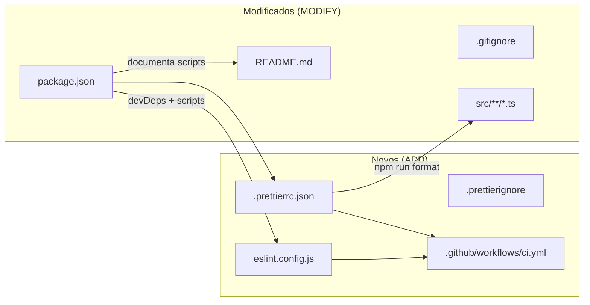
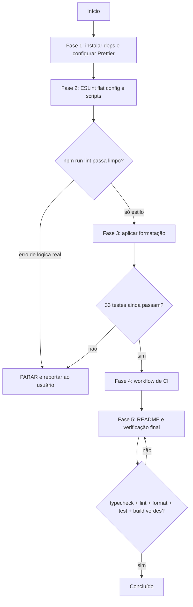

# Implementation Plan: Ferramental de Qualidade (Lint, Format e CI)

**Context:** O projeto tem testes, typecheck e build, mas nenhum linter, formatter ou
integração contínua. Isso deixa a consistência do código dependente de disciplina manual e
torna a qualidade invisível para quem apenas olha o repositório — um ponto fraco num case
avaliado. Este plano adiciona ESLint type-aware, Prettier e um workflow de CI.

**Tech Stack:** ESLint 9 (flat config) · typescript-eslint (`recommendedTypeChecked`) ·
Prettier 3 + `eslint-config-prettier` · GitHub Actions (Node 24) · sem husky/lint-staged.

---

## 0. Context to Load

> Leia TODOS os itens abaixo ANTES de iniciar a execução. Leia a versão ATUAL em disco —
> não confie em memória ou suposição.

**Docs de contexto (convenções e regras):**
- [ ] `CLAUDE.md` — comandos, idioma (pt-BR) e a regra do ESM `NodeNext`
- [ ] `context/metaspec.md` → **STACK** e **CURRENT STATE** — o que já existe hoje

**Código de referência (padrões a imitar):**
- [ ] `tsconfig.json` — `strict`, `noUncheckedIndexedAccess`, `include: ["src"]`, `rootDir: src`
- [ ] `tsconfig.build.json` — exclui `*.test.ts`
- [ ] `vitest.config.ts` — arquivo de config na raiz, FORA do `include` do tsconfig
- [ ] `src/domain/pedido.ts` — estilo praticado: aspas simples, 2 espaços, vírgula final
- [ ] `.gitignore` — seções comentadas em pt-BR, padrão a seguir ao acrescentar entradas

**Arquivos a modificar (leia o estado atual antes de alterar):**
- [ ] `package.json` — alterado nas tarefas 1.1 e 2.2
- [ ] `.gitignore` — alterado na tarefa 2.3
- [ ] `README.md` — alterado na tarefa 5.1
- [ ] todos os `.ts` de `src/` — reformatados na tarefa 3.1

---

## 1. Goals & Scope

### 1.1. Goals

* **Goals:** Estabelecer verificação automática de estilo e qualidade — formatação
  determinística via Prettier, regras type-aware via ESLint e um pipeline de CI que roda
  typecheck, lint, formato, testes e build a cada push e pull request.

### 1.2. Scope

* **Inputs:** o código TypeScript existente em `src/`, os arquivos de config da raiz e o
  `package.json` atual.
* **Outputs:** `eslint.config.js`, `.prettierrc.json`, `.prettierignore`,
  `.github/workflows/ci.yml`, novos scripts npm, código reformatado e README atualizado.

* **In-Scope:** Instalar e configurar ESLint 9 em flat config com `typescript-eslint` no
  preset `recommendedTypeChecked`, aplicado apenas a `src/**/*.ts`.
* **In-Scope:** Instalar e configurar Prettier com `printWidth: 100`, `singleQuote`,
  `semi`, `trailingComma: all`, `tabWidth: 2`.
* **In-Scope:** Adicionar `eslint-config-prettier` para desligar as regras de estilo do
  ESLint que conflitam com o Prettier.
* **In-Scope:** Criar os scripts `lint`, `lint:fix`, `format` e `format:check`.
* **In-Scope:** Criar o workflow de CI rodando em Node 24.
* **In-Scope:** Aplicar a formatação ao código existente **em um commit separado** do
  commit que introduz as configs.
* **In-Scope:** Documentar os comandos novos no README.

* **Out-of-Scope:** Não instalar husky, lint-staged nem qualquer hook de git.
* **Out-of-Scope:** Não formatar arquivos Markdown — `.md` fica no `.prettierignore`, para
  não desalinhar as tabelas escritas à mão em `docs/`, `context/` e `README.md`.
* **Out-of-Scope:** Não usar o preset `strictTypeChecked` nem adicionar regras avulsas além
  do preset escolhido.
* **Out-of-Scope:** Não alterar a lógica de nenhum módulo de `src/domain/` — apenas
  formatação. Se o lint apontar um problema real de lógica, pare e reporte.
* **Out-of-Scope:** Não publicar cobertura em serviço externo (Codecov e similares).
* **Out-of-Scope:** Não editar `context/metaspec.md`, `context/index.md` ou
  `context/timeline.md` — esses só mudam via `/context-update`.

* **Constraint:** `npm test`, `npm run typecheck` e `npm run build` devem continuar verdes
  em todas as fases.
* **Constraint:** A formatação não pode alterar comportamento — a suíte de 33 testes deve
  continuar passando com os mesmos resultados depois da tarefa 3.1.
* **Constraint:** O lint deve terminar com zero erros e zero warnings ao fim do plano.
* **Constraint:** O `eslint.config.js` da raiz não pode ser lintado com regras type-aware
  (está fora do `include` do `tsconfig.json`), sob pena de erro de parsing.
* **Constraint:** Comentários e documentação em pt-BR.

---

## 2. Technical Design

### O problema do type-aware fora do `src/`

`tsconfig.json` declara `include: ["src"]` e `rootDir: "src"`. Arquivos de config na raiz
(`vitest.config.ts`, `eslint.config.js`) **não pertencem ao projeto TypeScript**. Regras
type-aware exigem que o arquivo esteja em um projeto; aplicá-las na raiz produz o erro
`was not found by the project service`.

Solução adotada: segmentar a flat config em blocos com escopo explícito.

| Bloco | Escopo | Regras |
| --- | --- | --- |
| 1 | global `ignores` | `dist/`, `coverage/`, `node_modules/` |
| 2 | `src/**/*.ts` | `eslint.recommended` + `recommendedTypeChecked` + `projectService` |
| 3 | `**/*.config.ts`, `eslint.config.js` | `disableTypeChecked` — só regras sintáticas |
| 4 | último | `eslint-config-prettier` — desliga o que conflita com o formatter |

A ordem importa: em flat config o último bloco vence, então `eslint-config-prettier`
precisa vir por último.

### Separação dos commits

O requisito de diff legível se traduz em dois commits distintos:

1. `chore: adiciona eslint, prettier e CI` — configs, dependências, scripts, workflow, README.
   Não toca em nenhum arquivo de `src/`.
2. `style: aplica formatação do prettier` — exclusivamente o resultado de `npm run format`,
   sem nenhuma mudança manual junto.

Assim quem revisa consegue aprovar o segundo commit sem lê-lo linha a linha, sabendo que é
saída determinística de ferramenta.

### Data Flow (pipeline de verificação)

1. **Desenvolvimento:** `npm run format` normaliza o estilo; `npm run lint:fix` corrige o
   que for auto-corrigível.
2. **Pré-push (manual):** `npm run lint` e `npm run format:check` falham se algo escapou.
3. **CI:** a cada push ou PR, o workflow roda `npm ci` e então typecheck → lint →
   format:check → test → build, nessa ordem — do mais barato ao mais caro, falhando cedo.
4. **PR:** o resultado aparece como check no pull request.

### Estrutura dos arquivos (Draft)

> Pseudocódigo — comunica intenção, não é a implementação final.

```js
// eslint.config.js
export default tseslint.config(
  { ignores: ['dist/**', 'coverage/**', 'node_modules/**'] },
  {
    files: ['src/**/*.ts'],
    extends: [eslint.configs.recommended, ...tseslint.configs.recommendedTypeChecked],
    languageOptions: {
      parserOptions: { projectService: true, tsconfigRootDir: import.meta.dirname },
    },
  },
  {
    files: ['*.config.ts', 'eslint.config.js'],
    extends: [tseslint.configs.disableTypeChecked],
  },
  prettierConfig,   // eslint-config-prettier — SEMPRE por último
);
```

```json
// .prettierrc.json
{ "printWidth": 100, "singleQuote": true, "semi": true,
  "trailingComma": "all", "tabWidth": 2, "arrowParens": "always", "endOfLine": "lf" }
```

```yaml
# .github/workflows/ci.yml
name: CI
on:
  push: { branches: [main] }
  pull_request:
jobs:
  verificar:
    runs-on: ubuntu-latest
    steps:
      - uses: actions/checkout@v4
      - uses: actions/setup-node@v4
        with: { node-version: 24, cache: npm }
      - run: npm ci
      - run: npm run typecheck
      - run: npm run lint
      - run: npm run format:check
      - run: npm test
      - run: npm run build
```

### Impacto nos arquivos



```text
case_dti/
├── .github/
│   └── workflows/
│       └── ci.yml               [ADD]     typecheck -> lint -> format -> test -> build
├── eslint.config.js             [ADD]     flat config, type-aware só em src/
├── .prettierrc.json             [ADD]     printWidth 100, aspas simples
├── .prettierignore              [ADD]     ignora *.md, dist/, coverage/
├── .gitignore                   [MODIFY]  + caches de lint/format
├── package.json                 [MODIFY]  + 4 devDeps, + 4 scripts
├── README.md                    [MODIFY]  documenta os comandos novos
└── src/**/*.ts                  [MODIFY]  reformatados (commit separado)
```

### Visão de execução



### Cronograma das fases


---

## 3. Phased Execution

### Phase 1: Dependências e Prettier (Infrastructure)

- [ ] **1.1: Instalar as devDependencies** [MODIFY: ./package.json]
    - `npm install -D eslint typescript-eslint prettier eslint-config-prettier`
    - Não fixar versões à mão; deixar o npm resolver e registrar no `package-lock.json`.
    - *Verification:* as 4 entram em `devDependencies`; `npm test` continua verde.

- [ ] **1.2: Configurar o Prettier** [ADD: ./.prettierrc.json]
    - Opções conforme a Seção 2: `printWidth: 100`, `singleQuote`, `semi`,
      `trailingComma: "all"`, `tabWidth: 2`, `arrowParens: "always"`, `endOfLine: "lf"`.
    - *Verification:* `npx prettier --check src/config.ts` executa sem erro de config.

- [ ] **1.3: Definir o que o Prettier ignora** [ADD: ./.prettierignore]
    - Ignorar `*.md` (preserva as tabelas alinhadas à mão), `dist/`, `coverage/`,
      `node_modules/` e `package-lock.json`.
    - *Verification:* `npx prettier --check .` não lista nenhum `.md`.

### Phase 2: ESLint e scripts (Infrastructure)

- [ ] **2.1: Criar a flat config do ESLint** [ADD: ./eslint.config.js]
    - Quatro blocos na ordem da tabela da Seção 2, com `eslint-config-prettier` por último.
    - `projectService: true` + `tsconfigRootDir` aplicados SOMENTE ao bloco de `src/**/*.ts`.
    - *Verification:* `npx eslint .` roda sem erro de parsing ou de configuração.

- [ ] **2.2: Adicionar os scripts npm** [MODIFY: ./package.json]
    - `lint`: `eslint .` · `lint:fix`: `eslint . --fix`
    - `format`: `prettier --write .` · `format:check`: `prettier --check .`
    - *Verification:* os 4 scripts executam sem erro de invocação.

- [ ] **2.3: Ignorar caches de ferramenta** [MODIFY: ./.gitignore]
    - Acrescentar `.eslintcache` sob um comentário em pt-BR, seguindo o padrão de seções
      já usado no arquivo.
    - *Verification:* `git status` não passa a listar arquivo de cache.

- [ ] **2.4: Rodar o lint e triar os achados** [MODIFY: ./package.json]
    - Executar `npm run lint` e classificar cada achado: estilo (resolvido na Fase 3) ou
      problema real de lógica.
    - **Se houver problema real de lógica em `src/domain/`, PARE e reporte** — corrigir
      lógica está fora do escopo deste plano.
    - *Verification:* a saída do lint está triada e registrada no relatório final.

### Phase 3: Aplicar a formatação (Cleanup)

- [ ] **3.1: Formatar o código existente** [MODIFY: ./src/**/*.ts]
    - Rodar `npm run format`. Nenhuma edição manual junto — este passo deve produzir
      exclusivamente saída de ferramenta, para virar um commit `style:` isolado.
    - Também alcança `vitest.config.ts` e os `.json` da raiz não ignorados.
    - *Verification:* `npm test` continua com **33 testes passando**; `npm run typecheck`
      verde; `npm run format:check` sem pendências.

### Phase 4: Integração contínua (Infrastructure)

- [ ] **4.1: Criar o workflow de CI** [ADD: ./.github/workflows/ci.yml]
    - Gatilhos: `push` em `main` e todo `pull_request`.
    - Job única em `ubuntu-latest`, Node 24 com cache de npm, rodando na ordem:
      `npm ci` → typecheck → lint → format:check → test → build.
    - Nome do job e comentários em pt-BR, coerente com o resto do repositório.
    - *Verification:* YAML válido (`npx --yes yaml-lint .github/workflows/ci.yml` ou
      inspeção); os passos espelham exatamente os scripts do `package.json`.

### Phase 5: Documentação e verificação final (Cleanup)

- [ ] **5.1: Documentar os comandos no README** [MODIFY: ./README.md]
    - Acrescentar `lint`, `lint:fix`, `format` e `format:check` ao bloco "Como executar".
    - Mencionar em uma linha que o CI roda essas verificações a cada push e PR.
    - *Verification:* todo script do `package.json` relevante ao leitor aparece no README.

- [ ] **5.2: Verificação completa** [MODIFY: ./package.json]
    - Rodar, nesta ordem: `npm run typecheck`, `npm run lint`, `npm run format:check`,
      `npm test`, `npm run build`.
    - *Verification:* os cinco verdes, com zero erros e zero warnings de lint.

> **Nota para o executor:** faça os commits separados conforme a Seção 2 — um `chore:` com
> configs/deps/scripts/workflow/README e um `style:` só com o resultado de `npm run format`.
> **Não abra o pull request**; isso fica com o agente principal.

---

## 4. Test Strategy

- [ ] **Regressão:** a suíte existente (33 testes) deve passar inalterada após a formatação —
  é a garantia de que o reflow não alterou comportamento.
- [ ] **Estático:** `npm run lint` com zero erros e zero warnings; `npm run typecheck` verde.
- [ ] **Idempotência do formatter:** rodar `npm run format` duas vezes seguidas; a segunda
  execução não pode produzir nenhuma alteração.
- [ ] **Integração (CI):** após o push, o workflow deve concluir verde no GitHub Actions;
  se falhar, o erro é do plano e precisa ser corrigido antes de considerar a fase concluída.
- [ ] **Não-regressão de build:** `npm run build` continua gerando `dist/` sem erro, provando
  que nenhum import perdeu a extensão `.js` no reflow.

---

## 5. Rollback & Risks

- **Risk:** O preset `recommendedTypeChecked` acusa problemas reais no domínio recém-escrito,
  e a tentação é "consertar rápido" junto do tooling, misturando escopos.
    - *Mitigation:* a tarefa 2.4 obriga a PARAR e reportar em vez de corrigir. Correções de
      lógica viram um plano ou um commit próprio, com revisão.

- **Risk:** Regras type-aware aplicadas a arquivos fora do `include` do tsconfig quebram o
  lint com erro de projeto (`vitest.config.ts`, `eslint.config.js`).
    - *Mitigation:* o bloco 3 da flat config aplica `disableTypeChecked` a esses arquivos;
      a verificação da tarefa 2.1 roda `npx eslint .` na raiz, exercitando exatamente esse caso.

- **Risk:** O commit de formatação polui o `git blame` de todo o domínio, dificultando
  rastrear a autoria real das linhas.
    - *Mitigation:* commit `style:` isolado e identificável. Se incomodar, o hash pode ser
      registrado depois em `.git-blame-ignore-revs` — fora do escopo deste plano.

- **Risk:** Conflito silencioso entre regras de estilo do ESLint e do Prettier, gerando
  correções que se desfazem mutuamente.
    - *Mitigation:* `eslint-config-prettier` como último bloco da flat config; a Fase 5 roda
      lint e `format:check` em sequência, o que expõe qualquer oscilação.

- **Risk:** O CI falha por motivo de ambiente (versão de Node, `npm ci` sem lockfile
  sincronizado) e não por problema de código.
    - *Mitigation:* `package-lock.json` já existe e é atualizado pela tarefa 1.1; o Node 24
      do workflow é o mesmo do desenvolvimento.

- **Rollback:** Todo o trabalho está na branch `chore/tooling`, isolada do `main`. Reverter é
  descartar a branch. Se apenas a formatação incomodar, basta reverter o commit `style:`,
  que não tem dependência sobre os demais.
