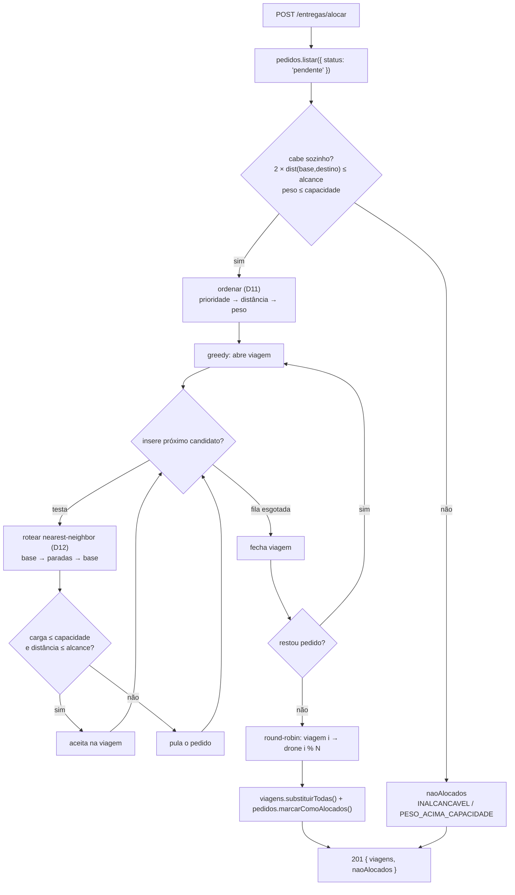
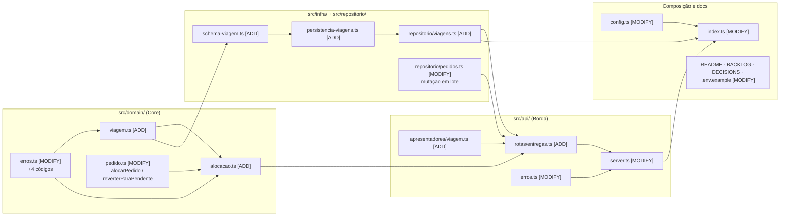

# Implementation Plan: Bloco 4 — Alocação & Otimização (E3)

**Context:** O sistema já cadastra pedidos (E1) e monta a frota (E2), mas nada decide *quais
pacotes vão em qual viagem*. Este bloco implementa o núcleo do case: agrupar os pedidos
`pendente` em viagens que respeitem capacidade e alcance, minimizando o número de viagens, e
expor as rotas calculadas via API.
**Tech Stack:** Node.js 24 (ESM `NodeNext`) · TypeScript · Express 4 · Zod · Vitest 4 + supertest

---

## 0. Context to Load

> Leia TODOS os itens abaixo ANTES de começar a execução. São os arquivos que carregam as
> convenções, regras de domínio e padrões necessários para implementar este plano sem
> alucinar. Leia a versão ATUAL em disco — não confie em memória nem em suposição.

**Pré-requisito de execução (antes de qualquer edição):**

- [ ] O repositório está na `main`. Criar a branch antes de tocar em qualquer arquivo:
      `git checkout -b feat/bloco-4`. Nenhum commit vai direto na `main`.

**Docs de contexto (convenções e regras):**

- [ ] `CLAUDE.md` — diretrizes de arquitetura, comandos, idioma (pt-BR) e a regra do `.js` nos imports
- [ ] `context/metaspec.md` → seções `ARCHITECTURE` e `CRITICAL BUSINESS RULES`
- [ ] `context/index.md` → seções `Critical Files` e `Tests`
- [ ] `docs/BACKLOG.md` → épico **E3** (E3-1, E3-2, E3-3) — os critérios de aceite são o contrato
- [ ] `docs/DECISIONS.md` → **D9** (greedy), **D10** (distância base→entregas→base), **D11**
      (ordenação), **D12** (nearest-neighbor), **D6** (persistência), **D8** e **D24** (frota e
      ids determinísticos), **D20** (erro→HTTP), **D22** (enums), **D23** (parse-don't-validate)

**Código de referência (padrões a imitar):**

- [ ] `src/domain/pedido.ts` — factory validante, tipos imutáveis, `comStatus` (transição pura)
- [ ] `src/domain/coordenada.ts` — `distanciaManhattan`, funções puras sem dependência de config
- [ ] `src/infra/persistencia-pedidos.ts` — porta `carregar`/`salvar`, escrita atômica, impl. de memória
- [ ] `src/infra/schema-pedido.ts` — schema Zod do dado já persistido, enums vindos do domínio
- [ ] `src/repositorio/pedidos.ts` — write-through, `listar`/`buscarPorId`, cópia defensiva
- [ ] `src/repositorio/frota.ts` — repositório sem persistência, derivado da config
- [ ] `src/api/rotas/drones.ts` — rota como casca fina, erros via `next`
- [ ] `src/api/apresentadores/drone.ts` — campo derivado nascendo e morrendo na borda
- [ ] `src/api/rotas/drones.test.ts` — padrão de teste de endpoint com supertest

**Arquivos a modificar (ler o estado atual antes de alterar):**

- [ ] `src/config.ts` — alterado na tarefa 3.1
- [ ] `src/domain/erros.ts` — alterado nas tarefas 1.2 e 2.2
- [ ] `src/domain/pedido.ts` — alterado na tarefa 3.4
- [ ] `src/repositorio/pedidos.ts` — alterado na tarefa 3.6
- [ ] `src/api/erros.ts` — alterado na tarefa 4.4
- [ ] `src/api/server.ts` — alterado na tarefa 4.4
- [ ] `src/index.ts` — alterado na tarefa 4.5
- [ ] `.env.example` — alterado na tarefa 5.1
- [ ] `README.md` — alterado na tarefa 5.2
- [ ] `docs/BACKLOG.md` — alterado na tarefa 5.3
- [ ] `docs/DECISIONS.md` — alterado na tarefa 5.4

---

## 1. Goals & Scope

### 1.1. Goals

* **Goals:** Fechar o épico E3 — alocar pedidos `pendente` em viagens por heurística greedy
  respeitando capacidade e alcance (E3-1), com ordenação determinística por prioridade →
  distância → peso (E3-2), e expor as viagens calculadas com roteamento nearest-neighbor em
  `GET /entregas/rota` (E3-3). Toda implementação em TDD: teste vermelho pelo motivo certo antes
  de cada linha de produção.

### 1.2. Scope

* **Inputs:** pedidos `pendente` do repositório; frota do repositório de frota; limites da config
  (`droneCapacidadeKg`, `droneAlcanceQuadras`, `base`).
* **Outputs:** lista de `Viagem` persistida (drone, pedidos, paradas, distância e carga totais) +
  relatório `naoAlocados`; pedidos alocados com status `alocado`.
* **In-Scope:** domínio da viagem, roteamento nearest-neighbor, algoritmo de alocação greedy,
  persistência JSON das viagens com reconciliação no boot, repositório de viagens, transição de
  status `pendente → alocado` e as rotas `POST /entregas/alocar` e `GET /entregas/rota`.
* **Out-of-Scope:** Não implementar a máquina de estados do drone nem consumo de bateria (E4) —
  o drone permanece `idle`, `bateriaQuadras` permanece cheia, `cargaKg` permanece 0.
* **Out-of-Scope:** Não implementar zonas de exclusão nem pathfinding (E5) — a distância continua
  sendo Manhattan pura entre dois pontos.
* **Out-of-Scope:** Não implementar dashboard, métricas de tempo nem passo de melhoria local
  (2-opt, realocação entre viagens) sobre o resultado do greedy — D9 descarta explicitamente.
* **Out-of-Scope:** Não editar `context/metaspec.md`, `context/index.md` nem `context/timeline.md`
  — esses docs só mudam via `/context-update`, depois da implementação.
* **Constraint:** Nenhuma viagem gerada pode exceder a capacidade (kg) do drone nem o alcance
  (quadras) medido no percurso completo base → entregas → base (D10).
* **Constraint:** A alocação deve ser uma função pura e determinística: mesma entrada → mesma
  saída, sem relógio, sem `Math.random`, sem I/O. Ids de viagem entram por injeção (`gerarId`),
  como já acontece em `criarPedido` e `criarDrone`.
* **Constraint:** Pedido de prioridade `alta` nunca pode ficar atrás de `media`/`baixa` que caiba
  na mesma viagem (E3-2).
* **Constraint:** A unidade de distância é a **quadra** em todo o bloco — nenhum identificador,
  mensagem ou doc pode falar em km (D16).
* **Constraint:** Nenhum teste pode escrever em disco fora de diretório temporário — o padrão é a
  persistência em memória, como nos blocos anteriores.
* **Constraint:** O domínio não pode importar `config.ts`, Express nem Zod; os limites entram por
  parâmetro.

---

## 2. Technical Design

### Decisões desta implementação

| # | Decisão | Escolha | Motivo |
|---|---------|---------|--------|
| 1 | Disparo da alocação | `POST /entregas/alocar` explícito | Separa cadastro de planejamento; padrão de indústria em roteirização (comando "solve"). Um `GET` que muda status violaria a semântica HTTP |
| 2 | Persistência das viagens | JSON, mesmo padrão de D6 | `pedido.status` já é persistido; viagem só em memória deixaria pedidos `alocado` órfãos no arquivo após reinício |
| 3 | Reconciliação no boot | Descartar viagem órfã, pedidos voltam a `pendente` | Reduzir `DRONE_QUANTIDADE` é operação prevista (D8), não corrupção — falhar o boot impediria o operador de encolher a frota. Fecha a limitação de D24 |
| 4 | Viagens × frota | Fila round-robin | O objetivo do E3-1 é minimizar viagens para entregar **tudo**, não caber numa rodada; execução sequencial é problema do E4 |
| 5 | Pedido inviável | Relatório `naoAlocados` na resposta | Alocação parcial é o comportamento correto; o `motivo` vira dado do dashboard (E6). Abortar tudo por um destino ruim trava a operação |
| 6 | Desempate final por peso | Mais pesado primeiro | Terceiro critério de D11 (que não fixa a direção). First-Fit-Decreasing é a heurística clássica de bin-packing: pacotes grandes primeiro deixam menos buraco e reduzem o nº de viagens |

### Data Flow

1. **Comando:** `POST /entregas/alocar` chega sem corpo; a rota lê os pedidos `pendente` do
   repositório e os drones do repositório de frota.
2. **Filtro de viabilidade:** cada pedido é testado sozinho — se `2 × distância(base, destino)`
   excede o alcance, ele nunca cabe em viagem nenhuma: sai da fila e entra em `naoAlocados` com
   motivo `INALCANCAVEL`. Peso acima da capacidade atual (possível se `DRONE_CAPACIDADE_KG` foi
   reduzido depois do cadastro) sai com motivo `PESO_ACIMA_CAPACIDADE`.
3. **Ordenação (D11):** prioridade (alta > media > baixa) → distância da base (menor primeiro) →
   peso (maior primeiro). Determinística.
4. **Empacotamento greedy (D9):** abre uma viagem; percorre a fila ordenada tentando inserir cada
   pedido. A inserção é aceita se, **após reroteamento**, a carga couber na capacidade e a
   distância total couber no alcance. Pedido que não cabe é pulado (first-fit) e reavaliado na
   viagem seguinte. Sem candidatos, a viagem fecha e uma nova abre. Repete até esvaziar a fila.
5. **Roteamento (D12):** a cada tentativa de inserção, a ordem de visita é recalculada por vizinho
   mais próximo a partir da base, fechando o circuito de volta na base. A distância resultante é a
   que vale para a checagem de alcance (D10) e para a resposta.
6. **Designação:** as viagens fechadas recebem drone em round-robin (`viagens[i] → drones[i % N]`).
7. **Persistência:** as viagens são gravadas via porta (write-through) e os pedidos alocados são
   atualizados para `alocado` e gravados.
8. **Leitura:** `GET /entregas/rota` devolve as viagens do repositório, sem recalcular nada; sem
   viagens, devolve `[]` — nunca erro.

### Boot com reconciliação

1. `criarRepositorioViagens` carrega o arquivo e recebe os ids da frota atual.
2. Viagem cujo `droneId` não existe na frota é descartada; os `pedidoIds` dela são devolvidos
   como `pedidoIdsOrfaos`.
3. `src/index.ts` usa essa lista para reverter os pedidos a `pendente` e loga o que foi desfeito.



### Data Structures (Draft)

> Pseudocódigo — comunica intenção, não é implementação.

```
// src/domain/viagem.ts
type Viagem = {
  id: string
  droneId: string
  pedidoIds: readonly string[]
  paradas: readonly Coordenada[]   // base -> ... -> base (inclui a base nas duas pontas)
  distanciaQuadras: number
  cargaKg: number
}

rotearNearestNeighbor(base, destinos) -> { paradas, distanciaQuadras }
  atual = base; pendentes = [...destinos]; paradas = [base]; total = 0
  enquanto pendentes não vazio:
    proximo = o de menor distanciaManhattan(atual, ·)
             // empate: menor x, depois menor y — determinismo, nunca ordem de array
    total += distancia(atual, proximo); paradas.push(proximo); atual = proximo
  total += distancia(atual, base); paradas.push(base)

criarViagem({ droneId, pedidos, base, capacidadeKg, alcanceQuadras, gerarId })
  valida carga  <= capacidadeKg   senão ErroDominio VIAGEM_ACIMA_CAPACIDADE
  valida rota   <= alcanceQuadras senão ErroDominio VIAGEM_ACIMA_ALCANCE
  // guarda de invariante: o algoritmo não deve produzir viagem inválida

// src/domain/alocacao.ts
type MotivoNaoAlocado = 'INALCANCAVEL' | 'PESO_ACIMA_CAPACIDADE'
type ResultadoAlocacao = {
  viagens: readonly Viagem[]
  naoAlocados: readonly { pedidoId: string; motivo: MotivoNaoAlocado; mensagem: string }[]
}

ordenarParaAlocacao(pedidos, base) -> Pedido[]      // D11, puro, não muta a entrada
alocarPedidos({ pedidos, droneIds, base, capacidadeKg, alcanceQuadras, gerarId }) -> ResultadoAlocacao

// src/domain/viagem.ts (reconciliação)
reconciliarViagens(viagens, droneIdsValidos) -> { viagens: Viagem[], pedidoIdsOrfaos: string[] }

// src/repositorio/viagens.ts
type RepositorioViagens = {
  listar(): Viagem[]
  substituirTodas(viagens: readonly Viagem[]): Viagem[]   // write-through
  pedidoIdsOrfaos(): string[]                             // resultado da reconciliação no boot
}

// src/api/apresentadores/viagem.ts
RespostaViagem = Viagem + { totalParadas, totalPedidos }  // derivados, nascem e morrem na borda
```

### Impacto nos arquivos



```text
case_dti/
├── .env.example                                [MODIFY]  VIAGENS_ARQUIVO
├── README.md                                   [MODIFY]  seção E3 + curl das 2 rotas
├── docs/
│   ├── BACKLOG.md                              [MODIFY]  E3-1/E3-2/E3-3 -> ✅
│   └── DECISIONS.md                            [MODIFY]  ADRs D25–D29
└── src/
    ├── config.ts                               [MODIFY]  viagensArquivo
    ├── index.ts                                [MODIFY]  compõe viagens + reconciliação
    ├── domain/
    │   ├── viagem.ts                           [ADD]     tipo, roteamento, reconciliação
    │   ├── viagem.test.ts                      [ADD]
    │   ├── alocacao.ts                         [ADD]     ordenação (D11) + greedy (D9)
    │   ├── alocacao.test.ts                    [ADD]
    │   ├── pedido.ts                           [MODIFY]  alocarPedido / reverterParaPendente
    │   ├── pedido.test.ts                      [MODIFY]  transições novas
    │   └── erros.ts                            [MODIFY]  +4 códigos
    ├── infra/
    │   ├── persistencia-viagens.ts             [ADD]     porta + arquivo + memória
    │   ├── persistencia-viagens.test.ts        [ADD]
    │   └── schema-viagem.ts                    [ADD]     Zod da viagem persistida
    ├── repositorio/
    │   ├── viagens.ts                          [ADD]     write-through + reconciliação
    │   ├── viagens.test.ts                     [ADD]
    │   ├── pedidos.ts                          [MODIFY]  marcarComoAlocados / reverterParaPendente
    │   └── pedidos.test.ts                     [MODIFY]
    └── api/
        ├── erros.ts                            [MODIFY]  novos códigos -> HTTP
        ├── server.ts                           [MODIFY]  Dependencias += viagens; monta /entregas
        ├── apresentadores/
        │   └── viagem.ts                       [ADD]     RespostaViagem
        └── rotas/
            ├── entregas.ts                     [ADD]     POST /alocar + GET /rota
            ├── entregas.test.ts                [ADD]
            ├── pedidos.test.ts                 [MODIFY]  nova assinatura de criarApp
            └── drones.test.ts                  [MODIFY]  nova assinatura de criarApp
```

---

## 3. Phased Execution

> **TDD obrigatório.** Em cada fase, a tarefa de teste vem primeiro e sua verificação é
> *"o teste falha pelo motivo certo"* (função/módulo inexistente, `Record` incompleto, tipo não
> atribuível) — nunca por erro de sintaxe. Só então vem a tarefa de implementação, cuja
> verificação é *"o teste passa"*. Não escrever produção adiantada.

```mermaid
gantt
    title Bloco 4 — Alocação (E3)
    dateFormat X
    axisFormat %s
    section Fase 1 · Viagem
    1.1 teste viagem (red)        :a1, 0, 1
    1.2 códigos de erro           :a2, after a1, 1
    1.3 viagem + nearest-neighbor :a3, after a2, 2
    section Fase 2 · Alocação
    2.1 teste alocação (red)      :b1, after a3, 2
    2.2 ordenação D11             :b2, after b1, 1
    2.3 greedy D9                 :b3, after b2, 2
    section Fase 3 · Persistência
    3.1 config + schema           :c1, after b3, 1
    3.2 teste persistência (red)  :c2, after c1, 1
    3.3 persistência viagens      :c3, after c2, 1
    3.4 transições de pedido      :c4, after c3, 1
    3.5 teste repositório (red)   :c5, after c4, 1
    3.6 repositórios              :c6, after c5, 2
    section Fase 4 · API
    4.1 teste rotas (red)         :d1, after c6, 2
    4.2 apresentador              :d2, after d1, 1
    4.3 rotas de entrega          :d3, after d2, 1
    4.4 erros + server            :d4, after d3, 1
    4.5 composição no index       :d5, after d4, 1
    section Fase 5 · Docs
    5.1-5.4 docs e verificação    :e1, after d5, 2
```



### Phase 1: Domínio da Viagem (Core Domain)

- [ ] **1.1: Testes da viagem e do roteamento (RED)** [ADD: `src/domain/viagem.test.ts`]
    - Casos de `rotearNearestNeighbor`: lista vazia devolve só a base e distância 0; um destino
      devolve `[base, destino, base]` com distância `2 × manhattan`; três destinos são visitados
      na ordem do vizinho mais próximo, não na ordem de entrada; empate de distância resolve por
      menor `x`, depois menor `y` (determinismo).
    - Casos de `criarViagem`: monta viagem válida com `cargaKg` somado e `distanciaQuadras` da
      rota; viagem exatamente no limite de capacidade e exatamente no limite de alcance é aceita
      (borda inclusiva); acima de qualquer um dos dois lança `ErroDominio` com o código próprio;
      `gerarId` injetado é usado.
    - Casos de `reconciliarViagens`: frota completa mantém tudo e devolve `pedidoIdsOrfaos` vazio;
      viagem com `droneId` inexistente é removida e seus `pedidoIds` saem como órfãos; a entrada
      não é mutada.
    - *Verification:* `npm test -- viagem` falha por módulo `viagem.ts` inexistente.

- [ ] **1.2: Novos códigos de erro de domínio** [MODIFY: `src/domain/erros.ts`]
    - Acrescentar a `CodigoErroDominio`: `VIAGEM_ACIMA_CAPACIDADE`, `VIAGEM_ACIMA_ALCANCE`,
      `VIAGEM_SEM_PEDIDOS`, `FROTA_VAZIA`.
    - *Verification:* `npm run typecheck` quebra em `src/api/erros.ts` — o `Record` exaustivo do
      mapa HTTP acusa os códigos sem status (mecanismo desenhado no Bloco 2 funcionando).

- [ ] **1.3: Tipo `Viagem`, roteamento e reconciliação** [ADD: `src/domain/viagem.ts`]
    - `Viagem` imutável (`id`, `droneId`, `pedidoIds`, `paradas`, `distanciaQuadras`, `cargaKg`).
    - `rotearNearestNeighbor(base, destinos)` (D12): puro, sem mutar a entrada, desempate
      determinístico por `x` e depois `y`.
    - `criarViagem(...)`: guarda de invariante — capacidade e alcance verificados **na
      construção**, com as bordas inclusivas (`<=`). Nunca deve disparar via alocação; existe para
      que um bug no greedy falhe alto em vez de gravar viagem inválida.
    - `reconciliarViagens(viagens, droneIdsValidos)`: função pura, sem I/O.
    - *Verification:* `npm test -- viagem` passa inteiro; `npm run typecheck` sem erro no domínio.

### Phase 2: Algoritmo de Alocação (Core Domain)

- [ ] **2.1: Testes da ordenação e do greedy (RED)** [ADD: `src/domain/alocacao.test.ts`]
    - Ordenação (D11/E3-2): `alta` antes de `media` antes de `baixa`; empate de prioridade resolve
      por menor distância da base; empate remanescente por maior peso; a mesma entrada em ordem
      embaralhada produz sempre a mesma saída; a entrada não é mutada.
    - Greedy (D9/E3-1): pedidos que somados cabem viram **uma** viagem; peso excedente abre a
      segunda; nenhuma viagem gerada excede capacidade nem alcance; um pedido `alta` distante não
      impede que um `baixa` próximo entre na mesma viagem quando ainda cabe (first-fit pula, não
      trava a fila).
    - Prioridade soberana: com dois pedidos que não cabem juntos, o `alta` vai na primeira viagem.
    - Inviáveis: destino cujo ida-e-volta excede o alcance sai em `naoAlocados` com
      `INALCANCAVEL` e **não** aparece em viagem nenhuma; peso acima da capacidade atual sai com
      `PESO_ACIMA_CAPACIDADE`; os demais continuam sendo alocados normalmente (alocação parcial).
    - Round-robin: com 2 drones e 3 viagens, a distribuição é `drone-1`, `drone-2`, `drone-1`;
      frota vazia lança `ErroDominio('FROTA_VAZIA')`.
    - Filtro de status: pedidos `cancelado`, `alocado` ou `entregue` na entrada são ignorados.
    - Determinismo e carga: entrada vazia devolve `{ viagens: [], naoAlocados: [] }`; com ~500
      pedidos gerados por seed fixa, duas execuções produzem exatamente o mesmo resultado e
      nenhuma viagem viola os limites (semente do E8-2).
    - *Verification:* `npm test -- alocacao` falha por módulo `alocacao.ts` inexistente.

- [ ] **2.2: Ordenação determinística (D11)** [ADD: `src/domain/alocacao.ts`]
    - `ordenarParaAlocacao(pedidos, base)`: prioridade (peso numérico de `PRIORIDADES`, sem
      hardcode de string solta) → distância Manhattan da base → peso decrescente. Ordena sobre uma
      cópia; comparador total (sem `0` residual que deixe a ordem à mercê do `sort`).
    - *Verification:* os testes de ordenação de 2.1 passam; os de greedy seguem vermelhos.

- [ ] **2.3: Empacotamento greedy + designação round-robin (D9)** [MODIFY: `src/domain/alocacao.ts`]
    - `alocarPedidos({ pedidos, droneIds, base, capacidadeKg, alcanceQuadras, gerarId })`.
    - Sequência: filtra `pendente` → separa inviáveis → ordena → empacota first-fit com
      reroteamento a cada tentativa → fecha viagens → distribui em round-robin.
    - Puro: sem I/O, sem relógio, sem `Math.random`; `gerarId` injetável como em `criarPedido`.
    - *Verification:* `npm test -- alocacao` passa inteiro, incluindo o caso de ~500 pedidos.

### Phase 3: Persistência e Repositórios (Infrastructure)

- [ ] **3.1: Arquivo de viagens na config e schema Zod** [MODIFY: `src/config.ts`] [ADD: `src/infra/schema-viagem.ts`]
    - `config.viagensArquivo = process.env.VIAGENS_ARQUIVO ?? 'data/viagens.json'`.
    - `schemaArquivoViagens`: espelha `schema-pedido.ts` — valida a forma da viagem persistida,
      derivando o que der do domínio em vez de reescrever literais.
    - *Verification:* `npm run typecheck` verde; `npm test -- config` continua passando.

- [ ] **3.2: Testes da persistência de viagens (RED)** [ADD: `src/infra/persistencia-viagens.test.ts`]
    - Round-trip memória: salvar e carregar devolve o mesmo conteúdo, desacoplado por cópia.
    - Arquivo ausente devolve `[]` (primeiro boot).
    - JSON com sintaxe quebrada e JSON com forma inválida lançam `ErroPersistencia` com mensagem
      apontando o campo; **o arquivo inválido não é apagado nem regravado**.
    - I/O real em diretório temporário: escrita atômica, `.tmp` não sobra ao final.
    - *Verification:* `npm test -- persistencia-viagens` falha por módulo inexistente.

- [ ] **3.3: Porta de persistência das viagens** [ADD: `src/infra/persistencia-viagens.ts`]
    - `PersistenciaViagens` com `carregar`/`salvar`, implementação de arquivo (atômica, validante)
      e implementação de memória — mesmo desenho de `persistencia-pedidos.ts` (D6).
    - *Verification:* `npm test -- persistencia-viagens` passa inteiro.

- [ ] **3.4: Transições de status do pedido** [MODIFY: `src/domain/pedido.ts`] [MODIFY: `src/domain/pedido.test.ts`]
    - Teste primeiro: `alocarPedido` só aceita `pendente` (qualquer outro status lança
      `ALOCACAO_NAO_PERMITIDA`); `reverterParaPendente` só aceita `alocado`; ambas são puras.
    - Implementar sobre `comStatus`, no mesmo estilo de `cancelarPedido`. Acrescentar
      `ALOCACAO_NAO_PERMITIDA` a `CodigoErroDominio`.
    - *Verification:* teste vermelho por função inexistente, depois `npm test -- pedido` verde.

- [ ] **3.5: Testes dos repositórios (RED)** [ADD: `src/repositorio/viagens.test.ts`] [MODIFY: `src/repositorio/pedidos.test.ts`]
    - Viagens: `listar()` devolve cópia (mutar o retorno não afeta o repositório);
      `substituirTodas` grava via porta (write-through) e substitui o conteúdo anterior;
      reconciliação no boot descarta viagem de drone inexistente, expõe `pedidoIdsOrfaos` e
      **persiste** a lista já reconciliada; frota completa mantém tudo e não grava à toa.
    - Pedidos: `marcarComoAlocados([ids])` muda os status e grava uma vez só; id inexistente
      lança `PEDIDO_NAO_ENCONTRADO` sem gravar nada (operação atômica);
      `reverterParaPendente([ids])` desfaz.
    - *Verification:* `npm test -- repositorio` falha nos casos novos, pelos motivos certos.

- [ ] **3.6: Repositório de viagens e mutação em lote de pedidos** [ADD: `src/repositorio/viagens.ts`] [MODIFY: `src/repositorio/pedidos.ts`]
    - `criarRepositorioViagens({ persistencia, droneIds })`: carrega, reconcilia na criação, grava
      se algo mudou, expõe `listar`/`substituirTodas`/`pedidoIdsOrfaos`.
    - `marcarComoAlocados` / `reverterParaPendente` em lote no repositório de pedidos: validam
      todos os ids **antes** de mutar qualquer um, e chamam `persistencia.salvar` uma única vez.
    - Nenhuma regra duplicada: as transições delegam ao domínio (3.4).
    - *Verification:* `npm test -- repositorio` passa inteiro.

### Phase 4: API e Composição (API Layer)

- [ ] **4.1: Testes das rotas de entrega (RED)** [ADD: `src/api/rotas/entregas.test.ts`] [MODIFY: `src/api/rotas/pedidos.test.ts`] [MODIFY: `src/api/rotas/drones.test.ts`]
    - `GET /entregas/rota` sem alocação devolve `200 []` (E3-3: lista vazia, não erro).
    - `POST /entregas/alocar` com pedidos pendentes devolve `201` com `{ viagens, naoAlocados }`;
      cada viagem traz `droneId`, `pedidoIds`, `paradas` (começando e terminando na base),
      `distanciaQuadras` e `cargaKg`.
    - Depois de alocar, `GET /pedidos?status=alocado` reflete a mudança e `GET /entregas/rota`
      devolve as mesmas viagens.
    - `POST /entregas/alocar` sem nenhum pedido pendente devolve `201` com listas vazias
      (idempotente, não é erro).
    - Pedido inviável aparece em `naoAlocados` com `pedidoId`, `motivo` e `mensagem`, e continua
      `pendente` na listagem.
    - As duas suítes existentes são adaptadas à nova assinatura de `criarApp`.
    - *Verification:* `npm test -- rotas` falha por módulo `entregas.ts` inexistente; as suítes
      antigas falham só por assinatura.

- [ ] **4.2: Apresentador da viagem** [ADD: `src/api/apresentadores/viagem.ts`]
    - `paraRespostaViagem`: campos do domínio + `totalParadas` e `totalPedidos` derivados. Campo
      derivado nasce e morre na borda — o tipo `Viagem` não muda (mesmo padrão de
      `bateriaPercentual`).
    - *Verification:* coberto pelos testes de rota de 4.1.

- [ ] **4.3: Rotas de entrega** [ADD: `src/api/rotas/entregas.ts`]
    - `criarRotasEntregas({ pedidos, frota, viagens })`: casca fina, erros via `next`, sem escolher
      status de erro (D20). Sem schema Zod — nenhuma das duas rotas recebe corpo ou query.
    - `POST /alocar`: lê pendentes + frota, chama `alocarPedidos`, grava viagens e status, responde
      `201`. `GET /rota`: devolve `viagens.listar().map(paraRespostaViagem)`.
    - *Verification:* `npm test -- entregas` passa inteiro.

- [ ] **4.4: Mapa de erros e montagem no server** [MODIFY: `src/api/erros.ts`] [MODIFY: `src/api/server.ts`]
    - Mapear os códigos novos: `VIAGEM_ACIMA_CAPACIDADE`, `VIAGEM_ACIMA_ALCANCE`,
      `VIAGEM_SEM_PEDIDOS`, `FROTA_VAZIA` e `ALOCACAO_NAO_PERMITIDA` → **422** (entrada válida que
      viola regra de negócio).
    - `Dependencias` ganha `viagens`; montar `app.use('/entregas', ...)` e remover o `TODO` da
      linha 35.
    - *Verification:* `npm run typecheck` verde (o `Record` exaustivo confirma que nenhum código
      ficou sem status); `npm test` verde.

- [ ] **4.5: Composição no entry point** [MODIFY: `src/index.ts`]
    - Compor `persistenciaViagens → repositorioViagens(droneIds da frota) → criarApp({ pedidos,
      frota, viagens })`.
    - Reconciliação do boot: se `viagens.pedidoIdsOrfaos()` não estiver vazio, reverter esses
      pedidos a `pendente` e logar o que foi desfeito, com a quantidade e o motivo.
    - *Verification:* `npm run dev` sobe; `curl -X POST localhost:3000/entregas/alocar` e
      `curl localhost:3000/entregas/rota` devolvem as viagens; reiniciar com `DRONE_QUANTIDADE`
      menor loga o descarte e devolve os pedidos a `pendente`.

### Phase 5: Documentação e Verificação Final (Cleanup)

- [ ] **5.1: Variável de ambiente** [MODIFY: `.env.example`]
    - `VIAGENS_ARQUIVO=data/viagens.json`, com nota de que reduzir `DRONE_QUANTIDADE` descarta as
      viagens dos drones removidos e devolve seus pedidos a `pendente`.
    - *Verification:* leitura; `.env.example` cobre toda variável lida em `config.ts`.

- [ ] **5.2: Documentação dos endpoints** [MODIFY: `README.md`]
    - Seção do E3 na tabela de endpoints + exemplos `curl` de request/response para as duas rotas
      (E7-2), no formato já usado pelas seções E1 e E2.
    - *Verification:* leitura; toda rota montada em `server.ts` aparece no README.

- [ ] **5.3: Status do backlog** [MODIFY: `docs/BACKLOG.md`]
    - E3-1, E3-2 e E3-3 → ✅.
    - *Verification:* nenhuma história marcada concluída sem teste correspondente.

- [ ] **5.4: Registro de decisões** [MODIFY: `docs/DECISIONS.md`]
    - ADRs novos, no formato existente (contexto, escolha, porquê, alternativas descartadas):
      **D25** disparo explícito da alocação; **D26** persistência das viagens; **D27**
      reconciliação de viagem órfã no boot (fecha a limitação conhecida de D24, que deve ser
      atualizada com a referência); **D28** round-robin; **D29** relatório `naoAlocados` +
      desempate por maior peso (FFD).
    - *Verification:* `npm run typecheck && npm run lint && npm run format:check && npm test &&
      npm run coverage && npm run build` — tudo verde, cobertura do domínio acima de 80% (D21).

---

## 4. Test Strategy

- [ ] **Unit (domínio):** `viagem.test.ts` — nearest-neighbor, determinismo do desempate, guardas
      de capacidade/alcance nas bordas inclusivas, reconciliação. `alocacao.test.ts` — ordenação
      D11 completa, greedy, prioridade soberana, inviáveis, round-robin, filtro de status.
      `pedido.test.ts` — novas transições e seus bloqueios.
- [ ] **Unit (infra/repositório):** round-trip e validação de schema da persistência de viagens;
      I/O real em diretório temporário; write-through, cópia defensiva, atomicidade da mutação em
      lote e reconciliação no boot.
- [ ] **Integration (API, supertest):** as duas rotas novas, o efeito da alocação visível em
      `GET /pedidos?status=alocado`, lista vazia sem alocação, alocação sem pendentes, relatório
      de inviáveis; suítes existentes adaptadas à nova assinatura.
- [ ] **Propriedade/carga (semente do E8-2):** com ~500 pedidos gerados por seed fixa, verificar as
      invariantes de saída — nenhuma viagem excede capacidade ou alcance, nenhum pedido aparece em
      duas viagens, todo pedido viável está alocado ou reportado, e duas execuções da mesma
      entrada produzem resultado idêntico.
- [ ] **Regressão:** `npm test` completo e `npm run coverage` ao final; nenhuma suíte anterior pode
      ficar vermelha.

---

## 5. Rollback & Risks

- **Risk:** O reroteamento nearest-neighbor a cada tentativa de inserção é O(n²) por viagem; com
  milhares de pedidos a alocação pode ficar lenta e comprometer o E8-2.
    - *Mitigation:* o teste de ~500 pedidos da fase 2 mede o custo já neste bloco. Se o tempo
      destoar, cortar cedo o candidato pelo limite inferior (`distância atual + 2 × manhattan(base,
      destino) > alcance` descarta sem rotear) antes de otimizar qualquer outra coisa.

- **Risk:** `POST /entregas/alocar` grava em dois lugares — viagens e status dos pedidos. Uma falha
  entre as duas gravações deixa o disco inconsistente (viagem gravada, pedido ainda `pendente`).
    - *Mitigation:* gravar as viagens **depois** dos pedidos, de modo que a falha intermediária
      produza o estado recuperável (pedido `alocado` sem viagem) que a reconciliação do boot já
      sabe desfazer. Registrar a ordem como comentário no código e a limitação no ADR D26.

- **Risk:** O greedy first-fit pode produzir mais viagens que o necessário em distribuições
  adversas — e "minimizar viagens" é o critério mais avaliado do case.
    - *Mitigation:* D9 já assume a heurística e descarta a otimização exata; os testes asseguram
      *correção* (limites respeitados), não otimalidade. A ordenação FFD (maior peso no desempate)
      é justamente o que reduz o desperdício. Melhoria local fica registrada como evolução possível.

- **Risk:** A mudança de assinatura de `criarApp` (terceira dependência) quebra as suítes de rota
  existentes.
    - *Mitigation:* previsto — `Dependencias` virou objeto no Bloco 3 exatamente para isso;
      acrescentar `viagens` é aditivo e a tarefa 4.1 já inclui a adaptação das duas suítes.

- **Risk:** A reconciliação do boot apaga viagens de forma silenciosa se o operador mexer no
  `.env` sem perceber.
    - *Mitigation:* log explícito no boot com a quantidade de viagens descartadas e de pedidos
      revertidos; nota em `.env.example` e no ADR D27.

- **Rollback:** Todo o trabalho vive na branch `feat/bloco-4`, sem commit na `main`. Reverter é
  `git checkout main` (ou `git branch -D feat/bloco-4`). Em disco, o único artefato novo é
  `data/viagens.json`, que pode ser apagado sem afetar `data/pedidos.json`; se a reconciliação já
  tiver revertido pedidos, eles voltam a `pendente` — estado válido, sem perda de cadastro.
