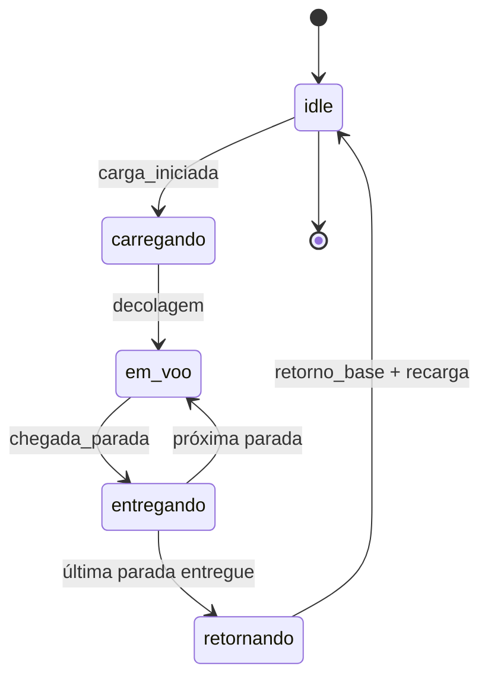
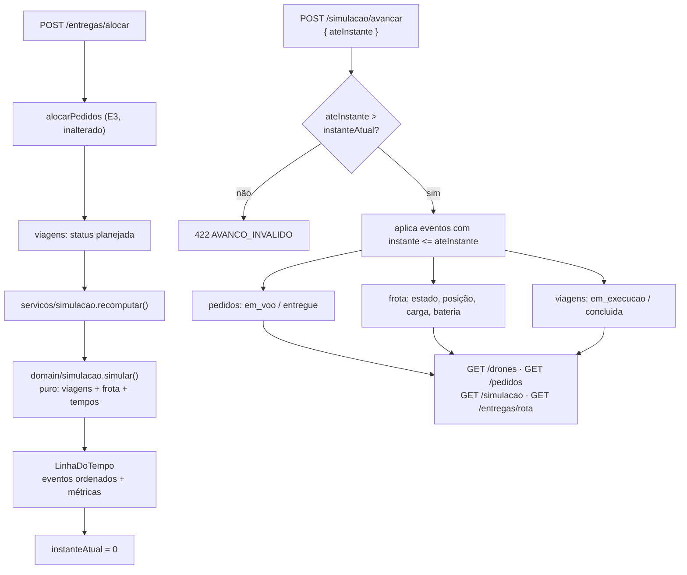

# Implementation Plan: Bloco 5 — Simulação & Estados (épico E4)

**Context:** O sistema planeja viagens (E3) mas não as executa: o drone continua `idle` na base
com bateria cheia mesmo com viagem atribuída, e o pedido para em `alocado` — `em_voo` e `entregue`
existem em `StatusPedido` e nenhum caminho de código os produz. Este bloco implementa a máquina de
estados do drone, o motor de simulação em tempo simulado, as métricas de tempo e a bateria.

**Tech Stack:** Node.js 24 (ESM `NodeNext`) · TypeScript · Express 4 · Zod · Vitest 4 + supertest

---

## 0. Context to Load

> Leia TODOS os itens abaixo ANTES de começar a execução. São os arquivos que carregam as
> convenções, regras de domínio e padrões necessários para implementar este plano sem alucinar.
> Leia a versão ATUAL em disco — não confie em memória nem em suposição.

**Context docs (convenções e regras):**

- [ ] `CLAUDE.md` — diretrizes de arquitetura, comandos e idioma (pt-BR)
- [ ] `context/metaspec.md` — seções ARCHITECTURE e CRITICAL BUSINESS RULES
- [ ] `context/index.md` → seção "Critical Files" — responsabilidade de cada arquivo
- [ ] `docs/DECISIONS.md` → D7, D8, D13, D14, D15, D16, D20, D24, D25, D26, D27, D28 — os ADRs que este bloco estende
- [ ] `docs/BACKLOG.md` → épico E4 (E4-1, E4-2, E4-3) — critérios de aceite

**Reference code (padrões a imitar):**

- [ ] `src/domain/alocacao.ts` — padrão de função pura de domínio: limites por parâmetro, `gerarId` injetável, sem I/O
- [ ] `src/domain/viagem.ts` — guarda de invariante na construção; desempate determinístico
- [ ] `src/domain/alocacao.test.ts` — padrão dos testes de domínio, incluindo o teste de carga por semente fixa
- [ ] `src/api/rotas/entregas.test.ts` — padrão dos testes de rota com supertest
- [ ] `src/api/rotas/drones.ts` — casca fina: repassa erro via `next`, sem escolher status
- [ ] `src/api/schemas/pedido.ts` — Zod na borda (valida forma, não regra)
- [ ] `src/infra/schema-viagem.ts` — schema do dado já persistido

**Files to modify (leia o estado atual antes de alterar):**

- [ ] `src/config.ts` — tarefa 1.2
- [ ] `src/domain/erros.ts` — tarefa 1.3
- [ ] `src/domain/drone.ts` — tarefa 1.4
- [ ] `src/domain/drone.test.ts` — tarefa 1.1
- [ ] `src/domain/pedido.ts` — tarefa 1.5
- [ ] `src/domain/pedido.test.ts` — tarefa 1.1
- [ ] `src/domain/viagem.ts` — tarefa 1.6
- [ ] `src/domain/viagem.test.ts` — tarefa 1.1
- [ ] `src/infra/schema-viagem.ts` — tarefa 1.7
- [ ] `src/infra/persistencia-viagens.test.ts` — tarefa 1.1
- [ ] `src/domain/alocacao.ts` — tarefa 2.3 (dívida do bloco 4)
- [ ] `src/domain/alocacao.test.ts` — tarefa 2.3
- [ ] `src/repositorio/frota.ts` — tarefa 3.2
- [ ] `src/repositorio/frota.test.ts` — tarefa 3.1
- [ ] `src/api/erros.ts` — tarefa 4.2
- [ ] `src/api/apresentadores/viagem.ts` — tarefa 4.3
- [ ] `src/api/rotas/entregas.ts` — tarefa 4.5
- [ ] `src/api/rotas/entregas.test.ts` — tarefa 4.1
- [ ] `src/api/server.ts` — tarefa 4.6
- [ ] `src/api/rotas/pedidos.test.ts` — tarefa 4.6 (adaptar à nova assinatura de `Dependencias`)
- [ ] `src/api/rotas/drones.test.ts` — tarefa 4.6 (adaptar à nova assinatura de `Dependencias`)
- [ ] `src/index.ts` — tarefa 4.7
- [ ] `.env.example` — tarefa 5.1
- [ ] `README.md` — tarefa 5.2
- [ ] `docs/BACKLOG.md` — tarefa 5.3
- [ ] `docs/DECISIONS.md` — tarefa 5.4

---

## 1. Goals & Scope

### 1.1. Goals

- **E4-1:** Máquina de estados explícita do drone (`idle → carregando → em_voo → entregando →
  retornando → idle`), com transições inválidas bloqueadas, executando as viagens geradas pelo E3.
- **E4-2:** Tempo por entrega, makespan da operação e tempo médio, calculados por
  `distância ÷ velocidade + tempos fixos` (D14) e expostos por API.
- **E4-3:** Bateria consumida proporcionalmente à distância e recarregada na base com duração
  proporcional ao consumo (D15).
- **Dívidas do bloco 4:** asserção do invariante de `empacotar`; ciclo de vida da viagem que encerra
  o acúmulo indefinido de viagens.

### 1.2. Scope

- **Inputs:** viagens `planejada` do repositório, pedidos `alocado`, frota atual, limites de tempo
  vindos da config; e o instante-alvo do avanço do relógio (`POST /simulacao/avancar`).
- **Outputs:** linha do tempo de eventos com instante, métricas agregadas, e o estado aplicado —
  pedidos `em_voo`/`entregue` persistidos, drones atualizados, viagens `em_execucao`/`concluida`.
- **In-Scope:** máquina de estados do drone com tabela de transições explícita.
- **In-Scope:** motor de simulação puro (`src/domain/simulacao.ts`) que transforma viagens em
  eventos com timestamps, sem I/O, sem relógio real e sem aleatoriedade.
- **In-Scope:** camada de serviço (`src/servicos/simulacao.ts`) que guarda a linha do tempo e o
  instante corrente, e aplica os eventos aos repositórios ao avançar.
- **In-Scope:** rotas `POST /simulacao/avancar`, `GET /simulacao`, `GET /simulacao/eventos`.
- **In-Scope:** `status` na viagem (`planejada → em_execucao → concluida`), filtro `?status=` em
  `GET /entregas/rota` e `DELETE /entregas/concluidas`.
- **Out-of-Scope:** Não implementar zonas de exclusão nem pathfinding (E5-2, bloco 6) — a distância
  segue Manhattan direta.
- **Out-of-Scope:** Não construir o dashboard nem qualquer view HTML (E6, bloco 7); este bloco
  apenas produz as métricas que o dashboard consumirá.
- **Out-of-Scope:** Não alterar a heurística de alocação nem o round-robin de D28 — a única mudança
  em `alocacao.ts` é a asserção do invariante.
- **Out-of-Scope:** Não editar `context/metaspec.md`, `context/index.md` nem `context/timeline.md` à
  mão — a sincronização do contexto é feita depois, por `/context-update`.
- **Constraint:** A simulação deve ser determinística — proibido `setTimeout`, `sleep`, `Date.now()`,
  `Math.random` (D13). Mesma entrada produz exatamente os mesmos instantes.
- **Constraint:** `src/domain/simulacao.ts` deve ser puro: sem I/O, sem acesso a `config`, com todos
  os limites entrando por parâmetro — igual a `alocacao.ts`.
- **Constraint:** Tipos do domínio permanecem imutáveis (`readonly`); toda transição devolve nova
  cópia, nunca muta no lugar.
- **Constraint:** `data/viagens.json` já existente (sem o campo `status`) deve continuar carregando
  sem erro — o schema precisa de default.
- **Constraint:** Nenhum teste pode escrever em disco fora de diretório temporário; a suíte usa a
  persistência em memória.
- **Constraint:** O relógio só avança para frente; pedir um instante menor que o corrente é erro de
  regra de negócio, não no-op.
- **Constraint:** Todo o trabalho na branch `feat/bloco-5` — nada commitado direto na `main`.

---

## 2. Technical Design

### 2.1. Decisões desta sessão (viram ADRs D30–D35 na tarefa 5.4)

| # | Decisão | Escolha | Motivo |
| --- | --- | --- | --- |
| D30 | Observabilidade do tempo | Relógio virtual com instante corrente, avançado por comando | Forma canônica de simulação de eventos discretos; é o que faz `GET /drones` exibir de fato a máquina de estados |
| D31 | Persistência da simulação | Não persistir — recomputar da lista de viagens no boot | A simulação é pura e determinística; persistir criaria um terceiro arquivo a reconciliar (mesma lógica de D24) |
| D32 | Semântica do avanço | Aplicar eventos: estado real muda e é persistido | Projeção pura deixaria `pedido.status` como ficção não persistida, colidindo com o E1-2 |
| D33 | Alocar com simulação em andamento | Recomputa a linha do tempo das viagens não concluídas e zera o relógio | Coerente com D25 (a alocação já recalcula do zero); mantém o instante inicial independente de histórico |
| D34 | Recarga | Duração proporcional à bateria consumida, entrando no makespan | Recarga instantânea não afetaria métrica nenhuma e esvaziaria o E4-3 |
| D35 | Ciclo de vida da viagem | `planejada → em_execucao → concluida` + `DELETE /entregas/concluidas` | Necessário para a simulação não reexecutar viagem já entregue; fecha a dívida de acúmulo do bloco 4 |

### 2.2. Máquina de estados (E4-1)



Tabela de transições permitidas (qualquer par fora dela lança `TRANSICAO_INVALIDA`):

| De | Para |
| --- | --- |
| `idle` | `carregando` |
| `carregando` | `em_voo` |
| `em_voo` | `entregando` |
| `entregando` | `em_voo`, `retornando` |
| `retornando` | `idle` |

### 2.3. Data Flow

1. **Alocação (existente):** `POST /entregas/alocar` gera viagens `planejada` e marca os pedidos
   como `alocado`.
2. **Recomputação da linha do tempo:** logo após alocar (D13/D33), o serviço chama
   `simular({ viagens não concluídas, pedidos, drones, base, tempos })` e zera o instante corrente.
3. **Montagem por drone:** as viagens são agrupadas por `droneId`, preservando a ordem de criação;
   cada drone tem seu próprio relógio começando em 0 — **drones diferentes voam em paralelo**, o
   mesmo drone executa suas viagens **em série**.
4. **Geração dos eventos de uma viagem:** `carga_iniciada` (+`tempoCarregamentoMin`) → `decolagem` →
   para cada perna da rota: avanço de `distância ÷ velocidade`, `chegada_parada` (bateria decresce),
   `entrega_concluida` por pedido daquela parada (+`tempoEntregaMin` cada) → perna final de volta →
   `retorno_base` → `recarga_concluida` (+`consumido × recargaMinPorQuadra`, bateria restaurada).
5. **Ordenação global:** todos os eventos são fundidos e ordenados por `instante`, depois `droneId`,
   depois `sequencia` — comparador total, nunca devolve 0.
6. **Métricas:** makespan = maior instante final; tempo por pedido = instante do seu
   `entrega_concluida`; média = soma ÷ nº de entregas.
7. **Avanço do relógio:** `POST /simulacao/avancar` aplica, em ordem, todo evento com
   `instante <= ateInstante`: `entrega_concluida` marca o pedido `entregue`, `decolagem` marca os
   pedidos da viagem `em_voo`, cada evento atualiza o drone no repositório de frota e o status da
   viagem. Persistência de pedidos e viagens acontece por write-through, como já é hoje.



### 2.4. Data Structures (Draft)

> Pseudocódigo — comunica intenção, não é implementação.

```ts
// src/domain/drone.ts  [MODIFY]
const TRANSICOES: Record<EstadoDrone, readonly EstadoDrone[]>
transitar(drone, novoEstado): Drone              // valida contra TRANSICOES
carregarDrone(drone, cargaKg): Drone             // idle -> carregando; valida capacidade
moverPara(drone, destino, distanciaQuadras): Drone  // posição + bateria -= distância
descarregar(drone, pesoKg): Drone
recarregar(drone): Drone                         // bateriaQuadras = alcanceQuadras

// src/domain/viagem.ts  [MODIFY]
const STATUS_VIAGEM = ['planejada', 'em_execucao', 'concluida'] as const
type Viagem = { ...campos atuais, readonly status: StatusViagem }
comStatusViagem(viagem, status): Viagem

// src/domain/pedido.ts  [MODIFY]
despacharPedido(pedido): Pedido   // alocado -> em_voo,   senão ENTREGA_NAO_PERMITIDA
entregarPedido(pedido): Pedido    // em_voo  -> entregue, senão ENTREGA_NAO_PERMITIDA

// src/domain/simulacao.ts  [ADD] — núcleo do bloco, puro
type TipoEvento =
  | 'carga_iniciada' | 'decolagem' | 'chegada_parada'
  | 'entrega_concluida' | 'retorno_base' | 'recarga_concluida'

type EventoSimulacao = {
  readonly sequencia: number          // ordem dentro da linha do tempo do drone
  readonly instanteMin: number
  readonly tipo: TipoEvento
  readonly droneId: string
  readonly viagemId: string
  readonly pedidoId?: string          // só em entrega_concluida
  readonly posicao: Coordenada
  readonly estadoDrone: EstadoDrone   // estado APÓS o evento
  readonly cargaKg: number
  readonly bateriaQuadras: number
}

type MetricasSimulacao = {
  readonly totalEntregas: number
  readonly makespanMin: number
  readonly tempoMedioEntregaMin: number
  readonly tempoPorPedido: readonly { pedidoId: string; instanteEntregaMin: number }[]
  readonly porDrone: readonly {
    droneId: string; viagens: number; distanciaQuadras: number; tempoOcupadoMin: number
  }[]
}

type LinhaDoTempo = { readonly eventos: readonly EventoSimulacao[]; readonly metricas: MetricasSimulacao }

type TemposSimulacao = {
  readonly velocidadeQuadrasMin: number
  readonly carregamentoMin: number
  readonly entregaMin: number
  readonly recargaMinPorQuadra: number
}

simular(opcoes: { viagens, pedidos, drones, base, tempos }): LinhaDoTempo

// src/servicos/simulacao.ts  [ADD] — orquestra domínio + repositórios, sem HTTP
type ServicoSimulacao = {
  recomputar(): LinhaDoTempo        // relê viagens/pedidos/frota, zera o instante
  linhaDoTempo(): LinhaDoTempo
  instanteAtual(): number
  avancarPara(instanteMin: number): { instanteAtual: number; eventosAplicados: readonly EventoSimulacao[] }
}
```

**Casamento parada → pedido.** As paradas são coordenadas e vários pedidos podem dividir o mesmo
destino. Em cada parada são entregues **todos** os pedidos ainda não entregues da viagem cujo
`destino` é igual àquela coordenada, ordenados por `id` (desempate determinístico), cada um
custando `entregaMin`.

### 2.5. Novos códigos de erro → HTTP

| Código | Status | Quando |
| --- | --- | --- |
| `TRANSICAO_INVALIDA` | 422 | Transição fora da tabela da máquina de estados |
| `BATERIA_INSUFICIENTE` | 422 | Perna de voo que excederia a bateria restante |
| `ENTREGA_NAO_PERMITIDA` | 422 | `despacharPedido`/`entregarPedido` a partir de status errado |
| `AVANCO_INVALIDO` | 422 | Instante-alvo menor que o instante corrente |
| `EMPACOTAMENTO_INCONSISTENTE` | 500 | Invariante do `empacotar` violada — é bug, não entrada do usuário |

---

## 3. Phased Execution

```mermaid
gantt
    title Bloco 5 — Simulação & Estados
    dateFormat X
    axisFormat %s
    section Fase 1
    Estados e ciclo de vida    :f1, 0, 3
    section Fase 2
    Motor de simulação         :f2, after f1, 4
    section Fase 3
    Serviço e repositórios     :f3, after f2, 3
    section Fase 4
    API                        :f4, after f3, 3
    section Fase 5
    Docs e fechamento          :f5, after f4, 2
```



### Phase 1: Estados, transições e ciclo de vida (Core Domain)

- [ ] **1.1: Testes vermelhos dos estados** [MODIFY: `src/domain/drone.test.ts`, `src/domain/pedido.test.ts`, `src/domain/viagem.test.ts`, `src/infra/persistencia-viagens.test.ts`]
    - `drone.test.ts`: cada transição válida da tabela produz nova cópia com o estado novo; cada
      transição inválida lança `TRANSICAO_INVALIDA`; `carregarDrone` acima da capacidade lança;
      `moverPara` desconta bateria e lança `BATERIA_INSUFICIENTE` quando o trecho não cabe;
      `recarregar` devolve a bateria a `alcanceQuadras`; nenhuma função muta a entrada.
    - `pedido.test.ts`: `despacharPedido` só de `alocado`, `entregarPedido` só de `em_voo`; demais
      status lançam `ENTREGA_NAO_PERMITIDA`.
    - `viagem.test.ts`: `criarViagem` nasce `planejada`; `comStatusViagem` devolve cópia.
    - `persistencia-viagens.test.ts`: arquivo salvo **sem** o campo `status` carrega com
      `status: 'planejada'` (compatibilidade com `data/viagens.json` existente).
    - *Verification:* `npm test` falha nesses arquivos por função/campo inexistente — o motivo certo.
- [ ] **1.2: Constantes de tempo** [MODIFY: `src/config.ts`]
    - `droneVelocidadeQuadrasMin` (1), `tempoCarregamentoMin` (5), `tempoEntregaMin` (2),
      `recargaMinPorQuadra` (0.5), todas com override por env.
    - *Verification:* `src/config.test.ts` continua verde; chaves presentes com os defaults.
- [ ] **1.3: Novos códigos de erro** [MODIFY: `src/domain/erros.ts`]
    - Acrescentar `TRANSICAO_INVALIDA`, `BATERIA_INSUFICIENTE`, `ENTREGA_NAO_PERMITIDA`,
      `AVANCO_INVALIDO`, `EMPACOTAMENTO_INCONSISTENTE` a `CodigoErroDominio`.
    - *Verification:* `npm run typecheck` passa a acusar `Record` incompleto em `src/api/erros.ts` —
      é o comportamento esperado, corrigido na tarefa 4.2.
- [ ] **1.4: Máquina de estados do drone** [MODIFY: `src/domain/drone.ts`]
    - Tabela `TRANSICOES` + `transitar`, `carregarDrone`, `moverPara`, `descarregar`, `recarregar`,
      todas puras, devolvendo nova cópia. Remover o comentário que adia isso ao "Bloco 5".
    - *Verification:* os testes de `drone.test.ts` da tarefa 1.1 passam.
- [ ] **1.5: Transições de entrega do pedido** [MODIFY: `src/domain/pedido.ts`]
    - `despacharPedido` e `entregarPedido`, no mesmo formato de `alocarPedido`.
    - *Verification:* os testes de `pedido.test.ts` da tarefa 1.1 passam.
- [ ] **1.6: Status da viagem** [MODIFY: `src/domain/viagem.ts`]
    - `STATUS_VIAGEM`, campo `status` em `Viagem` (`criarViagem` nasce `planejada`) e
      `comStatusViagem`.
    - *Verification:* os testes de `viagem.test.ts` passam; `npm run typecheck` aponta os pontos que
      constroem `Viagem` à mão (testes) para ajuste.
- [ ] **1.7: Schema da viagem persistida com default** [MODIFY: `src/infra/schema-viagem.ts`]
    - `status` como enum com `.default('planejada')`, para que arquivo antigo carregue sem erro.
    - *Verification:* o teste de compatibilidade da tarefa 1.1 passa; `npm test` verde na fase 1.

### Phase 2: Motor de simulação (Core Domain)

- [ ] **2.1: Testes vermelhos do motor** [ADD: `src/domain/simulacao.test.ts`]
    - Viagem de 1 pedido produz a sequência exata de eventos, com os instantes conferidos à mão
      pela fórmula de D14.
    - Ordem dos estados no log respeita a máquina de estados da seção 2.2.
    - Bateria decresce por perna e é restaurada no `recarga_concluida`; a recarga soma
      `consumido × recargaMinPorQuadra` ao instante.
    - Duas viagens do **mesmo** drone rodam em série (a segunda começa no fim da primeira,
      recarga incluída); viagens de drones **diferentes** rodam em paralelo (ambas começam em 0).
    - Vários pedidos no **mesmo destino** são todos entregues naquela parada, ordenados por `id`.
    - Métricas: makespan é o maior instante final; média confere; `tempoPorPedido` cobre todos.
    - Determinismo: duas execuções da mesma entrada produzem linhas do tempo idênticas
      (`toEqual`), inclusive no cenário de carga com semente fixa, no molde de `alocacao.test.ts`.
    - Viagem já `concluida` recebida na entrada é ignorada.
    - *Verification:* `npm test` falha por `src/domain/simulacao.ts` inexistente.
- [ ] **2.2: Implementar o motor** [ADD: `src/domain/simulacao.ts`]
    - `simular` conforme a seção 2.3, puro: sem `config`, sem I/O, sem relógio real. Ordenação
      final por `instanteMin → droneId → sequencia`, comparador total.
    - *Verification:* todos os testes de 2.1 passam; `grep` por `Date.now|Math.random|setTimeout` no
      arquivo não retorna nada.
- [ ] **2.3: Fechar o invariante do `empacotar` (dívida do bloco 4)** [MODIFY: `src/domain/alocacao.ts`, `src/domain/alocacao.test.ts`]
    - Teste primeiro: grupo vazio no laço de empacotamento lança `EMPACOTAMENTO_INCONSISTENTE` em
      vez de girar para sempre. Depois a guarda de uma linha.
    - *Verification:* o teste falha antes da guarda e passa depois; os 17 testes existentes de
      `alocacao.test.ts` seguem verdes.

### Phase 3: Serviço de simulação e repositórios (Integration)

- [ ] **3.1: Testes vermelhos do serviço** [ADD: `src/servicos/simulacao.test.ts`] [MODIFY: `src/repositorio/frota.test.ts`]
    - `frota.test.ts`: `atualizar` troca o drone pelo id e devolve cópia; id inexistente lança
      `DRONE_NAO_ENCONTRADO`; a frota segue não persistida.
    - `simulacao.test.ts`: `recomputar` monta a linha do tempo das viagens não concluídas e zera o
      instante; `avancarPara` aplica só os eventos até o instante e deixa pedidos/drones/viagens no
      estado esperado; avançar duas vezes não reaplica evento já aplicado (idempotência do trecho
      já percorrido); avançar para instante menor lança `AVANCO_INVALIDO`; avançar além do makespan
      conclui todas as viagens, entrega todos os pedidos e devolve os drones a `idle` na base com
      bateria cheia.
    - *Verification:* `npm test` falha por `src/servicos/simulacao.ts` e `frota.atualizar`
      inexistentes.
- [ ] **3.2: Frota mutável** [MODIFY: `src/repositorio/frota.ts`]
    - Acrescentar `atualizar(drone)` ao `RepositorioFrota`, mantendo a frota em memória e sem
      persistência (D24 continua valendo).
    - *Verification:* testes de `frota.test.ts` passam.
- [ ] **3.3: Serviço de simulação** [ADD: `src/servicos/simulacao.ts`]
    - `criarServicoSimulacao({ pedidos, frota, viagens, base, tempos })` implementando
      `recomputar`, `linhaDoTempo`, `instanteAtual` e `avancarPara`, aplicando os eventos aos
      repositórios na ordem da linha do tempo.
    - *Verification:* testes de `simulacao.test.ts` passam; `npm run typecheck` verde.

### Phase 4: API (API Layer)

- [ ] **4.1: Testes vermelhos das rotas** [ADD: `src/api/rotas/simulacao.test.ts`] [MODIFY: `src/api/rotas/entregas.test.ts`]
    - `simulacao.test.ts` (supertest): `GET /simulacao` devolve 200 com `instanteAtual` e métricas
      (zeradas sem alocação); `POST /simulacao/avancar` com `ateInstante` válido devolve 200 e muda
      `GET /drones` e `GET /pedidos`; instante retroativo devolve 422 `AVANCO_INVALIDO`; corpo
      malformado devolve 400 (Zod); `GET /simulacao/eventos` lista os eventos e aceita recorte.
    - `entregas.test.ts`: alocar deixa a linha do tempo pronta e o relógio em 0; `GET /entregas/rota`
      expõe `status` e aceita `?status=`; `DELETE /entregas/concluidas` remove só as concluídas;
      realocar depois de concluir não reexecuta as viagens já concluídas.
    - *Verification:* `npm test` falha por rota não montada / campo ausente.
- [ ] **4.2: Mapear os erros novos** [MODIFY: `src/api/erros.ts`]
    - Completar o `Record` com os 5 códigos da seção 2.5.
    - *Verification:* `npm run typecheck` volta a passar.
- [ ] **4.3: Apresentadores** [ADD: `src/api/apresentadores/simulacao.ts`] [MODIFY: `src/api/apresentadores/viagem.ts`]
    - `paraRespostaEvento` e `paraRespostaMetricas`; `RespostaViagem` ganha `status`.
    - *Verification:* formato conferido pelos testes de 4.1.
- [ ] **4.4: Schema Zod do avanço** [ADD: `src/api/schemas/simulacao.ts`]
    - Corpo `{ ateInstante?: number, minutos?: number }`, exatamente um dos dois, número finito
      não negativo. Valida forma, não regra (D3/D23).
    - *Verification:* corpo inválido devolve 400 com campo e motivo.
- [ ] **4.5: Rotas** [ADD: `src/api/rotas/simulacao.ts`] [MODIFY: `src/api/rotas/entregas.ts`]
    - `simulacao.ts`: as 3 rotas, casca fina, erros via `next`.
    - `entregas.ts`: chamar `simulacao.recomputar()` após alocar (D13/D33); `?status=` no
      `GET /rota`; `DELETE /concluidas`.
    - *Verification:* testes de 4.1 passam.
- [ ] **4.6: Compor no app** [MODIFY: `src/api/server.ts`, `src/api/rotas/pedidos.test.ts`, `src/api/rotas/drones.test.ts`]
    - `Dependencias` += `simulacao`; montar `/simulacao`. Adaptar os dois testes que constroem
      `Dependencias` à mão.
    - *Verification:* `npm test` verde na suíte inteira.
- [ ] **4.7: Boot** [MODIFY: `src/index.ts`]
    - Instanciar o serviço com os tempos da config e chamar `recomputar()` após a reconciliação de
      viagens órfãs (D27), para que o processo suba com a linha do tempo pronta (D31).
    - *Verification:* `npm run dev` + alocar + avançar reproduz o fluxo ponta a ponta; reiniciar
      mantém pedidos/viagens e reconstrói a linha do tempo.

### Phase 5: Documentação e fechamento (Cleanup)

- [ ] **5.1: Variáveis de ambiente** [MODIFY: `.env.example`]
    - As 4 constantes de tempo, com comentário de unidade (minutos e quadras/min).
    - *Verification:* copiar para `.env` e subir o servidor funciona.
- [ ] **5.2: README** [MODIFY: `README.md`]
    - Seção do E4: máquina de estados, modelo de tempo, bateria e as rotas novas, com `curl` de
      ponta a ponta (cadastrar → alocar → avançar → consultar) — E7-2.
    - *Verification:* comandos do README copiados e executados devolvem o descrito.
- [ ] **5.3: Backlog** [MODIFY: `docs/BACKLOG.md`]
    - E4-1, E4-2, E4-3 → ✅. Sincronizar os checkboxes atrasados: E1-1, E1-2, E1-3, E7-1, E7-2
      seguem 🔲 apesar de concluídos.
    - *Verification:* nenhuma história implementada permanece 🔲.
- [ ] **5.4: Decisões** [MODIFY: `docs/DECISIONS.md`]
    - ADRs D30–D35 da seção 2.1, no formato existente (contexto, escolha, porquê, alternativas
      descartadas). Termo "greedy" — nunca "gulosa".
    - *Verification:* `npm run format:check` verde; leitura confere com o implementado.

---

## 4. Test Strategy

Todo o bloco em **TDD**: em cada fase o teste é escrito primeiro e confirmado vermelho pelo motivo
certo (módulo inexistente, função inexistente, `Record` incompleto, rota não montada) antes de
qualquer linha de produção.

- [ ] **Unit (domínio):** máquina de estados — todas as transições válidas e uma inválida por
  estado; consumo e recarga de bateria, incluindo a borda exata (`bateria == distância`);
  transições de entrega do pedido; `status` da viagem.
- [ ] **Unit (motor):** instantes conferidos à mão pela fórmula de D14; sequência de eventos;
  série vs. paralelo entre drones; múltiplos pedidos no mesmo destino; métricas (makespan, média,
  por pedido, por drone); viagem concluída ignorada.
- [ ] **Determinismo:** duas execuções da mesma entrada devolvem linhas do tempo idênticas; nenhum
  teste depende de relógio real. Verificação mecânica: `Date.now`, `Math.random`, `setTimeout` não
  aparecem em `src/domain/simulacao.ts` nem em `src/servicos/simulacao.ts`.
- [ ] **Carga:** cenário com ~500 pedidos por semente fixa (molde de `alocacao.test.ts`) alocado e
  simulado — nenhuma viagem viola capacidade/alcance, nenhum drone termina com bateria negativa,
  todo pedido viável chega a `entregue`, e o tempo de execução se mantém na casa dos
  milissegundos.
- [ ] **Integration (serviço):** avanço parcial deixa estado intermediário coerente entre pedidos,
  drones e viagens; avanço além do makespan conclui tudo; avanço retroativo é erro; reaplicação não
  duplica efeito.
- [ ] **Integration (API, supertest):** as 3 rotas de simulação, o filtro e o `DELETE` de entregas,
  os status HTTP dos erros novos, e a validação Zod do corpo do avanço.
- [ ] **Compatibilidade:** `data/viagens.json` sem `status` carrega com o default.
- [ ] **Cobertura:** `npm run coverage` mantém o domínio ≥ 99% e o total ≥ 98%.

Verificação final obrigatória: `npm run typecheck`, `npm run lint`, `npm run format:check`,
`npm test`, `npm run coverage` e `npm run build` — todos verdes.

---

## 5. Rollback & Risks

- **Risk:** O campo `status` entra em `Viagem`, que é persistida — um `data/viagens.json` gerado
  pelo bloco 4 não tem esse campo e derrubaria o boot na validação do schema.
    - *Mitigation:* `.default('planejada')` no schema (tarefa 1.7), com teste de compatibilidade
      escrito antes (tarefa 1.1) usando um objeto sem o campo.
- **Risk:** A simulação reexecutar viagens já concluídas, tentando entregar pedido já `entregue` e
  lançando `ENTREGA_NAO_PERMITIDA` na segunda rodada de alocação.
    - *Mitigation:* é exatamente o que o ciclo de vida da viagem (D35) resolve; há teste explícito
      em 4.1 ("realocar depois de concluir não reexecuta as concluídas") e em 2.1 ("viagem já
      concluída é ignorada").
- **Risk:** Vazamento de não-determinismo (relógio real, ordem de `Object.keys`, `sort` instável)
  quebrando a reprodutibilidade exigida por D13 e pelo E8-1.
    - *Mitigation:* comparador total em toda ordenação (nunca devolve 0), teste de igualdade entre
      duas execuções, e verificação mecânica por `grep` dos símbolos proibidos.
- **Risk:** Aritmética de ponto flutuante nos instantes (velocidade e `recargaMinPorQuadra = 0.5`
  produzem frações) gerando comparações `<=` instáveis no avanço do relógio.
    - *Mitigation:* instantes derivados sempre da mesma fórmula, nunca acumulados por soma
      incremental de frações onde possível; testes com valores que exercitam meia-unidade; se
      surgir instabilidade, arredondar para 3 casas num ponto único e documentar.
- **Risk:** O serviço de simulação virar um "deus" que concentra regra de negócio, esvaziando o
  domínio — contrariando a diretriz de `CLAUDE.md`.
    - *Mitigation:* toda regra (transição, consumo, tempo) vive em `src/domain/`; o serviço só
      orquestra e aplica. Verificação: os testes de domínio cobrem as regras sem HTTP e sem
      repositório.
- **Risk:** Escopo inflar para dentro do E6 (dashboard) ao produzir métricas.
    - *Mitigation:* Out-of-Scope explícito; este bloco entrega métricas como JSON, sem nenhuma view.
- **Rollback:** Todo o trabalho vive na branch `feat/bloco-5`, sem commit na `main` —
  `git checkout main` descarta tudo. Nenhum arquivo do bloco 4 é removido, apenas estendido. O
  único formato persistido que muda é `viagens.json`, e a mudança é retrocompatível nos dois
  sentidos: arquivo do bloco 4 carrega no bloco 5 pelo `.default('planejada')`, e arquivo do bloco
  5 carrega no bloco 4 porque `z.object` não é estrito — a chave `status` extra é simplesmente
  descartada (`src/infra/schema-viagem.ts:14`).
