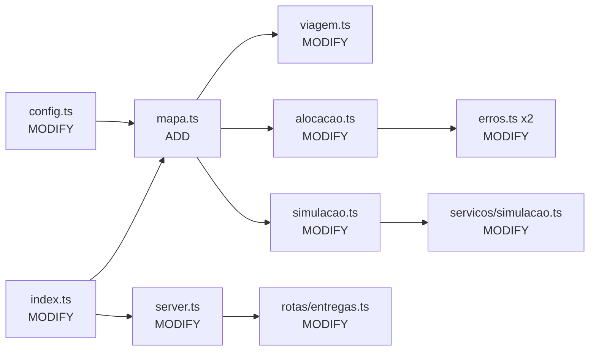
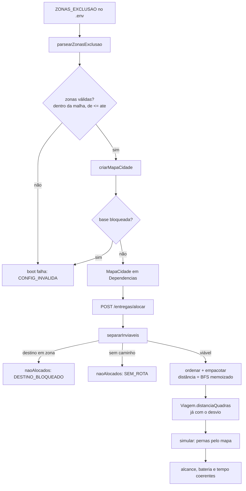

# Implementation Plan: Bloco 6 — Zonas de Exclusão Aérea (E5-2)

**Context:** Hoje a distância entre dois pontos é uma fórmula O(1) (`distanciaManhattan`) que ignora
obstáculos. O case pede zonas de exclusão aérea: células bloqueadas que o drone deve contornar. A
distância deixa de ser uma fórmula e passa a ser busca em grafo — e essa distância que desvia precisa
alimentar alcance/bateria, roteamento e tempo, sem quebrar a alocação nem o teste de carga existente.
Fecha o épico E5 (D17).

**Tech Stack:** Node.js 24 (>= 20.12), TypeScript ESM `NodeNext`, Express 4, Zod, Vitest 4.

---

## 0. Context to Load

> Leia TODOS os itens abaixo ANTES de executar. Leia a versão ATUAL em disco — não confie em
> memória nem em suposição.

**Context docs (convenções e regras):**

- [ ] `CLAUDE.md` — diretrizes de arquitetura, ESM `.js` nos imports, idioma pt-BR
- [ ] `context/metaspec.md` → `CRITICAL BUSINESS RULES` — D9–D14, D16, D29, D35 e a unidade "quadra"
- [ ] `context/index.md` → `Critical Files` → seções Domínio e API
- [ ] `docs/DECISIONS.md` → **D16** (métrica Manhattan) e **D17** (zonas como células bloqueadas)
- [ ] `docs/BACKLOG.md` → épico **E5** (E5-1 e E5-2)

**Reference code (padrões a imitar):**

- [ ] `src/domain/coordenada.ts` — módulo puro de malha; padrão de validação com `ErroDominio`
- [ ] `src/domain/simulacao.ts` — motor puro com limites por parâmetro; é o padrão de "objeto de
      opções" a seguir para o `MapaCidade`
- [ ] `src/domain/erros.ts` + `src/api/erros.ts` — código de domínio novo exige entrada no `Record`
      exaustivo, senão o typecheck quebra
- [ ] `src/config.test.ts` — padrão de teste de invariante de config (o `4 × cidadeTamanho` existente)

**Files to modify (leia o estado atual antes de alterar):**

- [ ] `src/config.ts` — tarefa 2.2
- [ ] `src/index.ts` — tarefa 2.3
- [ ] `src/domain/erros.ts` — tarefa 3.2
- [ ] `src/domain/viagem.ts` — tarefa 3.2
- [ ] `src/domain/alocacao.ts` — tarefa 3.3
- [ ] `src/domain/simulacao.ts` — tarefa 4.2
- [ ] `src/api/erros.ts` — tarefa 5.1
- [ ] `src/api/server.ts` — tarefa 2.3
- [ ] `src/api/rotas/entregas.ts` — tarefa 5.1
- [ ] `src/servicos/simulacao.ts` — tarefa 4.2
- [ ] `.env.example`, `README.md`, `docs/BACKLOG.md`, `docs/DECISIONS.md` — fase 5
- [ ] Testes correspondentes (`*.test.ts`) de cada arquivo acima

---

## 1. Goals & Scope

### 1.1. Goals

- **Goals:** Introduzir zonas de exclusão como células bloqueadas da malha, com a distância real
  (que contorna) alimentando alcance/bateria, roteamento e tempo; reportar destino inviável sem
  abortar a alocação; fechar E5-1 e E5-2.

### 1.2. Scope

- **Inputs:** `ZONAS_EXCLUSAO` no ambiente (retângulos `x1,y1:x2,y2` separados por `;`); pedidos e
  frota já existentes.
- **Outputs:** `Viagem.distanciaQuadras` refletindo o desvio; `naoAlocados` com os motivos novos
  `DESTINO_BLOQUEADO` e `SEM_ROTA`; métricas de tempo e bateria coerentes com o desvio.
- **In-Scope:** Módulo `src/domain/mapa.ts` (parser de zonas + `MapaCidade` com BFS memoizado);
  injeção do mapa em alocação, roteamento e simulação; validação de coerência no boot; atualização
  de README, BACKLOG e DECISIONS.
- **Out-of-Scope:** Não criar rota de API para ler ou editar zonas — a exposição para o mapa do
  dashboard fica no épico E6.
- **Out-of-Scope:** Não persistir zonas em arquivo nem reconciliá-las no boot — são derivadas da
  config, como a frota (D24) e a linha do tempo (D31).
- **Out-of-Scope:** Não persistir o caminho célula-a-célula na `Viagem` — só a distância resultante.
- **Out-of-Scope:** Não trocar a heurística de alocação nem o roteamento nearest-neighbor (D9/D12);
  só a fonte da distância muda.
- **Constraint:** `alocarPedidos` e `simular` devem permanecer determinísticas e livres de I/O,
  relógio e `Math.random`.
- **Constraint:** Com `ZONAS_EXCLUSAO` vazia, todo resultado deve ser idêntico ao de hoje — a
  distância volta a ser exatamente Manhattan.
- **Constraint:** O teste de carga existente (~500 pedidos) deve continuar rodando em tempo de
  suíte unitária; o custo total do pathfinding é O(P × células), nunca por par de pontos.
- **Constraint:** A unidade continua sendo a **quadra**; nenhuma menção a km (D16).
- **Constraint:** `viagens.json` do bloco 5 deve continuar carregando sem migração.

---

## 2. Technical Design

### Data Flow

1. **Boot:** `config.zonasExclusao` é parseada de `ZONAS_EXCLUSAO` (retângulos) e validada contra a
   malha; `src/index.ts` constrói o `MapaCidade` e o injeta em `Dependencias`.
2. **Consulta de distância:** `mapa.distancia(a, b)` roda um BFS **a partir de `a`** na primeira
   chamada, cobrindo a malha inteira, e memoiza o resultado por origem. Chamadas seguintes com a
   mesma origem são O(1). Devolve `null` quando não há caminho.
3. **Filtragem (alocação):** `separarInviaveis` classifica destino em célula bloqueada como
   `DESTINO_BLOQUEADO` e destino sem caminho até a base como `SEM_ROTA` — ambos vão para
   `naoAlocados`, sem abortar a rodada (D29).
4. **Roteamento e empacotamento:** `rotearNearestNeighbor` e `empacotar` consultam o mapa em vez da
   fórmula; a distância que desvia é a comparada com o alcance.
5. **Simulação:** cada perna usa `mapa.distancia`; a distância total do drone passa a ser derivada
   das pernas efetivamente percorridas, não do campo persistido.

### Data Structures (Draft)

```
type ZonaExclusao = { de: Coordenada; ate: Coordenada }   // retângulo inclusivo

type MapaCidade = {
  cidadeTamanho: number
  zonas: readonly ZonaExclusao[]
  bloqueada(c: Coordenada): boolean
  distancia(a: Coordenada, b: Coordenada): number | null   // null = sem rota
}

criarMapaCidade({ cidadeTamanho, zonas }): MapaCidade
parsearZonasExclusao(texto: string): ZonaExclusao[]        // "2,2:4,5;7,0:8,3"
```

**Nota sobre pureza:** `MapaCidade` guarda um memo interno de BFS por origem. Do ponto de vista do
chamador ele é referencialmente transparente — mesma entrada, mesma saída, sem I/O, relógio ou
aleatoriedade. A determinística continua verificável e deve ser coberta por teste explícito.

**Nota sobre conectividade:** se `a` e `b` são ambos alcançáveis a partir da base, são alcançáveis
entre si (mesma componente conexa). Logo, `null` dentro do roteamento é estado inalcançável depois
de `separarInviaveis` — deve **falhar alto** com `ErroDominio`, como a guarda de `empacotar`.

### Impacto nos arquivos



```text
case_dti/
├── .env.example                        [MODIFY]  ZONAS_EXCLUSAO
├── README.md                           [MODIFY]  seção E5 + exemplo de desvio
├── docs/
│   ├── BACKLOG.md                      [MODIFY]  E5-1 e E5-2 -> ✅
│   └── DECISIONS.md                    [MODIFY]  D36–D38
└── src/
    ├── config.ts                       [MODIFY]  zonasExclusao
    ├── config.test.ts                  [MODIFY]  invariantes de zona
    ├── index.ts                        [MODIFY]  compõe o MapaCidade
    ├── domain/
    │   ├── mapa.ts                     [ADD]     **parser + MapaCidade + BFS memoizado**
    │   ├── mapa.test.ts                [ADD]
    │   ├── viagem.ts                   [MODIFY]  roteamento consulta o mapa
    │   ├── viagem.test.ts              [MODIFY]
    │   ├── alocacao.ts                 [MODIFY]  filtragem + empacotamento com desvio
    │   ├── alocacao.test.ts            [MODIFY]
    │   ├── simulacao.ts                [MODIFY]  pernas e distância total pelo mapa
    │   ├── simulacao.test.ts           [MODIFY]
    │   └── erros.ts                    [MODIFY]  +3 códigos
    ├── servicos/
    │   ├── simulacao.ts                [MODIFY]  repassa o mapa ao motor
    │   └── simulacao.test.ts           [MODIFY]
    └── api/
        ├── erros.ts                    [MODIFY]  mapeia os códigos novos
        ├── server.ts                   [MODIFY]  Dependencias += mapa
        └── rotas/
            ├── entregas.ts             [MODIFY]  passa o mapa à alocação
            └── entregas.test.ts        [MODIFY]
```

### Visão de execução



### Cronograma das fases

```mermaid
gantt
  title Bloco 6 — Zonas de Exclusão
  dateFormat X
  axisFormat %s
  section Domínio
  F1 Mapa e BFS            :f1, 0, 3
  section Infra
  F2 Config e composição   :f2, after f1, 2
  section Domínio
  F3 Roteamento e alocação :f3, after f2, 3
  F4 Simulação             :f4, after f3, 2
  section Fecho
  F5 API, docs e verificação :f5, after f4, 2
```



---

## 3. Phased Execution

> **TDD obrigatório.** Em cada fase, a tarefa de teste vem primeiro e deve ser confirmada
> **vermelha pelo motivo certo** (módulo/função inexistente, assinatura incompatível, `Record`
> incompleto) antes de qualquer linha de produção.

### Phase 1: Mapa da cidade e pathfinding (Core Domain)

- [ ] **1.1: Testes do mapa** [ADD: `src/domain/mapa.test.ts`]
  - `parsearZonasExclusao`: string vazia → `[]`; um retângulo; vários separados por `;`; espaços
    tolerados; formato inválido, coordenada não-inteira e `de > ate` → `ErroDominio`.
  - `bloqueada`: célula dentro do retângulo (bordas inclusivas) e fora dele.
  - `distancia` **sem zonas**: idêntica a `distanciaManhattan` para vários pares (regressão da
    Constraint de compatibilidade).
  - `distancia` **com zonas**: parede que obriga desvio devolve valor maior que o Manhattan; parede
    que não fica no caminho não altera nada.
  - `distancia` para célula bloqueada → `null`; destino cercado por zonas → `null`.
  - Simetria: `distancia(a,b) === distancia(b,a)`.
  - Determinismo: duas chamadas seguidas e dois mapas criados da mesma config dão o mesmo resultado.
  - *Verification:* `npm test -- mapa` falha por módulo inexistente.
- [ ] **1.2: Implementar o mapa** [ADD: `src/domain/mapa.ts`]
  - `parsearZonasExclusao` (puro, valida forma e limites), `criarMapaCidade`, `bloqueada` via `Set`
    de chaves `"x,y"`, e `distancia` com BFS a partir da origem, memoizado por origem.
  - Movimento em 4 direções (coerente com Manhattan, D16); células bloqueadas e fora da malha não
    entram na fronteira.
  - *Verification:* `npm test -- mapa` passa; `npm run typecheck` verde.

### Phase 2: Config e composição (Infrastructure)

- [ ] **2.1: Testes de config** [MODIFY: `src/config.test.ts`]
  - `config.zonasExclusao` existe e é `[]` por padrão.
  - Invariante novo: base em célula bloqueada é config incoerente.
  - Invariante novo: zona fora da malha `0..cidadeTamanho` é rejeitada.
  - *Verification:* falha por chave inexistente.
- [ ] **2.2: Adicionar `zonasExclusao`** [MODIFY: `src/config.ts`]
  - Lê `ZONAS_EXCLUSAO` (default `''`) e delega o parse a `parsearZonasExclusao`.
  - *Verification:* `npm test -- config` passa.
- [ ] **2.3: Compor o mapa e injetá-lo** [MODIFY: `src/index.ts`] [MODIFY: `src/api/server.ts`]
  - `index.ts` cria o `MapaCidade` no boot e falha alto se a base estiver bloqueada.
  - `Dependencias` ganha `mapa` — extensão aditiva, como nos blocos 3, 4 e 5.
  - *Verification:* `npm run typecheck` acusa os pontos de uso que ainda não recebem o mapa.
- [ ] **2.4: Documentar a variável** [MODIFY: `.env.example`]
  - `ZONAS_EXCLUSAO` com formato, exemplo comentado e o default vazio.
  - *Verification:* `npm run format:check` verde.

### Phase 3: Roteamento e alocação (Core Domain)

- [ ] **3.1: Testes de roteamento e alocação** [MODIFY: `src/domain/viagem.test.ts`]
      [MODIFY: `src/domain/alocacao.test.ts`]
  - Roteamento: com zona no meio, `distanciaQuadras` cresce e a ordem das paradas pode mudar;
    desempate por menor `x`, depois `y`, preservado (D12).
  - `criarViagem`: viagem que cabia no alcance por Manhattan e não cabe com o desvio →
    `VIAGEM_ACIMA_ALCANCE`.
  - `separarInviaveis`: destino em zona → `DESTINO_BLOQUEADO`; destino cercado → `SEM_ROTA`; ambos
    em `naoAlocados`, com as demais viagens intactas (D29).
  - Regressão: sem zonas, todos os testes existentes de alocação continuam valendo.
  - Carga: ~500 pedidos **com** zonas, semente fixa, concluindo em tempo de suíte unitária.
  - *Verification:* falha por assinatura incompatível (falta `mapa` nas opções).
- [ ] **3.2: Roteamento e erros** [MODIFY: `src/domain/viagem.ts`] [MODIFY: `src/domain/erros.ts`]
  - `rotearNearestNeighbor` e `criarViagem` passam a receber o `MapaCidade`; perna sem rota lança
    `ROTA_IMPOSSIVEL` (estado inalcançável após a filtragem — falha alto, não silencia).
  - Novos códigos: `DESTINO_BLOQUEADO`, `SEM_ROTA`, `ROTA_IMPOSSIVEL`.
  - *Verification:* typecheck quebra em `src/api/erros.ts` até os códigos serem mapeados (esperado,
    resolvido em 5.1).
- [ ] **3.3: Alocação com desvio** [MODIFY: `src/domain/alocacao.ts`]
  - `OpcoesAlocacao` ganha `mapa`; `ordenarParaAlocacao`, `separarInviaveis` e `empacotar` consultam
    o mapa. `MotivoNaoAlocado` ganha os dois motivos novos.
  - Na ordenação, distância `null` ordena por último (contrato: nunca ocorre após a filtragem).
  - *Verification:* `npm test -- alocacao viagem` passa.

### Phase 4: Simulação (Core Domain)

- [ ] **4.1: Testes do motor** [MODIFY: `src/domain/simulacao.test.ts`]
      [MODIFY: `src/servicos/simulacao.test.ts`]
  - Perna que contorna zona consome mais bateria e mais tempo que a Manhattan equivalente.
  - `metricas.porDrone[].distanciaQuadras` bate com a soma das pernas percorridas.
  - Bateria insuficiente por causa do desvio falha com o erro já existente do domínio.
  - Determinismo preservado com zonas.
  - *Verification:* falha por assinatura incompatível.
- [ ] **4.2: Motor e serviço** [MODIFY: `src/domain/simulacao.ts`]
      [MODIFY: `src/servicos/simulacao.ts`]
  - `simular` recebe o `mapa`; as pernas e a volta usam `mapa.distancia`.
  - A distância total por drone passa a ser **derivada das pernas percorridas**, não de
    `viagem.distanciaQuadras` — elimina a divergência com viagens persistidas antes das zonas.
  - O serviço repassa o mapa ao motor, sem regra própria.
  - *Verification:* `npm test -- simulacao` passa.

### Phase 5: API, documentação e verificação (API Layer / Cleanup)

- [ ] **5.1: Mapear erros e passar o mapa na rota** [MODIFY: `src/api/erros.ts`]
      [MODIFY: `src/api/rotas/entregas.ts`] [MODIFY: `src/api/rotas/entregas.test.ts`]
  - `DESTINO_BLOQUEADO` e `SEM_ROTA` só aparecem em `naoAlocados` (corpo 200), mas entram no
    `Record` por serem códigos de domínio → **422**; `ROTA_IMPOSSIVEL` → **500** (bug do algoritmo,
    como `EMPACOTAMENTO_INCONSISTENTE`).
  - Teste de endpoint: alocar com zona configurada devolve 200 com os motivos novos em
    `naoAlocados`.
  - *Verification:* `npm test -- entregas` passa; typecheck verde.
- [ ] **5.2: Documentação** [MODIFY: `README.md`] [MODIFY: `docs/BACKLOG.md`]
      [MODIFY: `docs/DECISIONS.md`]
  - README: seção E5 com o formato de `ZONAS_EXCLUSAO` e um exemplo `curl` mostrando o desvio.
  - BACKLOG: **E5-1 ✅** (Manhattan já implementada desde o bloco 1) e **E5-2 ✅**.
  - DECISIONS: **D36** BFS memoizado por origem em vez de A* por par; **D37** zonas como retângulos
    na config, derivadas e não persistidas; **D38** destino inviável reportado na alocação, não
    rejeitado no cadastro.
  - *Verification:* revisão manual; nenhuma menção a km.
- [ ] **5.3: Verificação completa** [MODIFY: nenhum arquivo — comandos]
  - `npm run typecheck && npm run lint && npm run format:check && npm test && npm run coverage &&
    npm run build`.
  - Conferir mecanicamente que `Date.now`, `Math.random`, `setTimeout` e `setInterval` não aparecem
    em `src/domain/mapa.ts`.
  - *Verification:* pipeline verde; cobertura do domínio mantida em ~99%.

---

## 4. Test Strategy

- [ ] **Unit (domínio):** `mapa.test.ts` novo — parser, `bloqueada`, BFS com e sem desvio, `null`
      para cercado/bloqueado, simetria, determinismo. Testes existentes de `viagem`, `alocacao` e
      `simulacao` estendidos com cenários de zona.
- [ ] **Regressão:** com `zonasExclusao: []`, toda a suíte atual deve passar sem alteração de
      expectativa — é a prova de que a métrica não mudou onde não há obstáculo.
- [ ] **Integration (API):** `POST /entregas/alocar` com zonas configuradas devolve 200 com
      `DESTINO_BLOQUEADO` e `SEM_ROTA` em `naoAlocados`, sem abortar a rodada.
- [ ] **Carga/performance:** o teste de ~500 pedidos passa a rodar também com zonas, garantindo que
      o custo é O(P × células) e não por par.
- [ ] **Config:** invariantes de boot — zona fora da malha e base bloqueada.

---

## 5. Rollback & Risks

- **Risk:** BFS chamado por par dentro de `empacotar` degrada a alocação de milissegundos para
  minutos e trava o teste de carga.
  - *Mitigation:* memoização por origem é requisito de projeto, não otimização posterior (tarefa
    1.2); o teste de carga com zonas (3.1) é a rede que detecta a regressão.
- **Risk:** `viagens.json` gravado antes das zonas guarda `distanciaQuadras` sem desvio; a simulação
  recomputa as pernas com desvio e as métricas divergem do campo persistido.
  - *Mitigation:* a tarefa 4.2 deriva a distância total das pernas percorridas, tornando o campo
    persistido irrelevante para as métricas. Realocar regrava as viagens com o valor correto.
- **Risk:** Config com zona mal formada derruba o boot com mensagem obscura.
  - *Mitigation:* `parsearZonasExclusao` valida forma e limites com `ErroDominio` e mensagem citando
    o trecho ofensor; coberto por teste em 1.1.
- **Risk:** Zona nova torna inalcançáveis pedidos já `alocado` de uma rodada anterior.
  - *Mitigation:* a filtragem só roda sobre `pendente` (D25); viagens já planejadas seguem válidas
    até serem concluídas ou realocadas. Documentar como limitação conhecida no walkthrough.
- **Risk:** Assinaturas de `rotearNearestNeighbor`/`alocarPedidos` mudam e quebram chamadores
  esquecidos.
  - *Mitigation:* o parâmetro é obrigatório de propósito — o `typecheck` enumera todos os pontos de
    uso antes de qualquer teste rodar (mesma estratégia dos blocos 3-5).
- **Rollback:** Todo o trabalho vive na branch `feat/bloco-6`, ainda sem commit na `main`. Reverter
  é `git checkout main` + descartar a branch. Em produção, esvaziar `ZONAS_EXCLUSAO` restaura o
  comportamento idêntico ao do bloco 5 sem alterar código (garantido pela Constraint de
  compatibilidade).
