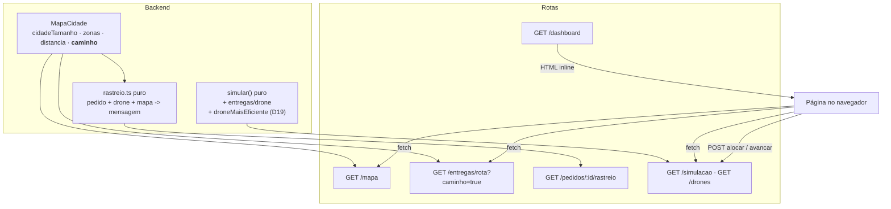
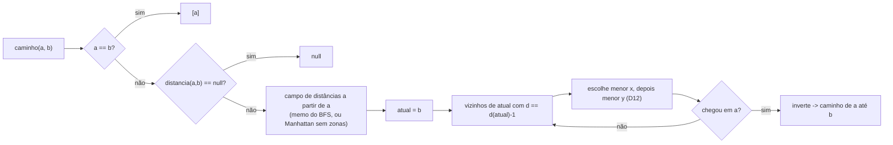

```mermaid
gantt
  title Bloco 7 — sequência das fases (TDD: vermelho antes de verde em cada uma)
  dateFormat X
  axisFormat %s
  section E6-3
  Apresentador + rota /mapa            :f1, 0, 1
  section E6-4
  caminho() no domínio                 :f2a, after f1, 2
  Schema + apresentador + rota         :f2b, after f2a, 1
  section E6-2
  rastreio.ts + GET /:id/rastreio      :f3, after f2b, 2
  section E6-1
  Métrica D19 + página + rota          :f4, after f3, 3
  section Docs
  ADRs, backlog, README                :f5, after f4, 1
```

# Implementation Plan: Bloco 7 — Dashboard & Feedback (Épico E6)

**Context:** O Bloco 6 fechou as restrições espaciais, mas deixou o mapa cego para o cliente da API:
as zonas de exclusão só existem dentro do processo e o desvio em volta delas nunca é observável —
uma viagem guarda paradas e distância total, jamais as células percorridas. Sem esses dois
habilitadores (E6-3 e E6-4) o dashboard desenharia um mapa incompleto e rotas em linha reta por cima
das zonas. Este bloco fecha o épico **E6** inteiro: expõe o mapa, torna o caminho observável, entrega
o dashboard web com métricas e mapa, e dá ao cliente uma mensagem de rastreio em linguagem amigável.

**Tech Stack:** Node.js 24 LTS · TypeScript (ESM, `NodeNext`) · Express 4 · Zod 3 · Vitest 4 +
supertest · HTML/CSS/SVG sem dependência externa.

---

## 0. Context to Load

> Leia TODOS os itens abaixo ANTES de começar a execução. São os arquivos que carregam as
> convenções, regras de domínio e padrões necessários para implementar este plano sem alucinar.
> Leia a versão ATUAL em disco — não confie em memória nem em suposição.

**Context docs (convenções e regras):**
- [ ] `CLAUDE.md` — diretrizes de arquitetura, comandos, idioma (pt-BR) e a regra do `.js` nos imports
- [ ] `context/metaspec.md` → seções `ARCHITECTURE` e `CRITICAL BUSINESS RULES`
- [ ] `context/index.md` → seções `Critical Files` e `Tests`
- [ ] `docs/DECISIONS.md` → **D8, D12, D16, D18, D19, D20, D24, D31, D35, D36, D37, D38** (a numeração
      nova deste bloco começa em **D39**)
- [ ] `docs/BACKLOG.md` → seção `E6 — Relatórios & Dashboard` (as 4 histórias e seus critérios de aceite)
- [ ] `context/walkthroughs/2026-07-27_Walkthrough_Bloco_6_Zonas_Exclusao.md` → §4 (as limitações que
      este bloco fecha)

**Reference code (padrões a imitar):**
- [ ] `src/api/rotas/drones.ts` — router mínimo sem schema Zod (padrão da rota de leitura pura)
- [ ] `src/api/rotas/entregas.ts` — router com objeto de dependências + filtro Zod na query
- [ ] `src/api/apresentadores/drone.ts` — apresentador com campo derivado na borda (`bateriaPercentual`)
- [ ] `src/api/apresentadores/viagem.ts` — apresentador de viagem (será estendido na Fase 2)
- [ ] `src/api/schemas/simulacao.ts` — schemas Zod de query (`schemaFiltrosViagem` será estendido)
- [ ] `src/domain/viagem.ts` → `compararPorXY` e `rotearNearestNeighbor` — o desempate D12 canônico
- [ ] `src/api/middleware-erros.ts` + `src/api/erros.ts` — envelope de erro e mapa código → HTTP

**Files to modify (leia o estado atual antes de alterar):**
- [ ] `src/domain/mapa.ts` — ganha `caminho()` na tarefa 2.2
- [ ] `src/domain/mapa.test.ts` — testes de caminho na tarefa 2.1
- [ ] `src/domain/simulacao.ts` — métricas de eficiência na tarefa 4.2
- [ ] `src/domain/simulacao.test.ts` — testes de eficiência na tarefa 4.1
- [ ] `src/api/server.ts` — monta `/mapa` (1.4), `/dashboard` (4.6) e a nova assinatura de pedidos (3.4)
- [ ] `src/api/schemas/simulacao.ts` — `schemaFiltrosViagem` ganha `caminho` na tarefa 2.4
- [ ] `src/api/apresentadores/viagem.ts` — caminho opcional por perna na tarefa 2.6
- [ ] `src/api/apresentadores/viagem.test.ts` — testes na tarefa 2.5
- [ ] `src/api/rotas/entregas.ts` — repassa `?caminho=true` ao apresentador na tarefa 2.8
- [ ] `src/api/rotas/entregas.test.ts` — testes na tarefa 2.7
- [ ] `src/api/rotas/pedidos.ts` — `GET /:id/rastreio` e nova assinatura na tarefa 3.4
- [ ] `src/api/rotas/pedidos.test.ts` — testes na tarefa 3.3
- [ ] `docs/DECISIONS.md` — ADRs D39–D42 na tarefa 5.1
- [ ] `docs/BACKLOG.md` — E6-1 a E6-4 para ✅ na tarefa 5.2
- [ ] `README.md` — seção E6 e exemplos na tarefa 5.3

---

## 1. Goals & Scope

### 1.1. Goals

* **Goals:** Fechar o épico E6 nas 4 histórias, na ordem em que se destravam:
  * **E6-3** — `GET /mapa` devolve malha, base e zonas de exclusão (leitura pura).
  * **E6-4** — o caminho percorrido entre duas paradas vira consultável, determinístico e derivado
    do mapa (nunca persistido), com o caminho canônico fixado em ADR.
  * **E6-1** — dashboard web servido pelo backend, com métricas (D19) e mapa da operação.
  * **E6-2** — `GET /pedidos/:id/rastreio` devolve o status do pacote em linguagem amigável.

### 1.2. Scope

* **Inputs:** o `MapaCidade` já composto no boot; os repositórios de pedidos, viagens e frota; a linha
  do tempo do `ServicoSimulacao`; `config.base` e `config.cidadeTamanho`.
* **Outputs:** 3 rotas novas (`GET /mapa`, `GET /pedidos/:id/rastreio`, `GET /dashboard`), 1 rota
  estendida (`GET /entregas/rota?caminho=true`), 2 campos novos nas métricas da simulação
  (`entregas` por drone e `droneMaisEficiente`) e uma página HTML autossuficiente.
* **In-Scope:** implementar tudo em **TDD** — em cada fase o teste é escrito primeiro e confirmado
  vermelho pelo motivo certo antes de qualquer linha de produção.
* **In-Scope:** registrar as 4 decisões deste bloco como ADRs **D39–D42** em `docs/DECISIONS.md`.
* **In-Scope:** atualizar `README.md` (seção E6 + tabela de endpoints + exemplos `curl`) e marcar
  E6-1 a E6-4 como ✅ em `docs/BACKLOG.md`.
* **Out-of-Scope:** Não criar endpoint de escrita, edição ou remoção de zonas — a leitura do E6-3 é
  somente leitura.
* **Out-of-Scope:** Não criar um endpoint agregador `GET /dashboard/dados` — a página consome as rotas
  que já existem.
* **Out-of-Scope:** Não editar `context/metaspec.md`, `context/index.md` nem `context/timeline.md` —
  esses arquivos só mudam via `/context-update`, depois do merge.
* **Out-of-Scope:** Não adicionar dependência de runtime nova (nem npm, nem CDN, nem framework de front).
* **Out-of-Scope:** Não atacar as dívidas abertas de outros blocos (paginação, `carga_iniciada`,
  regravação integral de `viagens.json`, memo sem limite) — são E8-2.
* **Constraint:** O caminho deve ser **derivado do mapa e nunca persistido** — nem em `viagens.json`,
  nem no tipo `Viagem` (mesma lógica de D31/D37).
* **Constraint:** Sem zonas configuradas, o caminho devolvido deve ser um trajeto Manhattan mínimo —
  a constraint de compatibilidade do Bloco 6 continua valendo em código, não só em teste.
* **Constraint:** O caminho deve ser **determinístico**: dois boots do mesmo estado produzem
  exatamente a mesma sequência de células, por regra de desempate explícita.
* **Constraint:** `MapaCidade` deve continuar referencialmente transparente para o chamador — sem I/O,
  relógio ou aleatoriedade (D13).
* **Constraint:** O payload padrão de `GET /entregas/rota` não pode crescer — o caminho só entra
  quando pedido explicitamente.
* **Constraint:** A página do dashboard deve ser **autossuficiente**: HTML, CSS e JS inline, sem
  nenhuma requisição a host externo.
* **Constraint:** `npm run build` deve continuar sendo `tsc -p tsconfig.build.json` puro, sem passo de
  cópia de assets — e `npm start` deve servir o dashboard igual ao `npm run dev`.
* **Constraint:** Nenhuma rota escolhe status HTTP — o mapa único em `src/api/erros.ts` segue sendo o
  dono (D20).
* **Constraint:** `typecheck`, `lint`, `format:check`, `test` e `build` verdes ao final.

---

## 2. Technical Design

### Decisões travadas nesta sessão (viram D39–D42)

| # | Decisão | Escolha | Motivo |
| --- | --- | --- | --- |
| **D39** | Caminho canônico | Backtracking sobre o campo de distâncias já memoizado, desempate por **menor `x`, depois menor `y`** | Zero memória extra sobre o BFS que já existe (o memo sem limite já é dívida E8-2), e reusa literalmente o desempate D12 do roteamento. Regra explícita, não "o que a fila do BFS calhou de produzir" |
| **D40** | Exposição do caminho | Opt-in em `GET /entregas/rota?caminho=true`, derivado na borda | `GET /simulacao/eventos` e `GET /entregas/rota` seguem sem paginação; embutir por padrão infla a listagem para todo consumidor por causa de um só |
| **D41** | Entrega da página | Módulo TS que exporta o HTML como template string | `tsc` não copia `.html`: um `public/` exigiria script de cópia no build e um ponto novo de falha no CI. Como módulo, compila junto e `npm start` serve idêntico ao `dev` |
| **D42** | Distância no rastreio | Distância real do mapa, contornando zonas | Depois de D36 é a única métrica do sistema; Manhattan reto anunciaria "2 quadras" com 8 de desvio pela frente. **Atualiza o critério de aceite do E6-2**, escrito antes do Bloco 6 |

### Data Flow

1. **Mapa legível (E6-3):** `GET /mapa` → apresentador combina `mapa.cidadeTamanho` + `mapa.zonas` +
   `config.base` → JSON. Sem repositório no caminho: o dado é derivado da config (D37).
2. **Campo de distâncias:** `mapa.caminho(a, b)` obtém o mesmo campo de distâncias que `mapa.distancia`
   já usa — o memo do BFS quando há zonas, ou `distanciaManhattan` quando não há.
3. **Backtracking (E6-4):** parte de `b` e caminha para trás escolhendo, entre os vizinhos com
   distância `d − 1`, o de menor `x` e depois menor `y`; inverte a lista ao chegar em `a`.
4. **Exposição opt-in (E6-4):** `GET /entregas/rota?caminho=true` → o apresentador de viagem calcula
   uma perna por par consecutivo de `viagem.paradas`, cada uma com suas células.
5. **Rastreio (E6-2):** `GET /pedidos/:id/rastreio` → localiza a viagem que contém o `pedidoId` →
   busca o drone → `mapa.distancia(drone.posicao, pedido.destino)` → função pura do domínio monta a
   mensagem conforme o status.
6. **Eficiência (E6-1):** o motor de simulação passa a contar entregas por drone e a eleger o
   `droneMaisEficiente` = entregas ÷ distância percorrida (D19), tudo dentro da função pura `simular`.
7. **Dashboard (E6-1):** `GET /dashboard` devolve a página; o JS inline faz `fetch` em `/mapa`,
   `/simulacao`, `/drones` e `/entregas/rota?caminho=true`, desenha o SVG e liga os botões de
   `POST /entregas/alocar` e `POST /simulacao/avancar`.



### O backtracking, passo a passo



### Data Structures (Draft)

```
// src/domain/mapa.ts — MapaCidade ganha um método
caminho(a: Coordenada, b: Coordenada): readonly Coordenada[] | null
  // inclui as duas pontas; comprimento = distancia(a,b) + 1
  // null exatamente quando distancia(a,b) === null

// pseudocódigo do backtracking (D39)
função caminho(a, b):
    se a == b: devolve [a]
    d = distanciaAte(a, b)                 // memo com zonas; Manhattan sem zonas
    se d == null: devolve null
    reverso = [b]; atual = b
    enquanto atual != a:
        candidatos = vizinhos(atual)
                       .filtra(dentroDaMalha e não bloqueada)
                       .filtra(distanciaAte(a, v) == distanciaAte(a, atual) - 1)
        atual = candidatos.min(por menor x, depois menor y)   // D12
        reverso.push(atual)
    devolve reverso.invertido()

// src/api/apresentadores/mapa.ts (E6-3)
RespostaMapa = { cidadeTamanho: number, base: Coordenada, zonas: ZonaExclusao[] }

// src/api/apresentadores/viagem.ts (E6-4) — campo opcional
PernaCaminho = { de: Coordenada, ate: Coordenada, celulas: Coordenada[] }
RespostaViagem = { ...campos de hoje..., caminho?: PernaCaminho[] }
paraRespostaViagem(viagem, opcoes?: { mapa: MapaCidade })   // sem opcoes -> sem caminho

// src/domain/rastreio.ts (E6-2) — função pura
OpcoesRastreio = { pedido, drone?: Drone, mapa: MapaCidade }
Rastreio = { pedidoId, status, mensagem, distanciaQuadras?, droneId? }
montarRastreio(opcoes): Rastreio

// src/domain/simulacao.ts (E6-1/D19) — extensões
MetricasPorDrone  += entregas: number, eficiencia: number  // entregas / distanciaQuadras
MetricasSimulacao += droneMaisEficiente: string | null     // maior eficiência; empate -> menor droneId

// src/dashboard/pagina.ts (E6-1/D41)
paginaDashboard(): string   // HTML completo, CSS e JS inline, zero host externo
```

### Impacto nos arquivos

```text
case_dti/
├── src/
│   ├── domain/
│   │   ├── mapa.ts                          [MODIFY]  + caminho() e o backtracking D39
│   │   ├── mapa.test.ts                     [MODIFY]  + casos de caminho
│   │   ├── rastreio.ts                      [ADD]     função pura de mensagem ao cliente (E6-2)
│   │   ├── rastreio.test.ts                 [ADD]
│   │   ├── simulacao.ts                     [MODIFY]  + entregas/drone e droneMaisEficiente (D19)
│   │   └── simulacao.test.ts                [MODIFY]
│   ├── api/
│   │   ├── server.ts                        [MODIFY]  monta /mapa e /dashboard; nova assinatura de pedidos
│   │   ├── schemas/simulacao.ts             [MODIFY]  schemaFiltrosViagem += caminho
│   │   ├── schemas/simulacao.test.ts        [ADD]     (se ainda não existir) guarda do "false" textual
│   │   ├── apresentadores/mapa.ts           [ADD]     RespostaMapa (E6-3)
│   │   ├── apresentadores/mapa.test.ts      [ADD]
│   │   ├── apresentadores/viagem.ts         [MODIFY]  + caminho opcional por perna
│   │   ├── apresentadores/viagem.test.ts    [MODIFY]
│   │   ├── rotas/mapa.ts                    [ADD]     GET /mapa (E6-3)
│   │   ├── rotas/mapa.test.ts               [ADD]
│   │   ├── rotas/dashboard.ts               [ADD]     GET /dashboard (E6-1)
│   │   ├── rotas/dashboard.test.ts          [ADD]
│   │   ├── rotas/entregas.ts                [MODIFY]  repassa ?caminho=true
│   │   ├── rotas/entregas.test.ts           [MODIFY]
│   │   ├── rotas/pedidos.ts                 [MODIFY]  + GET /:id/rastreio; dependências em objeto
│   │   └── rotas/pedidos.test.ts            [MODIFY]
│   └── dashboard/
│       ├── pagina.ts                        [ADD]     HTML/CSS/SVG/JS inline (D41)
│       ├── pagina.test.ts                   [ADD]
│       └── .gitkeep                         [DELETE]  o diretório deixa de estar vazio
├── docs/
│   ├── DECISIONS.md                         [MODIFY]  ADRs D39-D42
│   └── BACKLOG.md                           [MODIFY]  E6-1..E6-4 -> ✅
└── README.md                                [MODIFY]  seção E6, endpoints e exemplos
```



---

## 3. Phased Execution

> **TDD obrigatório.** Em cada fase, a tarefa de teste vem primeiro e sua verificação é *"o teste
> falha pelo motivo certo"* (módulo inexistente, propriedade `undefined`, assinatura incompatível —
> nunca erro de digitação). Só então a tarefa de implementação, cuja verificação é *"o teste passa"*.

### Phase 1: Mapa legível pela API (API Layer — E6-3)

- [ ] **1.1: Teste do apresentador de mapa** [ADD: src/api/apresentadores/mapa.test.ts]
    - `paraRespostaMapa(mapa, base)` devolve `{ cidadeTamanho, base, zonas }`.
    - Mapa sem zonas devolve `zonas: []` (lista vazia, nunca `undefined` nem erro).
    - Mapa com 2 zonas devolve as duas, com `de`/`ate` intactos.
    - *Verification:* `npm test -- mapa` falha por módulo inexistente.
- [ ] **1.2: Apresentador de mapa** [ADD: src/api/apresentadores/mapa.ts]
    - `RespostaMapa` + `paraRespostaMapa`, no mesmo formato de `apresentadores/drone.ts`.
    - *Verification:* os testes de 1.1 passam.
- [ ] **1.3: Teste da rota GET /mapa** [ADD: src/api/rotas/mapa.test.ts]
    - Via supertest, com `criarApp` e as dependências em memória (siga o fixture de `drones.test.ts`).
    - 200 com `cidadeTamanho`, `base` e `zonas`; com zonas configuradas, elas aparecem.
    - *Verification:* falha com 404 (rota ainda não montada).
- [ ] **1.4: Rota GET /mapa** [ADD: src/api/rotas/mapa.ts] [MODIFY: src/api/server.ts]
    - `criarRotasMapa(mapa)` no padrão de `rotas/drones.ts` (sem Zod — não há corpo nem query);
      a base vem de `config.base`, como já fazem `rotas/pedidos.ts` e `rotas/entregas.ts`.
    - Montar `app.use('/mapa', ...)` **antes** de `rotaNaoEncontrada` e `tratarErros`.
    - *Verification:* os testes de 1.3 passam; `npm test` inteiro verde.

### Phase 2: Caminho percorrido observável (Core Domain + API — E6-4/D39/D40)

- [ ] **2.1: Testes de `caminho()` no mapa** [MODIFY: src/domain/mapa.test.ts]
    - Sem zonas: `caminho` é um trajeto Manhattan mínimo — `comprimento === distancia(a,b) + 1`, cada
      passo é adjacente ao anterior, sem repetição.
    - Com zona no meio: o caminho **não contém nenhuma célula bloqueada** e o comprimento bate com
      `distancia(a,b) + 1`.
    - Determinismo: duas chamadas iguais e dois mapas criados da mesma config produzem o mesmo array.
    - Desempate: num cenário com dois caminhos mínimos, o eleito é o de menor `x` e depois menor `y`
      (assert do array exato, não só do comprimento).
    - `a === b` devolve `[a]`; destino cercado/bloqueado devolve `null` (mesma condição de `distancia`).
    - *Verification:* falha com `mapa.caminho is not a function`.
- [ ] **2.2: `caminho()` no `MapaCidade`** [MODIFY: src/domain/mapa.ts]
    - Extrair o acesso ao campo de distâncias para um helper interno único, usado por `distancia` e
      por `caminho`: memo do BFS quando há zonas, `distanciaManhattan` quando não há. **Uma única
      rotina de backtracking para os dois casos** — é o que garante a constraint de compatibilidade
      em código, e não só em teste.
    - Backtracking conforme o pseudocódigo da Seção 2, com desempate `compararPorXY` (D12).
    - Não introduzir estado novo: o memo continua sendo o do BFS por origem.
    - *Verification:* os testes de 2.1 passam; os testes pré-existentes de `mapa.test.ts` seguem verdes.
- [ ] **2.3: Teste do filtro `caminho` na query** [ADD: src/api/schemas/simulacao.test.ts]
    - `schemaFiltrosViagem` aceita `caminho` ausente, `"true"` e `"false"`.
    - **`?caminho=false` NÃO pode ligar o caminho** — é o motivo de não usar `z.coerce.boolean()`,
      que trata qualquer string não vazia como `true`.
    - Valor fora do conjunto é rejeitado (vira 400 pelo middleware).
    - *Verification:* falha por `caminho` inexistente no tipo do schema.
- [ ] **2.4: `schemaFiltrosViagem` ganha `caminho`** [MODIFY: src/api/schemas/simulacao.ts]
    - `z.enum(['true','false']).optional()` — valida a forma, o significado fica na rota.
    - *Verification:* os testes de 2.3 passam.
- [ ] **2.5: Testes do apresentador com caminho** [MODIFY: src/api/apresentadores/viagem.test.ts]
    - Sem `opcoes`, a resposta **não tem** a chave `caminho` (payload de hoje, byte a byte).
    - Com `{ mapa }`, `caminho` traz uma perna por par consecutivo de `paradas`, cada uma com
      `de`, `ate` e `celulas`; a primeira começa na base e a última termina na base.
    - *Verification:* falha por propriedade inexistente no tipo `RespostaViagem`.
- [ ] **2.6: Caminho opcional no apresentador** [MODIFY: src/api/apresentadores/viagem.ts]
    - Segundo parâmetro opcional `{ mapa }`; monta as pernas de `viagem.paradas`. Perna sem rota é
      estado inalcançável para viagem já planejada — deixe `ROTA_IMPOSSIVEL` propagar (500), coerente
      com `viagem.ts` e `simulacao.ts`.
    - *Verification:* os testes de 2.5 passam.
- [ ] **2.7: Testes de `GET /entregas/rota?caminho=true`** [MODIFY: src/api/rotas/entregas.test.ts]
    - Sem o parâmetro, a resposta é idêntica à de hoje (regressão).
    - Com `caminho=true` e uma zona configurada, o caminho da perna contorna a zona.
    - `caminho=true` combina com `status=` sem conflito.
    - *Verification:* falha porque a resposta ainda não traz `caminho`.
- [ ] **2.8: Rota repassa a opção ao apresentador** [MODIFY: src/api/rotas/entregas.ts]
    - *Verification:* os testes de 2.7 passam; `npm test` inteiro verde.

### Phase 3: Feedback ao cliente (Core Domain + API — E6-2/D42)

- [ ] **3.1: Testes de `montarRastreio`** [ADD: src/domain/rastreio.test.ts]
    - Uma mensagem própria e clara por status: `pendente`, `alocado`, `em_voo`, `entregue`, `cancelado`.
    - `em_voo`: a mensagem cita a distância do drone ao destino **em quadras**, vinda do mapa; com uma
      zona entre drone e cliente, o número é o desviado, não o Manhattan reto (D42).
    - `em_voo` com drone na própria coordenada do cliente → faixa "chegando" (0 quadras).
    - `em_voo` sem drone localizável, ou sem rota, degrada para uma mensagem sem distância — **não
      lança**: é leitura para o cliente final, não invariante de domínio.
    - Função pura: sem I/O, relógio ou aleatoriedade.
    - *Verification:* falha por módulo inexistente.
- [ ] **3.2: `rastreio.ts` no domínio** [ADD: src/domain/rastreio.ts]
    - `montarRastreio({ pedido, drone?, mapa })` → `Rastreio`. Textos em pt-BR, tom de cliente final.
    - Usar `Record<StatusPedido, ...>` exaustivo, no mesmo espírito do mapa de transições de `drone.ts`
      e do mapa de status HTTP: status novo sem mensagem declarada quebra o typecheck.
    - *Verification:* os testes de 3.1 passam.
- [ ] **3.3: Testes de `GET /pedidos/:id/rastreio`** [MODIFY: src/api/rotas/pedidos.test.ts]
    - 200 para pedido `pendente` recém-cadastrado, com mensagem e sem `distanciaQuadras`.
    - Após alocar e avançar o relógio, um pedido `em_voo` traz `droneId` e `distanciaQuadras`.
    - `id` inexistente → 404 no envelope padronizado, com `PEDIDO_NAO_ENCONTRADO`.
    - Regressão: as 4 rotas de pedido existentes seguem funcionando após a troca de assinatura.
    - *Verification:* falha com 404 de rota inexistente.
- [ ] **3.4: Rota de rastreio** [MODIFY: src/api/rotas/pedidos.ts] [MODIFY: src/api/server.ts]
    - `criarRotasPedidos` passa a receber um objeto `{ pedidos, viagens, frota, mapa }`, seguindo o
      precedente de `DependenciasEntregas` — não acrescente parâmetros posicionais.
    - A rota localiza a viagem que contém o `pedidoId` para chegar ao `droneId`; se não houver viagem
      ou drone, chama `montarRastreio` sem o drone.
    - Registrar `GET /:id/rastreio` junto das demais; a rota nunca escolhe status (D20).
    - *Verification:* os testes de 3.3 passam; `npm test` inteiro verde (o typecheck vai enumerar todo
      chamador de `criarRotasPedidos` — ajuste os fixtures como no Bloco 6).

### Phase 4: Dashboard web (Core Domain + API — E6-1/D18/D19/D41)

- [ ] **4.1: Testes da métrica de eficiência** [MODIFY: src/domain/simulacao.test.ts]
    - `MetricasPorDrone` ganha `entregas` (quantos pedidos aquele drone entregou) e `eficiencia`.
    - `droneMaisEficiente` = maior `entregas ÷ distanciaQuadras` (D19); empate resolve por menor
      `droneId`; sem viagens, é `null`.
    - Guarda: distância 0 não produz `Infinity` nem `NaN`.
    - Regressão: `totalEntregas`, `makespanMin` e `tempoMedioEntregaMin` não mudam de valor.
    - *Verification:* falha por propriedade inexistente em `MetricasPorDrone`.
- [ ] **4.2: Eficiência no motor de simulação** [MODIFY: src/domain/simulacao.ts]
    - Contar as entregas por drone dentro do laço que já existe; eleger o mais eficiente ao final.
    - A função continua pura e determinística (D13). `RespostaMetricas` é alias do tipo do domínio —
      os campos novos fluem para `GET /simulacao` sem tocar no apresentador.
    - *Verification:* os testes de 4.1 passam.
- [ ] **4.3: Teste da página** [ADD: src/dashboard/pagina.test.ts]
    - `paginaDashboard()` devolve HTML com `<!doctype html>`, `<title>` e os contêineres que o JS usa.
    - **Autossuficiência:** o HTML não contém `src="http`, `href="http` nem `//cdn` — assert explícito.
    - Determinismo: duas chamadas devolvem exatamente a mesma string.
    - *Verification:* falha por módulo inexistente.
- [ ] **4.4: Página do dashboard** [ADD: src/dashboard/pagina.ts] [DELETE: src/dashboard/.gitkeep]
    - HTML + CSS + JS inline, em pt-BR. Painel de métricas (entregas realizadas, tempo médio por
      entrega, makespan, drone mais eficiente) e mapa em **SVG** desenhado a partir de `/mapa`:
      malha, base, zonas (retângulos), clientes e as rotas usando `caminho` (não linhas retas).
    - Controles: botão "Alocar pedidos" (`POST /entregas/alocar`) e "Avançar relógio" com campo de
      minutos (`POST /simulacao/avancar`), recarregando os dados após cada ação.
    - Fontes de dados: `/mapa`, `/simulacao`, `/drones`, `/entregas/rota?caminho=true`.
    - Escapar qualquer texto vindo da API antes de injetar no DOM (`textContent`, nunca `innerHTML`
      com dado de resposta).
    - *Verification:* os testes de 4.3 passam.
- [ ] **4.5: Teste da rota GET /dashboard** [ADD: src/api/rotas/dashboard.test.ts]
    - 200 com `content-type` `text/html`; o corpo contém o `<title>` esperado.
    - *Verification:* falha com 404.
- [ ] **4.6: Rota GET /dashboard** [ADD: src/api/rotas/dashboard.ts] [MODIFY: src/api/server.ts]
    - `res.type('html').send(paginaDashboard())`. Sem `express.static`, sem asset em disco (D41).
    - *Verification:* os testes de 4.5 passam; `npm run build && npm start` serve o dashboard a partir
      de `dist/` — a prova de que D41 se sustenta.

### Phase 5: Documentação e fechamento do épico (Cleanup)

- [ ] **5.1: ADRs D39–D42** [MODIFY: docs/DECISIONS.md]
    - Uma entrada por decisão da tabela da Seção 2, no formato do arquivo (Contexto / Escolha /
      Porquê / Alternativas descartadas). D42 deve dizer explicitamente que **atualiza** o critério de
      aceite do E6-2, escrito antes de D36.
    - *Verification:* os 4 ADRs existem, numerados na sequência, sem quebrar a numeração anterior.
- [ ] **5.2: Épico E6 concluído** [MODIFY: docs/BACKLOG.md]
    - E6-1, E6-2, E6-3 e E6-4 de 🔲 para ✅, cada uma com a nota de implementação e o ADR relevante,
      no padrão que E5-1/E5-2 usam. Ajustar o critério de aceite do E6-2 para a distância real (D42).
    - *Verification:* nenhuma história do E6 permanece 🔲.
- [ ] **5.3: README** [MODIFY: README.md]
    - Nova seção `### Implementados (E6 — Relatórios & Dashboard)` seguindo o formato das anteriores;
      as 3 rotas novas e o parâmetro `?caminho=true` na tabela de endpoints; exemplos `curl` de
      `/mapa` e `/pedidos/:id/rastreio`; instrução de abrir `http://localhost:3000/dashboard`.
    - *Verification:* `npm run format:check` verde (o `.prettierignore` exclui `*.md`, então a tabela
      alinhada à mão é preservada — confira o alinhamento manualmente).
- [ ] **5.4: Verificação final** [MODIFY: —]
    - Rodar, nesta ordem: `npm run typecheck`, `npm run lint`, `npm run format:check`, `npm test`,
      `npm run coverage`, `npm run build`.
    - *Verification:* os 6 verdes; cobertura do domínio permanece **≥ 95%** e a total **≥ 90%**.
      Reportar os números reais da execução, nunca estimados.

---

## 4. Test Strategy

- [ ] **Unit (domínio):** `mapa.caminho` (compatibilidade sem zonas, contorno com zonas, determinismo,
      desempate exato, `a === b`, `null` sem rota); `montarRastreio` (uma mensagem por status,
      distância desviada, degradação sem drone); métricas de eficiência (empate, distância zero,
      regressão das métricas antigas).
- [ ] **Unit (borda):** apresentadores de mapa e de viagem — em especial que **o payload padrão da
      viagem não muda** quando o caminho não é pedido.
- [ ] **Unit (schema):** `schemaFiltrosViagem` com `caminho=false` — o teste que existe justamente para
      travar o footgun do `z.coerce.boolean()`.
- [ ] **Integration (supertest, sem porta real):** `GET /mapa`, `GET /entregas/rota?caminho=true`,
      `GET /pedidos/:id/rastreio` (pendente, em_voo, id inexistente) e `GET /dashboard` (200 + html).
      Fluxo ponta a ponta: cadastrar → alocar → avançar → rastrear.
- [ ] **Regressão:** a suíte inteira verde. Toda rota existente mantém o payload de hoje; nenhuma
      persistência ganha campo novo (`viagens.json` e `pedidos.json` inalterados).
- [ ] **Carga:** o teste de ~500 pedidos que já existe continua no mesmo patamar de tempo — `caminho`
      não é chamado na alocação, apenas na borda, sob demanda.

---

## 5. Rollback & Risks

- **Risco:** `z.coerce.boolean()` trata `"false"` como `true` — `?caminho=false` ligaria o caminho.
    - *Mitigação:* `z.enum(['true','false'])` e o teste 2.3 escrito **antes** da implementação,
      exatamente para esse caso.
- **Risco:** o backtracking entra em laço infinito se nenhum vizinho tiver distância `d − 1` (bug no
  campo de distâncias) ou se a comparação de coordenadas falhar.
    - *Mitigação:* o campo de distâncias é o do BFS já validado no Bloco 6; ainda assim, guarda de
      passos máximos igual a `d` — estouro lança `ROTA_IMPOSSIVEL` em vez de travar o processo.
- **Risco:** o caminho sem zonas divergir do trajeto Manhattan, quebrando a constraint do Bloco 6.
    - *Mitigação:* uma **única** rotina de backtracking para os dois casos (2.2), mais o teste de
      comprimento e adjacência em malha sem zonas.
- **Risco:** trocar a assinatura de `criarRotasPedidos` derruba chamadores além dos listados — foi
  exatamente o que aconteceu no Bloco 6 com `Dependencias.mapa`.
    - *Mitigação:* rodar `npm run typecheck` logo após a mudança e deixar o compilador enumerar os
      chamadores; é ajuste mecânico de fixture, sem decisão de projeto.
- **Risco:** `?caminho=true` sobre muitas viagens gera payload grande, agravando a ausência de
  paginação já registrada como E8-2.
    - *Mitigação:* opt-in por design (D40) — o padrão continua sem caminho; registrar o ponto como
      observação de E8-2 no walkthrough, sem tentar resolver paginação aqui.
- **Risco:** a página HTML como template string sofrer com escape de crase/`${}` do TypeScript.
    - *Mitigação:* o teste 4.3 compara a string produzida e checa marcadores; qualquer escape errado
      aparece como HTML quebrado no assert, não em produção.
- **Risco:** o dashboard funcionar em `npm run dev` e falhar em `npm start` por asset não copiado.
    - *Mitigação:* é precisamente o que D41 elimina; a verificação 4.6 exige rodar o build e servir de
      `dist/` antes de dar a fase por concluída.
- **Rollback:** todo o trabalho vive em uma branch `feat/bloco-7`; `git checkout main` descarta tudo.
  As mudanças são aditivas — nenhuma rota existente muda de contrato, nenhum arquivo persistido muda
  de schema, e o caminho nunca chega ao disco. Reverter o merge não deixa estado a migrar.
