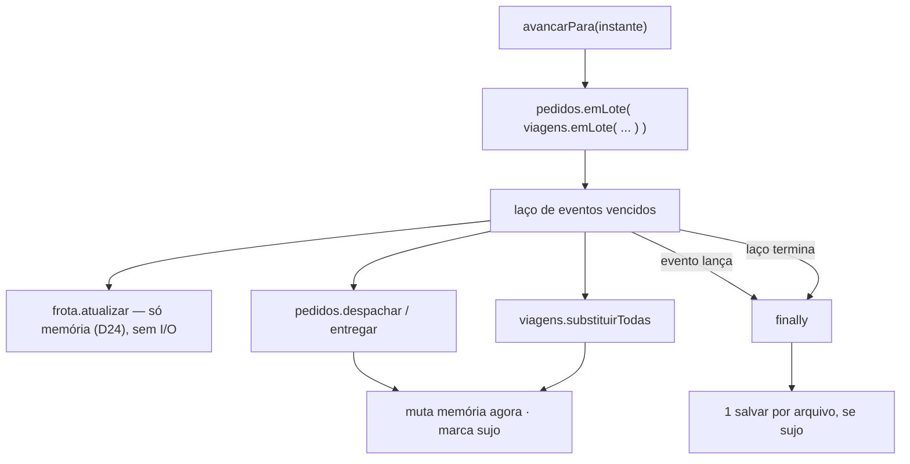

```mermaid
gantt
  title Saneamento — sequência (TDD: vermelho antes de verde em cada fase)
  dateFormat X
  axisFormat %s
  section Rastreio
  Plural morto                    :f1, 0, 1
  section Repositórios
  emLote em pedidos e viagens     :f2, after f1, 2
  section Serviço
  avancarPara em lote             :f3, after f2, 2
  section Motor
  VIAGEM_INCONSISTENTE            :f4, after f3, 1
  section Docs
  ADRs D43-D44                    :f5, after f4, 1
```

# Implementation Plan: Saneamento de três dívidas técnicas

**Context:** Três dívidas registradas no metaspec, de custo baixo e retorno alto, que não pertencem a
nenhum épico do backlog: um ramo morto no formatador de plural do rastreio, a regravação integral dos
arquivos JSON a cada evento aplicado no avanço do relógio (O(n²) de I/O), e uma viagem apontando para
drone inexistente sendo ignorada em silêncio pelo motor de simulação, contra o padrão de "falhar alto"
do domínio.

**Tech Stack:** Node.js 24 LTS · TypeScript (ESM, `NodeNext`) · Express 4 · Vitest 4 + supertest.

---

## 0. Context to Load

> Leia TODOS os itens abaixo ANTES de começar a execução. Leia a versão ATUAL em disco — não confie
> em memória nem em suposição.

**Context docs (convenções e regras):**
- [ ] `CLAUDE.md` — diretrizes de arquitetura, comandos, idioma (pt-BR) e a regra do `.js` nos imports
- [ ] `context/metaspec.md` → seção `CURRENT STATE` (as três dívidas estão listadas lá) e
      `CRITICAL BUSINESS RULES`
- [ ] `docs/DECISIONS.md` → **D6, D20, D26, D27, D30, D31, D32, D42** (a numeração nova começa em **D43**)

**Reference code (padrões a imitar):**
- [ ] `src/repositorio/pedidos.ts` → `mutarEmLote` — o padrão de "valida tudo, muta tudo, grava uma vez"
      que este plano generaliza para o avanço inteiro
- [ ] `src/domain/erros.ts` + `src/api/erros.ts` — como um código novo entra no `Record` exaustivo
- [ ] `src/infra/persistencia-viagens.ts` → `criarPersistenciaMemoria` — o dublê que os testes espionam

**Files to modify (leia o estado atual antes de alterar):**
- [ ] `src/domain/rastreio.ts` — plural na tarefa 1.2
- [ ] `src/domain/rastreio.test.ts` — teste na tarefa 1.1
- [ ] `src/repositorio/pedidos.ts` — `emLote` na tarefa 2.2
- [ ] `src/repositorio/pedidos.test.ts` — testes na tarefa 2.1
- [ ] `src/repositorio/viagens.ts` — `emLote` na tarefa 2.4
- [ ] `src/repositorio/viagens.test.ts` — testes na tarefa 2.3
- [ ] `src/servicos/simulacao.ts` — `avancarPara` na tarefa 3.2
- [ ] `src/servicos/simulacao.test.ts` — testes nas tarefas 3.1 e 4.3
- [ ] `src/domain/simulacao.ts` — `throw` na tarefa 4.2
- [ ] `src/domain/simulacao.test.ts` — teste na tarefa 4.1
- [ ] `src/domain/erros.ts` — código novo na tarefa 4.2
- [ ] `src/api/erros.ts` — mapa HTTP na tarefa 4.2
- [ ] `docs/DECISIONS.md` — ADRs D43–D44 na tarefa 5.1

---

## 1. Goals & Scope

### 1.1. Goals

* **Goals:** Fechar três dívidas do metaspec sem alterar nenhum contrato público da API:
  * **Plural morto** — remover o ramo inalcançável de `rastreio.ts`, levando o arquivo a 100% de branches.
  * **I/O em lote** — `POST /simulacao/avancar` passa a gravar `pedidos.json` e `viagens.json` **uma
    vez cada**, em vez de uma vez por evento aplicado.
  * **Falhar alto** — viagem cujo `droneId` não existe na frota lança `VIAGEM_INCONSISTENTE` (500) em
    vez de ser pulada em silêncio.

### 1.2. Scope

* **Inputs:** o estado atual dos repositórios de pedidos, viagens e frota; a linha do tempo já
  computada pelo `ServicoSimulacao`.
* **Outputs:** mesmo comportamento observável nas rotas, com uma escrita por arquivo por avanço; um
  código de erro novo, alcançável apenas em estado inconsistente.
* **In-Scope:** implementar em **TDD** — teste vermelho pelo motivo certo antes de cada implementação.
* **In-Scope:** registrar as duas decisões como ADRs **D43–D44** em `docs/DECISIONS.md`.
* **Out-of-Scope:** Não editar `context/metaspec.md`, `context/index.md` nem `context/timeline.md` —
  só mudam via `/context-update`, depois do merge.
* **Out-of-Scope:** Não atacar as demais dívidas listadas no metaspec (reconciliação contra o mapa,
  `carga_iniciada`, drone por snapshot, reinício do relógio, D26, memo sem limite, paginação).
* **Out-of-Scope:** Não adicionar `happy-dom` nem testar o JS embutido do dashboard — decisão separada.
* **Out-of-Scope:** Não documentar `VIAGEM_INCONSISTENTE` no README — o arquivo mostra exemplos de erro
  do cliente, e este é 500 de inconsistência interna, inalcançável por requisição válida.
* **Constraint:** Nenhuma rota pode mudar de contrato — status, payloads e mensagens permanecem os de
  hoje para todo caminho alcançável por requisição válida.
* **Constraint:** A mutação **em memória** continua imediata; apenas a **gravação** é adiada. Leitura
  após escrita dentro do mesmo avanço tem de enxergar o estado novo — é disso que
  `atualizarStatusViagem` depende para o seu early-return.
* **Constraint:** O flush tem de acontecer mesmo quando um evento lança (`finally`), preservando a
  semântica atual de "progresso parcial fica em disco".
* **Constraint:** `emLote` reentrante não pode gravar cedo: só o lote mais externo faz o flush.
* **Constraint:** O `throw` novo não pode quebrar o boot — a reconciliação D27 roda **antes** de
  `criarServicoSimulacao` em `src/index.ts`, e essa ordem tem de continuar valendo.
* **Constraint:** `typecheck`, `lint`, `format:check`, `test` e `build` verdes ao final; cobertura do
  domínio não pode cair.

---

## 2. Technical Design

### Decisões travadas nesta sessão (viram D43–D44)

| # | Decisão | Escolha | Motivo |
| --- | --- | --- | --- |
| **D43** | Persistência no avanço do relógio | *Unit of work*: repositórios ganham `emLote(fn)`, que adia a gravação e faz o flush em `finally` | Colapsa N escritas em 1 por arquivo sem trocar throughput por corretude — um evento que lança continua deixando o progresso parcial em disco |
| **D44** | Viagem de drone inexistente | Lança `VIAGEM_INCONSISTENTE` (500), código novo | Depois de D27 esse estado é bug de invariante, não entrada válida. `DRONE_NAO_ENCONTRADO` mapeia 404 e mentiria sobre a natureza da falha |

### Por que o batching cobre pedidos também

O laço de `avancarPara` toca dois arquivos, e o volume está no que **não** estava registrado:

| Repositório | Gravações hoje, por avanço | Depois |
| --- | --- | --- |
| `viagens.json` | 2 por viagem (`em_execucao`, `concluida`) | 1 |
| `pedidos.json` | 1 por decolagem + **1 por pedido entregue** | 1 |

Com `n` pedidos, cada gravação serializa o arquivo inteiro: `O(n)` escritas × `O(n)` bytes = `O(n²)`.
Corrigir só viagens deixaria de pé exatamente o termo dominante.

### O mecanismo: `emLote` no repositório, não no serviço

A alternativa seria o serviço acumular as mutações e chamar `substituirTodas` uma vez no fim. Não
serve: o repositório de pedidos não expõe "substituir tudo" — expõe transições de domínio
(`despachar`, `entregar`), e é isso que garante que a regra de status não seja duplicada fora dele.
Manter o repositório como dono da persistência e dar a ele um modo de lote preserva esse desenho.



### Data Structures (Draft)

```
// src/repositorio/pedidos.ts e src/repositorio/viagens.ts — mesma forma nos dois
Repositorio* += emLote<T>(fn: () => T): T

// pseudocódigo do modo de lote (D43)
let adiando = false
let sujo    = false

função persistir():                    // substitui as chamadas diretas a persistencia.salvar
    se adiando: sujo = true; retorna   // memória já foi mutada pelo chamador
    persistencia.salvar(estado)

função emLote(fn):
    se adiando: retorna fn()           // reentrante: o lote externo faz o flush
    adiando = true
    tente:
        retorna fn()
    finalmente:
        adiando = false
        se sujo: sujo = false; persistencia.salvar(estado)

// src/servicos/simulacao.ts — avancarPara envolve só o laço
função avancarPara(instanteMin):
    ...guarda de AVANCO_INVALIDO (inalterada)...
    aplicados = pedidos.emLote(() => viagens.emLote(() => {
        ...laço de eventos vencidos, idêntico ao de hoje...
    }))
    instante = instanteMin
    devolve { instanteAtual: instante, eventosAplicados: aplicados }

// src/domain/erros.ts
CodigoErroDominio += 'VIAGEM_INCONSISTENTE'
// src/api/erros.ts
VIAGEM_INCONSISTENTE: 500      // ao lado de EMPACOTAMENTO_INCONSISTENTE e ROTA_IMPOSSIVEL

// src/domain/simulacao.ts — o `continue` silencioso vira falha alta
se (!droneReal) lança ErroDominio('VIAGEM_INCONSISTENTE', "viagem X aponta para drone Y, ausente da frota")
```

### Impacto nos arquivos

```text
case_dti/
├── docs/DECISIONS.md                    [MODIFY]  ADRs D43–D44
└── src/
    ├── domain/
    │   ├── rastreio.ts                  [MODIFY]  remove o ternário morto
    │   ├── rastreio.test.ts             [MODIFY]  trava o texto para 2+ quadras
    │   ├── erros.ts                     [MODIFY]  + VIAGEM_INCONSISTENTE
    │   ├── simulacao.ts                 [MODIFY]  continue -> throw
    │   └── simulacao.test.ts            [MODIFY]  teste do estado inconsistente
    ├── repositorio/
    │   ├── pedidos.ts                   [MODIFY]  **emLote + persistir()**
    │   ├── pedidos.test.ts              [MODIFY]
    │   ├── viagens.ts                   [MODIFY]  **emLote + persistir()**
    │   └── viagens.test.ts              [MODIFY]
    ├── servicos/
    │   ├── simulacao.ts                 [MODIFY]  avancarPara envolve o laço
    │   └── simulacao.test.ts            [MODIFY]  conta gravações; cobre o throw
    └── api/
        └── erros.ts                     [MODIFY]  VIAGEM_INCONSISTENTE -> 500
```



---

## 3. Phased Execution

> **TDD obrigatório.** Em cada fase, a tarefa de teste vem primeiro e sua verificação é *"o teste falha
> pelo motivo certo"*. Só então a implementação, cuja verificação é *"o teste passa"*.

### Phase 1: Plural morto no rastreio (Core Domain)

- [ ] **1.1: Teste do texto de distância** [MODIFY: src/domain/rastreio.test.ts]
    - `em_voo` a 2 quadras → "a 2 quadras de você"; a 5 → "a 5 quadras".
    - `<= 1` continua caindo em "chegando" (regressão da faixa, que **não** muda).
    - *Verification:* os testes novos passam já antes da mudança (é um teste de trava, não de
      comportamento novo) — registre isso explicitamente; o vermelho desta fase é o de 1.2.
- [ ] **1.2: Remover o ternário** [MODIFY: src/domain/rastreio.ts]
    - Fixar `"quadras"`, com comentário curto explicando que a faixa `<= 1` garante `>= 2` aqui.
    - *Verification:* suíte verde e `npm run coverage` mostra `rastreio.ts` com **100% de branches**
      (hoje 90%) — é essa a prova de que o ramo era morto.

### Phase 2: Modo de lote nos repositórios (Repositório)

- [ ] **2.1: Testes de `emLote` em pedidos** [MODIFY: src/repositorio/pedidos.test.ts]
    - Espionar `salvar` do dublê de memória (`vi.spyOn(persistencia, 'salvar')`).
    - Duas mutações dentro de `emLote` → **1** chamada de `salvar`; fora dele → 2 (regressão do
      write-through).
    - Leitura dentro do lote enxerga a mutação anterior (memória imediata).
    - `emLote` que lança → a exceção propaga **e** `salvar` foi chamado uma vez (`finally`).
    - `emLote` aninhado → só o externo grava.
    - `emLote` sem nenhuma mutação → **zero** chamadas de `salvar`.
    - *Verification:* falha com `repositorio.emLote is not a function`.
- [ ] **2.2: `emLote` no repositório de pedidos** [MODIFY: src/repositorio/pedidos.ts]
    - Rotear **todas** as chamadas a `persistencia.salvar` por um `persistir()` interno — hoje elas
      aparecem em `adicionar`, `cancelar` e `mutarEmLote`.
    - *Verification:* os testes de 2.1 passam; os pré-existentes seguem verdes.
- [ ] **2.3: Testes de `emLote` em viagens** [MODIFY: src/repositorio/viagens.test.ts]
    - Mesma bateria de 2.1, sobre `substituirTodas`.
    - *Verification:* falha por método inexistente.
- [ ] **2.4: `emLote` no repositório de viagens** [MODIFY: src/repositorio/viagens.ts]
    - Mesmo desenho. Atenção: a gravação da reconciliação do boot (D27) acontece na **criação**, fora
      de qualquer lote — não deve ser tocada.
    - *Verification:* os testes de 2.3 passam.

### Phase 3: `avancarPara` grava uma vez por arquivo (Serviços)

- [ ] **3.1: Teste de contagem de gravações** [MODIFY: src/servicos/simulacao.test.ts]
    - Cenário com várias viagens e vários pedidos; espionar `salvar` das duas persistências.
    - Um `avancarPara` que aplica todos os eventos → **exatamente 1** gravação de `pedidos.json` e
      **1** de `viagens.json`.
    - Regressão de estado: pedidos ficam `entregue`, viagens `concluida`, drones `idle` — idêntico ao
      de hoje. O que muda é a contagem, não o resultado.
    - Avanço que não aplica nenhum evento → **zero** gravações.
    - *Verification:* falha na contagem (hoje são várias por arquivo).
- [ ] **3.2: Envolver o laço em `emLote`** [MODIFY: src/servicos/simulacao.ts]
    - `pedidos.emLote(() => viagens.emLote(() => { ...laço... }))`. Não alterar a guarda de
      `AVANCO_INVALIDO`, que fica **fora** do lote, nem a atribuição de `instante`.
    - `aplicarEvento`, `atualizarStatusViagem` e a ordem dos eventos ficam intactos.
    - *Verification:* os testes de 3.1 passam; toda a suíte de serviços e de rotas segue verde.

### Phase 4: Viagem de drone inexistente falha alto (Core Domain + API)

- [ ] **4.1: Teste do estado inconsistente** [MODIFY: src/domain/simulacao.test.ts]
    - `simular` com uma viagem cujo `droneId` não está em `drones` → lança `ErroDominio` com código
      `VIAGEM_INCONSISTENTE`, citando viagem e drone na mensagem.
    - Regressão: com a frota coerente, a linha do tempo é a mesma de hoje.
    - *Verification:* falha porque hoje a viagem é pulada e `simular` devolve normalmente.
- [ ] **4.2: Código novo e `throw`** [MODIFY: src/domain/erros.ts] [MODIFY: src/api/erros.ts]
      [MODIFY: src/domain/simulacao.ts]
    - Acrescentar `VIAGEM_INCONSISTENTE` ao union e ao `Record` de status (**500**) — o `Record`
      exaustivo quebra o typecheck se o mapeamento faltar, que é o ponto.
    - Trocar o `continue` pelo `throw`, com comentário apontando que D27 é quem garante que o caso não
      ocorre em boot íntegro.
    - *Verification:* os testes de 4.1 passam.
- [ ] **4.3: Teste de que o boot segue protegido** [MODIFY: src/servicos/simulacao.test.ts]
    - Criar o serviço com viagens e frota coerentes após reconciliação → `recomputar()` no construtor
      não lança. Trava a ordem de que `src/index.ts` depende.
    - *Verification:* passa; a suíte inteira verde.

### Phase 5: Registro das decisões (Cleanup)

- [ ] **5.1: ADRs D43–D44** [MODIFY: docs/DECISIONS.md]
    - Formato do arquivo (Contexto / Escolha / Porquê / Alternativas descartadas). D43 deve registrar
      que o escopo inclui **pedidos e viagens**, e por quê. D44, por que não reusar
      `DRONE_NAO_ENCONTRADO`.
    - *Verification:* os 2 ADRs existem, numerados na sequência.
- [ ] **5.2: Verificação final** [MODIFY: —]
    - Rodar, nesta ordem: `npm run typecheck`, `npm run lint`, `npm run format:check`, `npm test`,
      `npm run coverage`, `npm run build`.
    - *Verification:* os 6 verdes; `rastreio.ts` em 100% de branches; cobertura do domínio **não cai**
      em relação aos ~98% atuais. Reportar os números reais, nunca estimados.

---

## 4. Test Strategy

- [ ] **Unit (repositório):** `emLote` nos dois repositórios — contagem de gravações, leitura após
      escrita dentro do lote, flush em caminho de erro, reentrância, lote vazio.
- [ ] **Unit (domínio):** texto do rastreio para 2+ quadras e regressão da faixa "chegando";
      `simular` lançando `VIAGEM_INCONSISTENTE`.
- [ ] **Integration (serviços):** um `avancarPara` completo → 1 gravação por arquivo, com o estado
      final idêntico ao de hoje.
- [ ] **Regressão:** suíte inteira verde. Nenhuma rota muda status, payload ou mensagem; os testes de
      supertest existentes são a prova.
- [ ] **Cobertura:** `rastreio.ts` sai de 90% para 100% de branches — a métrica que confirma que o ramo
      removido era de fato inalcançável.

---

## 5. Rollback & Risks

- **Risco:** adiar a mutação em memória junto com a gravação quebraria `atualizarStatusViagem`, cujo
  early-return depende de `viagens.listar()` já refletir o status novo.
    - *Mitigação:* o adiamento é **só** do `salvar`; o teste de "leitura dentro do lote enxerga a
      mutação anterior" (2.1/2.3) existe para travar isso.
- **Risco:** `finally` mal escrito engolir a exceção do evento, transformando falha em sucesso silencioso.
    - *Mitigação:* o teste de 2.1 exige as duas coisas ao mesmo tempo — a exceção propaga **e** houve
      uma gravação.
- **Risco:** `emLote` aninhado gravar no lote interno, anulando o ganho.
    - *Mitigação:* caso explícito de reentrância nos testes, e é exatamente a forma como
      `avancarPara` usa os dois repositórios.
- **Risco:** o `throw` novo derrubar o boot num estado que hoje sobe degradado.
    - *Mitigação:* a reconciliação D27 roda antes de `criarServicoSimulacao` em `src/index.ts` —
      confirmado na ordem atual do arquivo; a tarefa 4.3 trava essa dependência com teste.
- **Risco:** o teste de contagem de gravações ficar frágil a mudanças futuras no número de eventos.
    - *Mitigação:* assertar **1 por arquivo**, um valor que não depende do volume — é justamente a
      propriedade que se quer garantir.
- **Rollback:** o trabalho vive na branch `chore/saneamento-dividas`, que sai de `feat/bloco-7`;
  `git checkout feat/bloco-7` descarta tudo. As mudanças são internas: nenhum schema persistido muda,
  nenhum contrato de rota muda, e o formato dos arquivos em disco é idêntico — um `pedidos.json`
  gravado antes ou depois desta mudança é o mesmo arquivo.
